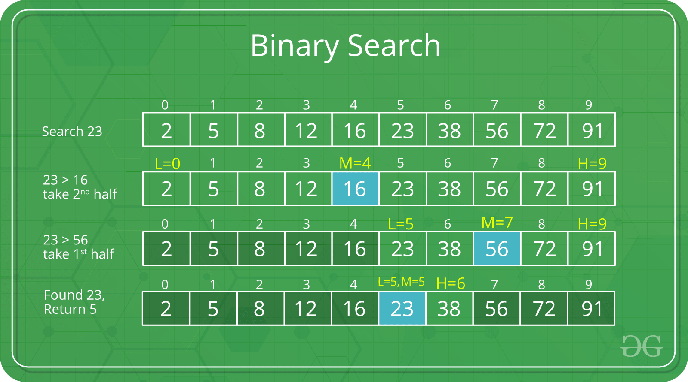

---

# **📘Chapter 1: Algorithms and Complexities**

---

# **1. Introduction: What Are Algorithms?**

An **algorithm** is a clear, precise, step-by-step procedure used to solve a specific problem.
It must:

* Have a clearly defined purpose
* Operate on clearly defined input
* Produce a clearly defined output
* Finish in a finite amount of time
* Be unambiguous

Algorithms appear in almost every aspect of computer science and everyday technology:

* Speech recognition
* Spam filtering
* GPS route finding
* Movie recommendations
* Sorting contacts
* Processing exam scores
* Banking/transaction processing
* Image classification

Large systems like Gmail or Microsoft Word **are not algorithms themselves**, but they **contain many algorithms** working together.

---

# **2. Why Algorithms Matter**

Modern applications process enormous amounts of data.
Better algorithms = faster programs = better user experiences.

Good algorithm design helps us:

* **Reduce execution time**
* **Minimize memory usage**
* **Handle large data inputs**
* **Scale applications efficiently**

Algorithm study teaches us:

1. **How to identify problems**
2. **How to describe solutions systematically**
3. **How to compare solutions objectively**
4. **How to measure performance differences**

---

# **3. Creating Our First Algorithm (Binary → Decimal Conversion)**


Binary numbers represent values using only **1** and **0**.
Each digit corresponds to a **power of 2**.

Example for binary `"10110"`:

| Position (right→left) | Bit | Power of 2 | Value |
| --------------------- | --- | ---------- | ----- |
| 0                     | 0   | 2⁰ = 1     | 0     |
| 1                     | 1   | 2¹ = 2     | 2     |
| 2                     | 1   | 2² = 4     | 4     |
| 3                     | 0   | 2³ = 8     | 0     |
| 4                     | 1   | 2⁴ = 16    | 16    |

Total = 16 + 0 + 4 + 2 + 0 = **22**.

---

# **4. Java Implementation for Binary → Decimal**

```java
public static int convertBinaryToDecimal(String binary) {
    int converter = 1;       // starts at 2^0
    int decimal = 0;

    for (int i = 1; i <= binary.length(); i++) {
        // Start from the rightmost bit
        if (binary.charAt(binary.length() - i) == '1') {
            decimal += converter;
        }
        converter *= 2;     // move to next power of 2
    }
    return decimal;
}
```

### **How This Works Internally**

Iteration breakdown for `"10110"`:

| Loop | Bit | Converter (power) | Added Value | Decimal Total |
| ---- | --- | ----------------- | ----------- | ------------- |
| 1    | 0   | 1 (2⁰)            | 0           | 0             |
| 2    | 1   | 2 (2¹)            | 2           | 2             |
| 3    | 1   | 4 (2²)            | 4           | 6             |
| 4    | 0   | 8 (2³)            | 0           | 6             |
| 5    | 1   | 16 (2⁴)           | 16          | 22            |

---

# **5. Why Algorithm Complexity Matters**


As data grows, **poor algorithms collapse**.

For example:

* A search that takes 1 second for 1,000 items
  → may take **1,000 seconds** for 1,000,000 items
  → which is unacceptable.

Complexity analysis allows us to:

* Predict behavior before implementation
* Choose efficient solutions
* Avoid timeouts in real systems (banking, aviation, healthcare)

---

# **6. Example: Calculating Minimum Distance in Air Traffic Control**


If *n* planes are in the air, and you compute the distance between *every pair*, you must perform:

```
n × n comparisons  →  O(n²)
```

### Java Example

```java
public double minimumDistance(List<Point> planes) {
    double min = Double.MAX_VALUE;

    for (Point p1 : planes) {
        for (Point p2 : planes) {
            double d = p1.distanceTo(p2);
            if (d != 0 && d < min) {
                min = d;
            }
        }
    }
    return min;
}
```

This is extremely expensive for large *n*.

---

# **7. How Algorithms Behave as Input Grows**


We classify algorithms by how they **scale**:

| Complexity     | Growth Pattern        | Example               |
| -------------- | --------------------- | --------------------- |
| **O(1)**       | Constant              | Accessing array index |
| **O(log n)**   | Very slow growth      | Binary search         |
| **O(n)**       | Directly proportional | Single loops          |
| **O(n log n)** | Faster than linear    | Efficient sorting     |
| **O(n²)**      | Steep growth          | Nested loops          |
| **O(2ⁿ)**      | Explosive             | Brute-force search    |

Visual intuition:
Think of each complexity as a different kind of runner:

* **O(1)**: Teleports to finish.
* **O(log n)**: Gets faster as distance grows.
* **O(n)**: Moves steadily.
* **O(n²)**: Slows dramatically over time.
* **O(2ⁿ)**: Collapses from exhaustion immediately.

---

# **8. Best, Worst, and Average Case Analysis**


### Example: Searching a String in an Array

```java
public int search(String target, String[] arr) {
    for (int i = 0; i < arr.length; i++) {
        if (arr[i].equals(target)) {
            return i;
        }
    }
    return -1;
}
```

* **Best Case:** item is at index 0 → minimal work
* **Worst Case:** item at last index or not present → check all items
* **Average Case:** usually somewhere in the middle

---

# **9. Duplicate Checking — Quadratic Behavior**

Simple approach:

```java
public boolean containsDuplicates(int[] nums) {
    for (int i = 0; i < nums.length; i++) {
        for (int j = 0; j < nums.length; j++) {
            if (i != j && nums[i] == nums[j]) {
                return true;
            }
        }
    }
    return false;
}
```

This performs:

```
n × n comparisons → O(n²)
```

---

# **10. Big O Simplification Rules**

1. **Drop constants**

    * `3n + 7 → n`
    * `42 → 1 → O(1)`

2. **Keep highest-order term**

    * `n + n² + n³ → n³`

3. **Different operations → pick worst growth**

    * `O(n) + O(n²) → O(n²)`

---

# **11. Complexity Classes with Java Examples**

## **11.1 O(1) — Constant Time**

```java
int getFirst(int[] a) {
    return a[0];
}
```

Always 1 step.

---

## **11.2 O(log n) — Logarithmic**

Binary search halves the input each step.

```java
public boolean binarySearch(int x, int[] sorted) {
    int left = 0, right = sorted.length - 1;

    while (left <= right) {
        int mid = (left + right) / 2;

        if (sorted[mid] == x) return true;
        else if (sorted[mid] > x) right = mid - 1;
        else left = mid + 1;
    }
    return false;
}
```

---

## **11.3 O(n) — Linear**

```java
int count(char c, String s) {
    int count = 0;
    for (char ch : s.toCharArray())
        if (ch == c) count++;
    return count;
}
```

---

## **11.4 O(n²) — Quadratic**

Nested loops:

```java
void printPairs(int[] a) {
    for (int x : a)
        for (int y : a)
            System.out.println(x + ", " + y);
}
```

---

## **11.5 O(n log n)**

Sorting algorithms (Merge sort, Quick sort average case).

---

## **11.6 O(2ⁿ) — Exponential**

Prime factor trial division for large primes tends toward exponential.


```java
List<Long> primeFactors(long x) {
    List<Long> factors = new ArrayList<>();
    long f = 2;

    while (x > 1) {
        if (x % f == 0) {
            factors.add(f);
            x /= f;
        } else {
            f++;
        }
    }
    return factors;
}
```

---

# **12. Improving an O(n²) Algorithm to O(n log n)**


### Intersection of Two Arrays

**Slow version:**

```java
// O(n²)
if (a[i] == b[j]) ...
```

**Improved version:**

```java
// Step 1: sort both arrays     → O(n log n)
// Step 2: merge-like scanning  → O(n)
```

### Java Implementation

```java
public List<Integer> intersectionFast(int[] a, int[] b) {
    Arrays.sort(a);
    Arrays.sort(b);

    List<Integer> result = new ArrayList<>();
    int i = 0, j = 0;

    while (i < a.length && j < b.length) {
        if (a[i] == b[j]) {
            result.add(a[i]);
            i++; j++;
        } else if (a[i] < b[j]) {
            i++;
        } else {
            j++;
        }
    }
    return result;
}
```

Total complexity:

```
O(n log n)
```

A major improvement over O(n²).

---

# **13. Summary of Key Ideas**

By the end of Chapter 1, students should understand:

### ✔ What algorithms are

### ✔ How to compare algorithms

### ✔ Best/worst/average case complexity

### ✔ Big O notation & simplification

### ✔ O(1), O(log n), O(n), O(n²), O(2ⁿ)

### ✔ Converting binary/octal to decimal

### ✔ Java examples for each type of complexity

### ✔ How algorithm choice affects performance

---

