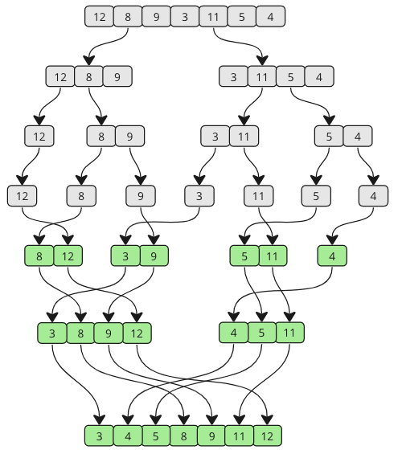

---

# **DSA Merge Sort**

## **Merge Sort**

The Merge Sort algorithm is a divide-and-conquer algorithm that sorts an array by first breaking it down into smaller arrays, and then building the array back together the correct way so that it is sorted.

This method is called **divide and conquer** because it repeatedly divides the unsorted list into two smaller sub-lists until it reaches a base case of one element.
>**Divide**: The algorithm starts with breaking up the array into smaller and smaller pieces until one such sub-array only consists of one element.

>**Conquer**: The algorithm merges the small pieces of the array back together by putting the lowest values first, resulting in a sorted array.

The breaking down and building up of the array to sort the array is done recursively.


**How it works:**

* Divide the unsorted array into two sub-arrays, half the size of the original.
* Continue to divide the sub-arrays as long as the current piece of the array has more than one element.
* Merge two sub-arrays together by always putting the lowest value first.
* Keep merging until there are no sub-arrays left.

Take a look at the drawing below to see how Merge Sort works from a different perspective. As you can see, the array is split into smaller and smaller pieces until it is merged back together. And as the merging happens, values from each sub-array are compared so that the lowest value comes first.


---

# **Merge Sort — Manual Run Through**

Let's try to do the sorting manually, just to get an even better understanding of how Merge Sort works before actually implementing it in a programming language.

### **Step 1**

We start with an unsorted array, and we know that it splits in half until the sub-arrays only consist of one element. The Merge Sort function calls itself two times, once for each half of the array. That means that the first sub-array will split into the smallest pieces first.

```
[ 12, 8, 9, 3, 11, 5, 4 ]
[ 12, 8, 9 ]   [ 3, 11, 5, 4 ]
[ 12 ]   [ 8, 9 ]   [ 3, 11, 5, 4 ]
[ 12 ]   [ 8 ] [ 9 ]   [ 3, 11, 5, 4 ]
```

### **Step 2**

8 and 9 are merged. 8 comes first.

```
[ 12 ]   [ 8, 9 ]   [ 3, 11, 5, 4 ]
```

### **Step 3**

Merge `[12]` with `[8,9]`:

```
[ 8, 9, 12 ]   [ 3, 11, 5, 4 ]
```

### **Step 4**

Split the second half recursively:

```
[ 8, 9, 12 ]   [ 3, 11, 5, 4 ]
[ 8, 9, 12 ]   [ 3, 11 ]   [ 5, 4 ]
[ 8, 9, 12 ]   [ 3 ] [ 11 ]   [ 5, 4 ]
```

### **Step 5**

Merge 3 and 11:

```
[ 8, 9, 12 ]   [ 3, 11 ]   [ 5, 4 ]
```

### **Step 6**

Split and merge 5 and 4:

```
[ 8, 9, 12 ] [ 3, 11 ] [ 5 ] [ 4 ]
[ 8, 9, 12 ] [ 3, 11 ] [ 4, 5 ]
```

### **Step 7**

Merge right sub-arrays:

Comparisons:

* 3 < 4
* 4 < 11
* 5 < 11
* 11 is last

Result:

```
[ 8, 9, 12 ]   [ 3, 4, 5, 11 ]
```

### **Step 8–12**

Merge the final two sub-arrays:

Step-by-step merging:

```
Before: [ 8, 9, 12 ] [ 3, 4, 5, 11 ]
After:  [ 3, 8, 9, 12 ] [ 4, 5, 11 ]

Before: [ 3, 8, 9, 12 ] [ 4, 5, 11 ]
After:  [ 3, 4, 8, 9, 12 ] [ 5, 11 ]

Before: [ 3, 4, 8, 9, 12 ] [ 5, 11 ]
After:  [ 3, 4, 5, 8, 9, 12 ] [ 11 ]

Before: [ 3, 4, 5, 8, 9, 12 ] [ 11 ]
After:  [ 3, 4, 5, 8, 9, 12 ] [ 11 ]

Before: [ 3, 4, 5, 8, 9, 12 ] [ 11 ]
After:  [ 3, 4, 5, 8, 9, 11, 12 ]
```

**Sorting is finished!**

---

# **Manual Run Through: What Happened?**

We see two stages: splitting, then merging.

A mid index is computed by dividing the array length by 2. Splitting stops when sub-arrays have one element. Merging compares first elements of sub-arrays, placing the lowest first.

---

# **Merge Sort Implementation (Java)**

Below is the rewritten Java version of the Python-style pseudocode you provided.

---

## ✅ **Recursive Merge Sort in Java**

```java
public class MergeSortRecursive {

    public static int[] mergeSort(int[] arr) {
        if (arr.length <= 1) {
            return arr;
        }

        int mid = arr.length / 2;

        int[] left = new int[mid];
        int[] right = new int[arr.length - mid];

        System.arraycopy(arr, 0, left, 0, mid);
        System.arraycopy(arr, mid, right, 0, arr.length - mid);

        int[] sortedLeft = mergeSort(left);
        int[] sortedRight = mergeSort(right);

        return merge(sortedLeft, sortedRight);
    }

    private static int[] merge(int[] left, int[] right) {
        int[] result = new int[left.length + right.length];
        int i = 0, j = 0, k = 0;

        while (i < left.length && j < right.length) {
            if (left[i] < right[j]) {
                result[k++] = left[i++];
            } else {
                result[k++] = right[j++];
            }
        }

        while (i < left.length) {
            result[k++] = left[i++];
        }

        while (j < right.length) {
            result[k++] = right[j++];
        }

        return result;
    }

    public static void main(String[] args) {
        int[] arr = {3, 7, 6, -10, 15, 23, 55, -13};
        int[] sorted = mergeSort(arr);

        System.out.print("Sorted array: ");
        for (int num : sorted) {
            System.out.print(num + " ");
        }
    }
}
```

---

## ✅ **Non-Recursive (Iterative) Merge Sort in Java**

```java
public class MergeSortIterative {

    private static int[] merge(int[] left, int[] right) {
        int[] result = new int[left.length + right.length];
        int i = 0, j = 0, k = 0;

        while (i < left.length && j < right.length) {
            if (left[i] < right[j]) {
                result[k++] = left[i++];
            } else {
                result[k++] = right[j++];
            }
        }

        while (i < left.length) {
            result[k++] = left[i++];
        }

        while (j < right.length) {
            result[k++] = right[j++];
        }

        return result;
    }

    public static int[] mergeSort(int[] arr) {
        int n = arr.length;
        int step = 1;

        while (step < n) {
            for (int i = 0; i < n; i += 2 * step) {

                int mid = Math.min(i + step, n);
                int end = Math.min(i + 2 * step, n);

                int[] left = new int[mid - i];
                int[] right = new int[end - mid];

                System.arraycopy(arr, i, left, 0, left.length);
                System.arraycopy(arr, mid, right, 0, right.length);

                int[] merged = merge(left, right);

                for (int j = 0; j < merged.length; j++) {
                    arr[i + j] = merged[j];
                }
            }

            step *= 2;
        }

        return arr;
    }

    public static void main(String[] args) {
        int[] arr = {3, 7, 6, -10, 15, 23, 55, -13};
        int[] sorted = mergeSort(arr);

        System.out.print("Sorted array: ");
        for (int num : sorted) {
            System.out.print(num + " ");
        }
    }
}
```

---

# **Merge Sort Time Complexity**

The time complexity for Merge Sort is:

```
O(n · log n)
```

Merge Sort performs almost the same regardless of whether the input is already sorted, random, or reversed, because it must always split and merge sub-arrays.

---

