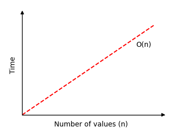

---

# **DSA Linear Search**

## **Linear Search**

The Linear Search algorithm searches through an array and returns the index of the value it searches for.

Speed:

Find value:
4

Current value: 4

New Values
Found it! Index: 5
0 1 2 3 4 5 6 7 8 9 10 11 12 13 14 15 16 17 18 19 20 21

Run the simulation above to see how the Linear Search algorithm works.

To see what happens when a value is not found, try to find value 5.

This algorithm is very simple and easy to understand and implement.

If the array is already sorted, it is better to use the much faster Binary Search algorithm that we will explore on the next page.

A big difference between sorting algorithms and searching algorithms is that sorting algorithms modify the array, but searching algorithms leave the array unchanged.

### **How it works:**

* Go through the array value by value from the start.
* Compare each value to check if it is equal to the value we are looking for.
* If the value is found, return the index of that value.
* If the end of the array is reached and the value is not found, return -1 to indicate that the value was not found.

---

# **Manual Run Through**

Let's try to do the searching manually, just to get an even better understanding of how Linear Search works before actually implementing it in a programming language. We will search for value 11.

### **Step 1:**

We start with an array of random values.

`[ 12, 8, 9, 11, 5, 11 ]`

### **Step 2:**

We look at the first value in the array, is it equal to 11?

`[ 12, 8, 9, 11, 5, 11 ]`

### **Step 3:**

We move on to the next value at index 1, and compare it to 11 to see if it is equal.

`[ 12, 8, 9, 11, 5, 11 ]`

### **Step 4:**

We check the next value at index 2.

`[ 12, 8, 9, 11, 5, 11 ]`

### **Step 5:**

We move on to the next value at index 3. Is it equal to 11?

`[ 12, 8, 9, 11, 5, 11 ]`

We have found it!
Value 11 is found at index 3.

Returning index position 3.

Linear Search is finished.

Run the simulation below to see the steps above animated:

Linear Search
`[ 12, 8, 9, 11, 5, 11 ]`

---

# **Manual Run Through: What Happened?**

This algorithm is really straight forward.

Every value is checked from the start of the array to see if the value is equal to 11, the value we are trying to find.

When the value is found, the searching is stopped, and the index where the value is found is returned.

If the array is searched through without finding the value, -1 is returned.

---

# **Linear Search Implementation**

To implement the Linear Search algorithm we need:

* An array with values to search through.
* A target value to search for.
* A loop that goes through the array from start to end.
* An if-statement that compares the current value with the target value, and returns the current index if the target value is found.
* After the loop, return -1, because at this point we know the target value has not been found.

The resulting code for Linear Search looks like this:

---

# **Example (Java Version of Provided Python Code)**

```java
public class LinearSearchDemo {

    public static int linearSearch(int[] arr, int targetVal) {
        for (int i = 0; i < arr.length; i++) {
            if (arr[i] == targetVal) {
                return i;
            }
        }
        return -1;
    }

    public static void main(String[] args) {
        int[] arr = {3, 7, 2, 9, 5};
        int targetVal = 9;

        int result = linearSearch(arr, targetVal);

        if (result != -1) {
            System.out.println("Value " + targetVal + " found at index " + result);
        } else {
            System.out.println("Value " + targetVal + " not found");
        }
    }
}
```

---

# **Linear Search Time Complexity**

If Linear Search runs and finds the target value as the first array value in an array with *n* values, only one compare is needed.

But if Linear Search runs through the whole array of *n* values, without finding the target value, *n* compares are needed.

This means that the time complexity for Linear Search is:

### **O(n)**

If we draw how much time Linear Search needs to find a value in an array of *n* values, we get this graph:

(Time Complexity Graph)



Note that choosing "Random", "Descending" or "Ascending" has no effect on how fast Linear Search is.

---

# **DSA Exercises**

### **Test Yourself With Exercises**

**Exercise:**
Complete the code.

```
def linearSearch(arr, targetVal):
    for i in range(len(arr)):
        if arr[i] == targetVal:
          
    return -1
```

---

