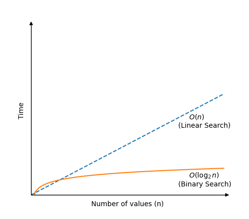

---

# **DSA Binary Search**

## **Binary Search**

The Binary Search algorithm searches through an array and returns the index of the value it searches for.

It is much faster than Linear Search, but requires a **sorted array** to work.

The Binary Search algorithm works by checking the value in the center of the array. If the target value is lower, the next value to check is in the center of the left half of the array. This way of searching means that the search area is always half of the previous search area, and this is why the Binary Search algorithm is so fast.

This process of halving the search area happens until the target value is found, or until the search area of the array is empty.

---

## **How it works**

1. Check the value in the center of the array.
2. If the target value is lower, search the left half of the array. If the target value is higher, search the right half.
3. Continue step 1 and 2 for the new reduced part of the array until the target value is found or until the search area is empty.
4. If the value is found, return the target value index. If the target value is not found, return **-1**.

---

## **Manual Run Through**

Let's try to do the searching manually, just to get an even better understanding of how Binary Search works before actually implementing it in a programming language. We will search for value **11**.

### **Step 1:**

We start with an array.

```
[ 2, 3, 7, 7, 11, 15, 25 ]
```

### **Step 2:**

The value in the middle of the array at index 3, is it equal to 11?

```
[ 2, 3, 7, 7, 11, 15, 25 ]
```

### **Step 3:**

7 is less than 11, so we must search for 11 to the right of index 3.
The values to the right of index 3 are:

```
[ 11, 15, 25 ]
```

The next value to check is the middle value **15**, at index **5**.

### **Step 4:**

15 is higher than 11, so we must search to the left of index 5.
We have already checked index 0–3, so index **4** is the only value left to check.

```
[ 2, 3, 7, 7, 11, 15, 25 ]
```

We have found it!

**Value 11 is found at index 4.**

Returning index position 4.

Binary Search is finished.

---

## **Binary Search**

```
[ 2, 3, 7, 7, 11, 15, 25 ]
```

---

## **Manual Run Through: What Happened?**

To start with, the algorithm has two variables **"left"** and **"right"**.

* **left = 0** (index of the first value)
* **right = 6** (index of the last value)

The first middle calculation:

```
(left + right) / 2 = (0 + 6) / 2 = 3
```

We check index 3:

* 7 is lower than 11 → search the right half.

New search area:

```
[ 11, 15, 25 ]  on indexes 4–6
```

Update:

* left = 4
* right = 6

New middle:

```
(left + right) / 2 = (4 + 6) / 2 = 10 / 2 = 5
```

Check index 5:

* 15 is higher than 11 → search the left side.

Now:

* left = 4
* right = 4

Middle:

```
(left + right) / 2 = (4 + 4) / 2 = 4
```

Index 4 contains **11** → return **4**.

Binary Search continues halving the array until the target is found.

If the target value is found, the index is returned.
If not found, **-1** is returned.

---

## **Binary Search Implementation**

To implement Binary Search, we need:

* An array with values to search through.
* A target value to search for.
* A loop that runs as long as `left <= right`.
* An if-statement that compares the middle value with the target value and returns the index if found.
* An if-statement that checks if the target value is less than or greater than the middle value and updates `left` or `right`.
* After the loop, return **-1**, because at this point the target was not found.

---

## **Java Implementation**

```java
public class BinarySearchExample {

    public static int binarySearch(int[] arr, int targetVal) {
        int left = 0;
        int right = arr.length - 1;

        while (left <= right) {
            int mid = (left + right) / 2;

            if (arr[mid] == targetVal) {
                return mid;
            }

            if (arr[mid] < targetVal) {
                left = mid + 1;
            } else {
                right = mid - 1;
            }
        }

        return -1;
    }

    public static void main(String[] args) {
        int[] myArray = {1, 3, 5, 7, 9, 11, 13, 15, 17, 19};
        int myTarget = 15;

        int result = binarySearch(myArray, myTarget);

        if (result != -1) {
            System.out.println("Value " + myTarget + " found at index " + result);
        } else {
            System.out.println("Target not found in array.");
        }
    }
}
```

---

## **Binary Search Time Complexity**

Each time Binary Search checks a new value, the search area is halved.

This means that even in the worst-case scenario—when Binary Search cannot find the target value—it still only needs:

```
log2(n)
```

comparisons to search through a sorted array of **n** values.

### **Time Complexity:**

```
O(log₂ n)
```

Note: In Big-O notation, we could also write:

```
O(log n)
```

but writing:

```
O(log₂ n)
```

reminds us that the array search area is halved for every comparison, which is the core principle of Binary Search.

If we draw how much time Binary Search needs to find a value in an array of n values compared to Linear Search, we get this graph:

**Binary Search Time Complexity**



---

## **DSA Exercises**

### **Test Yourself With Exercises**

**Exercise:**
What kind of array?

For the Binary Search algorithm to work,
the array must already be **sorted**.

Start the Exercise

---

