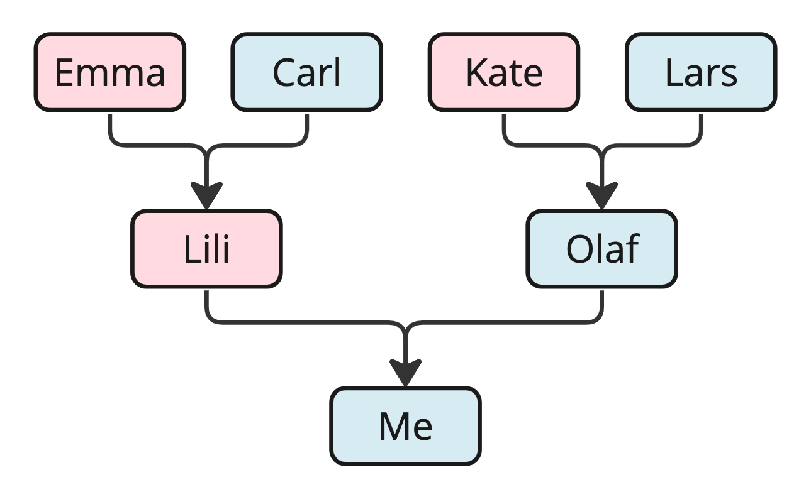

---

# **Lesson Notes: Introduction to Data Structures and Algorithms (DSA)**

---

## **1. Introduction**

Modern software systems depend heavily on how well data is stored and how efficiently it can be processed.
This is where **Data Structures** and **Algorithms** come in.

* **Data Structures** focus on *how data is organized, stored, and accessed*.
* **Algorithms** focus on *how problems are solved using that data*.

Together, DSA allows computers to handle:

* Millions of users
* Gigabytes of data
* Real-time operations
* Complex decision-making

Studying DSA helps developers write programs that are:

* Faster
* More memory-efficient
* Easier to scale
* More robust

---

## **2. What Are Data Structures?**

A **data structure** is a specialized format for organizing and storing data so that it can be accessed and modified efficiently.

### **Why do we need data structures?**

Different problems require different ways of storing data. The choice of a data structure affects:

* How quickly we can search for data
* How efficiently we can insert or delete data
* How much memory is used
* How scalable the system is

### **Real World Analogy: Family Tree**

A *family tree* is a perfect example of a natural data structure:

* It stores people (nodes)
* It shows relationships (parent/child links)
* It allows us to answer questions like:

    * "Who is my grandmother?"
    * "Who are all ancestors of this person?"

Without this structure:

* Finding relationships would require manually scanning all people
* Connections between generations would be unclear
* Searching would be slow and error-prone

This illustrates how structures give data *meaning*, *organization*, and *efficiency*.

### **Importance of Data Structures**

In computing, data structures are essential for:

* Large databases
* File systems
* Search engines
* Internet indexing
* Real-time applications
* Social networks
* Cloud systems

They allow millions of operations per second by organizing data intelligently.

---

## **3. Types of Data Structures**

### **A. Primitive Data Structures**

These are the most basic building blocks provided by programming languages:

* `int` (integer numbers)
* `float` (decimal numbers)
* `char` (characters)
* `boolean` (true/false values)

They hold simple values and do not contain other data.

### **B. Abstract Data Structures (or Abstract Data Types – ADTs)**

These are more advanced structures created using primitive types.
They often support complex operations like inserting, deleting, or searching.

Common ADTs include:

* **Arrays** – fast indexed access
* **Linked Lists** – dynamic, flexible size
* **Stacks** – LIFO (Last In, First Out)
* **Queues** – FIFO (First In, First Out)
* **Trees** – hierarchical structures
* **Graphs** – networks of nodes and connections

Each ADT is designed for a specific type of problem.

---

## **4. What Are Algorithms?**

An **algorithm** is a precise, step-by-step method for solving a problem.

### **Real World Analogy: A Cooking Recipe**

Consider a recipe:

* It has a clear goal: prepare a dish
* It provides steps in order
* Each step must be followed precisely
* The "inputs" are ingredients
* The "output" is the meal

In computing:

* Inputs are *data*
* Steps are written in a *programming language*
* Output is the *solution* or *result*

### **Why Algorithms Matter**

Without algorithms, a program would not know:

* How to sort data
* How to search efficiently
* How to make decisions
* How to perform calculations

The quality of an algorithm often determines whether a program:

* runs in 1 second
* or 10 years

### **Everyday Examples of Algorithms**

* GPS route calculation (shortest path algorithms)
* Autopilot decision-making (control algorithms)
* Search engines retrieving results (indexing algorithms)
* Sorting movies or products by rating (sorting algorithms)
* Recommendation systems analyzing data

Many algorithms are designed to work with specific data structures.
Example:

* **Bubble Sort**, **Quick Sort** → work on arrays
* **DFS**, **BFS** → work on trees and graphs

---

## **5. How Data Structures and Algorithms Work Together**

Data structures and algorithms depend on one another:

### **A data structure without an algorithm is passive.**

Example:
A list of numbers is useless if we cannot search, sort, or modify it quickly.

### **An algorithm without a data structure has no data to work with.**

Example:
Sorting requires storage like arrays or lists.

### **Together they make efficient computing possible.**

This is the core of DSA:

* **Store** data in the best structure
* **Process** it using the best algorithm

### **Benefits of Understanding DSA**

You can:

* Pick the right data structure for each problem
* Write faster, optimized programs
* Reduce memory usage
* Solve complex problems systematically
* Improve as a developer and problem-solver

---

## **6. Where Are Data Structures and Algorithms Used?**

### **A. Everyday Software Systems**

* Operating systems (task scheduling, memory management)
* Databases (indexing, query optimization)
* Web applications (handling user requests, caching)
* Video games (pathfinding, physics calculations)
* Machine learning (data preprocessing, graph structures)
* Cryptography (secure key exchange, hashing)
* Search engines (web crawling, ranking pages)
* Social networks (friend suggestions, feed ranking)

### **B. Practical Problems Solved by DSA**

* Handling millions of user records
* Finding shortest routes (GPS)
* Optimizing tasks and workloads
* Storing and retrieving information quickly
* Compressing and encrypting data
* Building efficient recommender systems

DSA plays a role in almost every piece of software we use daily.

---

## **7. Key Theoretical Concepts and Terminology**

### **1. Algorithm**

A defined sequence of steps used to solve a problem.

### **2. Data Structure**

A system for organizing and storing data efficiently.

### **3. Time Complexity**

How running time grows as the size of input grows (e.g., O(n), O(n²)).

### **4. Space Complexity**

How much memory an algorithm uses relative to input size.

### **5. Big O Notation**

Mathematical notation for describing complexity growth rates.

### **6. Recursion**

A function that calls itself to solve a smaller version of a problem.

### **7. Divide and Conquer**

Break a large problem into smaller subproblems, solve them individually, and combine results.
Used in algorithms like Merge Sort and Quick Sort.

### **8. Brute Force**

A simple approach that tries every possible solution until the correct one is found.
Often slow, but easy to implement.

These concepts form the foundation for deeper DSA topics.

---

## **8. How to Approach This Tutorial**

To progress effectively:

1. Start with a simple data structure (e.g., arrays)
2. Learn associated algorithms
3. Move on to more complex structures like trees and graphs
4. Understand time and space complexity for each algorithm
5. Practice writing code in your preferred language (Python, JavaScript, C, etc.)

### **Prerequisites**

You should be comfortable with at least one programming language.

### **Next Lesson**

You will study:

* Two algorithms that print the first 100 Fibonacci numbers
* One using loops
* One using recursion

This example introduces:

* Algorithm design
* Primitive data structures
* Time complexity
* Recursion fundamentals

---

