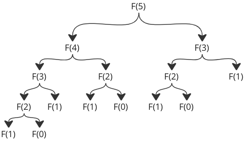
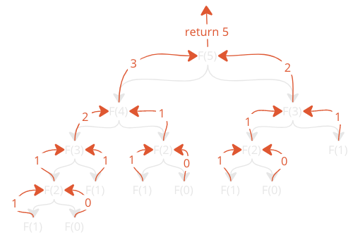

---

# **Lesson Notes: A Simple Algorithm — Fibonacci Numbers (with Java examples)**

## **1. Introduction**

Before diving deep into algorithms and data structures, it is important to start with a simple but powerful example.
One of the most famous sequences used to teach algorithms—especially recursion and iteration—is the **Fibonacci sequence**.

The Fibonacci numbers are named after the 13th-century mathematician **Leonardo Fibonacci**. The sequence starts with:

```
0, 1
```

Each new number is the **sum of the two previous numbers**:

```
0, 1, 1, 2, 3, 5, 8, 13, 21, ...
```

This simple relationship makes Fibonacci numbers perfect for demonstrating:

* How algorithms work
* How loops work
* How recursion works
* How algorithmic complexity differs between approaches

---

# **2. The Fibonacci Algorithm**

We want to generate Fibonacci numbers using this rule:

[
F(n) = F(n-1) + F(n-2)
]

So to generate the first 20 Fibonacci numbers:

1. Start with:

    * `prev2 = 0`
    * `prev1 = 1`
2. Print the two starting numbers.
3. Repeat 18 times:

    * `newFibo = prev1 + prev2`
    * print `newFibo`
    * update:

        * `prev2 = prev1`
        * `prev1 = newFibo`

This algorithm can be implemented:

* Using a **loop**
* Using **recursion**
* Using **recursive formula F(n)** (returns *one* Fibonacci number)

Let’s implement all three in **Java**.

---

# **3. Implementation #1 — Using a For Loop (Java)**

### **Requirements**

Our loop-based program needs:

* Two variables to store previous Fibonacci numbers
* A loop that runs 18 times (after printing first two numbers)
* Logic to create and print each next Fibonacci number

### ✅ **Java Code: Fibonacci using a for-loop**

```java
public class FibonacciLoop {

    public static void main(String[] args) {
        int prev2 = 0;
        int prev1 = 1;

        System.out.println(prev2);
        System.out.println(prev1);

        for (int i = 0; i < 18; i++) {
            int newFibo = prev1 + prev2;
            System.out.println(newFibo);

            prev2 = prev1;
            prev1 = newFibo;
        }
    }
}
```

### **Complexity**

* Time: **O(n)**
* Space: **O(1)**
  Efficient and fast!

---

# **4. Implementation #2 — Using Recursion to Print Sequence (Java)**

Recursion means:

> A function calls itself.

To print the first 20 Fibonacci numbers recursively, we replace the loop with a recursive function.

### **What we need**

* A global or external counter to track how many numbers have been printed
* A recursive function that:

    * computes the next number
    * prints it
    * calls itself again, until 20 numbers are printed

### ✅ **Java Code: Recursive Fibonacci sequence printer**

```java
public class FibonacciRecursiveSequence {

    static int count = 2; // We already print 0 and 1

    public static void main(String[] args) {
        System.out.println(0);
        System.out.println(1);

        fibonacci(1, 0);
    }

    public static void fibonacci(int prev1, int prev2) {
        if (count <= 19) {
            int newFibo = prev1 + prev2;
            System.out.println(newFibo);

            count++;
            fibonacci(newFibo, prev1); // recursive call
        }
    }
}
```

### **Complexity**

* Time: **O(n)**
* Space: **O(n)** (due to recursive stack)

Still reasonable.

---

# **5. Implementation #3 — Finding F(n) using Pure Recursion (Java)**



Here we use the mathematical definition:

The Fibonacci sequence is defined mathematically as:

```markdown
F(0) = 0
F(1) = 1
F(n) = F(n-1) + F(n-2)
```

### **Very important:**

This version calls itself **twice**, leading to exponential growth in function calls.

### **Java Code: Compute nth Fibonacci recursively**
Notice that this recursive method calls itself two times, not just one. This makes a huge difference in how the program will actually run on our computer. 
The number of calculations will explode when we increase the number of the Fibonacci number we want. 
To be more precise, the number of function calls will double every time we increase the Fibonacci number we want by one.


Just take a look at the number of function calls for F(5):
```java
public class FibonacciRecursiveNth {

    public static void main(String[] args) {
        System.out.println(F(19)); // prints the 20th Fibonacci number
    }

    public static int F(int n) {
        if (n <= 1) {
            return n;
        }
        return F(n - 1) + F(n - 2);
    }
}
```

### **Complexity**

* Time: **O(2ⁿ)** (extremely slow for large n)
* Space: **O(n)**

This approach becomes unusable for large n, but it is excellent for teaching recursion.

---

# **6. Understanding Why Pure Recursion Explodes**

Notice that this recursive method calls itself two times, not just one. This makes a huge difference in how the program will actually run on our computer. 
The number of calculations will explode when we increase the number of the Fibonacci number we want. 
To be more precise, the number of function calls will double every time we increase the Fibonacci number we want by one.
To better understand the code, here is how the recursive function calls return values so that F(5) returns the correct value in the end:



Many calls repeat the same values again and again.

This is why, although elegant, pure recursion is **inefficient**.

---

# **7. Summary**

We learned:

### ✔ What Fibonacci numbers are

### ✔ How algorithms implement mathematical rules

### ✔ Loop-based Fibonacci (efficient)

### ✔ Recursive sequence printing (educational)

### ✔ Recursive F(n) calculation (inefficient but instructive)

### ✔ Differences in time and space complexity

This prepares us to move into our first data structure: **arrays**.

---

# **8. Exercise (Java Version)**

Rewrite the following Python-like function into a recursive Java implementation:

### **Your Starting Point (Python-like pseudocode)**

```
print(0)
print(1)
count = 2

def fibonacci(prev1, prev2):
    global count
    if count <= 19:
        newFibo = prev1 + prev2
        print(newFibo)
        prev2 = prev1
        prev1 = newFibo
        count += 1
        
(prev1, prev2)
    else:
        return

fibonacci(1,0)
```

---

# ✅ **Exercise Requirements (Java)**

Implement the same logic in Java:

### **Task**

Create a Java program that:

1. Prints the first two Fibonacci numbers: `0` and `1`
2. Uses a **recursive method** to print the remaining 18 numbers
3. Uses a static counter to track how many numbers have been printed
4. Stops after printing 20 numbers total

### **Starter Template (Fill the missing parts)**

```java
public class RecursiveFibExercise {

    static int count = 2; // We have printed 0 and 1

    public static void main(String[] args) {

        System.out.println(0);
        System.out.println(1);

        // TODO: Call recursive method here
    }

    public static void fibonacci(int prev1, int prev2) {
        // TODO: Implement recursion logic
        // Steps:
        // 1. If count <= 19:
        //      a. compute new number
        //      b. print it
        //      c. increment counter
        //      d. call fibonacci(...) again
    }
}
```

---

