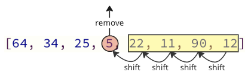
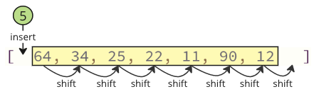
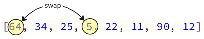

---

# **DSA – Selection Sort**

## **Selection Sort**

Selection Sort is a simple comparison-based sorting algorithm.
It works by repeatedly finding the lowest (minimum) value in the unsorted part of the array and moving it to the front.

### **Speed**

Selection Sort repeatedly scans the list, selecting the next lowest value and placing it in its proper position until the entire array is sorted.

---

## **How Selection Sort Works**

1. Go through the array to find the lowest value.
2. Move the lowest value to the front of the *unsorted* portion of the array.
3. Continue scanning the rest of the array again and again—one scan for each element—until the entire array is sorted.

---

## **Manual Run Through**

Before writing code, let’s manually walk through a small example **one pass at a time** so we understand the logic.

### **Step 1:** Start with an unsorted array:

```
[7, 12, 9, 11, 3]
```

### **Step 2:** Scan the array to find the lowest value.

The lowest value is **3**.

```
[7, 12, 9, 11, 3]
```

### **Step 3:** Move **3** to the front:

```
[3, 7, 12, 9, 11]
```

### **Step 4:** Look through the rest of the array starting from 7.

7 is already the smallest among `[7, 12, 9, 11]`, so no movement is needed:

```
[3, 7, 12, 9, 11]
```

### **Step 5:** Scan `[12, 9, 11]`.

The lowest value is **9**.

```
[3, 7, 12, 9, 11]
```

### **Step 6:** Move 9 to its correct position:

```
[3, 7, 9, 12, 11]
```

### **Step 7:** Look at `[12, 11]`.

The lowest value is **11**.

```
[3, 7, 9, 12, 11]
```

### **Step 8:** Move 11 in front of 12:

```
[3, 7, 9, 11, 12]
```

Now the array is fully sorted.

---

## **Manual Run-Through Summary**

Understanding the example above is critical:

• The smallest element (**3**) was placed in the correct position first.
• Then the algorithm continued finding the next smallest values.
• Each time, the "sorted portion" of the array grew, and the "unsorted portion" shrank.

To sort 5 values, the algorithm must run **4 passes**, because each pass puts exactly **one** element in its final position.

---

# **Selection Sort Implementation (Java)**

To implement Selection Sort, we need:

1. **An array to sort**
2. **An outer loop** that runs (n−1) times
3. **An inner loop** that scans the unsorted portion and finds the lowest value
4. **Move the lowest value to the correct place**

Below is the Java version of the first (non-optimized) implementation.

---

## **Selection Sort – Version 1 (Using Removal + Insertion Logic)**

*(Note: Java arrays cannot "remove" or "insert" like Python, so we emulate the logic.)*

```java
public class SelectionSortVersion1 {

    public static void main(String[] args) {
        int[] arr = {64, 34, 25, 5, 22, 11, 90, 12};

        int n = arr.length;

        for (int i = 0; i < n - 1; i++) {
            int minIndex = i;

            // Find the index of the minimum value
            for (int j = i + 1; j < n; j++) {
                if (arr[j] < arr[minIndex]) {
                    minIndex = j;
                }
            }

            // Simulate "remove" + "insert" by manually shifting elements
            int minValue = arr[minIndex];

            // Shift left to remove minValue
            for (int k = minIndex; k > i; k--) {
                arr[k] = arr[k - 1];
            }

            // Insert minValue at position i
            arr[i] = minValue;
        }

        System.out.print("Sorted array: ");
        for (int num : arr) System.out.print(num + " ");
    }
}
```

### **What this version does**

* Finds the smallest number
* Removes it (via shifting)
* Inserts it at the start (via shifting)

This is **conceptually correct**, but shifting values is expensive and slow.

---

# **Selection Sort Shifting Problem**



In the version above, shifting causes extra work:

* Removing an element requires shifting all elements after it.
* Inserting it at the front requires shifting elements again.

### **Even if you don’t see shifting in high-level code**, shifting **still happens inside the array** at the memory level.

This makes the algorithm slower.

---


# **Solution: Swap Instead of Shift**

Instead of shifting the whole array twice, we simply **swap** the minimum value with the first unsorted element.

 

### Why swapping works:

* The minimum value goes to its correct position.
* The value we swap it with is unsorted anyway, so it can be placed anywhere in the unsorted portion.

This avoids ALL unnecessary shifting.

---

# **Selection Sort – Improved Version (Using Swapping)**

### *(This is the standard and efficient version)*

```java
public class SelectionSort {

    public static void main(String[] args) {
        int[] arr = {64, 34, 25, 12, 22, 11, 90, 5};

        int n = arr.length;

        for (int i = 0; i < n; i++) {
            int minIndex = i;

            // Find the index of the smallest element
            for (int j = i + 1; j < n; j++) {
                if (arr[j] < arr[minIndex]) {
                    minIndex = j;
                }
            }

            // Swap arr[i] and arr[minIndex]
            int temp = arr[i];
            arr[i] = arr[minIndex];
            arr[minIndex] = temp;
        }

        System.out.print("Sorted array: ");
        for (int num : arr) System.out.print(num + " ");
    }
}
```

---

# **Selection Sort Time Complexity**

Selection Sort sorts an array of size **n**.

### Breakdown:

* For each of the **n** passes…
* …the algorithm scans the remaining unsorted elements
* …which is on average **n / 2** comparisons per pass
* Total comparisons ≈ **n² / 2** → still **O(n²)**

Thus:

```
O(n²)
```

### Graph Interpretation

* Time grows extremely fast as n increases
* Best case = Worst case = **O(n²)**
* Bubble Sort has a best case of **O(n)**, but Selection Sort doesn’t improve from best case input

The only difference between best and worst case:

* In the **best case**, no swaps occur
* In the **worst case**, swapping occurs n times

---

# **DSA Exercise**

Given the array:

```
[7, 12, 9, 11, 3]
```

After the **first full pass** of Selection Sort:

* The smallest value (**3**) moves to the first position
* So the **LAST element after the first run** is the value originally at index 0 (unless swapped later)

---

