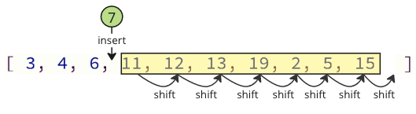
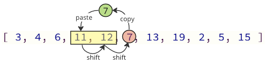

---

# **DSA – Insertion Sort**

## **Insertion Sort**

Insertion Sort is a simple sorting algorithm that divides the array into two parts:

* A **sorted** part (on the left)
* An **unsorted** part (on the right)

The algorithm repeatedly takes one value from the unsorted part and inserts it into the correct position in the sorted part.

---

## **How Insertion Sort Works**

1. Take the first value from the unsorted part of the array.
2. Insert it into the correct position in the sorted part.
3. Repeat this for every value until the entire array is sorted.

The sorted part grows from left to right.

---

# **Manual Run Through**

Before implementing the algorithm, let’s manually walk through a small example.

### **Step 1: Start with an unsorted array**

```
[7, 12, 9, 11, 3]
```

### **Step 2:**

Consider the **first value** as the sorted portion.
One value by itself is always sorted.

```
[7 | 12, 9, 11, 3]
```

### **Step 3:**

Next value is **12**.
Since 12 > 7, it stays where it is.

```
[7, 12 | 9, 11, 3]
```

### **Step 4:**

Next value is **9**.

```
[7, 12, 9, 11, 3]
```

### **Step 5:**

Insert **9** into the correct place in the sorted part `[7, 12]`.

```
[7, 9, 12 | 11, 3]
```

### **Step 6:**

Next value is **11**.

```
[7, 9, 12, 11, 3]
```

### **Step 7:**

Insert **11** between 9 and 12.

```
[7, 9, 11, 12 | 3]
```

### **Step 8:**

Final unsorted value is **3**.

```
[7, 9, 11, 12, 3]
```

### **Step 9:**

Insert **3** at the beginning.

```
[3, 7, 9, 11, 12]
```

Now the entire array is sorted.

---

# **Manual Run-Through Summary**

* The first element is always treated as sorted.
* Each new element must be inserted into the correct position among previously sorted elements.
* Sorting a 5-element array requires **4 passes**, because the first element is already considered sorted.

Each pass reduces the unsorted portion and grows the sorted portion.

---

# **Insertion Sort Implementation (Java)**

To implement insertion sort, we need:

1. An array to sort
2. An **outer loop** that selects each unsorted value
3. An **inner loop** that scans the sorted part to find the correct insertion position

If the array has `n` values, the outer loop runs `n−1` times.

---

# **Version 1: Direct Removal + Insertion (Python-Style Behavior, Simulated in Java)**

In Python, you can `pop()` and `insert()`.
Java arrays do not support removal or insertion, but we can **simulate** the behavior.

This Java version mimics the logic exactly:

```java
public class InsertionSortVersion1 {

    public static void main(String[] args) {
        int[] arr = {64, 34, 25, 12, 22, 11, 90, 5};
        int n = arr.length;

        for (int i = 1; i < n; i++) {
            int currentValue = arr[i];
            int insertIndex = i;

            // Simulate Python's pop() by shifting left
            for (int k = i; k < n - 1; k++) {
                arr[k] = arr[k + 1];
            }

            // Now find where to insert currentValue
            for (int j = i - 1; j >= 0; j--) {
                if (arr[j] > currentValue) {
                    insertIndex = j;
                }
            }

            // Simulate Python's insert() by shifting right
            for (int k = n - 2; k >= insertIndex; k--) {
                arr[k + 1] = arr[k];
            }

            arr[insertIndex] = currentValue;
        }

        System.out.print("Sorted array: ");
        for (int num : arr) System.out.print(num + " ");
    }
}
```

This behaves like Python but is slow due to excessive shifting.

---

# **Insertion Sort Improvements**

The previous version removes and inserts values, which causes many shifting operations.


Even in high-level languages like Python, removing or inserting from the middle of a dynamic array forces many elements to shift in memory.

Java arrays, however, have **fixed size**, so remove/insert operations don't exist.
But shifting still happens anytime values move.



### **Better Approach: Only shift what’s necessary**

Instead of removing and inserting, we:

* Save the current value
* Shift only the elements that are greater than it
* Insert the value into the correct position

This reduces shifting dramatically.

---

# **Improved Insertion Sort (Efficient Version, Java)**

This is the standard, most efficient version of insertion sort.



```java
public class InsertionSort {

    public static void main(String[] args) {

        int[] arr = {64, 34, 25, 12, 22, 11, 90, 5};
        int n = arr.length;

        for (int i = 1; i < n; i++) {
            int currentValue = arr[i];
            int insertIndex = i;

            // Shift larger elements right to make room
            for (int j = i - 1; j >= 0; j--) {
                if (arr[j] > currentValue) {
                    arr[j + 1] = arr[j];
                    insertIndex = j;
                } else {
                    break; // Stop early when correct position is found
                }
            }

            // Insert the saved value
            arr[insertIndex] = currentValue;
        }

        System.out.print("Sorted array: ");
        for (int num : arr) System.out.print(num + " ");
    }
}
```

### **Why this version is faster**

* Only shifts the necessary elements
* Breaks early when the correct position is found
* Avoids unnecessary scanning

Example:
Instead of shifting **10 elements**, we might only shift **2**.

---

# **Insertion Sort and Time Complexity**

Insertion Sort sorts an array of `n` values.

### Average behavior:

* Each value is compared to ~ n/2 others
* Done `n` times
* Time complexity becomes:

```
O(n²)
```

### Important characteristics:

* **Best case:** O(n) (already sorted input)
* **Average case:** O(n²)
* **Worst case:** O(n²)

Best case is fast because no shifting is needed.
Worst case occurs when the array is sorted in descending order.

---

# **Conclusion**

Insertion Sort is simple and efficient for:

* Small arrays
* Nearly sorted arrays
* Situations where shifting is cheaper than swapping

The improved version is the real-world implementation because it minimizes unnecessary memory operations.

Next step after this topic: **Quicksort**, a much faster algorithm for larger datasets.

---

