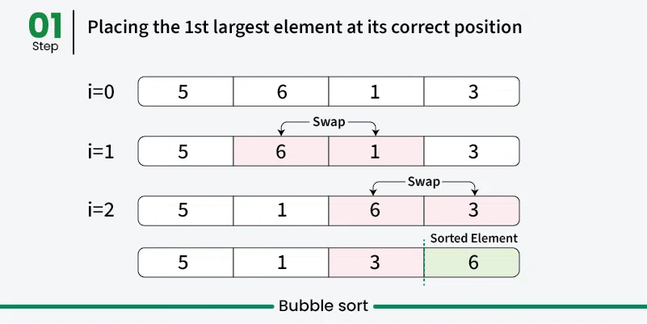
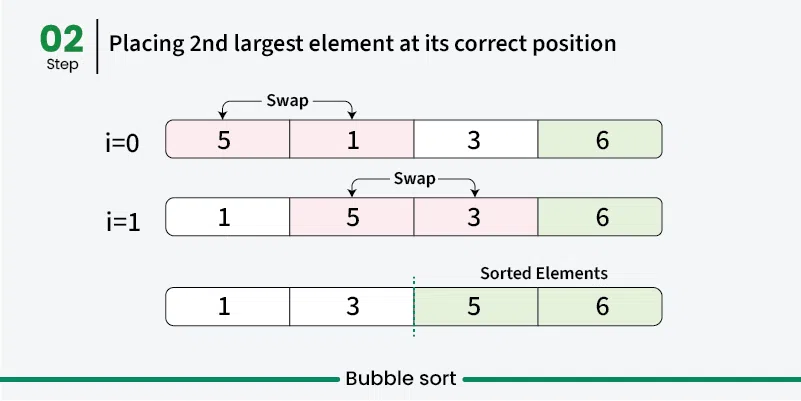
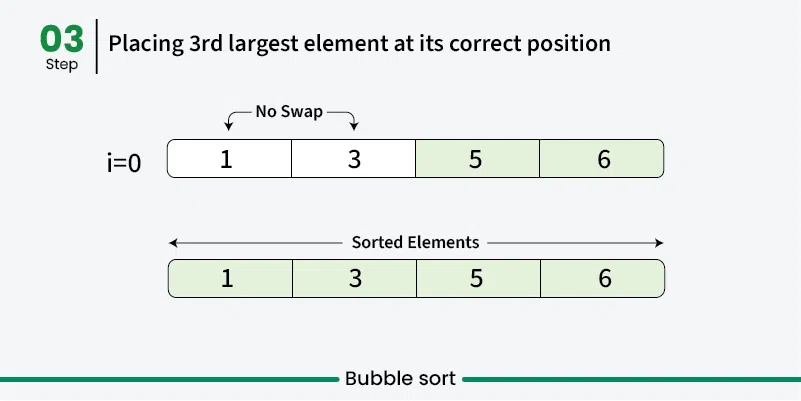

---

# Bubble Sort

**Last Updated: 08 Dec, 2025**

## Introduction

Bubble Sort is one of the **simplest sorting algorithms**. It works by **repeatedly comparing adjacent elements** in a list and **swapping them if they are in the wrong order**. This process continues until the entire list is sorted.

Although Bubble Sort is easy to understand and implement, it is **not suitable for large datasets** because its average and worst-case time complexity are high.

---

## How Bubble Sort Works

Bubble Sort sorts an array using **multiple passes**:

* In the **first pass**, the largest element “bubbles up” to the **last position**.
* In the **second pass**, the second-largest element moves to the **second last position**.
* This process continues until the array is fully sorted.

### Key Observations

* After **k passes**, the **largest k elements** are already placed in their correct positions at the end.
* In each pass, the algorithm only processes the **unsorted portion** of the array.
* Adjacent elements are compared and swapped if the left element is greater than the right one.
* Repeated swapping ensures that the largest remaining element reaches its correct position.

---

---

---

---

## Algorithm Steps

1. Start from the first element of the array.
2. Compare each pair of adjacent elements.
3. Swap them if they are in the wrong order.
4. After each pass, ignore the last sorted elements.
5. Repeat until no swaps occur or the array is sorted.

---

## Optimized Bubble Sort

Bubble Sort can be optimized by **stopping early** if no swaps occur during a pass.
This indicates that the array is already sorted.

---

## Java Implementation (Optimized)

```java
// Optimized Java implementation of Bubble Sort
import java.io.*;

class GFG {

    // An optimized version of Bubble Sort
    static void bubbleSort(int arr[], int n) {
        int i, j, temp;
        boolean swapped;

        for (i = 0; i < n - 1; i++) {
            swapped = false;

            for (j = 0; j < n - i - 1; j++) {
                if (arr[j] > arr[j + 1]) {

                    // Swap arr[j] and arr[j+1]
                    temp = arr[j];
                    arr[j] = arr[j + 1];
                    arr[j + 1] = temp;
                    swapped = true;
                }
            }

            // If no two elements were swapped, break
            if (swapped == false)
                break;
        }
    }

    // Function to print the array
    static void printArray(int arr[], int size) {
        for (int i = 0; i < size; i++)
            System.out.print(arr[i] + " ");
        System.out.println();
    }

    // Driver program
    public static void main(String args[]) {
        int arr[] = {64, 34, 25, 12, 22, 11, 90};
        int n = arr.length;

        bubbleSort(arr, n);

        System.out.println("Sorted array:");
        printArray(arr, n);
    }
}
```

---

## Output

```
Sorted array:
11 12 22 25 34 64 90
```

---

## Complexity Analysis

* **Time Complexity**

    * Best Case: O(n) (already sorted, with optimization)
    * Average Case: O(n²)
    * Worst Case: O(n²)

* **Auxiliary Space Complexity**

    * O(1) (in-place sorting)

---

## Advantages of Bubble Sort

* Easy to understand and implement
* Requires **no extra memory**
* It is a **stable sorting algorithm** (preserves relative order of equal elements)

---

## Disadvantages of Bubble Sort

* Very **slow for large datasets** due to O(n²) time complexity
* Has **limited real-world applications**
* Mostly used for **educational purposes** to demonstrate sorting concepts

---

## Summary

Bubble Sort is an introductory sorting algorithm that helps learners understand the fundamentals of comparison-based sorting. While it is not efficient for real-world applications, it remains valuable in teaching algorithmic thinking and basic optimization concepts.

---

