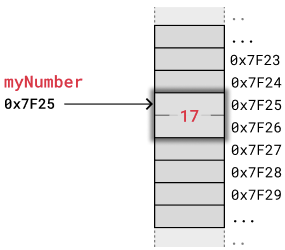
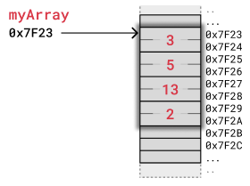
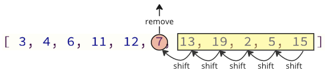
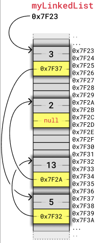
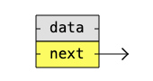
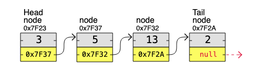

---

# **DSA Linked Lists in Memory — Full Notes (Java Version)**

## **Computer Memory**

To explain what linked lists are, and how linked lists are different from arrays, we need to understand some basics about how **computer memory** works.

Computer memory is the storage your program uses when it is running. This is where your **variables**, **arrays**, and **linked lists** are stored.

---

## **Variables in Memory**



Imagine storing an integer `17` in a variable called `myNumber`.
For simplicity, assume the integer is stored as **two bytes (16 bits)**, and the memory address for `myNumber` is **0x7F25**.

The address 0x7F25 is the address of the **first byte** of the two bytes that store the integer.
When the computer reads an integer at 0x7F25, it reads **both bytes**, because on this example computer, integers are 2 bytes.

This is how the variable `myNumber = 17` is stored in memory.

The example matches how integers are stored on the **Arduino Uno (8-bit architecture)**:

* 8-bit CPU
* 16-bit address bus
* 2 bytes for integers
* 2 bytes for addresses

Personal computers and smartphones use **32-bit or 64-bit architectures**, meaning larger integers and larger memory addresses, but the basic principle of memory remains the same.

---

## **Arrays in Memory**

To understand linked lists, it is useful to first understand how **arrays** are stored.



Array elements are stored **contiguously** in memory.
Each element is placed **right after the previous element**.

Example:
`myArray = [3, 5, 13, 2]`
Each integer uses **2 bytes**, just like in the earlier example.

When accessing `myArray[2]`, the computer:

* starts at 0x7F23 (the first byte of the array)
* jumps over 2 integers (2 × 2 bytes)
* reads the value 13 at address 0x7F27

### **Removing or inserting elements in arrays**



When removing or inserting elements:

* all elements after the change must be **shifted up or down** in memory
* these shifts are **time-consuming**, especially in real-time systems
* in C you must manually shift the elements and allocate enough space beforehand

---

## **Linked Lists in Memory**



Instead of storing a collection of data as an array, we can create a **linked list**.

Linked lists are used in many scenarios:

* dynamic data storage
* stack and queue implementation
* graph representation, etc.

A linked list consists of **nodes**, where each node contains:

* some sort of **data**
* at least one **pointer/link** to another node

To make it easier to see how the nodes relate to each other, we will display nodes in a linked list in a simpler way, less related to their memory location, like in the image below:


If we put the same four nodes from the previous example together using this new visualization, it looks like this:


### **Benefits of Linked Lists**

* Nodes are stored **anywhere in free memory**
* Nodes do **not** need to be next to each other
* When adding or removing nodes, **other nodes do NOT need to be shifted**

Example linked list with 4 nodes:
Values: **3 → 5 → 13 → 2**
Each node contains:

* 2 bytes for integer
* 2 bytes for address
  Total: **4 bytes per node**

We then simplify illustrations to show only the nodes and pointers, ignoring memory addresses.

The **first node** is called the **Head**.
The **last node** is called the **Tail**.

### **Drawback of Linked Lists**

Unlike arrays:

* you **cannot directly access** a node like `myArray[5]`
* to reach the 5th node, you must start at the **Head** and **traverse** node by node using pointers

---

## **Memory in Modern Computers**

Modern computers still work the same way in principle, but use more memory per integer and more memory per address.

Example (originally in C, but rewritten in Java):

### **Java Example: Checking Sizes**

Java does not allow direct reading of memory sizes like C does, but we can demonstrate approximate sizes:

```java
public class MemoryExample {
    public static void main(String[] args) {

        int myVal = 13;

        System.out.println("Value of integer 'myVal': " + myVal);
        System.out.println("Size of integer (Java int): 4 bytes");

        // In Java, references (addresses) are abstract.
        // But typically they are 8 bytes on a 64-bit JVM.
        Object ref = new Object();

        System.out.println("Approximate size of a reference: 8 bytes (64-bit JVM)");
        System.out.println("Reference to 'ref': " + ref);
    }
}
```

Java runs on a virtual machine, so direct memory access and pointer size measurement cannot be done like in C.

---

## **Linked List Implementation (Converted to Java)**


Below is the same linked list from the earlier example (nodes containing 3, 5, 13, 2), implemented in **Java**.

### **Java Implementation of a Basic Linked List**

```java
class Node {
    int data;
    Node next;

    public Node(int data) {
        this.data = data;
        this.next = null;
    }
}

public class LinkedListExample {

    public static void printList(Node head) {
        Node current = head;
        while (current != null) {
            System.out.print(current.data + " -> ");
            current = current.next;
        }
        System.out.println("null");
    }

    public static void main(String[] args) {

        Node node1 = new Node(3);
        Node node2 = new Node(5);
        Node node3 = new Node(13);
        Node node4 = new Node(2);

        // Linking nodes
        node1.next = node2;
        node2.next = node3;
        node3.next = node4;

        printList(node1);
    }
}
```

This Java version mirrors the function of the C and Python examples but uses Java's object-oriented structure.

---

## **Python Example (Rewritten in Java)**

The original Python code created nodes and linked them.
Here is the direct Java equivalent:

```java
class Node {
    int data;
    Node next;

    public Node(int data) {
        this.data = data;
        this.next = null;
    }
}

public class PythonEquivalentInJava {
    public static void main(String[] args) {

        Node node1 = new Node(3);
        Node node2 = new Node(5);
        Node node3 = new Node(13);
        Node node4 = new Node(2);

        node1.next = node2;
        node2.next = node3;
        node3.next = node4;

        Node currentNode = node1;

        while (currentNode != null) {
            System.out.print(currentNode.data + " -> ");
            currentNode = currentNode.next;
        }
        System.out.println("null");
    }
}
```

---

## **DSA Exercises**

### **Exercise**

**What is the benefit of using Linked Lists?**

A good thing about linked lists is that when inserting or removing a node, **other elements do not have to be shifted in memory**.

---

