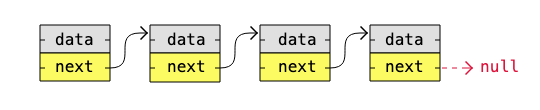
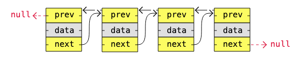
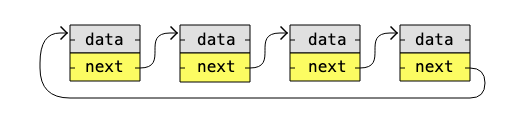
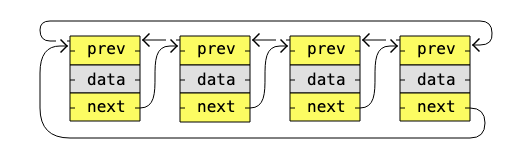
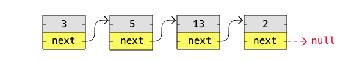
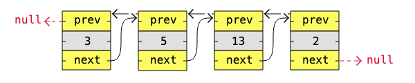

---

# **DSA Linked Lists Types**

## **Types of Linked Lists**

There are three basic forms of linked lists:

* **Singly linked lists**
* **Doubly linked lists**
* **Circular linked lists**

A **singly linked list** is the simplest kind of linked list. It takes up less space in memory because each node has only one address to the next node, like in the image below.

*A singly linked list.*



A **doubly linked list** has nodes with addresses to both the previous and the next node and therefore takes more memory. But doubly linked lists are useful if you need to move both up and down the list.

*A doubly linked list.*



A **circular linked list** is like a singly or doubly linked list with the first node (the "head") and the last node (the "tail") connected.

In singly or doubly linked lists, you can find the start and end of a list by checking if the links are null. But for circular linked lists, more complex code is needed to explicitly check for start and end nodes in certain applications.

Circular linked lists are good for lists you need to cycle through continuously.

*Example of a circular singly linked list.*



*Example of a circular doubly linked list.*



**Note:** What kind of linked list you need depends on the problem you are trying to solve.

---

# **Linked List Implementations**

Below are basic implementations of:

* Singly linked list
* Doubly linked list
* Circular singly linked list
* Circular doubly linked list

The next page will cover different operations that can be done on linked lists.

---

# **1. Singly Linked List Implementation**

Below is an implementation of this singly linked list:

*A singly linked list with values.*



### **Example — A basic singly linked list in Java**

```java
class Node {
    int data;
    Node next;

    Node(int data) {
        this.data = data;
        this.next = null;
    }
}

public class SinglyLinkedListDemo {
    public static void main(String[] args) {
        Node node1 = new Node(3);
        Node node2 = new Node(5);
        Node node3 = new Node(13);
        Node node4 = new Node(2);

        node1.next = node2;
        node2.next = node3;
        node3.next = node4;

        Node currentNode = node1;
        while (currentNode != null) {
            System.out.print(currentNode.data + " -> ");
            currentNode = currentNode.next;
        }
        System.out.println("null");
    }
}
```

---

# **2. Doubly Linked List Implementation**

Below is an implementation of this doubly linked list:

*A doubly linked list with values.*



### **Example — A basic doubly linked list in Java**

```java
class DNode {
    int data;
    DNode next;
    DNode prev;

    DNode(int data) {
        this.data = data;
        this.next = null;
        this.prev = null;
    }
}

public class DoublyLinkedListDemo {
    public static void main(String[] args) {
        DNode node1 = new DNode(3);
        DNode node2 = new DNode(5);
        DNode node3 = new DNode(13);
        DNode node4 = new DNode(2);

        node1.next = node2;

        node2.prev = node1;
        node2.next = node3;

        node3.prev = node2;
        node3.next = node4;

        node4.prev = node3;

        System.out.println("\nTraversing forward:");
        DNode currentNode = node1;
        while (currentNode != null) {
            System.out.print(currentNode.data + " -> ");
            currentNode = currentNode.next;
        }
        System.out.println("null");

        System.out.println("\nTraversing backward:");
        currentNode = node4;
        while (currentNode != null) {
            System.out.print(currentNode.data + " -> ");
            currentNode = currentNode.prev;
        }
        System.out.println("null");
    }
}
```

---

# **3. Circular Singly Linked List Implementation**

Below is an implementation of this circular singly linked list:

*A circular singly linked list with values.*


### **Example — A basic circular singly linked list in Java**

```java
class CSNode {
    int data;
    CSNode next;

    CSNode(int data) {
        this.data = data;
        this.next = null;
    }
}

public class CircularSinglyLinkedListDemo {
    public static void main(String[] args) {
        CSNode node1 = new CSNode(3);
        CSNode node2 = new CSNode(5);
        CSNode node3 = new CSNode(13);
        CSNode node4 = new CSNode(2);

        node1.next = node2;
        node2.next = node3;
        node3.next = node4;
        node4.next = node1;  // Line 14: Makes it circular

        CSNode currentNode = node1;
        CSNode startNode = node1;

        System.out.print(currentNode.data + " -> ");
        currentNode = currentNode.next;

        while (currentNode != startNode) { // Line 17: stops after looping once
            System.out.print(currentNode.data + " -> ");
            currentNode = currentNode.next;
        }

        System.out.println("...");
    }
}
```

---

# **4. Circular Doubly Linked List Implementation**

Below is an implementation of this circular doubly linked list:

*A circular doubly linked list with values.*


### **Example — A basic circular doubly linked list in Java**

```java
class CDNode {
    int data;
    CDNode next;
    CDNode prev;

    CDNode(int data) {
        this.data = data;
        this.next = null;
        this.prev = null;
    }
}

public class CircularDoublyLinkedListDemo {
    public static void main(String[] args) {
        CDNode node1 = new CDNode(3);
        CDNode node2 = new CDNode(5);
        CDNode node3 = new CDNode(13);
        CDNode node4 = new CDNode(2);

        node1.next = node2;
        node1.prev = node4;   // Line 13: Makes circular

        node2.prev = node1;
        node2.next = node3;

        node3.prev = node2;
        node3.next = node4;

        node4.prev = node3;
        node4.next = node1;   // Line 22: Makes circular

        System.out.println("\nTraversing forward:");
        CDNode currentNode = node1;
        CDNode startNode = node1;

        System.out.print(currentNode.data + " -> ");
        currentNode = currentNode.next;

        while (currentNode != startNode) { // Line 26: ensures single full loop
            System.out.print(currentNode.data + " -> ");
            currentNode = currentNode.next;
        }
        System.out.println("...");

        System.out.println("\nTraversing backward:");
        currentNode = node4;
        startNode = node4;

        System.out.print(currentNode.data + " -> ");
        currentNode = currentNode.prev;

        while (currentNode != startNode) {
            System.out.print(currentNode.data + " -> ");
            currentNode = currentNode.prev;
        }
        System.out.println("...");
    }
}
```

---

# **DSA Exercises**

## **Exercise:**

Take a look at this singly linked list:


*A singly Linked List*

How can we make this Linked List circular?

The list can be made circular **by connecting the next pointer in the last node to the head node**.

---
