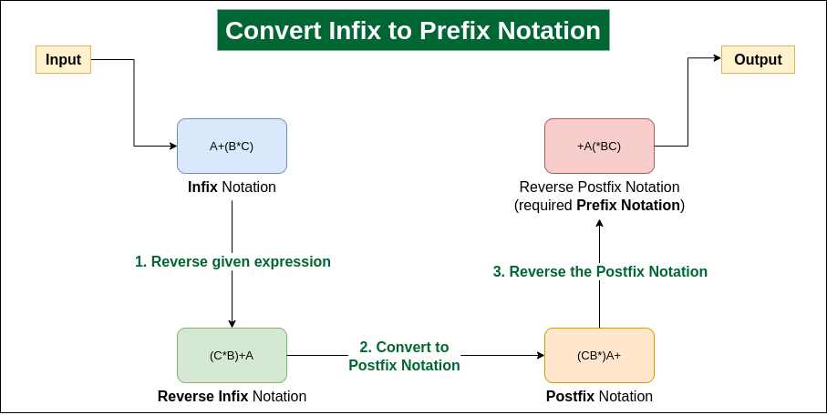

---

# 📘 **Lesson Notes: Infix to Prefix Notation**

*Last Updated: 15 Sep, 2025*

Converting **infix expressions** (e.g., `a + b`) into **prefix notation** (e.g., `+ a b`) is an essential skill in compiler design, expression evaluation, and stack-based computation.

This lesson explains:

- ✔ What prefix notation is
- ✔ How precedence & associativity affect conversion
- ✔ Two major approaches for infix → prefix
- ✔ Step-by-step algorithm
- ✔ Java implementations (Approach 1 & Approach 2)
- ✔ Examples + outputs

---

# 🧠 **1. Understanding Prefix (Polish) Notation**

📌 **Prefix notation** places the **operator before the operands**.

Example:

* Infix: `a + b`
* Prefix: `+ a b`

### Why Prefix?

* No parentheses needed
* Unambiguous
* Easy for computers to evaluate using stacks
* Mirrors expression tree traversal (preorder)

---

# 🔢 **2. Operator Precedence & Associativity**

| Operator | Precedence | Associativity |
| -------- | ---------- | ------------- |
| `^`      | Highest    | Right-to-left |
| `*` `/`  | Medium     | Left-to-right |
| `+` `-`  | Lowest     | Left-to-right |

Rules:

1. Higher precedence evaluated first.
2. If equal precedence:

    * Left-associative: evaluate left first
    * Right-associative: evaluate right first (`^`)

---

# 🎯 **3. Conversion Goal**

Convert:

```
Infix → Prefix
operand1 operator operand2 → operator operand1 operand2
```

Example:
Input: `a*(b+c)/d`
Output: `/*a+bcd`

---

# 🚀 **Approach 1 — Using Stack (Right-to-Left Scan)**

⏱ Time: **O(n)**
📦 Space: **O(n)**

### **Core Idea**

1. Scan the infix expression from **right to left**.
2. Append operands directly to result.
3. Use a stack to handle operators with correct precedence.
4. Treat `(` and `)` reversed because scanning is reversed:

    * Push `)`
    * On encountering `(`, pop until `)`
5. At end, pop all operators and append.
6. **Reverse the result** to obtain the correct prefix.

---

## ✅ **Java Code: Approach 1 (Stack-Based)**

```java
import java.util.Stack;

class GfG {

    // return precedence of operator
    static int precedence(char c) {
        if (c == '^') return 3;
        else if (c == '*' || c == '/') return 2;
        else if (c == '+' || c == '-') return 1;
        else return -1;
    }

    static boolean isRightAssociative(char c) {
        return c == '^';
    }

    // check if operator
    static boolean isOperator(char c) {
        return (c == '+' || c == '-' || c == '*' || c == '/' || c == '^');
    }

    // convert infix to prefix
    static String infixToPrefix(String s) {
        Stack<Character> st = new Stack<>();
        StringBuilder result = new StringBuilder();

        // scan right to left
        for (int i = s.length() - 1; i >= 0; i--) {
            char c = s.charAt(i);

            if (Character.isLetterOrDigit(c)) {
                result.append(c);
            }
            else if (c == ')') {
                st.push(c);
            }
            else if (c == '(') {
                while (!st.isEmpty() && st.peek() != ')') {
                    result.append(st.pop());
                }
                if (!st.isEmpty()) st.pop();
            }
            else if (isOperator(c)) {
                while (!st.isEmpty() && isOperator(st.peek()) &&
                       (precedence(st.peek()) > precedence(c) ||
                       (precedence(st.peek()) == precedence(c) && isRightAssociative(c)))) {
                    result.append(st.pop());
                }
                st.push(c);
            }
        }

        // pop all remaining operators
        while (!st.isEmpty()) result.append(st.pop());

        return result.reverse().toString();  // final prefix
    }

    public static void main(String[] args) {
        String s = "a*(b+c)/d";
        System.out.println(infixToPrefix(s));  
    }
}
```

### **Output**

```
/*a+ b c d
```

Formatted:

```
/*a+bcd
```

---

# 🚀 **Approach 2 — Reverse + Postfix Method**

Also O(n) time and space.

### **Algorithm**

1. Reverse the infix expression.
2. Swap brackets:

    * `(` ↔ `)`
3. Convert reversed expression → postfix.
4. Reverse the postfix → prefix.



### Formula

```
prefix = reverse( postfix( reverse(infix) ) )
```

---

## ✅ **Java Code: Approach 2 (Reversal + Postfix)**

```java
import java.util.Stack;

public class GFG {

    static int precedence(char c) {
        if (c == '^') return 3;
        else if (c == '*' || c == '/') return 2;
        else if (c == '+' || c == '-') return 1;
        else return -1;
    }

    static boolean isRightAssociative(char c) {
        return c == '^';
    }

    static boolean isOperator(char c) {
        return (c == '+' || c == '-' || c == '*' || c == '/' || c == '^');
    }

    static String infixToPrefix(String s) {

        // Step 1: reverse string
        StringBuilder sb = new StringBuilder(s).reverse();
        char[] arr = sb.toString().toCharArray();

        // Step 2: swap brackets
        for (int i = 0; i < arr.length; i++) {
            if (arr[i] == '(') arr[i] = ')';
            else if (arr[i] == ')') arr[i] = '(';
        }

        Stack<Character> st = new Stack<>();
        StringBuilder result = new StringBuilder();

        // Step 3: infix → postfix on reversed string
        for (char c : arr) {
            if (Character.isLetterOrDigit(c)) {
                result.append(c);
            }
            else if (c == '(') {
                st.push(c);
            }
            else if (c == ')') {
                while (!st.isEmpty() && st.peek() != '(') {
                    result.append(st.pop());
                }
                st.pop();
            }
            else if (isOperator(c)) {
                while (!st.isEmpty() && st.peek() != '(' &&
                      (precedence(st.peek()) > precedence(c) ||
                      (precedence(st.peek()) == precedence(c) && isRightAssociative(c)))) {
                    result.append(st.pop());
                }
                st.push(c);
            }
        }

        while (!st.isEmpty()) result.append(st.pop());

        // Step 4: reverse postfix → prefix
        return result.reverse().toString();
    }

    public static void main(String[] args) {
        String s = "a*(b+c)/d";
        System.out.println(infixToPrefix(s));
    }
}
```

### **Output**

```
/*a+bcd
```

---

# 📝 **Example Explained**

Input:

```
a*(b+c)/d
```

1. Convert `(b+c)` → `+bc`
2. Expression becomes: `a*(+bc)/d`
3. Multiply → `*a+bc`
4. Divide by d → `/*a+bcd`

Final prefix:

```
/*a+bcd
```

---

# 🎉 **You now have:**

✔ Full lesson notes
✔ Clean Markdown version
✔ Approach 1 + Approach 2
✔ Java code (compilable)
✔ Example + Explanation

---

