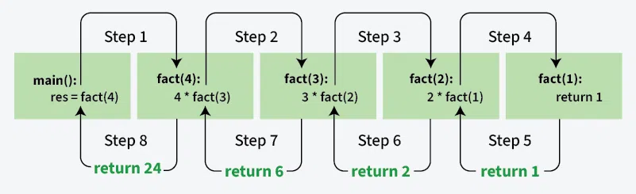
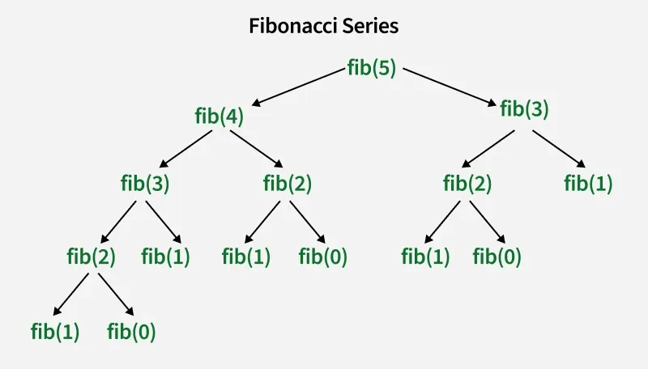

---

# #️⃣ **Introduction to Recursion**

**Last Updated: 25 Oct, 2025**

> Recursion is the process in which a function **calls itself directly or indirectly**, and such a function is called a **recursive function**.

A **recursive algorithm** works by taking one step toward a solution and then recursively calling itself to move further. The recursion stops once the solution is reached.
Since the called function may call itself again, the process might continue forever if not controlled.
Therefore, defining a **base case** is essential to terminate recursion.

---

# ## ⭐ Steps to Implement Recursion

### **Step 1 — Define a Base Case**

Identify the simplest case for which the answer is known.
This is the **stopping condition**, preventing infinite recursion.

### **Step 2 — Define a Recursive Case**

Break the problem into **smaller subproblems** and call the function recursively to solve each one.

### **Step 3 — Ensure Recursion Terminates**

Make sure the recursion **moves toward the base case**.
A recursion that never reaches its base case results in an infinite loop.

### **Step 4 — Combine Solutions**

Use the results of the subproblems to solve the **original problem** once recursion unwinds.

---

# ## ⭐ Example 1 — Sum of Natural Numbers (n = 3)

### Input & Output

```
Input: n = 3  
Output: 6
Explanation: 1 + 2 + 3 = 6

Input: n = 7  
Output: 28
Explanation: 1 + 2 + 3 + 4 + 5 + 6 + 7 = 28
```

### **Base Case**

```
if (n == 1) return 1;
```

### **Recursive Case**

```
sum(n) = n + sum(n - 1)
```

### Java Code

```java
public class Main {
    public static int sum(int n) {

        // base condition
        if (n == 1)
            return 1;

        return n + sum(n - 1);
    }

    public static void main(String[] args) {
        int n = 5;
        System.out.println(sum(n));
    }
}
```

### Output

```
15
```

---

# ## ⭐ Execution Flow of the Recursive Solution

Calls are pushed on the stack:

```
sum(3)
 → sum(2)
   → sum(1)
```

Then results unwind:

```
sum(1) = 1
sum(2) = 2 + 1 = 3
sum(3) = 3 + 3 = 6
```

---

# ## ⭐ Comparison of Recursive and Iterative Approaches

Recursion helps in **logic building** and breaking complex problems into smaller subproblems.
Recursive thinking is foundational for **Dynamic Programming** and **Divide & Conquer**.

Recursion is naturally suited for:

* Towers of Hanoi
* Inorder / Preorder / Postorder Tree Traversals
* DFS of Graph
* Many mathematical series

---

# ## ⭐ FAQ on Recursion

### **What is the base condition in recursion?**

A recursive program stops when the **base condition** becomes true.
There may be **more than one** base case.
In the sum example, the base condition is:

```
n == 1
```

### **How is a problem solved using recursion?**

Represent the problem in smaller subproblems and apply base conditions that stop further recursion.

---

# ## ⭐ Example 2 — Factorial of a Number



### Definition

For a number `n ≥ 0`:

```
n! = 1 × 2 × ... × n
Base case: 0! = 1
```

### Java Code

```java
public class GfG {
    public static int fact(int n) {

        // BASE CONDITION
        if (n == 0)
            return 1;

        return n * fact(n - 1);
    }

    public static void main(String[] args) {
        System.out.println("Factorial of 5 : " + fact(5));
    }
}
```

### Output

```
Factorial of 5 : 120
```

---

# ## ⭐ When Does Stack Overflow Occur?

A **StackOverflowError** occurs when:

* The base case is incorrect
* The base case is unreachable
* The recursive call never terminates

### Example (Incorrect Code)

```java
int fact(int n) {
    // wrong base case (may cause stack overflow)
    if (n == 100)
        return 1;
    else
        return n * fact(n - 1);
}
```

Calling `fact(10)` will make calls:

10 → 9 → 8 → 7 → … → 0 → −1 → −2 → ...

The base case `n == 100` is never reached → infinite recursion → **stack overflow**.

---

# ## ⭐ Direct vs Indirect Recursion

### **Direct Recursion**

A function calls **itself** directly.

```java
void directRecFun() {
    directRecFun();
}
```

### **Indirect Recursion**

A function calls another function, which eventually calls the first function.

```java
void indirectRecFun1() {
    indirectRecFun2();
}

void indirectRecFun2() {
    indirectRecFun1();
}
```

---

# ## ⭐ Tail vs Non-Tail Recursion

### **Tail Recursion**

A recursive call that appears **as the last statement** in the function.

### **Non-Tail Recursion**

More computation happens **after** the recursive call (example: factorial).

---

# ## ⭐ Memory Allocation in Recursion

Recursion uses an **internal function call stack**, and each recursive call stores:

* Local variables
* Return address
* Function state

The stack follows **LIFO** (Last In, First Out).

### Rules:

1. Each function call gets a **new memory block**.
2. Base case returns and **begins unwinding**.
3. Returned values are passed back to previous calls.

---

# ## ⭐ Example — Understanding Stack Behavior

```java
class GFG {
    static void printFun(int test) {
        if (test < 1)
            return;
        else {
            System.out.printf("%d ", test);
            printFun(test - 1);  
            System.out.printf("%d ", test);
            return;
        }
    }

    public static void main(String[] args) {
        int test = 3;
        printFun(test);
    }
}
```

### Output

```
3 2 1 1 2 3
```

### Execution Explanation

* `printFun(3)` → allocates memory
* Calls `printFun(2)`
* Calls `printFun(1)`
* Calls `printFun(0)` → base case
* Returns and unwinds
* Prints values while unwinding

The stack **grows** with recursive calls and **shrinks** as the recursion returns.

---

# ## ⭐ Advantages of Recursion

* Cleaner, simpler code
* Perfect for inherently recursive problems
* Useful in tree traversal, graph search, divide-and-conquer algorithms
* Makes some problems easier to express

---

# ## ⭐ Disadvantages of Recursion

* Slower (stack management overhead)
* Higher memory usage
* Can be harder to debug
* Risk of stack overflow if base case is not well defined

---

# ## ⭐ Example 3 — Fibonacci with Recursion



### Mathematical Equation

```
fib(n) = n                 if n == 0 or n == 1
fib(n) = fib(n-1) + fib(n-2)
```

### Recurrence Relation

```
T(n) = T(n − 1) + T(n − 2) + O(1)
```

### Java Code

```java
class GFG {

    static int fib(int n) {

        if (n == 0)
            return 0;

        if (n == 1 || n == 2)
            return 1;

        return (fib(n - 1) + fib(n - 2));
    }

    public static void main(String[] args) {
        int n = 5;
        System.out.print("Fibonacci series of 5 numbers is: ");

        for (int i = 0; i < n; i++) {
            System.out.print(fib(i) + " ");
        }
    }
}
```

### Output

```
Fibonacci series of 5 numbers is: 0 1 1 2 3
```

---

# ## ⭐ Common Applications of Recursion

* **Tree Traversal:** Inorder, Preorder, Postorder
* **Graph Traversal:** DFS
* **Sorting Algorithms:** Quick Sort, Merge Sort
* **Divide & Conquer:** Binary Search
* **Fractal Generation:** Mandelbrot set
* **Backtracking:** N-Queens, Sudoku
* **Memoization:** Optimal subproblem reuse

---

# ## ⭐ Summary of Recursion

```
• Recursion has two parts: a base case and a recursive case.
• Base case terminates recursion.
• Each recursive call creates a new copy of the function in stack memory.
• Infinite recursion leads to stack overflow.
• Classic examples: Merge Sort, Quick Sort,
  Tower of Hanoi, Fibonacci, Factorial, etc.
```

---

