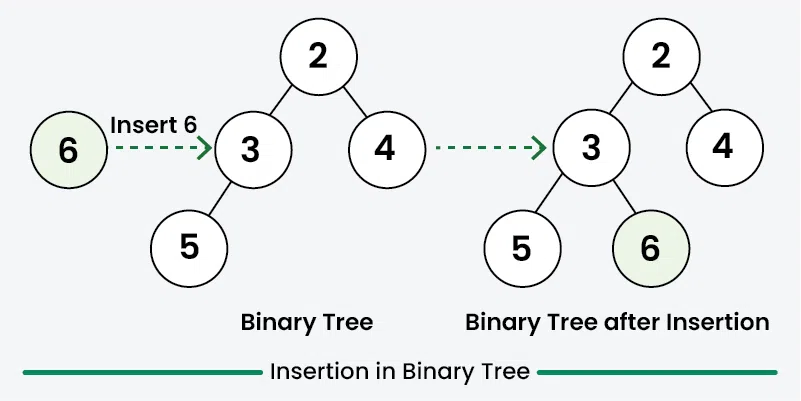

---

# 🌳 **Insertion in a Binary Tree in Level Order (Beginner Level Lesson Notes)**

### 🎯 **Goal**

Given a **binary tree** and a **key**, insert the key into the tree at the **first available position** when scanning the tree in **level order** (also called breadth-first order).

We must insert the new node exactly where a **left** or **right** child is **NULL** for the first time.

---

# ⭐ What is Level Order Traversal?

Level order means we visit the tree **level by level**, from **left to right**, using a **queue**.

Example:

```
     10
   /    \
 11      9
 /      / \
7     15   8
```

Level order sequence = **10, 11, 9, 7, 15, 8**

---

# ⭐ Why Insert in Level Order?

A binary tree (NOT binary search tree) does *not* have ordering rules.

So, to keep the tree **as complete as possible**, we insert the new key in the **first available spot**:

* First empty **left child**
* Or first empty **right child**

This is naturally discovered through **level order traversal**.

---

# ⭐ Approach (Beginner Explanation)

1. If the tree is **empty**, the new node becomes the **root**.
2. Else:

    * Create a **queue**
    * Push the root into the queue
    * While the queue is not empty:

        * Remove (poll) a node from the front
        * If its **left child is empty**, insert the new node there → **stop**
        * Otherwise, push the left child to the queue
        * If its **right child is empty**, insert the new node there → **stop**
        * Otherwise, push the right child to the queue

We continue until we find the **first free position**.

---



---

# ⭐ Full Java Code (From Your Provided Code)

```java
// Java program to insert element (in level order)
// in Binary Tree
import java.util.LinkedList;
import java.util.Queue;

class Node {
    int data;
    Node left, right;
    
    Node(int x) {
        data = x;
        left = right = null;
    }
}

class GfG {
  
    // Function to insert element 
    // in binary tree
    static Node InsertNode(Node root, int data) {
      
        // If the tree is empty, assign new node 
        // address to root
        if (root == null) {
            root = new Node(data);
            return root;
        }

        // Else, do level order traversal until we find an empty
        // place, i.e. either left child or right child of some
        // node is pointing to NULL.
        Queue<Node> q = new LinkedList<>();
        q.add(root);

        while (!q.isEmpty()) {
          
            // Front element in queue
            Node curr = q.poll();

            // First check left; if left is null, insert
            if (curr.left != null)
                q.add(curr.left);
            else {
                curr.left = new Node(data);
                return root;
            }

            // Then check right
            if (curr.right != null)
                q.add(curr.right);
            else {
                curr.right = new Node(data);
                return root;
            }
        }
        return root;
    }

    // Inorder traversal of a binary tree
    static void inorder(Node curr) {
        if (curr == null)
            return;
        inorder(curr.left);
        System.out.print(curr.data + " ");
        inorder(curr.right);
    }

    public static void main(String[] args) {
      
        // Constructing the binary tree
        //          10
        //        /    \ 
        //       11     9
        //      /      / \
        //     7      15   8
        Node root = new Node(10);
        root.left = new Node(11);
        root.right = new Node(9);
        root.left.left = new Node(7);
        root.right.left = new Node(15);
        root.right.right = new Node(8);

        int key = 12;
        root = InsertNode(root, key);

        // After insertion (12 added)
        //          10
        //        /    \ 
        //       11     9
        //      /  \   / \
        //     7   12 15  8
        
        inorder(root);
    }
}
```

---

# ⭐ Output

```
7 11 12 10 15 9 8
```

---

# ⭐ Time & Space Complexity

| Type      | Complexity | Reason                                        |
| --------- | ---------- | --------------------------------------------- |
| **Time**  | **O(n)**   | You may visit all nodes once                  |
| **Space** | **O(n)**   | Queue may store many nodes during level order |

---
