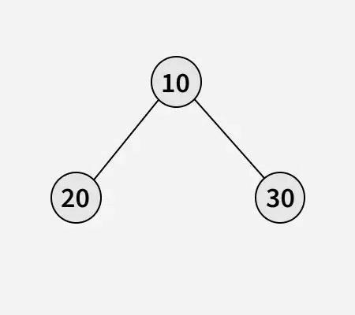
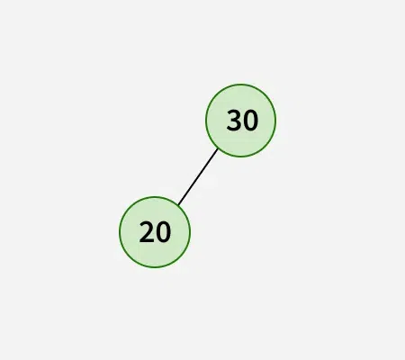
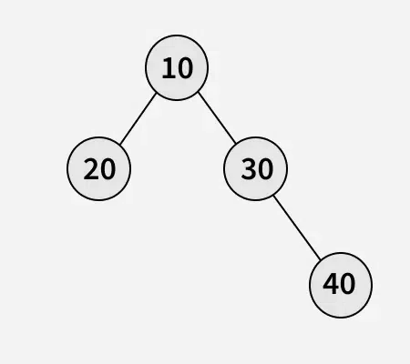
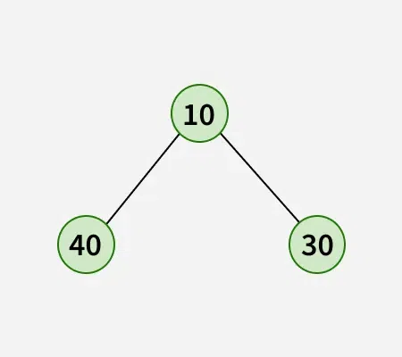
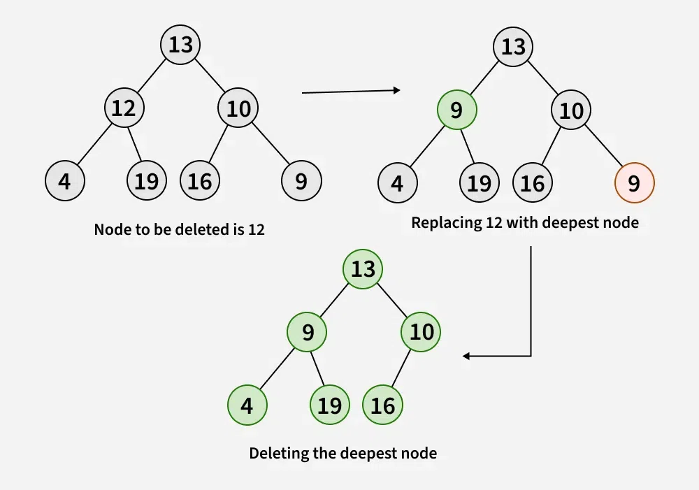

---

# 🌳 **Deletion in a Binary Tree (Level-Order Based Deletion)**

*(Not the same as BST deletion)*

### 🎯 **Goal**

Given a **binary tree** and a **key**, delete the node containing that key.
Since this is **not a Binary Search Tree**, we cannot use comparisons to choose where to replace nodes.

Instead, we follow this rule:

> **Replace the node to be deleted with the deepest, rightmost node in the tree**,
> and then **delete that deepest node**.

This ensures the binary tree remains balanced and shrinks from **bottom-right**.

---

# ⭐ Why This Method?

In a normal binary tree:

* We cannot rely on sorted order (because it’s NOT a BST)
* So, the best candidate to replace a node is:

    * **Deepest node**
    * **Rightmost node**

Why?
Because removing the deepest rightmost node does **not disturb the tree structure**.

---

# ⭐ Example 1
---

---
Deleting key = **10**

Before:
(deepest & rightmost = **30**)

After replacement:
10 → replaced by 30
Then 30 is removed.
---

---

# ⭐ Example 2
---

---
Deleting key = **20**

Deepest rightmost = **40**, so we replace 20 with 40 and delete 40.

---

---

# ⭐ Approach (Step-by-Step)

### ✔ Step 1 — Level Order Traversal

Find:

* The **node that contains the key**
* The **deepest & rightmost node**

### ✔ Step 2 — Replace

Set:

```
keyNode.data = deepestNode.data
```

### ✔ Step 3 — Delete

Remove the deepest node using another BFS pass.

---



---

# ⭐ Java Implementation (Provided Code, cleaned formatting)

```java
// Java program to delete a specific 
// element in a binary tree

import java.util.LinkedList;
import java.util.Queue;

class Node {
    int data;
    Node left, right;

    Node(int x) {
        data = x;
        left = right = null;
    }
}

class GfG {

    // Function to delete the deepest node in a binary tree
    static void deletDeepest(Node root, Node dNode) {
        Queue<Node> q = new LinkedList<>();
        q.add(root);

        Node curr;
        while (!q.isEmpty()) {
            curr = q.poll();

            // If current node is the deepest node, delete it
            if (curr == dNode) {
                curr = null;
                dNode = null;
                return;
            }

            // Check right child
            if (curr.right != null) {
                if (curr.right == dNode) {
                    curr.right = null;
                    dNode = null;
                    return;
                }
                q.add(curr.right);
            }

            // Check left child
            if (curr.left != null) {
                if (curr.left == dNode) {
                    curr.left = null;
                    dNode = null;
                    return;
                }
                q.add(curr.left);
            }
        }
    }

    // Function to delete the node with the given key
    static Node deletion(Node root, int key) {

        if (root == null)
            return null;

        // Tree has only one node
        if (root.left == null && root.right == null) {
            if (root.data == key)
                return null;
            else
                return root;
        }

        Queue<Node> q = new LinkedList<>();
        q.add(root);

        Node curr = null;
        Node keyNode = null;

        // BFS to find deepest node and key node
        while (!q.isEmpty()) {
            curr = q.poll();

            if (curr.data == key)
                keyNode = curr;

            if (curr.left != null)
                q.add(curr.left);

            if (curr.right != null)
                q.add(curr.right);
        }

        // Replace key node with deepest node
        if (keyNode != null) {
            int x = curr.data;   // deepest node data
            keyNode.data = x;    // replace
            deletDeepest(root, curr);  // delete deepest node
        }

        return root;
    }

    // Inorder traversal
    static void inorder(Node curr) {
        if (curr == null)
            return;

        inorder(curr.left);
        System.out.print(curr.data + " ");
        inorder(curr.right);
    }

    public static void main(String[] args) {

        // Construct the binary tree
        //       10         
        //      /  \       
        //    11    9
        //   / \   / \     
        //  7  12 15  8   
        Node root = new Node(10);
        root.left = new Node(11);
        root.right = new Node(9);
        root.left.left = new Node(7);
        root.left.right = new Node(12);
        root.right.left = new Node(15);
        root.right.right = new Node(8);

        int key = 11;
        root = deletion(root, key);
        inorder(root);
    }
}
```

---

# ⭐ Output

```
7 8 12 10 15 9
```

---

# ⭐ Time and Space Complexity

| Type      | Complexity | Explanation                       |
| --------- | ---------- | --------------------------------- |
| **Time**  | **O(n)**   | Full level order traversal needed |
| **Space** | **O(n)**   | Queue used in BFS                 |

---

# ⭐ Note

You *can* replace the key node with **any leaf node**, but using the **deepest rightmost** node keeps the binary tree as complete and balanced as possible.

---

