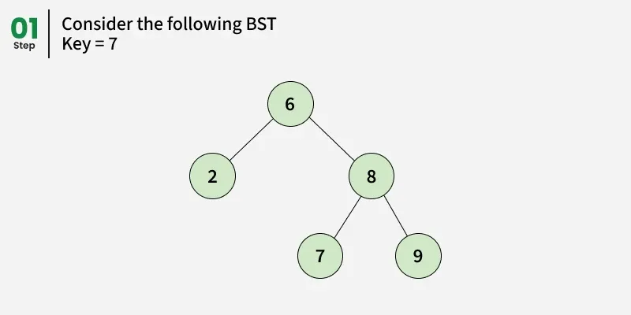
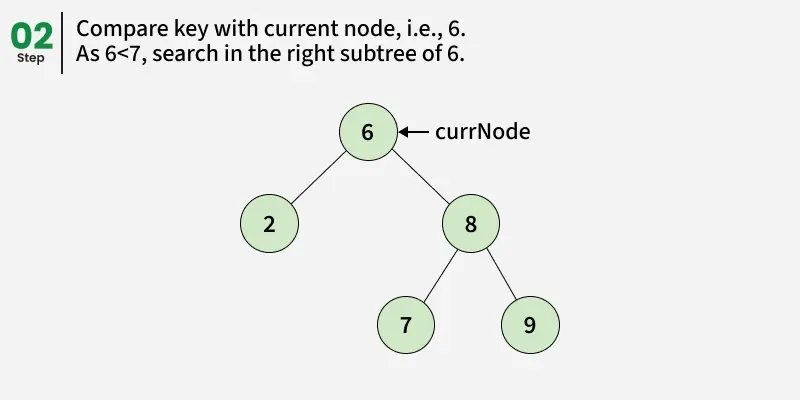
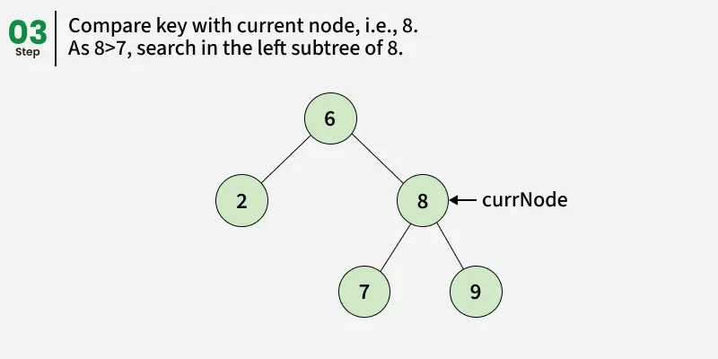
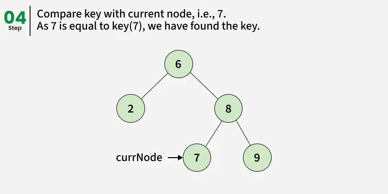

---

# ⭐ Beginner Lesson: Searching in a Binary Search Tree (BST)

A **Binary Search Tree (BST)** is a special type of binary tree where:

* **Left child < Parent**
* **Right child > Parent**

This rule helps us **search for a value much faster** compared to a normal binary tree.

---

# 🎯 What Are We Trying to Do?

We are given:

* The **root** of a BST.
* A number called **key**.

Our goal:

👉 **Check if the key is present in the BST or not.**

The key might **exist** → return `true`
The key might **not exist** → return `false`

---

# 🧠 How BST Search Works (Very Simple Steps)

When searching for a value:

1. **Start at the root**.
2. Compare the **key** with the root’s value:

    * If **equal** → ✔️ found!
    * If **smaller** → go to the **left subtree**.
    * If **greater** → go to the **right subtree**.
3. Repeat until:

    * You find the key → return `true`
    * You reach a null node → return `false`

This works because BSTs keep all smaller values on the left and all greater values on the right.

---

---

---

---

---

# 📘 Example

Consider this BST:

```
       6
      / \
     2   8
        / \
       7   9
```

If `key = 7` → It **is found** → output: `true`

If `key = 14` → It **does not exist** → output: `false`

---

# 🖥️ Searching in BST Using Recursion (Beginner Friendly)

```java
// Node Structure
class Node {
    int data;
    Node left, right;

    public Node(int item) {
        data = item;
        left = right = null;
    }
}

class GFG {
    static boolean search(Node root, int key) {

        // root is null -> key not found
        if (root == null)
            return false;

        // root data matches key -> found
        if (root.data == key)
            return true;

        // if key is greater, search right subtree
        if (key > root.data)
            return search(root.right, key);

        // else search left subtree
        return search(root.left, key);
    }

    public static void main(String[] args) {

        // Creating BST
        //    6
        //   / \
        //  2   8
        //     / \
        //    7   9

        Node root = new Node(6);
        root.left = new Node(2);
        root.right = new Node(8);
        root.right.left = new Node(7);
        root.right.right = new Node(9);

        int key = 7;

        // Searching for key
        System.out.println(search(root, key));
    }
}
```

### Output

```
1
```

---

# 📗 Searching in BST Using Iteration (No recursion)

This version avoids recursion, so it uses **constant space**.

```java
class Node {
    int data;
    Node left, right;

    public Node(int item) {
        data = item;
        left = right = null;
    }
}

class GFG {
    static boolean search(Node root, int key) {
        boolean present = false;

        // Iterative traversal
        while (root != null) {

            if (root.data == key) {
                present = true;
                break;
            } else if (key > root.data) {
                root = root.right;   // go right
            } else {
                root = root.left;    // go left
            }
        }
        return present;
    }

    public static void main(String[] args) {

        // Creating BST
        Node root = new Node(6);
        root.left = new Node(2);
        root.right = new Node(8);
        root.right.left = new Node(7);
        root.right.right = new Node(9);

        int key = 7;
        System.out.println(search(root, key));
    }
}
```

### Output

```
1
```

---

# ⏱️ Time & Space Complexity

| Approach  | Time Complexity | Space Complexity           |
| --------- | --------------- | -------------------------- |
| Recursion | **O(h)**        | **O(h)** (recursion stack) |
| Iteration | **O(h)**        | **O(1)**                   |

Where **h = height of BST**

* Best case (balanced tree): `h = log n`
* Worst case (skewed tree): `h = n`

---

# 🎉 Summary for Beginners

Searching in a BST is easy because:

* Smaller values go **left**
* Bigger values go **right**
* We compare step by step until we find the key or reach null.

Two ways to search:

1. **Recursion** → easy to understand
2. **Iteration** → faster and uses less memory

---

