---

# 🟢 Binary Tree Data Structure

**Last Updated:** 02 Aug, 2025

A **Binary Tree** is a **hierarchical, non-linear data structure** in which each node has **at most two children**:

* **Left Child**
* **Right Child**

It is commonly used in computer science for **efficient storage, retrieval, and hierarchical organization** of data.

---
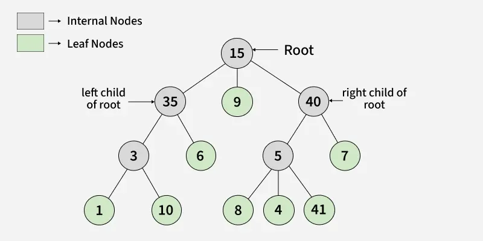
---

## Introduction to Binary Tree

* **Binary Tree** is a **non-linear hierarchical data structure**.
* The **topmost node** is called the **root**.
* Nodes without children are called **leaves**.
* Nodes with at least one child are called **internal nodes**.

---

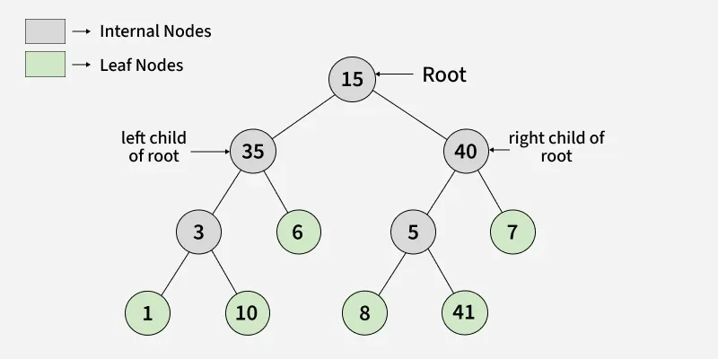

---
## Representation of a Binary Tree

Each node in a binary tree contains:

1. **Data** – The value of the node.
2. **Pointer to left child** – Reference to the left subtree.
3. **Pointer to right child** – Reference to the right subtree.

**Node structure in Java:**

```java
class Node {
    int key;
    Node left, right;

    public Node(int item) {
        key = item;
        left = right = null;
    }
}
```

---
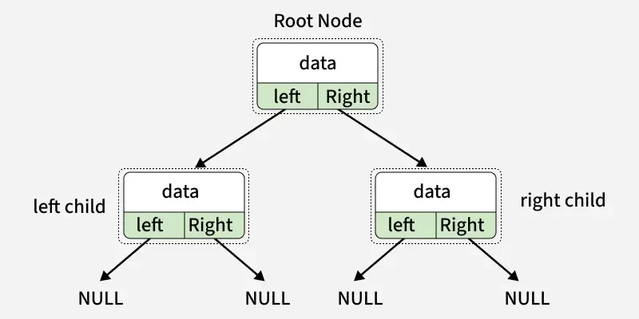
---

## Terminologies in Binary Tree

* **Parent Node:** Node that is the direct ancestor of a child node.
* **Child Node:** Node that is the direct descendant of a parent node.
* **Ancestors of a node:** All nodes on the path from the root to the node (including the node itself).
* **Descendants of a node:** All nodes in the subtree rooted at the node (including the node itself).
* **Subtree:** A tree consisting of a node as root and all its descendants.
* **Edge:** Connection between a parent node and a child node.
* **Path:** Sequence of nodes connected by edges from one node to another.
* **Leaf Node:** Node with no children.
* **Internal Node:** Node with at least one child.
* **Depth/Level:** Number of edges from root to the node (root has level 0).
* **Height:** Number of edges on the longest path from root to a leaf.

---
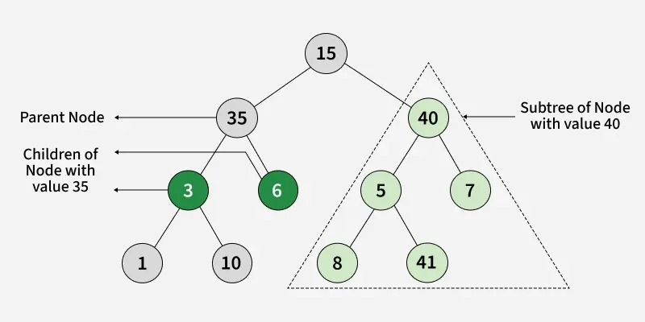
---

## Creating a Binary Tree

---
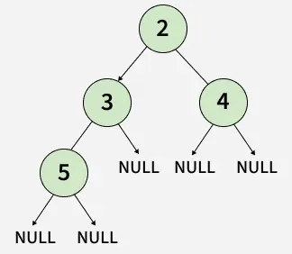
---

Example: Creating a binary tree with four nodes 2, 3, 4, 5

```java
Node firstNode = new Node(2);
Node secondNode = new Node(3);
Node thirdNode = new Node(4);
Node fourthNode = new Node(5);

// Connect nodes
firstNode.left = secondNode;
firstNode.right = thirdNode;
secondNode.left = fourthNode;
```

---

# Properties of Binary Tree

This lesson explores the **fundamental properties of a binary tree**, covering its structure, characteristics, and key relationships between nodes, edges, height, and levels.

---
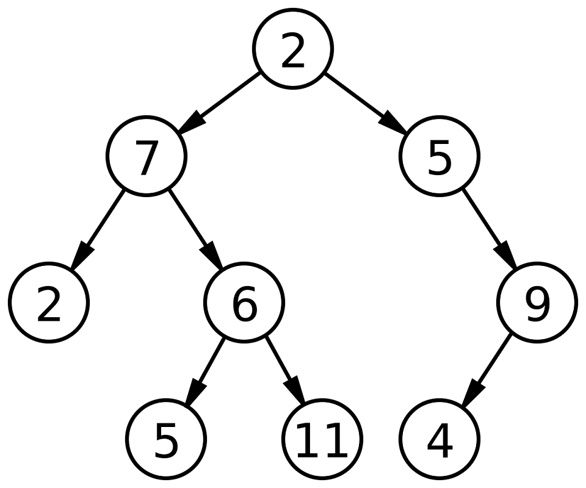
---

## Binary Tree Representation

* **Height of root node** is considered **0**.

---
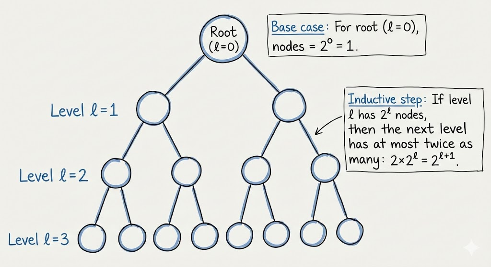
---
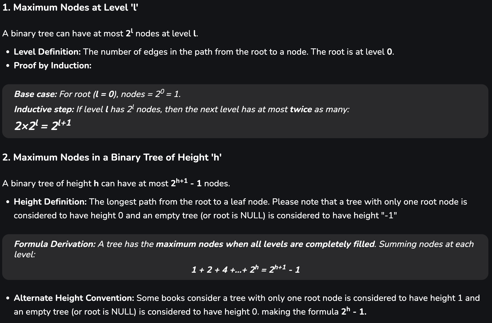
---
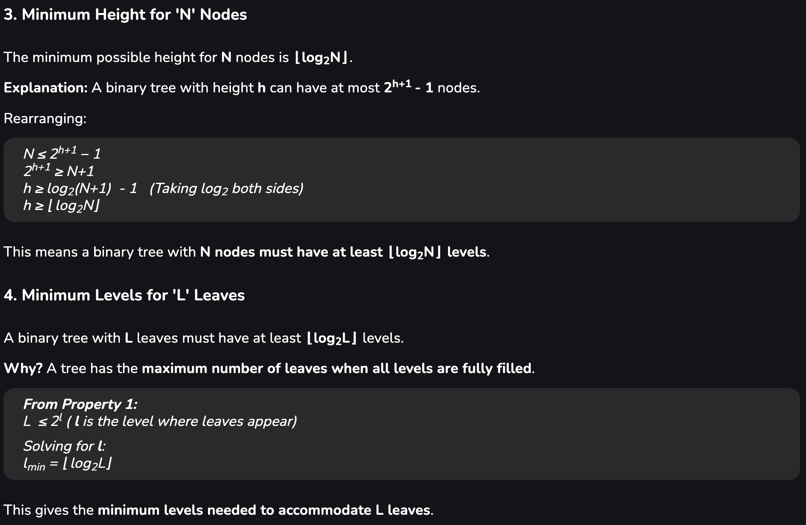
---
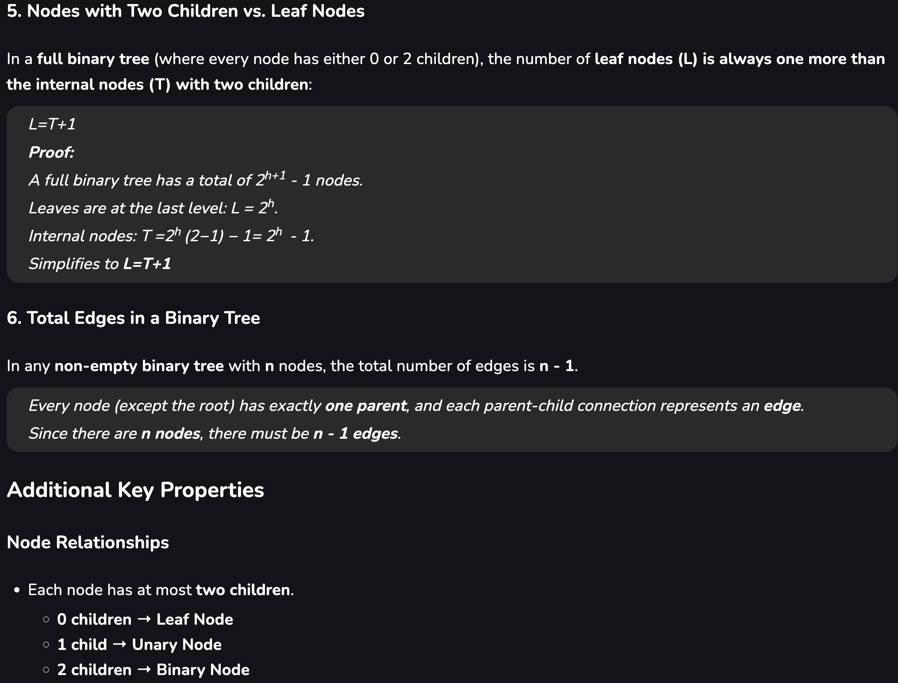
---
# Types of Binary Tree

>A **binary tree** is a tree data structure where each node has at most **two children**, usually referred to as the **left child** and **right child**. Binary trees are widely used in applications such as **binary search trees** and **heaps**.

---

## 1. Types of Binary Tree (Based on Number of Children)

### 1.1 Full Binary Tree

* A binary tree is a **full binary tree** if every node has **0 or 2 children**.
* All nodes except leaf nodes have **two children**.
* Also known as a **proper binary tree**.

---
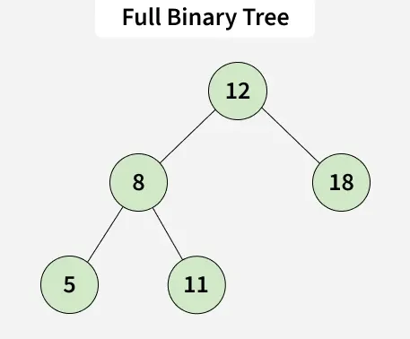
---

### 1.2 Degenerate (Pathological) Tree

* A **degenerate tree** is a tree where **every internal node has exactly one child**.
* Such a tree is **performance-wise similar to a linked list**.

---
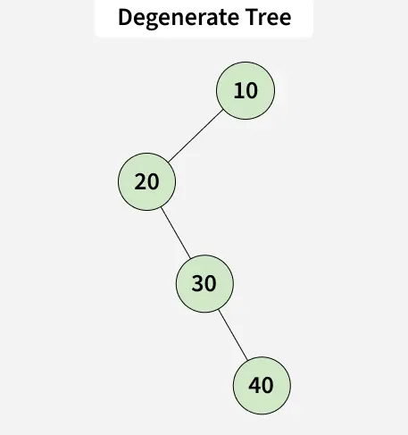
---

### 1.3 Skewed Binary Tree

* A **skewed binary tree** is a degenerate tree dominated by either **left nodes** or **right nodes**.
* Types:

    * **Left-skewed binary tree**
    * **Right-skewed binary tree**

---
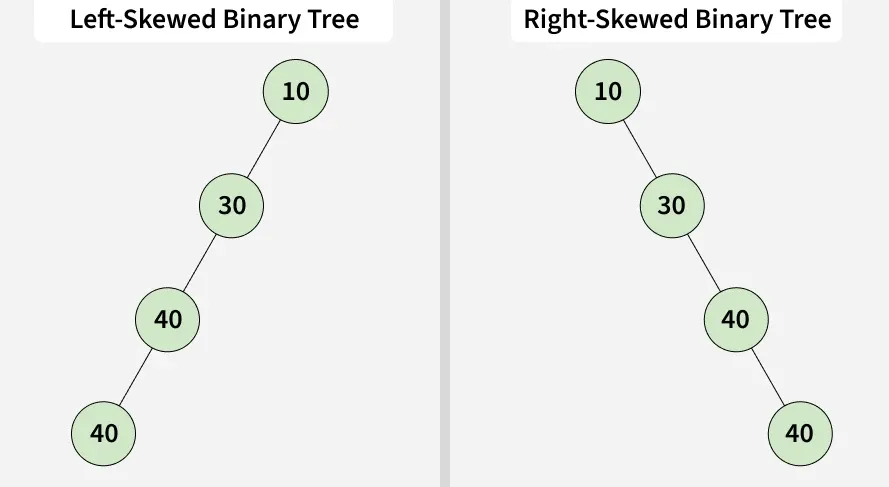
---

## 2. Types of Binary Tree (Based on Level Completion)

### 2.1 Complete Binary Tree

* All levels are **fully filled** except possibly the **last level**, which is filled from **left to right**.
* Differences from a full binary tree:

    1. Every level except the last is completely filled.
    2. All leaf elements **lean towards the left**.

---
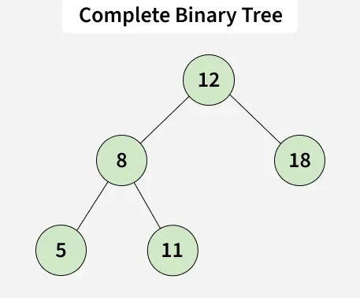
---

### 2.2 Perfect Binary Tree

* All **internal nodes** have exactly **two children**.
* All **leaf nodes** are at the **same level**.
* Number of leaf nodes (L) and internal nodes (T) relationship:

[
L = T + 1
]

---
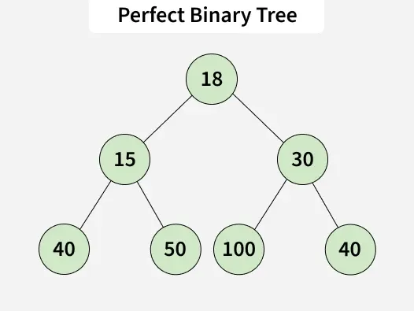
---

### 2.3 Balanced Binary Tree

* Height of the tree is (O(\log n)), where (n) is the number of nodes.
* Example: **AVL Tree**, which maintains balance by ensuring:

[
d = | \text{Height of Left Subtree} - \text{Height of Right Subtree} | \le 1
]

---
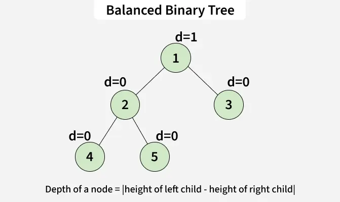
---

## 3. Special Types of Binary Trees

---
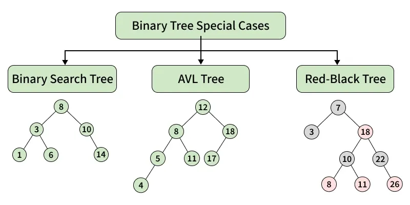
---

### 3.1 Binary Search Tree (BST)

* **Node-based binary tree** with properties:

    1. Left subtree contains only nodes with keys **less than** the node’s key.
    2. Right subtree contains only nodes with keys **greater than** the node’s key.
    3. Left and right subtrees are **also BSTs**.

---
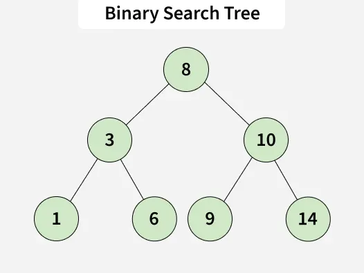
---

### 3.2 AVL Tree

* **Self-balancing BST**.
* Difference between heights of left and right subtrees of all nodes ≤ 1.

---
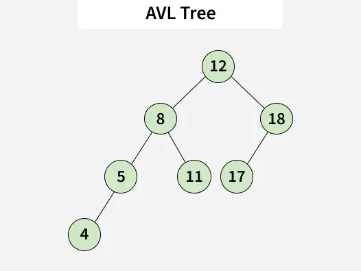
---
### 3.3 Red-Black Tree

* Self-balancing BST where each node has a **color bit** (red or black) to maintain approximate balance.
* Ensures **O(log n)** time for search, insertion, and deletion.

---
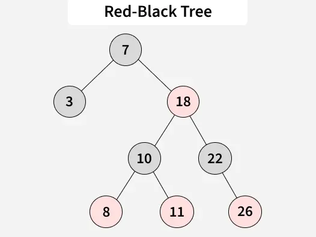
---

### 3.4 B-Tree

* Self-balancing search tree designed for **disk-based systems**.
* Each node can have **multiple keys and children**.
* Keys within a node are sorted, and subtrees store values in a **key range**.
* Ensures **minimized height** for fast access on large datasets.

---

### 3.5 B+ Tree

* Extension of **B-Tree**.
* **Leaf nodes** store all data; internal nodes store **keys only** for indexing.
* Leaf nodes are linked sequentially to allow **efficient range queries** and **ordered traversals**.

---

# Binary Tree: Applications, Advantages, and Disadvantages

A **binary tree** is a tree in which each node has **at most two children**. Binary trees are widely used in computer science for organizing hierarchical data, efficient searching, and supporting specialized structures like heaps, AVL trees, and BSTs.

---

## 1. Applications of Binary Trees

### 1.1 General Applications

* **DOM in HTML**: Manage hierarchical structure of web pages.
* **File Explorer**: Organize file systems for efficient navigation.
* **Expression Evaluation**: Used in calculators and compilers to evaluate arithmetic expressions.
* **Routing Algorithms**: Support decision-making in network routing.
* **Additional Uses**: Any application benefiting from hierarchical data organization.

---

### 1.2 Hierarchical Data Representation

* **File Systems & Folder Structures**: Organize files and directories efficiently.
* **Organizational Charts**: Represent corporate or institutional hierarchies.
* **XML/HTML Parsing**: Process structured data in documents.

---

### 1.3 Applications of Binary Search Trees (BST)

* **Efficient Operations**: Search, insertion, and deletion with average time complexity:

[
O(\log n)
]

* AVL and Red-Black trees maintain this efficiency.
* Additional operations such as **sorted traversal, floor, and ceil** are also efficient.
* **Data Structures**: Implement **associative arrays, maps, and sets** while keeping data sorted.

> Note: Search, insert, and delete are faster than arrays and linked lists but slower than hashing. Hashing does not allow sorted traversal, floor, and ceil operations.

---

### 1.4 Applications of Binary Heap Trees

* **Expression Trees**: Represent arithmetic expressions where **internal nodes** are operators and **leaf nodes** are operands.
* **Use Cases**: Common in compilers and calculators.
* **Huffman Coding Trees**: Used in data compression algorithms for **lossless compression** (e.g., Huffman coding).

---

### 1.5 Decision Trees

* **Machine Learning**: Models for classification and regression problems.
* **Conditional Processes**: Represent sequential decision-making steps.
* **Traversal Operations**: Preorder, inorder, and postorder traversals support expression evaluation and tree reconstruction.

---

## 2. Advantages of Binary Trees

* **Structured Organization**: Provides clear, hierarchical data storage.
* **Efficient Searching and Sorting**: BSTs enable fast data operations.
* **Balanced Storage**: AVL and Red-Black trees maintain **O(\log n)** height, ensuring performance efficiency.
* **Flexibility**: Can be adapted to specialized structures like heaps and BSTs.
* **Recursion Support**: Naturally fits recursive algorithms.
* **Scalability**: Handles large dynamic datasets effectively.

---

## 3. Disadvantages of Binary Trees

* **Skewed Trees**: Unbalanced trees can degrade performance to

[
O(n)
]

(similar to linked lists).

* **Memory Overhead**: Each node requires additional pointers, increasing memory usage.
* **Complex Implementation**: Balancing trees (e.g., AVL, Red-Black) involves complex rotations.
* **Limited Degree**: Each node is restricted to **two children**, which may not suit some applications.

---

# Enumeration of Binary Trees

A **binary tree** can be classified based on whether its nodes are **labeled** or **unlabeled**:

* **Labeled Binary Tree:** Each node is assigned a unique label.
* **Unlabeled Binary Tree:** Nodes are not assigned any label.

### Example: Unlabeled vs. Labeled Trees

* **Unlabeled Trees (considered same if structure is same):**

```
    o                 o
  /   \             /   \ 
 o     o           o     o 
```

* **Labeled Trees (considered different if node labels differ):**

```
    A                C
  /   \             /  \ 
 B     C           A    B 
```

---

## 1. Counting Unlabeled Binary Trees

Let **T(n)** denote the number of **unlabeled binary trees** with `n` nodes.

### Base Cases

* For `n = 0` (empty tree):

[
T(0) = 1
]

* For `n = 1`:

[
T(1) = 1
]

* For `n = 2`:

[
T(2) = 2
]

* For `n = 3`:

[
T(3) = 5
]

> These values can be illustrated as trees:

```
n=1:         o

n=2:      o      o
          /      \  
         o        o

n=3:      o      o           o          o      o
         /        \         /  \      /         \
        o          o       o    o     o          o
       /            \                  \        /
      o              o                  o      o
```

---

### 1.1 Recursive Formula

The number of trees is calculated by **considering all possible pairs of left and right subtrees**:

[
T(n) = \sum_{i=0}^{n-1} T(i) \cdot T(n-i-1)
]

Or equivalently:

[
T(n) = \sum_{i=1}^{n} T(i-1) \cdot T(n-i)
]

Where:

* `T(i-1)` = number of nodes in the left subtree
* `T(n-i)` = number of nodes in the right subtree

#### Example Calculations

* For `n = 3`:

[
T(3) = T(0)\cdot T(2) + T(1)\cdot T(1) + T(2)\cdot T(0) = 1\cdot2 + 1\cdot1 + 2\cdot1 = 5
]

* For `n = 4`:

[
T(4) = T(0)\cdot T(3) + T(1)\cdot T(2) + T(2)\cdot T(1) + T(3)\cdot T(0)
= 1\cdot5 + 1\cdot2 + 2\cdot1 + 5\cdot1
= 14
]

> This sequence of numbers is known as the **Catalan Numbers**:
> [
> 1, 1, 2, 5, 14, 42, 132, 429, 1430, 4862, \dots
> ]

---

### 1.2 Direct Formula for Catalan Numbers

The **nth Catalan number** can also be evaluated using the formula:

[
T(n) = \frac{(2n)!}{(n+1)! , n!}
]

---

### 1.3 Binary Search Trees (BSTs)

The **number of BSTs** with `n` nodes is the **same** as the number of unlabeled binary trees.

* Reason: In a BST, any key can be the root.
* If the root is the i-th key in sorted order:

    * `i-1` keys go to the left subtree
    * `n-i` keys go to the right subtree

This results in the same recursive formula as for unlabeled trees.

---

## 2. Counting Labeled Binary Trees

For **labeled binary trees**, every unlabeled tree with `n` nodes can generate **n! different labeled trees** by permuting the labels among the nodes.

[
\text{Number of Labeled Trees} = (\text{Number of Unlabeled Trees}) \times n!
]

Using the Catalan formula:

[
\text{Number of Labeled Trees} = \frac{(2n)!}{(n+1)! , n!} \cdot n!
]

#### Example:

* For `n = 3`:

[
\text{Number of Labeled Trees} = 5 \cdot 3! = 5 \cdot 6 = 30
]

---


This version is **ready to paste into a Markdown document**, and all equations will render correctly.

If you want, I can now **combine this with your earlier “Binary Tree Introduction and Types” notes** to make **one full comprehensive lesson**. Do you want me to do that?
