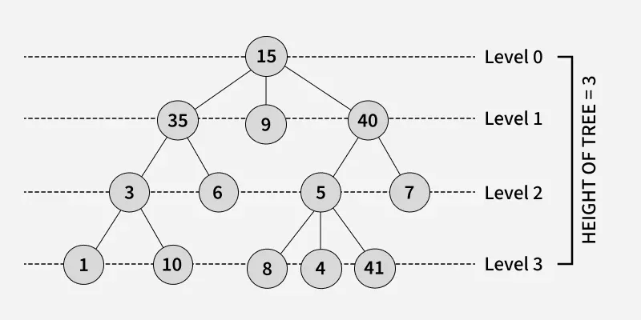
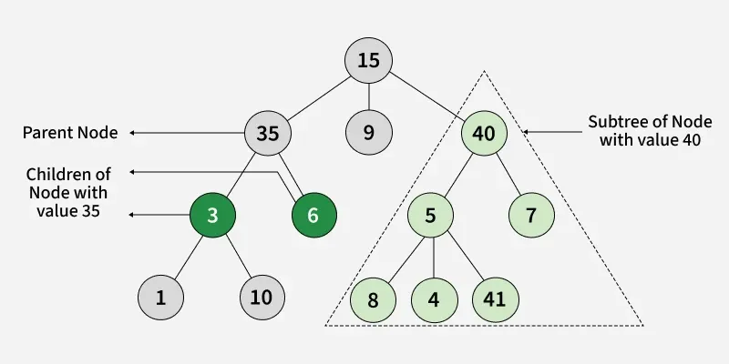
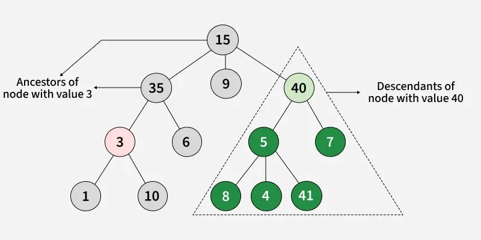
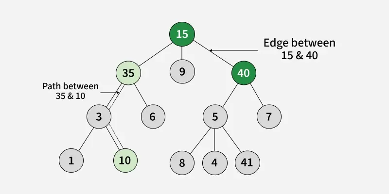
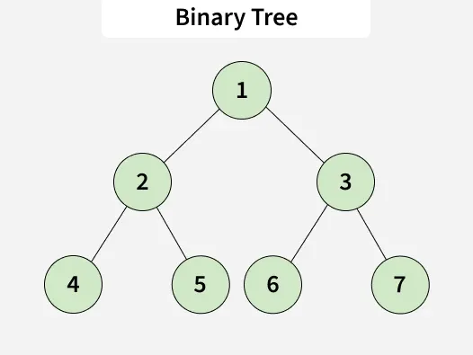
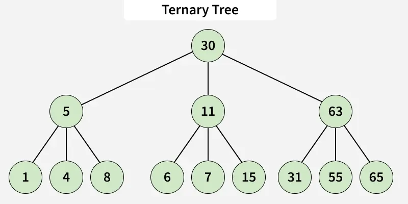
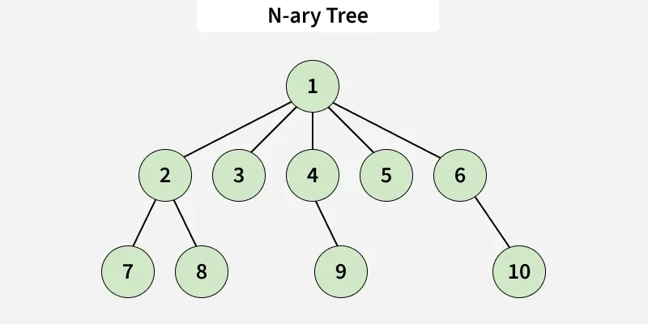

---

# 🌳 **Lesson Notes: Tree Data Structures (Beginner Level)**

---

## **Introduction to Tree Data Structure**

*Last Updated : 07 Oct, 2025*

A **tree** is a hierarchical data structure used to organize and represent data in a **parent–child relationship**.
It consists of **nodes**, where the **topmost node** is called the **root**, and every other node can have one or more **child nodes**.
---

---

---

---

---

---

# 🌱 **Basic Terminologies in Tree Data Structure**

Understanding these terms is very important:

* **Parent Node:**
  A node that is an immediate predecessor of another node.
  *Example:* 35 is the parent of 3 and 6.

* **Child Node:**
  A node that is an immediate successor of another node.
  *Example:* 3 and 6 are children of 35.

* **Root Node:**
  The topmost node in a tree, which does not have a parent.
  *Example:* 15 is the root node.

* **Leaf Node (External Node):**
  Nodes that do not have any children.
  *Example:* 1, 10, 12, 5, 7, 7 are leaf nodes.

* **Ancestor:**
  Any node on the path from the root to a given node (excluding the node itself).
  *Example:* 15 and 35 are ancestors of 10.

* **Descendant:**
  A node x is a descendant of another node y if y is an ancestor of x.
  *Example:* 1, 10, and 6 are descendants of 35.

* **Sibling:**
  Nodes that share the same parent.
  *Example:* 1 and 10 are siblings, and 5 and 7 are siblings.

* **Level of a Node:**
  The number of edges in the path from the root to that node.
  The root node is at level 0.

* **Internal Node:**
  A node with at least one child.

* **Neighbor of a Node:**
  The parent or children of a node.

* **Subtree:**
  A node and all its descendants form a subtree.

---

# 🌳 **Why Tree is considered a non-linear data structure?**

Data in a tree is not stored sequentially (not in a linear order).
Instead, it is organized across multiple **levels**, forming a **hierarchical structure**.
Because of this arrangement, a tree is classified as a **non-linear data structure**.

---

# 🧱 **Representation of a Node in Tree Data Structure**

A tree can be represented using a **collection of nodes**.
Each node can be represented with the help of classes or structs in Java.

### Java code:

```java
class Node {
    int data;
    List<Node> children;

    Node(int x) {
        data = x;
        children = new ArrayList<>();
    }
}
```

---

# ⭐ **Importance of Tree Data Structure**

Trees are useful for storing data that naturally forms a **hierarchy**.

Examples:

* **File systems**:
  Folders → subfolders → files.

* **DOM (Document Object Model)**:
  `<html>` is the root.
  `<head>` and `<body>` are its children.
  These nodes have their own child nodes.

Trees help in **efficient data organization**, **searching**, and **retrieval**.

---

# 🌲 **Types of Tree Data Structures**

A tree consists of nodes connected by edges.
It represents relationships between elements.

---

## **1. Binary Tree**
---

---
>A **binary tree** is a tree where each node has **at most two children** (left child and right child).

### **Types of Binary Trees:**

* **Binary Search Tree (BST)** and its variations:
  Left child < parent < right child.

* **Binary Indexed Tree (Fenwick Tree):**
  Used to compute prefix sums efficiently.

* **Balanced Binary Tree:**
  The difference in heights between left and right subtrees is small (often at most 1).
  Examples: **AVL Tree, Red Black Tree, Splay Tree**

---

## **2. Ternary Tree**
---

---
>A **Ternary Tree** is a tree where each node has **at most three children**
>(left child, mid child, right child).

### **Examples:**

* **Ternary Search Tree**
* **Ternary Heap**

---

## **3. N-ary Tree (Generic Tree)**
---

---
>An **N-ary tree** is a generalization of a binary tree.
>Each node can have **at most N children**.

### **Examples:**

* **B-tree:** Used in large databases.
* **B+ Tree:** Stores data only in leaf nodes.
* **Trie (Prefix Tree):** Each node represents a character in a word.

---

># ⚙️ **Basic Operations of Tree Data Structure**
>* **Create** – Create a tree.
>* **Insert** – Insert data in a tree.
>* **Search** – Search specific data to check if it exists.
>* **Traversal** – Visit all nodes in a specific order:

---

# 💻 **Java Example Using All Concepts**

```java
import java.util.ArrayList;
import java.util.List;

// Node structure for tree
class Node {
    int data;
    List<Node> children;

    Node(int x) {
        data = x;
        children = new ArrayList<>();
    }
}

class GFG {
    // Function to add a child to a node
    static void addChild(Node parent, Node child) {
        parent.children.add(child);
    }

    // Function to print parents of each node
    static void printParents(Node node, Node parent) {
        if (parent == null)
            System.out.println(node.data + " -> NULL");
        else
            System.out.println(node.data + " -> " + parent.data);

        for (Node child : node.children)
            printParents(child, node);
    }

    // Function to print children of each node
    static void printChildren(Node node) {
        System.out.print(node.data + " -> ");
        for (Node child : node.children)
            System.out.print(child.data + " ");
        System.out.println();

        for (Node child : node.children)
            printChildren(child);
    }

    // Function to print leaf nodes
    static void printLeafNodes(Node node) {
        if (node.children.isEmpty()) {
            System.out.print(node.data + " ");
            return;
        }
        for (Node child : node.children)
            printLeafNodes(child);
    }

    // Function to print degrees of each node 
    static void printDegrees(Node node, Node parent) {
        int degree = node.children.size();
        if (parent != null)
            degree++;
        System.out.println(node.data + " -> " + degree);

        for (Node child : node.children)
            printDegrees(child, node);
    }

    public static void main(String[] args) {
        // Creating nodes
        Node root = new Node(1);
        Node n2 = new Node(2);
        Node n3 = new Node(3);
        Node n4 = new Node(4);
        Node n5 = new Node(5);

        // Constructing tree
        addChild(root, n2);
        addChild(root, n3);
        addChild(n2, n4);
        addChild(n2, n5);

        System.out.println("Parents of each node:");
        printParents(root, null);

        System.out.println("Children of each node:");
        printChildren(root);

        System.out.print("Leaf nodes: ");
        printLeafNodes(root);
        System.out.println();

        System.out.println("Degrees of nodes:");
        printDegrees(root, null);
    }
}
```

---

# 📤 **Program Output**

```
Parents of each node:
1 -> NULL
2 -> 1
4 -> 2
5 -> 2
3 -> 1

Children of each node:
1 -> 2 3 
2 -> 4 5 
4 -> 
5 -> 
3 -> 

Leaf nodes: 4 5 3 

Degrees of nodes:
1 -> 2
2 -> 3
4 -> 1
5 -> 1
3 -> 1
```

---

# 🌟 **Properties of Tree Data Structure**

* **Number of edges:**
  A tree with **N nodes** always has **N − 1 edges**.

* **Depth of a node:**
  The length of the path from the root to the node.

* **Height of the tree:**
  The longest path from the root to any leaf node.

* **Degree of a node:**
  The number of children a node has.
  Leaf nodes have degree **0**.

* **Degree of the tree:**
  The maximum degree among all nodes.

---

