---

# ⭐ **Lesson Notes: Tree Traversal Techniques (Beginner Level)**

**Last Updated: 06 Dec, 2025**

Tree traversal refers to the process of **visiting or accessing each node of a tree exactly once in a specific order**.

In linear data structures such as **arrays, linked lists, or queues**, there is only **one** logical way to traverse them: start from one end and move to the other.

However, a **tree is non-linear**, which means it branches out in many directions.
Because of this, there are **multiple ways** to traverse its nodes.

---

# 🌳 **Main Categories of Tree Traversal**
---

Tree traversals are broadly classified into **two categories**:

---
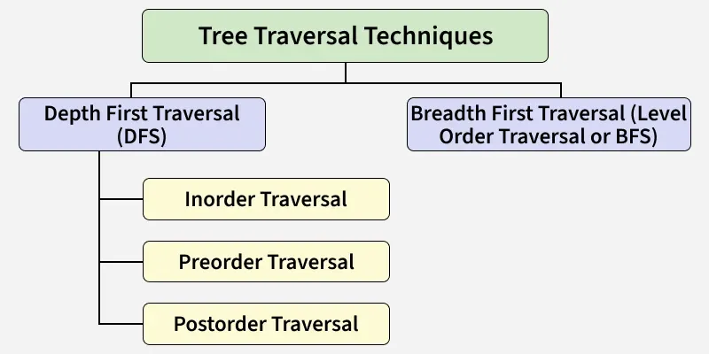
---

## 1️⃣ **Depth-First Traversal (DFT)**

DFT explores **as far as possible along a branch** before backtracking and exploring the next branch.

There are **three types** of DFT:

* **Inorder Traversal (Left → Root → Right)**
* **Preorder Traversal (Root → Left → Right)**
* **Postorder Traversal (Left → Right → Root)**

---

## 2️⃣ **Breadth-First Traversal (BFT)**

Also known as **Level Order Traversal**.

BFT explores nodes **level by level**, starting from the root and moving from **top to bottom**.

Example of level order for a tree:
**1, 2, 3, 4, 5, 6, 7**

---

# ⭐ **1. Inorder Traversal (Left → Root → Right)**

In Inorder traversal, the nodes are visited in this order:

1. **Traverse the left subtree**
2. **Visit the root**
3. **Traverse the right subtree**

### ✔️ **Algorithm for Inorder Traversal**

```
Inorder(tree):
    Traverse the left subtree, i.e., call Inorder(left->subtree)
    Visit the root
    Traverse the right subtree, i.e., call Inorder(right->subtree)
```
---
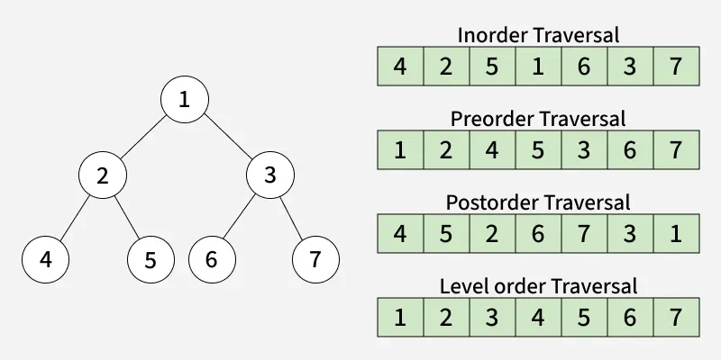
---
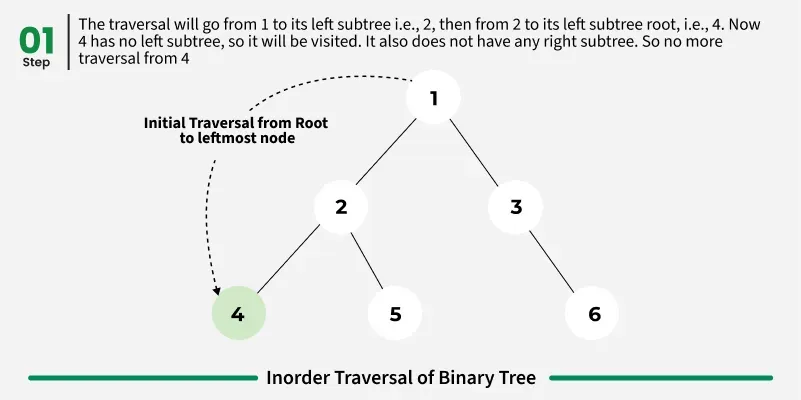
---
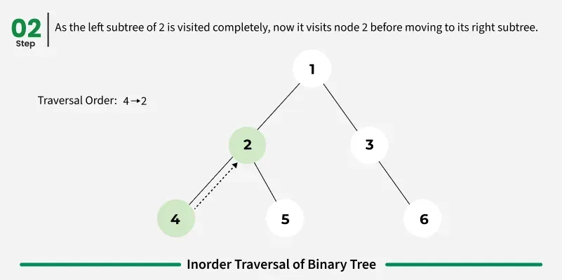
---
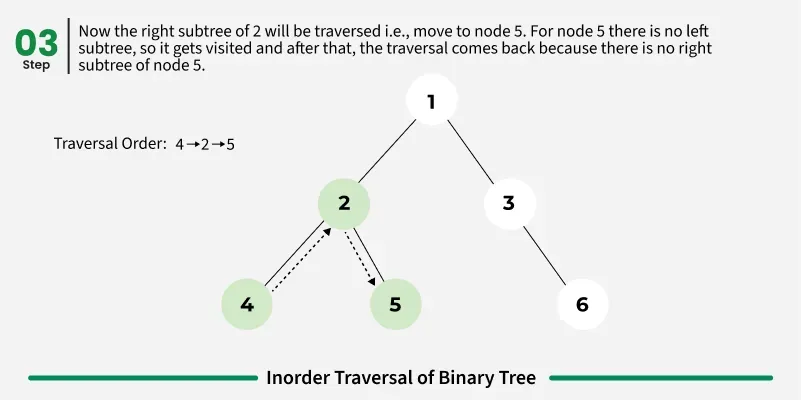
---
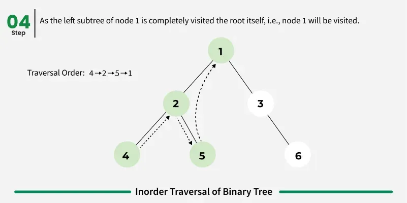
---
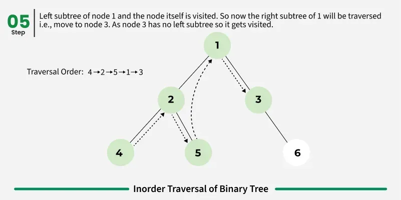
---
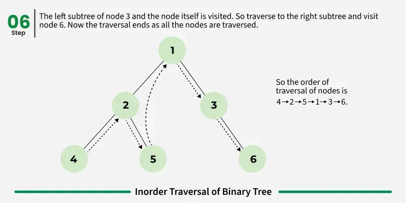
---

### 📌 **Uses of Inorder Traversal**

---
* In a **Binary Search Tree (BST)**, it gives nodes in **non-decreasing (sorted) order**.
* To get nodes in **non-increasing order**, simply reverse the traversal.
* Used to **evaluate arithmetic expressions** in expression trees.

---

# ⭐ **2. Preorder Traversal (Root → Left → Right)**

In Preorder traversal, the visiting order is:

1. **Visit the root**
2. **Traverse the left subtree**
3. **Traverse the right subtree**
---
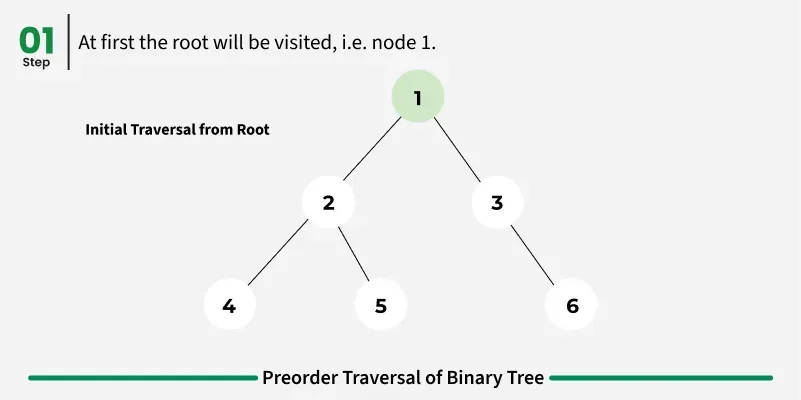
---
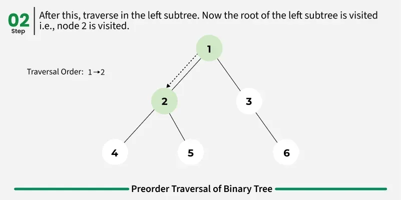
---
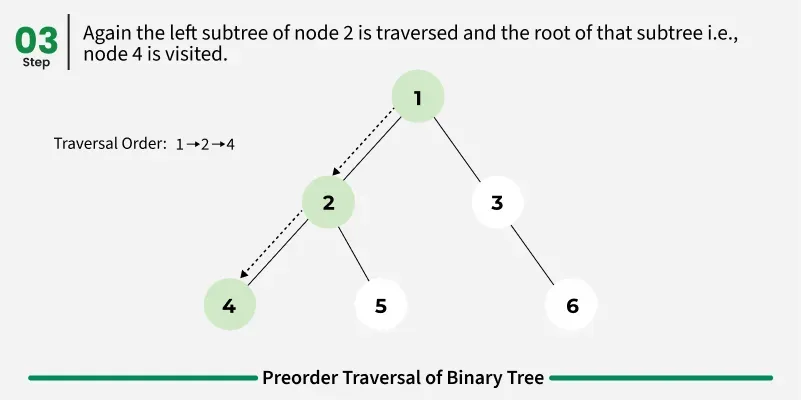
---
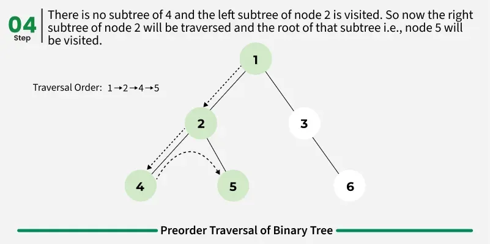
---
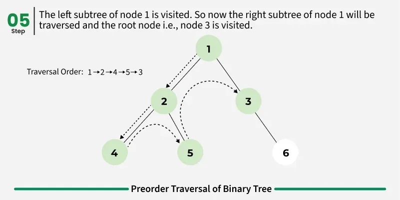
---
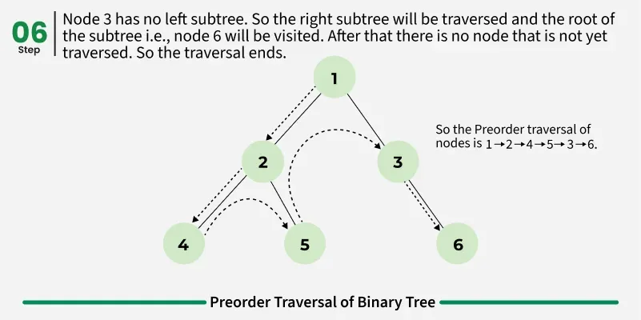
---

### ✔️ **Algorithm for Preorder Traversal**

```
Preorder(tree):
    Visit the root
    Traverse the left subtree, i.e., call Preorder(left->subtree)
    Traverse the right subtree, i.e., call Preorder(right->subtree)
```

### 📌 **Uses of Preorder Traversal**

* Used to **create a copy** of a tree.
* Used to generate **prefix expressions** in expression trees.

---

# ⭐ **3. Postorder Traversal (Left → Right → Root)**

In Postorder traversal, the visiting order is:

1. **Traverse the left subtree**
2. **Traverse the right subtree**
3. **Visit the root**

---
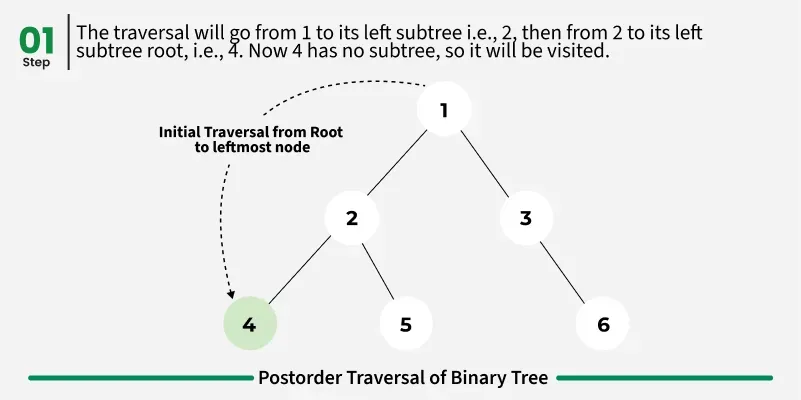
---
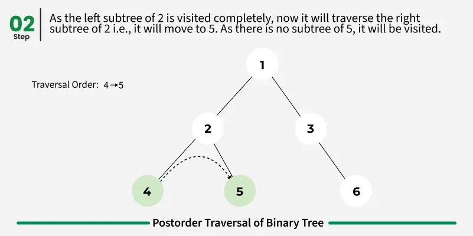
---
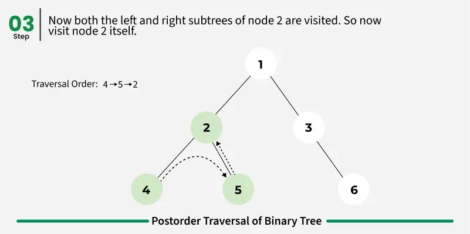
---
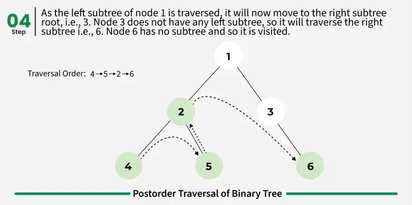
---
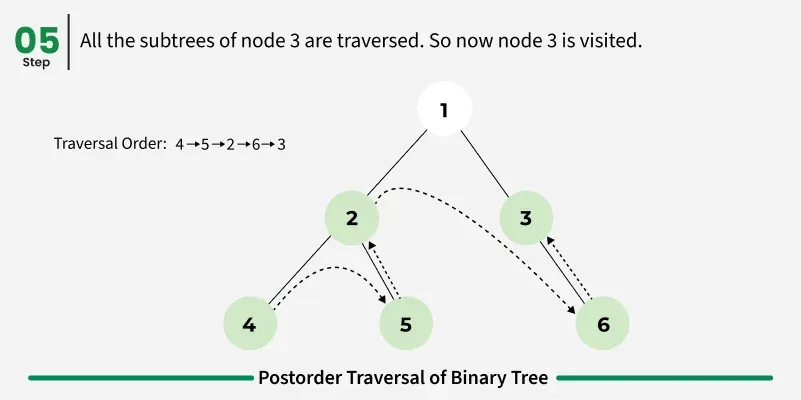
---
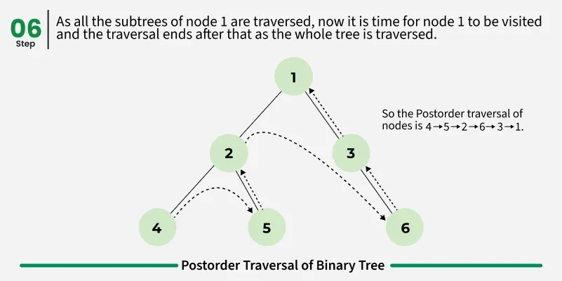
---
### ✔️ **Algorithm for Postorder Traversal**

```
Postorder(tree):
    Traverse the left subtree, i.e., call Postorder(left->subtree)
    Traverse the right subtree, i.e., call Postorder(right->subtree)
    Visit the root
```

### 📌 **Uses of Postorder Traversal**

* Used to **delete or free** a tree.
* Used to produce **postfix expressions** from expression trees.
* Useful for **garbage collection algorithms**, especially where manual memory management is required.

---

# ⭐ **4. Level Order Traversal (Breadth-First Search)**

Level Order Traversal visits nodes **level by level**, starting at the root.

### ✔️ **Algorithm for Level Order Traversal**

```
LevelOrder(tree):
    Create an empty queue Q
    Enqueue the root node
    Loop while Q is not empty:
        Dequeue a node and visit it
        Enqueue its left child if it exists
        Enqueue its right child if it exists
```
---
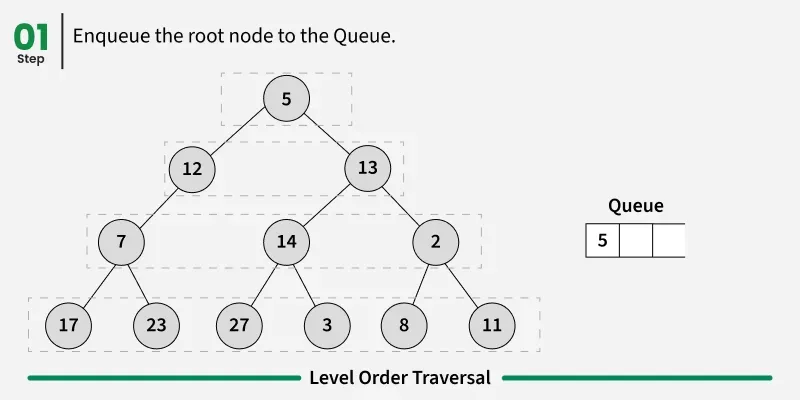
---
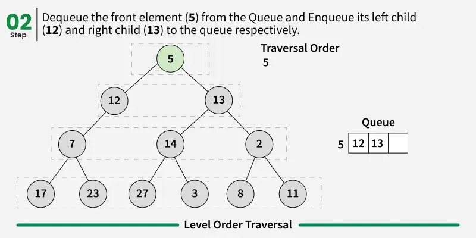
---
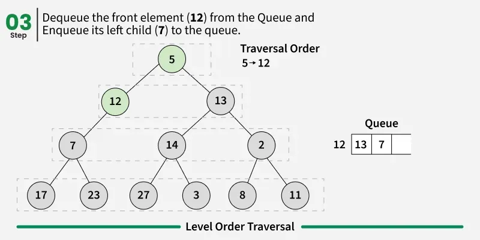
---
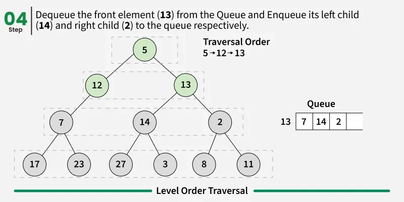
---
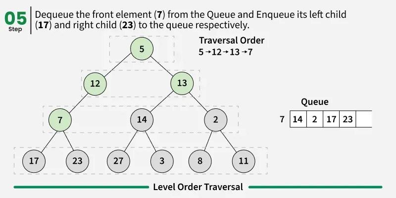
---
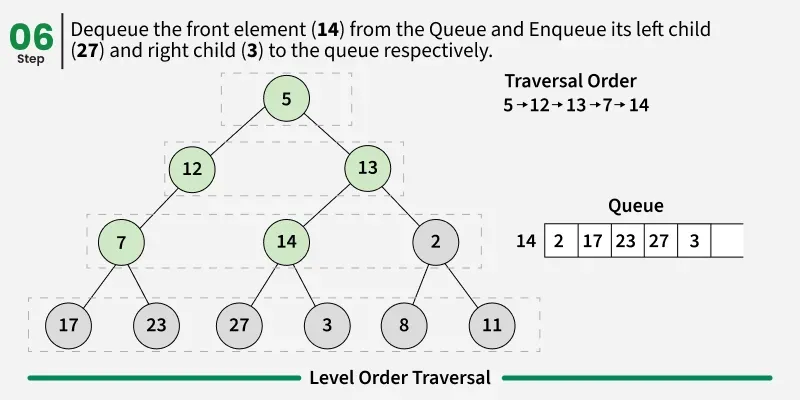
---
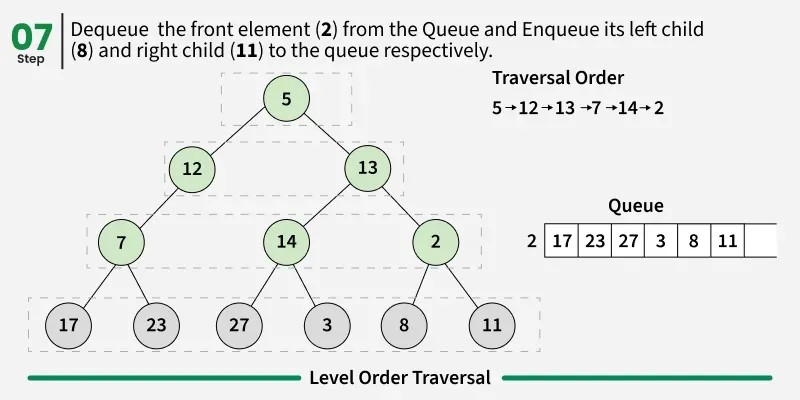
---
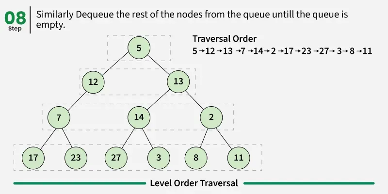
---
### 📌 **Uses of Level Order Traversal**

* Level-wise operations like finding **maximum/minimum** at each level.
* **Tree serialization/deserialization** for storage or reconstruction.
* Solving problems such as finding **maximum width** of a tree.

---

# 🌟 **Other Tree Traversal Techniques**

Besides the main ones, there are special-purpose traversals:

---

## 1️⃣ **Boundary Traversal**

Boundary traversal includes:

* **Left boundary** (excluding leaf nodes)
* **All leaf nodes**
* **Right boundary** (excluding leaf nodes)

Useful for printing the **outline** of the tree.
---
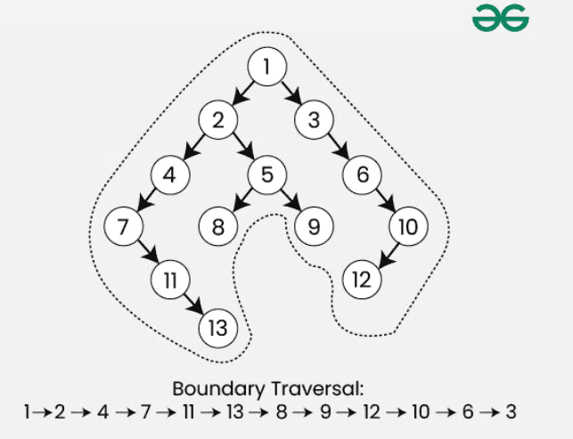
---

## 2️⃣ **Diagonal Traversal**

In Diagonal Traversal, nodes in the same **diagonal** are printed together.

A diagonal is formed by moving rightwards while tracking downward movement.
---
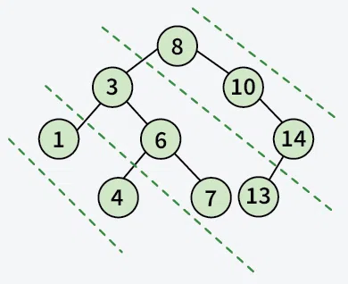
---

# 🎯 Summary for Beginners

| Traversal Type  | Order               | Main Use                                   |
| --------------- | ------------------- | ------------------------------------------ |
| **Inorder**     | Left → Root → Right | Sorted order in BST, expression evaluation |
| **Preorder**    | Root → Left → Right | Copying trees, prefix notation             |
| **Postorder**   | Left → Right → Root | Delete tree, postfix notation              |
| **Level Order** | Level by Level      | BFS tasks, width, serialization            |

---


