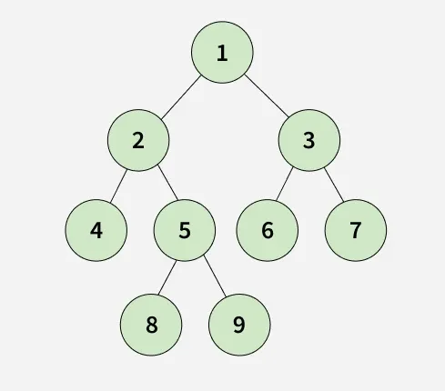
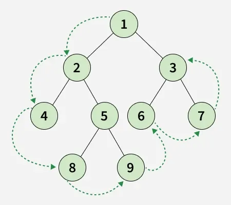
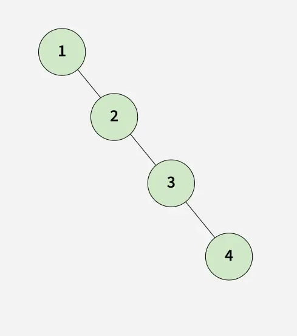
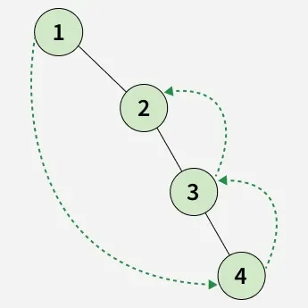

---

# ⭐ Lesson Notes: Boundary Traversal of a Binary Tree

**Last Updated: 07 Oct, 2025**

---

## 1. What is Boundary Traversal?

**Boundary Traversal** of a binary tree is the process of traversing the tree **in anti-clockwise order**, starting from the root, such that the **boundary nodes** are visited first.

The **boundary** consists of three parts:

1. **Left Boundary:** Nodes on the left edge, **excluding leaf nodes**.
2. **Leaf Nodes:** All leaf nodes from **left to right**.
3. **Right Boundary:** Nodes on the right edge, **excluding leaf nodes**, traversed **bottom-up**.

**Notes:**

* If the root does not have a left or right subtree, the root itself is included.
* Each node should appear **only once**.

---
>Input :


---
> Output : [1, 2, 4, 8, 9, 6, 7, 3]
> 
>Explanation:


---
>Input :


---
>Output : [1, 4, 3, 2]
> 
>Explanation:


---

## 2. Example

**Input Tree:**

```
        1
      /   \
     2     3
    / \   / \
   4   5 6   7
      / \
     8   9
```

**Boundary Traversal Output:**

```
1 2 4 8 9 6 7 3
```

**Explanation:**

* Left Boundary: 1, 2
* Leaf Nodes: 4, 8, 9, 6, 7
* Right Boundary (bottom-up): 3

---

## 3. Approach 1: Using Recursion

**Time Complexity:** O(n)
**Auxiliary Space:** O(h) (height of the tree)

### Steps:

1. Traverse **left boundary** (exclude leaf nodes).
2. Collect all **leaf nodes** using recursion.
3. Traverse **right boundary** (exclude leaf nodes, add in reverse).
4. Combine results: left boundary → leaves → right boundary.

### Java Code (Recursive)

```java
import java.util.ArrayList;
import java.util.List;

class Node {
    int data;
    Node left, right;
    Node(int x) { data = x; left = right = null; }
}

class GFG {

    static boolean isLeaf(Node node) {
        return node.left == null && node.right == null;
    }

    static void collectLeft(Node root, ArrayList<Integer> res) {
        if (root == null || isLeaf(root)) return;
        res.add(root.data);
        if (root.left != null) collectLeft(root.left, res);
        else collectLeft(root.right, res);
    }

    static void collectLeaves(Node root, ArrayList<Integer> res) {
        if (root == null) return;
        if (isLeaf(root)) { res.add(root.data); return; }
        collectLeaves(root.left, res);
        collectLeaves(root.right, res);
    }

    static void collectRight(Node root, ArrayList<Integer> res) {
        if (root == null || isLeaf(root)) return;
        if (root.right != null) collectRight(root.right, res);
        else collectRight(root.left, res);
        res.add(root.data); // bottom-up
    }

    static ArrayList<Integer> boundaryTraversal(Node root) {
        ArrayList<Integer> res = new ArrayList<>();
        if (root == null) return res;
        if (!isLeaf(root)) res.add(root.data);
        collectLeft(root.left, res);
        collectLeaves(root, res);
        collectRight(root.right, res);
        return res;
    }

    public static void main(String[] args) {
        Node root = new Node(1);
        root.left = new Node(2);
        root.right = new Node(3);
        root.left.left = new Node(4);
        root.left.right = new Node(5);
        root.right.left = new Node(6);
        root.right.right = new Node(7);
        root.left.right.left = new Node(8);
        root.left.right.right = new Node(9);

        List<Integer> boundary = boundaryTraversal(root);
        for (int x : boundary) System.out.print(x + " ");
    }
}
```

**Output:**

```
1 2 4 8 9 6 7 3
```

---

## 4. Approach 2: Using Iteration and Morris Traversal

**Time Complexity:** O(n)
**Auxiliary Space:** O(h)

* Uses **iteration** for left and right boundaries.
* Uses **Morris Traversal** to collect leaf nodes without recursion.

### Java Code (Iterative + Morris)

```java
import java.util.ArrayList;

class Node {
    int data;
    Node left, right;
    Node(int x) { data = x; left = right = null; }
}

class GFGIterative {

    static boolean isLeaf(Node node) {
        return node.left == null && node.right == null;
    }

    static void collectLeft(Node root, ArrayList<Integer> res) {
        Node curr = root;
        while (curr != null && !isLeaf(curr)) {
            res.add(curr.data);
            curr = (curr.left != null) ? curr.left : curr.right;
        }
    }

    static void collectLeaves(Node root, ArrayList<Integer> res) {
        Node current = root;
        while (current != null) {
            if (current.left == null) {
                if (current.right == null) res.add(current.data);
                current = current.right;
            } else {
                Node predecessor = current.left;
                while (predecessor.right != null && predecessor.right != current)
                    predecessor = predecessor.right;

                if (predecessor.right == null) {
                    predecessor.right = current;
                    current = current.left;
                } else {
                    if (predecessor.left == null) res.add(predecessor.data);
                    predecessor.right = null;
                    current = current.right;
                }
            }
        }
    }

    static void collectRight(Node root, ArrayList<Integer> res) {
        Node curr = root;
        ArrayList<Integer> temp = new ArrayList<>();
        while (curr != null && !isLeaf(curr)) {
            temp.add(curr.data);
            curr = (curr.right != null) ? curr.right : curr.left;
        }
        for (int i = temp.size() - 1; i >= 0; i--) res.add(temp.get(i));
    }

    static ArrayList<Integer> boundaryTraversal(Node root) {
        ArrayList<Integer> res = new ArrayList<>();
        if (root == null) return res;
        if (!isLeaf(root)) res.add(root.data);
        collectLeft(root.left, res);
        collectLeaves(root, res);
        collectRight(root.right, res);
        return res;
    }

    public static void main(String[] args) {
        Node root = new Node(1);
        root.left = new Node(2);
        root.right = new Node(3);
        root.left.left = new Node(4);
        root.left.right = new Node(5);
        root.right.left = new Node(6);
        root.right.right = new Node(7);
        root.left.right.left = new Node(8);
        root.left.right.right = new Node(9);

        ArrayList<Integer> boundary = boundaryTraversal(root);
        for (int x : boundary) System.out.print(x + " ");
    }
}
```

**Output:**

```
1 2 4 8 9 6 7 3
```

---

### ✅ Key Points

* Traversal is **anti-clockwise**: Root → Left Boundary → Leaves → Right Boundary.
* Avoid duplicates: leaf nodes are **not included** in left/right boundaries.
* The recursive approach is easier; iterative + Morris is more **space-efficient**.

---


