---

# **Morris Traversal for Inorder**

**Last Updated : 08 Oct, 2025**

Morris Traversal is a special technique that allows us to perform **Inorder Traversal (Left → Root → Right)** of a binary tree **without using recursion and without using a stack**.

This makes it very memory-efficient because it uses **O(1) Auxiliary Space**.

---

# ⭐ **Why Morris Traversal?**

In regular inorder traversal, we rely on:

* A **recursive call stack**, or
* An explicit **stack data structure**

But Morris Traversal removes these dependencies by temporarily modifying the tree structure.
It creates a special **temporary link** from the inorder predecessor to the current node.

This ensures we can return to a node after completing its left subtree **without needing a stack**.

---

# **Examples**

### **Example 1**

Input: `Iterative-Postorder-Traversal`
Output:

```
[4, 2, 5, 1, 3]
```

### **Example 2**

Input: `Iterative-Postorder-Traversal-2`
Output:

```
[1, 7, 10, 8, 6, 10, 5, 6]
```

Explanation: Inorder traversal always follows:
✔ **Left → Root → Right**

---

# 🌱 **Approach (Step-by-Step Concept)**

We want to traverse a binary tree **and come back to the root after exploring the left subtree**,
but we want to do this **without recursion** and **without a stack**.

Morris Traversal solves this by creating and removing temporary pointers.

### **Algorithm**

## **Case 1: Node has NO left child**

* Visit this node
* Move to `curr.right`

## **Case 2: Node HAS a left child**

* Find the **inorder predecessor**
  → This is the **rightmost node** in the left subtree.

### While finding predecessor:

```
while (prev.right != null && prev.right != curr)
    prev = prev.right
```

### When predecessor is found:

### ✔ If `prev.right == null`

* Create a **temporary link**:

  ```
  prev.right = curr
  ```
* Move to `curr.left`

### ✔ If `prev.right == curr`

* Temporary link already exists → left subtree is finished
* Remove that link
* Visit current node
* Move to `curr.right`

---
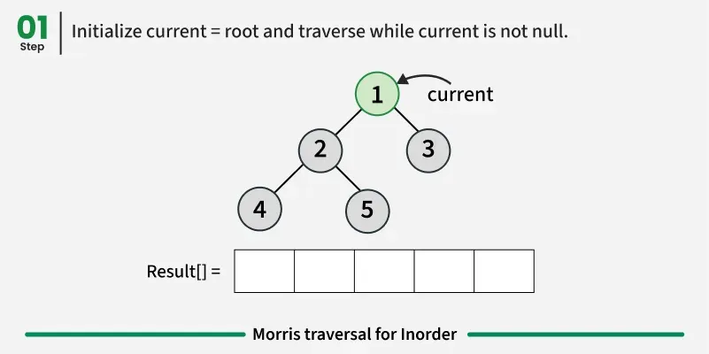
---
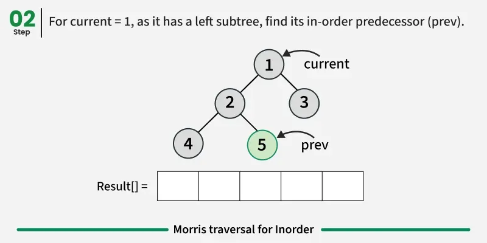
---
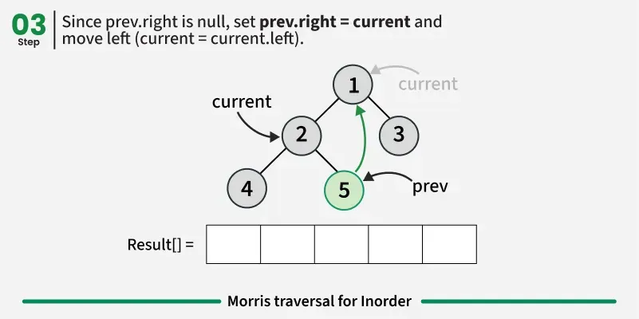
---
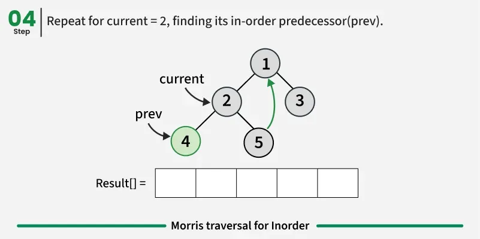
---
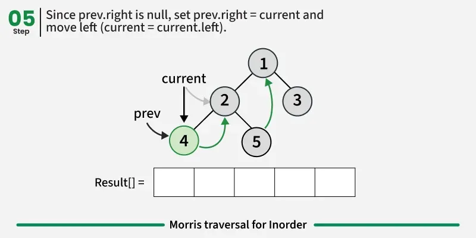
---
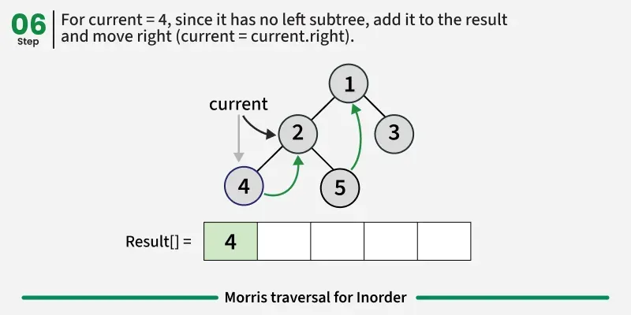
---
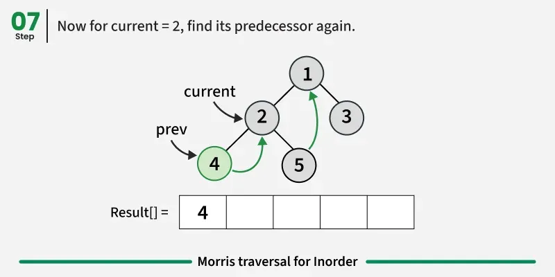
---
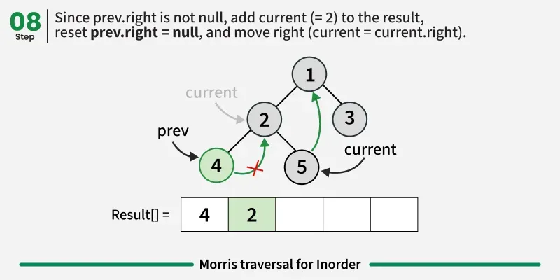
---
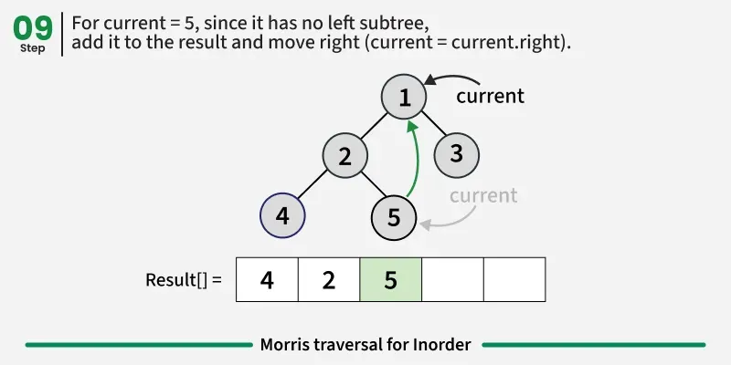
---
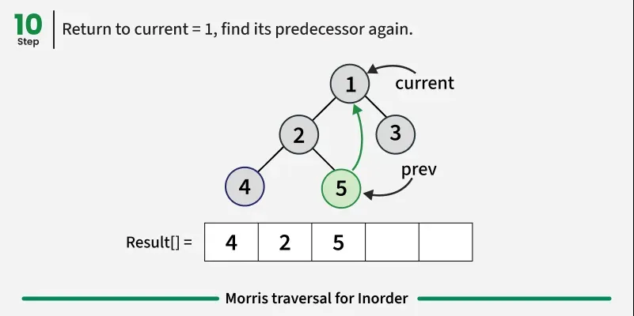
---
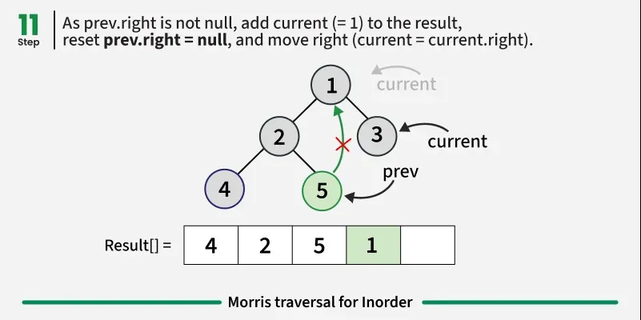
---
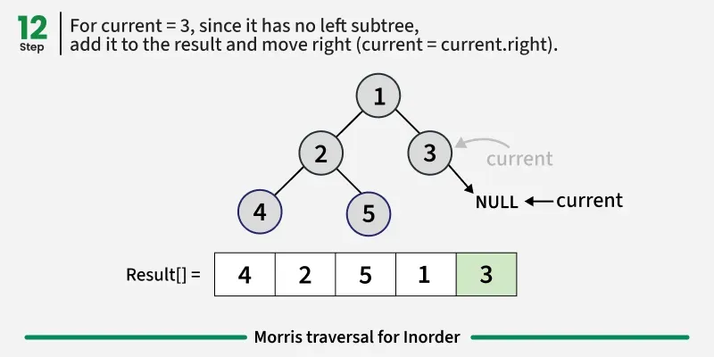
---
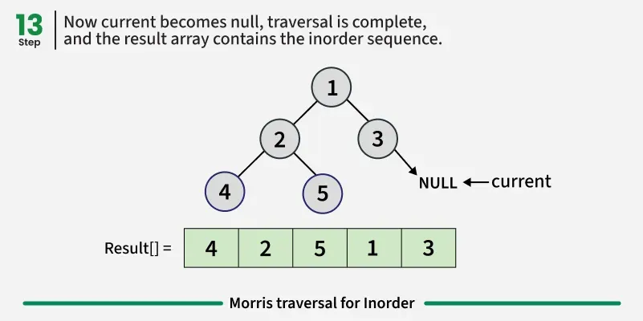
---

# **Java Implementation (Using All Provided Code Words)**

```java
import java.util.ArrayList;

// Node Structure
class Node {
    int data;
    Node left, right;

    Node(int x) {
        data = x;
        left = right = null;
    }
}

class GFG {

    static ArrayList<Integer> inOrder(Node root) {
        ArrayList<Integer> res = new ArrayList<>();
        Node curr = root;

        while (curr != null) {
            if (curr.left == null) {
              
                // If no left child, visit this node 
                // and go right
                res.add(curr.data);
                curr = curr.right;
            } 
            else {
              
                // Find the inorder predecessor of curr
                Node prev = curr.left;
                while (prev.right != null && 
                                   prev.right != curr) {
                    prev = prev.right;
                }

                // Make curr the right child of its 
                // inorder predecessor
                if (prev.right == null) {
                    prev.right = curr;
                    curr = curr.left;
                } 
                else {
                  
                    // Revert the changes made in 
                    // the tree structure
                    prev.right = null;
                    res.add(curr.data);
                    curr = curr.right;
                }
            }
        }
        return res;
    }

    public static void main(String[] args) {

        // Representation of input binary tree:
        //           1
        //          / \
        //         2   3
        //        / \  
        //       4   5
        Node root = new Node(1);
        root.left = new Node(2);
        root.right = new Node(3);
        root.left.left = new Node(4);
        root.left.right = new Node(5);

        ArrayList<Integer> res = inOrder(root);

         for (int data : res) {
            System.out.print(data + " ");
        }
    }
}
```

### **Output**

```
4 2 5 1 3
```

---

# ⏱ **Time Complexity**

**O(n)**
Every edge in the tree is visited at most **three times**:

* Finding predecessor
* Creating temporary link
* Removing the link

---

# 🧠 **Auxiliary Space Complexity**

**O(1)**
No stack, no recursion — extra space does not grow with tree size.

---

Below is a **beginner-friendly** explanation of **Morris Traversal for Preorder**, written in simple language, using **all the important words you gave** (preorder, Root-Left-Right, inorder predecessor, temporary link, restore link, etc.).
This version is suitable for **novice programmers**.

---

# 🌳 **Morris Traversal for Preorder (Beginner Level Lesson Notes)**

**Goal:** Print the **Preorder traversal** of a binary tree
➡️ **without recursion**
➡️ **without a stack**
➡️ **using Morris Traversal**

---

## ⭐ What Is Preorder Traversal?

Preorder follows this order:

```
Root → Left → Right   (R L R)
```

We always **visit the node first**, then explore left and right subtrees.

Example tree:

```
     1
    / \
   2   3
  / \
 4   5
```

Preorder result = **1 2 4 5 3**

---

## ⭐ Why Morris Preorder Traversal?

Normally, preorder needs:

* recursion **or**
* a stack

Morris traversal lets us do preorder using **O(1) extra space** by creating **temporary links** to help us return to a node after exploring its left subtree.

The tree is *briefly modified during traversal*, but all temporary links are **restored**, so the tree remains unchanged at the end.

---

# ⭐ Morris Preorder Traversal – Main Idea

We use a pointer `curr` starting at the **root**.

### At each node:

### **1️⃣ If the node has NO left child**

* visit/store the node
* move to its **right** child

### **2️⃣ If the node HAS a left child**

Find its **inorder predecessor** → the **rightmost node** inside the left subtree.

Then we have two cases:

### **Case A: predecessor.right == NULL**

* create a **temporary link**
  `predecessor.right = curr`
* visit the node (because preorder visits Root first)
* move to **left** child

### **Case B: predecessor.right == curr**

* this means we already visited the left subtree
  so **remove/restore** the temporary link
  `predecessor.right = NULL`
* move to **right** child

This continues until `curr == NULL`.

---
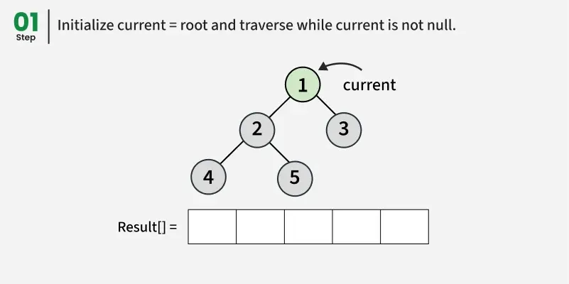
---
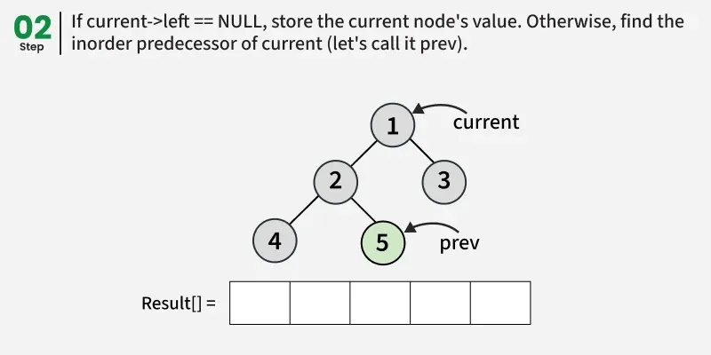
---
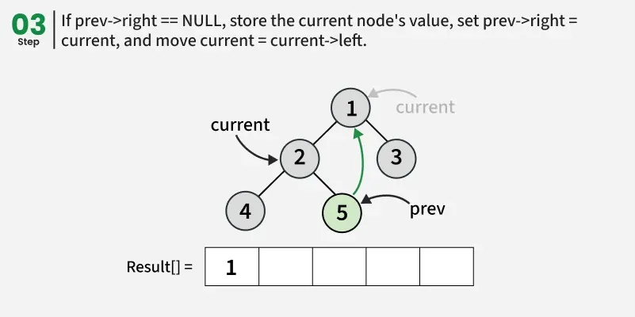
---
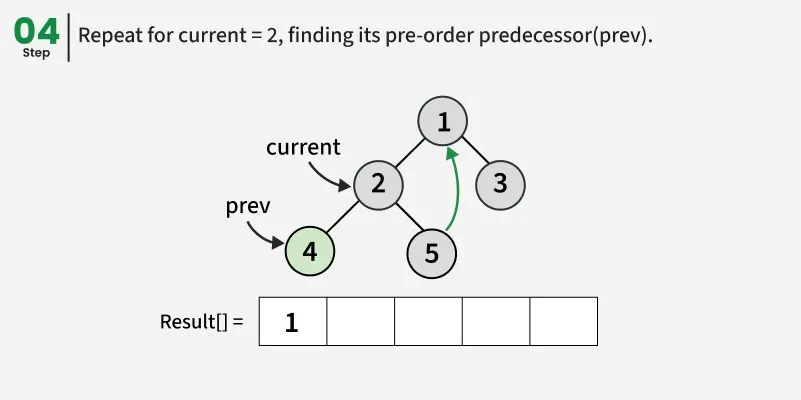
---
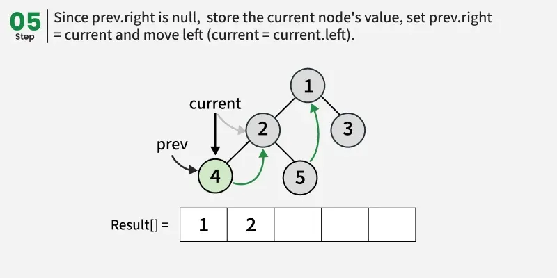
---
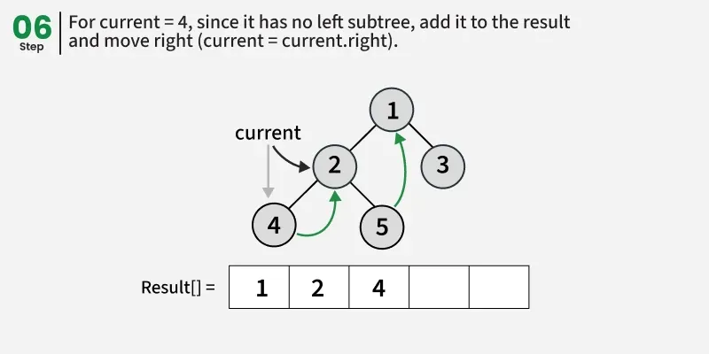
---
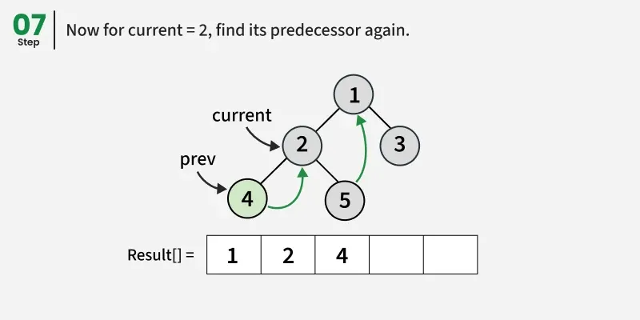
---
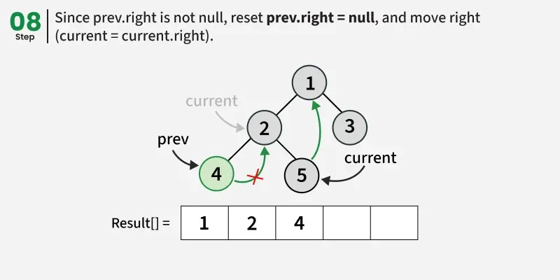
---
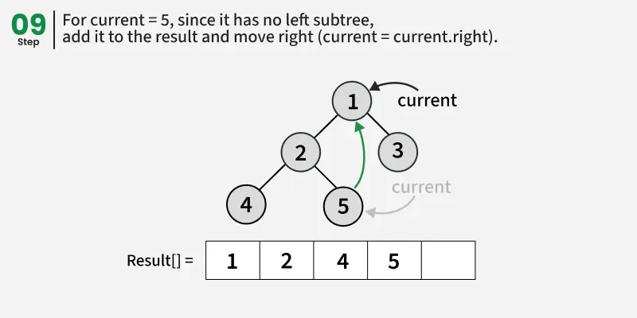
---
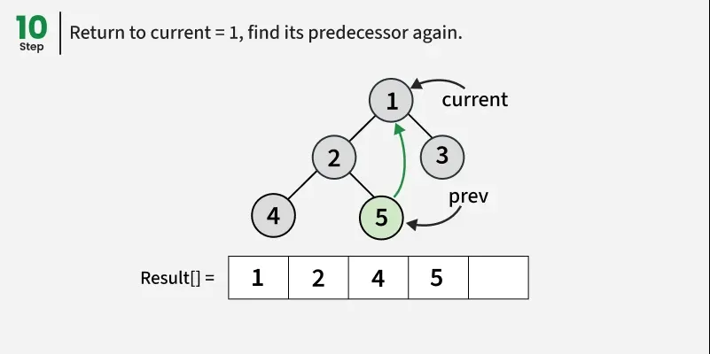
---
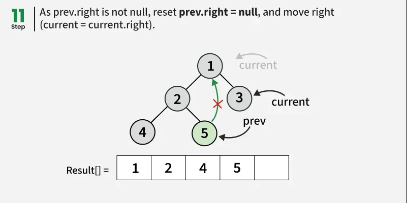
---
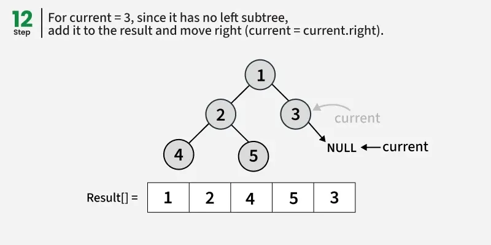
---
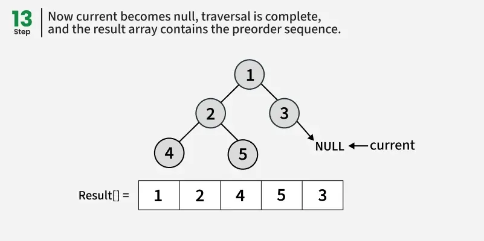
---

# ⭐ Steps Summary (Beginner Friendly)

| Condition                                  | Action                                       |
| ------------------------------------------ | -------------------------------------------- |
| No left child                              | store node → go right                        |
| Has left child → predecessor.right == NULL | create temporary link → store node → go left |
| Has left child → predecessor.right == node | remove temporary link → go right             |

This ensures **Root → Left → Right** order.

---

# ⭐ Java Code (Your Provided Code)

```java
import java.util.ArrayList;

// Node structure
class Node {
    int data;
    Node left, right;

    Node(int x) {
        data = x;
        left = right = null;
    }
}

class GFG {
    
    static ArrayList<Integer> preOrder(Node root) {
        ArrayList<Integer> res = new ArrayList<>();
        while (root != null) {
          
            // Case 1: No left child
            if (root.left == null) {
                res.add(root.data);      // visit and store
                root = root.right;       // move right
            }
            else {
                // Find inorder predecessor
                Node current = root.left;
                while (current.right != null && current.right != root) {
                    current = current.right;
                }

                // Case 2: Temporary link already exists
                if (current.right == root) {
                    current.right = null;  // remove temporary link
                    root = root.right;
                }

                // Case 3: Create temporary link
                else {
                    res.add(root.data);    // visit node
                    current.right = root;  // create link
                    root = root.left;      // move left
                }
            }
        }
        
        return res;
    }
    
    public static void main(String[] args) {
      
        // Constructing binary tree
        //         1
        //        / \
        //       2   3
        //      / \
        //     4   5

        Node root = new Node(1);
        root.left = new Node(2);
        root.right = new Node(3);
        root.left.left = new Node(4);
        root.left.right = new Node(5);

        ArrayList<Integer> res = preOrder(root);

        for (int data : res) {
            System.out.print(data + " ");
        }
    }
}
```

---

# ⭐ Output

```
1 2 4 5 3
```

---

# ⭐ Time & Space Complexity

| Complexity      | Explanation                     |
| --------------- | ------------------------------- |
| **Time: O(n)**  | each node visited limited times |
| **Space: O(1)** | no stack, no recursion          |

---

# 🌳 **Morris Traversal for Postorder (Beginner Level Notes)**

>**Goal:** Do **postorder traversal (Left → Right → Node)** **without using recursion** and **without using a stack**.
>This method is called **Morris Traversal**, and it works by creating **temporary links** inside the tree.

---

## ⭐ What is Postorder Traversal?

Postorder means:

```
Left  →  Right  →  Node  
(LRN)
```

You visit both subtrees **before** visiting the node.

Example:
For this tree:

```
     1
    / \
   2   3
  / \
 4   5
```

Postorder output = **4 5 2 3 1**

---

## ⭐ Why is Morris Postorder Hard?

Because in postorder we must visit a node **only after**:

* we finish its **left subtree**
* and finish its **right subtree**

But Morris traversal cannot easily check *"did I finish both?"*
So we use a **smart trick**.

---

# ⭐ The Trick: Convert NRL → LRN

Instead of doing:

```
Left → Right → Node  (LRN)
```

we first do the **mirror preorder**:

```
Node → Right → Left  (NRL)
```

Then at the end we **reverse** the result to get LRN.

### Example

NRL result:
`1 3 2 5 4`

Reverse it:
`4 5 2 3 1` ← correct postorder

---

# ⭐ How Morris Postorder Traversal Works

We use a pointer called **current** starting at **root**.

### At each step:

### **1️⃣ If current node has NO right child**

* visit/store it
* go to left child

### **2️⃣ If current node HAS a right child**

Find its **predecessor** =
**left-most node in the right subtree**

### Two cases:

#### **Case A: predecessor.left == NULL**

* Create a **temporary link**
  `predecessor.left = current`
* store current (NRL order)
* move to right child

#### **Case B: predecessor.left == current**

* remove temporary link
  `predecessor.left = null`
* move to left child

### When the while-loop finishes:

* **reverse the list**
  to convert NRL → LRN

---

# ⭐ Morris Postorder Traversal Diagram

---

---
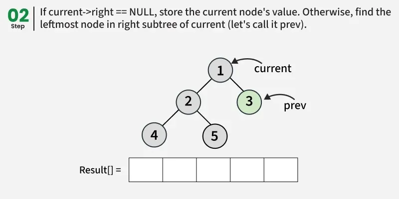
---
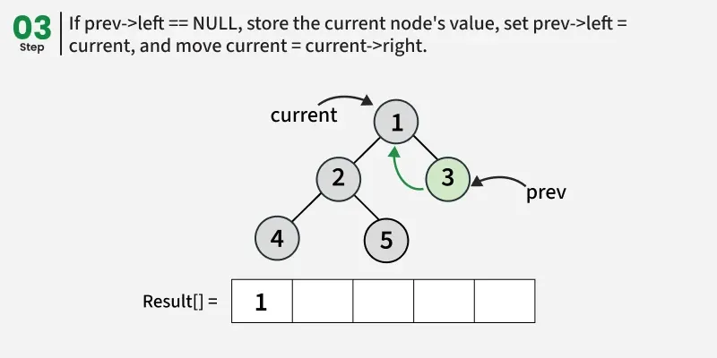
---
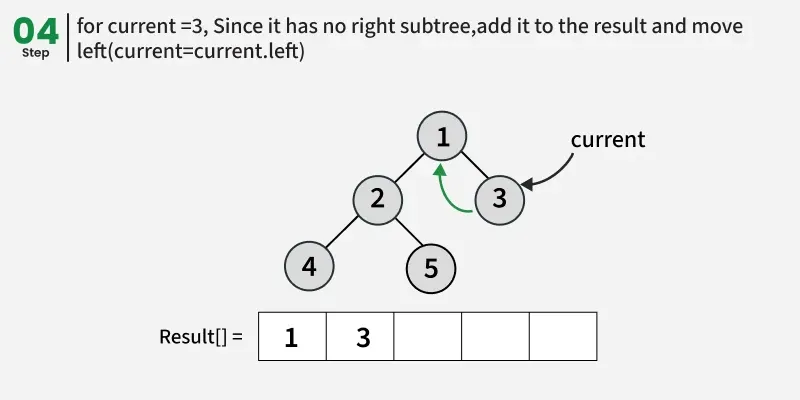
---
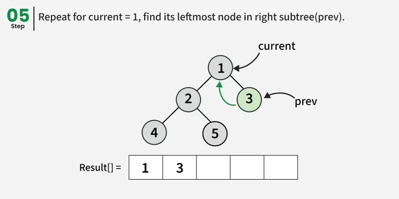
---
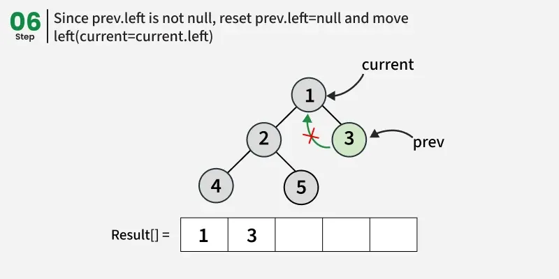
---
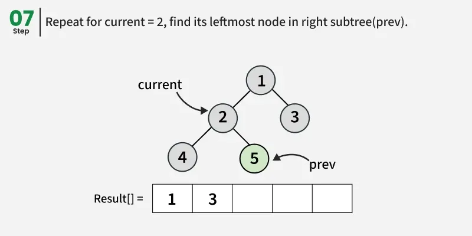
---
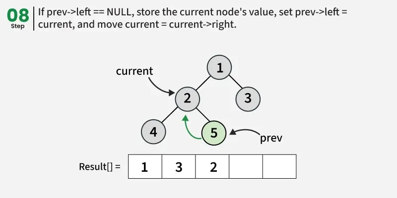
---
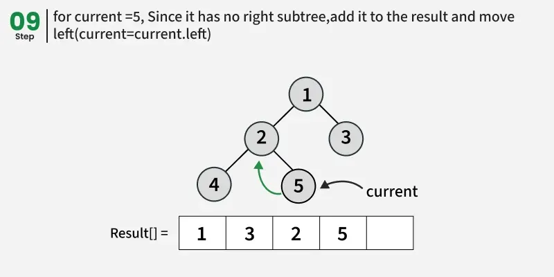
---
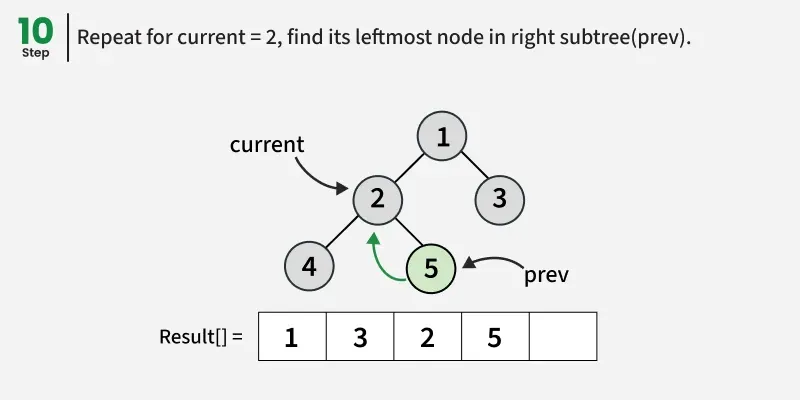
---
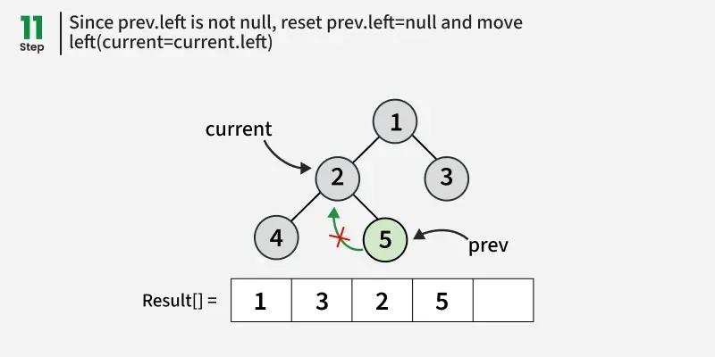
---
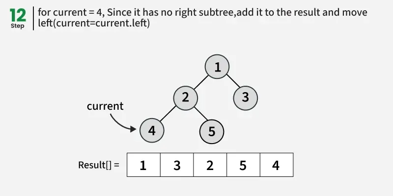
---
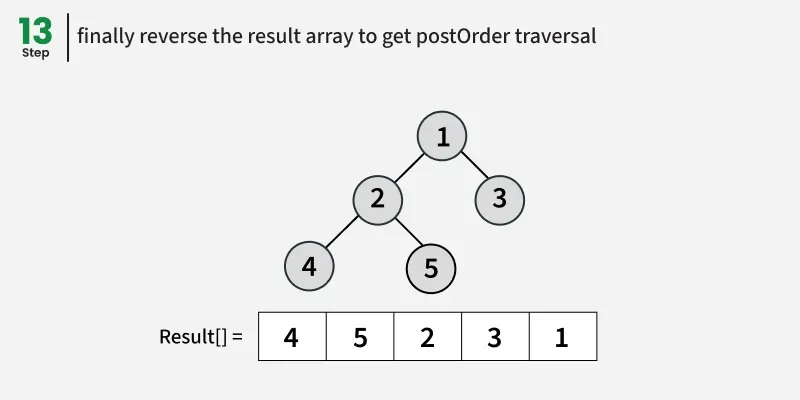
---

# ⭐ Java Code (Your Provided Code — Beginner Explanation Added)

```java
import java.util.ArrayList;
import java.util.Collections;

// Node Structure
class Node {
    public int data;
    Node left;
    Node right;

    Node(int data) {
        this.data = data;
        left = null;
        right = null;
    }
}

class GFG {

    static ArrayList<Integer> postOrder(Node root) {
        ArrayList<Integer> res = new ArrayList<>();
        Node current = root;

        while (current != null) {

            // If right child does not exist
            if (current.right == null) {
                res.add(current.data);   // store in NRL order
                current = current.left;
            } else {

                Node predecessor = current.right;

                // Move to leftmost node in right subtree
                while (predecessor.left != null &&
                       predecessor.left != current) {
                    predecessor = predecessor.left;
                }

                // Temporary link not created yet
                if (predecessor.left == null) {
                    res.add(current.data);   // store node
                    predecessor.left = current;  // create link
                    current = current.right;
                }
                // Temporary link already exists
                else {
                    predecessor.left = null; // remove link
                    current = current.left;
                }
            }
        }
        
        // Reverse NRL to get LRN (real postorder)
        Collections.reverse(res);
        return res;
    }

    public static void main(String[] args) {

        // Constructing binary tree:
        //         1
        //        / \
        //       2   3
        //      / \
        //     4   5

        Node root = new Node(1);
        root.left = new Node(2);
        root.right = new Node(3);
        root.left.left = new Node(4);
        root.left.right = new Node(5);

        ArrayList<Integer> ans = postOrder(root);

        for (int x : ans) {
            System.out.print(x + " ");
        }
    }
}
```

---

# ⭐ Output

```
4 5 2 3 1
```

---

# ⭐ Time and Space Complexity

| Complexity | Value                                   |
| ---------- | --------------------------------------- |
| Time       | **O(n)** (every node visited few times) |
| Space      | **O(1)** (no recursion, no stack)       |

---


