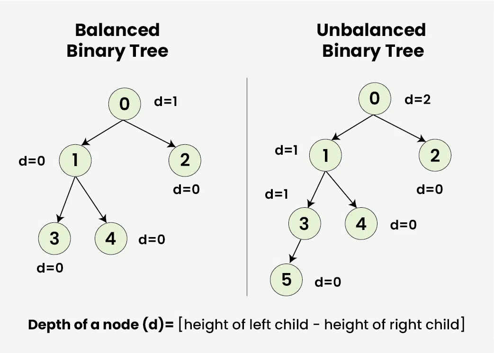
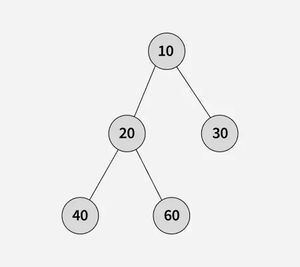
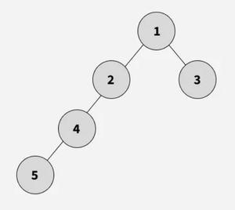
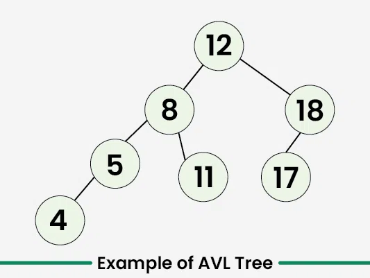
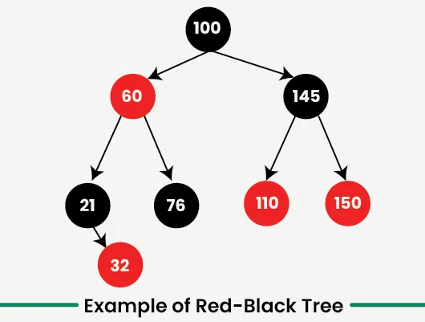

---

# Balanced Binary Tree

**Last Updated : 23 Jul, 2025**

A binary tree is balanced if the height of the tree is **O(Log n)** where *n* is the number of nodes.

For Example, the **AVL tree** maintains **O(Log n)** height by making sure that the difference between the heights of the left and right subtrees is at most **1**.

**Red-Black trees** maintain **O(Log n)** height by making sure that the number of Black nodes on every root-to-leaf path is the same and that there are no adjacent red nodes.

Balanced Binary Search trees are performance-wise good as they provide **O(log n)** time for **search, insert and delete**.

---

## Balanced Binary Tree Properties

> 1. A single node is always balanced. It is also referred to as a **height-balanced binary tree**.
> 2. An empty tree (**Root = Null**) is also always considered as balanced.

---

## Example

balance-vs-unbalance-binnary-tree

---

---

It is a type of binary tree in which the difference between the height of the left and the right subtree for each node is either **0 or 1**.

In the figure above, the root node having a value **0** is unbalanced with a depth of **2 units**.

---

## How to Check if a Binary Tree is Balanced?

To check if a Binary tree is balanced we need to check three conditions :

1. The absolute difference between heights of left and right subtrees at any node should be less than **1**.
2. For each node, its left subtree should be a balanced binary tree.
3. For each node, its right subtree should be a balanced binary tree.

---

# Balanced Binary Tree or Not

Given the root of a binary tree, determine if it is height-balanced. A binary tree is considered height-balanced if the absolute difference in heights of the left and right subtrees is at most **1** for every node in the tree.

---

## Examples

### Input:
---

---

final_tree

### Output:
---

---
true

### Explanation:

The height difference between the left and right subtrees at all nodes is at most **1**. Hence, the tree is balanced.

---

## [Naive Approach] By Calculating Height For Each Node - O(n²) Time and O(h) Space

A simple approach is to compute the absolute difference between the heights of the left and right subtrees for each node of the tree using DFS traversal. If, for any node, this absolute difference becomes greater than one, then the entire tree is not height-balanced.

---

### Code

```java
// Node Structure
class Node {
    int data;
    Node left;
    Node right;

    Node(int d) {
        int data = d;
        this.left = null;
        this.right = null;
    }
}

class GFG {

    // Function to calculate the height of a tree
    static int height(Node node) {
        if (node == null)
            return 0;

        // Height = 1 + max of left height and right heights
        return 1 + Math.max(height(node.left), height(node.right));
    }

    // Function to check if the binary tree with given root
    // is height-balanced
    static boolean isBalanced(Node root) {
        if (root == null)
            return true;

        // Get the height of left and right sub trees
        int lHeight = height(root.left);
        int rHeight = height(root.right);

        if (Math.abs(lHeight - rHeight) > 1)
            return false;

        // Recursively check the left and right subtrees
        return isBalanced(root.left) && isBalanced(root.right);
    }

    public static void main(String[] args) {
        // Representation of input BST:
        //            10
        //           / \
        //          20   30
        //         /  \
        //        40   60
        Node root = new Node(10);
        root.left = new Node(20);
        root.right = new Node(30);
        root.left.left = new Node(40);
        root.left.right = new Node(60);

        System.out.println(isBalanced(root) ? "true" : "false");
    }
}
```

Output

```
true
```

---

## [Expected Approach] Using Single Traversal - O(n) Time and O(h) Space

We can optimize by checking balance and calculating height in the same recursion. For each node, check its left and right subtrees. If both are balanced, return the subtree’s height; otherwise, return **-1** to show it’s not balanced. This avoids extra height calculations.

---

### Code

```java
// Node Structure
class Node {
    int data;
    Node left;
    Node right;

    Node(int d) {
        this.data = d; 
        left = right = null;
    }
}

class GFG {

    // Function that returns the height of the tree if the tree is balanced
    // Otherwise it returns -1.
    static int isBalancedRec(Node root) {
        if (root == null)
            return 0;

        // Find Heights of left and right sub trees
        int lHeight = isBalancedRec(root.left);
        int rHeight = isBalancedRec(root.right);

        // If either the subtrees are unbalanced or the absolute difference  
        // of their heights is greater than 1, return -1
        if (lHeight == -1 || rHeight == -1 || Math.abs(lHeight - rHeight) > 1)
            return -1;

        return Math.max(lHeight, rHeight) + 1;
    }

    // Function to check if tree is height balanced
    static boolean isBalanced(Node root) {
        return isBalancedRec(root) > 0;
    }

    public static void main(String[] args) {
        // Representation of input BST:
        //            10
        //           / \
        //          20  30
        //         /  \
        //       40    60
        Node root = new Node(10);
        root.left = new Node(20);
        root.right = new Node(30);
        root.left.left = new Node(40);
        root.left.right = new Node(60);

        System.out.println(isBalanced(root) ? "true" : "false");
    }
}
```

Output

```
true
```

---

## Self-Balancing Binary Search Trees

>Self-Balancing Binary Search Trees are height-balanced binary search trees that automatically keep the height as small as possible when insertion and deletion black_red_tree.basic_operations are performed on the tree.

---

### AVL Trees

>AVL tree is a self-balancing Binary Search Tree (BST) where the difference between heights of left and right subtrees cannot be more than one for all nodes.

Example of AVL Trees:
---

---

The above tree is AVL because the differences between the heights of left and right subtrees for every node are less than or equal to **1**.

---

### Red Black Tree

>A Red-Black Tree is a self-balancing binary search tree where each node has an additional attribute: a color, which can be either red or black.
>
>The primary objective of these trees is to maintain balance during insertions and deletions, ensuring efficient data retrieval and manipulation.

Example-of-Red-Black-Tree
---

---

The Red-Black Tree in above image ensures that every path from the root to a leaf node has the same number of black nodes. In this case, there is **one** (excluding the root node).

---

## Advantages of Balanced Binary Tree

* Balanced binary trees, such as AVL trees and Red-Black trees, maintain their height in logarithmic proportion to the number of nodes.
* This ensures that fundamental black_red_tree.basic_operations like insertion, deletion, and search are executed with **O(log n)** time complexity.
* Non Destructive In a balanced binary tree are performed in such a way that the tree remains balanced without requiring a complete reorganization.
* Balanced binary trees are well-suited for range queries, where you need to find all elements within a specified range.

---

