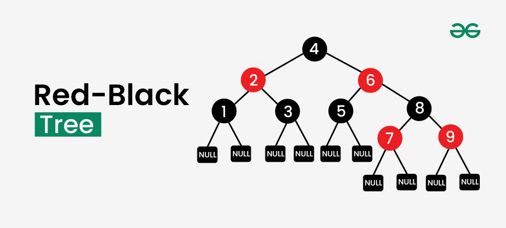
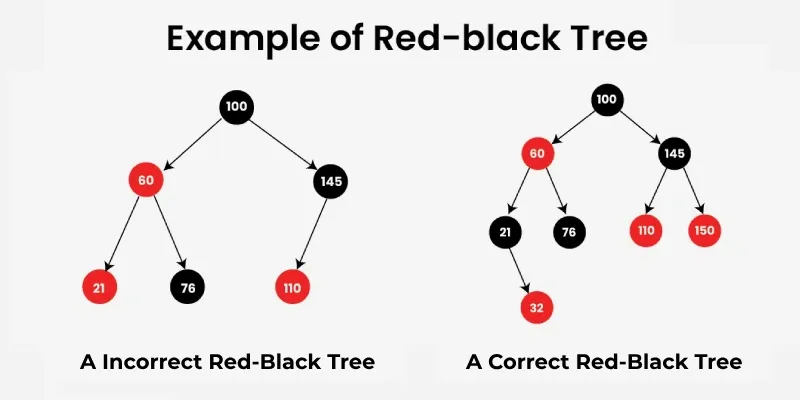
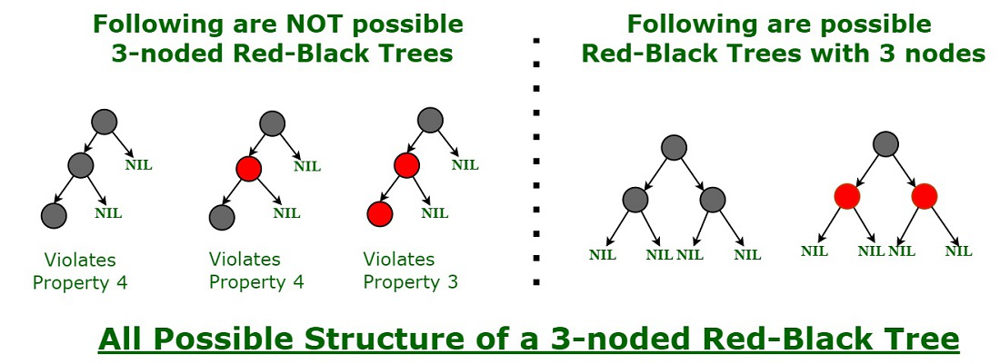

---

# Introduction to Red-Black Tree

**Last Updated : 08 Dec, 2025**

## 1. Overview

A **Red-Black Tree** is a **self-balancing binary search tree (BST)** where the height of the tree is never beyond **O(log n)**.
The main advantage of limiting the height is **efficient search, insertion, and deletion black_red_tree.basic_operations**.

In a normal Binary Search Tree, these black_red_tree.basic_operations may degrade to **O(n)** time in the worst case (for example, when the tree becomes skewed). However, in a Red-Black Tree, all major black_red_tree.basic_operations—**search, insert, and delete**—are guaranteed to run in **O(log n)** time.

Each node in a Red-Black Tree contains an additional attribute called **color**, which can be either **red** or **black**. These colors are used to maintain balance during insertions and deletions, ensuring efficient data retrieval and manipulation.

---

## 2. Red-Black Tree Concept

A Red-Black Tree is a Binary Search Tree with extra constraints enforced using node colors. These constraints ensure that the tree remains approximately balanced after every update operation.

---

---

## 3. Properties of Red-Black Trees

A Red-Black Tree has the following properties:

1. **Node Color**: Each node is either **red** or **black**.
2. **Root Property**: The root of the tree is always **black**.
3. **Red Property**: Red nodes cannot have red children (no two consecutive red nodes on any path).
4. **Black Property**: Every path from a node to its descendant **NIL nodes (leaves)** contains the same number of black nodes.
5. **Leaf Property**: All leaves (NIL nodes) are black.

These properties ensure that the longest path from the root to any leaf is **no more than twice** the length of the shortest path, maintaining balance and efficient performance.

---

---

## 4. Correct vs Incorrect Red-Black Tree

* A **correct Red-Black Tree** ensures that every path from the root to a leaf node has the same number of black nodes. In the given example, there is **one black node on each path** (excluding the root node).
* An **incorrect Red-Black Tree** violates the rules:

    * Two red nodes appear adjacent to each other.
    * One path from the root to a leaf has **zero black nodes**, while other paths contain a black node.

---

## 5. Why Red-Black Trees?

Most BST black_red_tree.basic_operations such as **search, min, max, insert, and delete** take **O(h)** time, where *h* is the height of the tree.
In a skewed BST, the height can become *n*, making black_red_tree.basic_operations **O(n)**.

Red-Black Trees guarantee that the height remains **O(log n)** after every insertion and deletion, ensuring an **upper bound of O(log n)** for all black_red_tree.basic_operations.

### Time Complexity Summary

| Sr. No. | Algorithm | Time Complexity |
| ------- | --------- | --------------- |
| 1       | Search    | O(log n)        |
| 2       | Insert    | O(log n)        |
| 3       | Delete    | O(log n)        |

---

## 6. Comparison with AVL Trees

* **AVL Trees** are more strictly balanced than Red-Black Trees.
* AVL Trees may require **more rotations** during insertion and deletion.
* **Red-Black Trees** are preferred when:

    * Insertions and deletions are frequent.
* **AVL Trees** are preferred when:

    * Search black_red_tree.basic_operations are more frequent than updates.

---

## 7. How Does a Red-Black Tree Ensure Balance?

A simple way to understand balancing is that a **chain of three nodes is not possible** in a Red-Black Tree.
Any coloring combination of three consecutive nodes will violate at least one Red-Black Tree property.

This restriction ensures that the tree does not become skewed.

---

---

## 8. Interesting Points About Red-Black Trees

* **Black Height**: The number of black nodes on any path from the root to a leaf (NIL nodes are counted as black).
* A Red-Black Tree of height *h* has black height **≥ h/2**.
* The height of a Red-Black Tree with *n* nodes is:
  **h ≤ 2 log₂(n + 1)**.
* All leaves (NIL) are black.
* **Black Depth** of a node is the number of black ancestors from the root to that node.

---

## 9. Basic Operations on Red-Black Tree

The basic black_red_tree.basic_operations include:

* **Insertion**
* **Search**
* **Deletion**
* **Rotation**

---

## 10. Insertion in Red-Black Tree

Insertion follows a **two-step process**:

1. Perform a standard **BST insertion**.
2. Fix violations of Red-Black Tree properties.

### Insertion Steps

1. Insert the new node like in a BST.
2. Color the new node **red**.
3. Fix violations:

    * If the parent is black → no violation.
    * If the parent is red → violation occurs.

### Fixing Violations During Insertion

* **Case 1: Uncle is Red**

    * Recolor parent and uncle to black.
    * Recolor grandparent to red.
    * Move upward and repeat if needed.
* **Case 2: Uncle is Black**

    * **Sub-case 2.1**: Node is a right child → perform left rotation.
    * **Sub-case 2.2**: Node is a left child → perform right rotation and recolor.

---

## 11. Searching in Red-Black Tree

Searching is identical to searching in a standard BST.

### Search Steps

1. Start at the root.
2. Compare the target value:

    * Equal → node found.
    * Smaller → move left.
    * Greater → move right.
3. Repeat until the value is found or a NIL node is reached.

---

## 12. Deletion in Red-Black Tree

Deletion also follows a **two-step process**:

1. Perform standard BST deletion.
2. Fix Red-Black Tree violations.

### Fixing Violations During Deletion

* **Double Black** condition may occur when a black node is deleted.
* **Case 1: Sibling is Red**

    * Rotate parent and recolor.
* **Case 2: Sibling is Black**

    * **Sub-case 2.1**: Both sibling’s children are black → recolor sibling and propagate.
    * **Sub-case 2.2**: At least one red child → rotate and recolor accordingly.

---

## 13. Rotation in Red-Black Tree

Rotations help maintain balance and preserve tree properties.

### Left Rotation

Moves node *x* down to the left and its right child *y* up.

**Pseudocode:**

```java
// Utility function to perform left rotation
private void leftRotate(Node x) {
    Node y = x.right;
    x.right = y.left;

    if (y.left != NIL) {
        y.left.parent = x;
    }

    y.parent = x.parent;

    if (x.parent == null) {
        root = y;
    } else if (x == x.parent.left) {
        x.parent.left = y;
    } else {
        x.parent.right = y;
    }

    y.left = x;
    x.parent = y;
}

```

### Right Rotation

Moves node *x* down to the right and its left child *y* up.

**Pseudocode:**

``` java
// Utility function to perform right rotation
private void rightRotate(Node x) {
    Node y = x.left;
    x.left = y.right;

    if (y.right != NIL) {
        y.right.parent = x;
    }

    y.parent = x.parent;

    if (x.parent == null) {
        root = y;
    } else if (x == x.parent.right) {
        x.parent.right = y;
    } else {
        x.parent.left = y;
    }

    y.right = x;
    x.parent = y;
}
```

---

## 14. When to Perform Rotations

### After Insertion

* Used to fix red-red violations.
* Combined with recoloring.

### After Deletion

* Used to fix double-black conditions.

---

## 15. Implementation of Red-Black Tree

---
```java
// Red-Black Tree implementation in Java
public class RedBlackTree {

    // Enum for node color
    private enum Color {
        RED, BLACK
    }

    // Node structure
    private class Node {
        int data;
        Color color;
        Node left, right, parent;

        Node(int data) {
            this.data = data;
            this.color = Color.RED; // New nodes are always red
            this.left = NIL;
            this.right = NIL;
            this.parent = null;
        }
    }

    private final Node NIL;   // Sentinel NIL node
    private Node root;

    // Constructor
    public RedBlackTree() {
        NIL = new Node(0);
        NIL.color = Color.BLACK;
        NIL.left = NIL.right = NIL;
        root = NIL;
    }

    /* ---------------- LEFT ROTATION ---------------- */
    private void leftRotate(Node x) {
        Node y = x.right;
        x.right = y.left;

        if (y.left != NIL) {
            y.left.parent = x;
        }

        y.parent = x.parent;

        if (x.parent == null) {
            root = y;
        } else if (x == x.parent.left) {
            x.parent.left = y;
        } else {
            x.parent.right = y;
        }

        y.left = x;
        x.parent = y;
    }

    /* ---------------- RIGHT ROTATION ---------------- */
    private void rightRotate(Node x) {
        Node y = x.left;
        x.left = y.right;

        if (y.right != NIL) {
            y.right.parent = x;
        }

        y.parent = x.parent;

        if (x.parent == null) {
            root = y;
        } else if (x == x.parent.right) {
            x.parent.right = y;
        } else {
            x.parent.left = y;
        }

        y.right = x;
        x.parent = y;
    }

    /* ---------------- INSERT ---------------- */
    public void insert(int data) {
        Node newNode = new Node(data);

        Node parent = null;
        Node current = root;

        // Standard BST insert
        while (current != NIL) {
            parent = current;
            if (data < current.data) {
                current = current.left;
            } else {
                current = current.right;
            }
        }

        newNode.parent = parent;

        if (parent == null) {
            root = newNode;
        } else if (data < parent.data) {
            parent.left = newNode;
        } else {
            parent.right = newNode;
        }

        // Fix Red-Black Tree violations
        fixInsert(newNode);
    }

    /* ---------------- FIX INSERT VIOLATIONS ---------------- */
    private void fixInsert(Node k) {
        while (k != root && k.parent.color == Color.RED) {

            if (k.parent == k.parent.parent.left) {
                Node uncle = k.parent.parent.right;

                // Case 1: Uncle is red
                if (uncle.color == Color.RED) {
                    k.parent.color = Color.BLACK;
                    uncle.color = Color.BLACK;
                    k.parent.parent.color = Color.RED;
                    k = k.parent.parent;
                }
                // Case 2: Uncle is black
                else {
                    if (k == k.parent.right) {
                        k = k.parent;
                        leftRotate(k);
                    }
                    k.parent.color = Color.BLACK;
                    k.parent.parent.color = Color.RED;
                    rightRotate(k.parent.parent);
                }
            } else {
                Node uncle = k.parent.parent.left;

                // Mirror Case 1
                if (uncle.color == Color.RED) {
                    k.parent.color = Color.BLACK;
                    uncle.color = Color.BLACK;
                    k.parent.parent.color = Color.RED;
                    k = k.parent.parent;
                }
                // Mirror Case 2
                else {
                    if (k == k.parent.left) {
                        k = k.parent;
                        rightRotate(k);
                    }
                    k.parent.color = Color.BLACK;
                    k.parent.parent.color = Color.RED;
                    leftRotate(k.parent.parent);
                }
            }
        }
        root.color = Color.BLACK;
    }

    /* ---------------- SEARCH ---------------- */
    public boolean search(int key) {
        return searchTree(root, key) != NIL;
    }

    private Node searchTree(Node node, int key) {
        if (node == NIL || key == node.data) {
            return node;
        }
        if (key < node.data) {
            return searchTree(node.left, key);
        }
        return searchTree(node.right, key);
    }

    /* ---------------- INORDER TRAVERSAL ---------------- */
    public void inorder() {
        inorderHelper(root);
        System.out.println();
    }

    private void inorderHelper(Node node) {
        if (node != NIL) {
            inorderHelper(node.left);
            System.out.print(node.data + " ");
            inorderHelper(node.right);
        }
    }

    /* ---------------- MAIN METHOD ---------------- */
    public static void main(String[] args) {
        RedBlackTree rbt = new RedBlackTree();

        // Insert elements
        rbt.insert(10);
        rbt.insert(20);
        rbt.insert(30);
        rbt.insert(15);

        // Inorder traversal
        System.out.println("Inorder Traversal:");
        rbt.inorder();   // Output: 10 15 20 30

        // Search black_red_tree.basic_operations
        System.out.println("Search 15: " + rbt.search(15)); // true
        System.out.println("Search 25: " + rbt.search(25)); // false
    }
}
```

---

## Key Features of This Java Implementation

* Uses a **sentinel NIL node** (standard Red-Black Tree practice)
* Ensures:

    * Root is always black
    * No two red nodes are adjacent
    * Equal black height on all paths
* Guarantees **O(log n)** for:

    * Insertion
    * Search
    * Rotations
---

## 16. Advantages of Red-Black Trees

* **Self-balancing** structure.
* Guaranteed **O(log n)** performance.
* Efficient for search, insert, and delete.
* Relatively simple rules.
* Widely used in real-world systems.

---

## 17. Disadvantages of Red-Black Trees

* More complex than simpler balanced trees.
* Additional overhead due to color maintenance.

---

## 18. Applications of Red-Black Trees

* **Maps and Sets** (e.g., TreeMap and TreeSet in Java, map and set in C++).
* **File systems** for directory management.
* **In-memory databases**.
* **Graphics and game development** (collision detection, pathfinding).

---

### Summary

Red-Black Trees provide an efficient, reliable, and widely used solution for maintaining balanced binary search trees, making them a cornerstone data structure in modern software systems.
