---

# AVL Tree Data Structure

**Last Updated : 06 Dec, 2025**

---

## 1. Introduction to AVL Tree

An **AVL Tree** is a **self-balancing Binary Search Tree (BST)** in which the difference between the heights of the left and right subtrees of **any node** cannot be more than **one**.

This strict height-balance property ensures that the tree remains balanced after every insertion and deletion, providing efficient performance.

---

## 2. Balance Factor

The balance of an AVL Tree is maintained using a value called the **Balance Factor**.

>Balance Factor = Height of Left Subtree - Height of Right Subtree

For a tree to be **balanced**, the following condition must hold for **every node**:

>-1 ≤ Balance Factor ≤ 1

---

## 3. Example of an AVL Tree

---
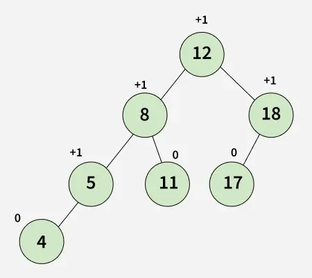
---

In the given AVL Tree example, the balance factors of nodes are:

* 12 : +1
* 8 : +1
* 18 : +1
* 5 : +1
* 11 : 0
* 17 : 0
* 4 : 0

Since all balance factors lie between **-1 and +1**, the tree satisfies the AVL property and is therefore a valid AVL Tree.

---

## 4. Example of a BST That Is Not an AVL Tree

---
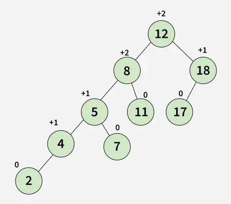
---

A Binary Search Tree may **not** be an AVL Tree if it becomes unbalanced.

In the given example, the tree is **not an AVL Tree** because the balance factors of nodes **8** and **12** are **greater than 1**, violating the AVL balance condition.

---

## 5. Important Points About AVL Tree

### 5.1 Rotations

Rotations are used to restore balance in **O(1)** time while ensuring the overall time complexity remains **O(log n)**.

AVL Trees use **four types of rotations** to rebalance themselves after insertions and deletions:

1. Left-Left (LL) Rotation
2. Right-Right (RR) Rotation
3. Left-Right (LR) Rotation
4. Right-Left (RL) Rotation

### 5.2 Insertion and Deletion

* **Insertion** is followed by upward traversal to check balance factors and apply rotations.
* **Deletion** is more complex than insertion because **multiple rotations** may be required.
* Compared to Red-Black Trees, AVL Trees may need **more rebalancing steps**, especially during deletion.

### 5.3 Use Cases

AVL Trees are particularly useful when:

* Frequent and efficient **lookups** are required
* Predictable time complexity is crucial
* Used in **database indexing**, **memory-intensive applications**, and real-time systems

### 5.4 Drawbacks Compared to Other Trees

* AVL Trees provide **faster lookups** than Red-Black Trees
* However, they incur **more overhead** during insertions and deletions due to strict balancing
* As a result, **Red-Black Trees** are more commonly used in standard libraries such as:

    * `TreeMap` and `TreeSet` in Java
    * `map` and `set` in C++ STL

---

## 6. In-order Traversal

An **in-order traversal** of an AVL Tree produces elements in **sorted order**, just like a normal Binary Search Tree.

---

## 7. Operations on an AVL Tree

### 7.1 Searching

* Searching in an AVL Tree is the same as in a BST.
* Since the tree is always balanced, the time complexity is **O(log n)**.

### 7.2 Insertion

* Insertion is performed like a normal BST insertion.
* After insertion, **rotations** are applied to ensure that the balance factor of all affected nodes is **≤ 1**.

### 7.3 Deletion

* Deletion follows standard BST deletion rules.
* After deletion, rotations are applied to restore balance.
* The balance factor of all affected nodes is maintained at **≤ 1**.

---

## 8. Rotating the Subtrees

To keep the AVL Tree balanced while maintaining BST properties, rotations are applied in four specific cases.

### 8.1 Left-Left (LL) Case
---
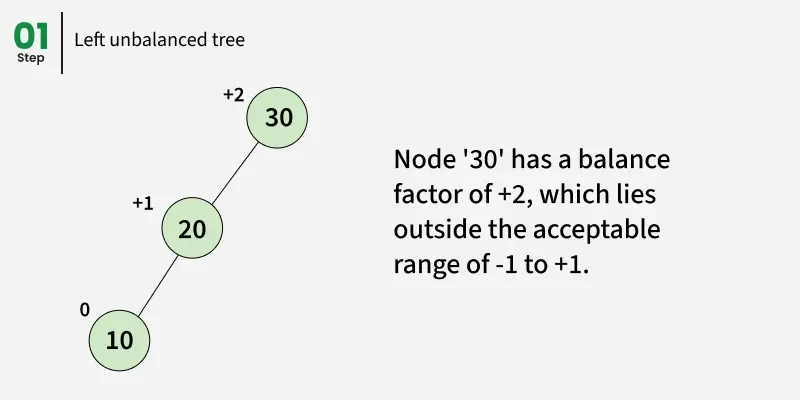
---
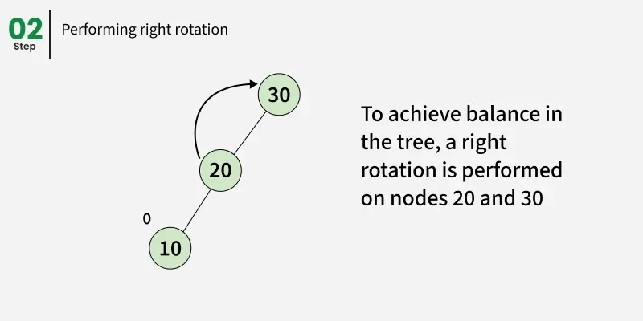
---
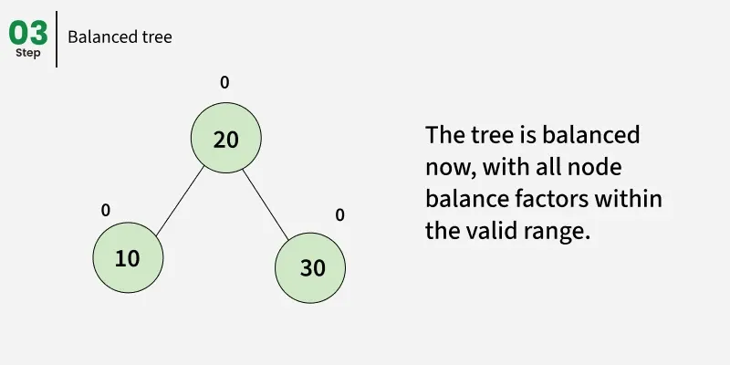
---

* Occurs when a node is inserted into the **left subtree of the left child**
* Balance factor becomes **greater than +1**
* **Fix**: Perform a **single right rotation**

---

### 8.2 Right-Right (RR) Case

---
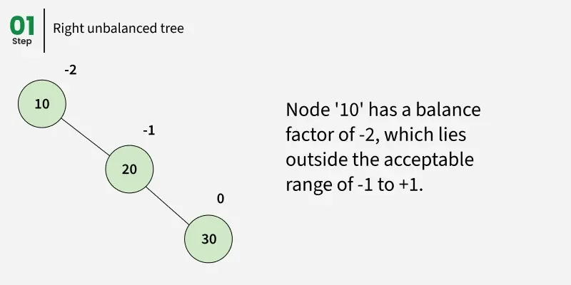
---
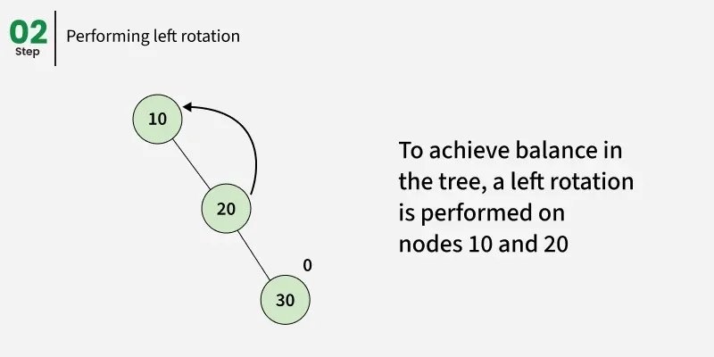
---
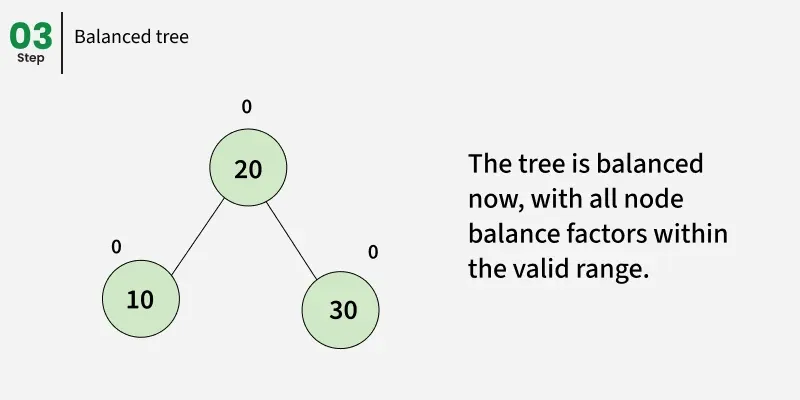
---

* Occurs when a node is inserted into the **right subtree of the right child**
* Balance factor becomes **less than -1**
* **Fix**: Perform a **single left rotation**

---

### 8.3 Left-Right (LR) Case

---
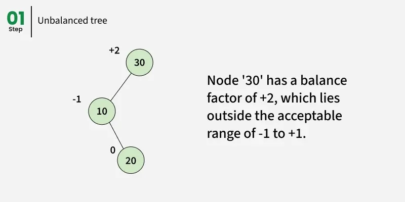
---
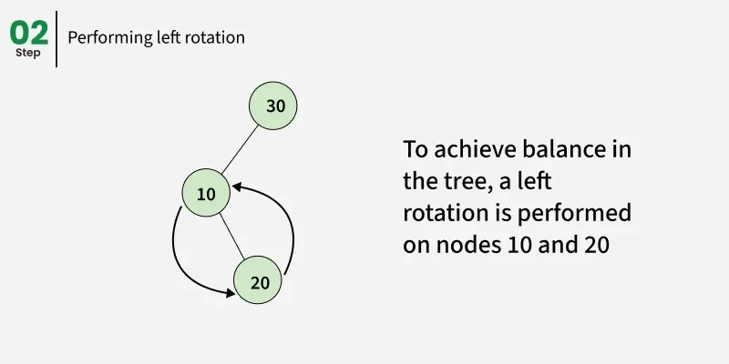
---
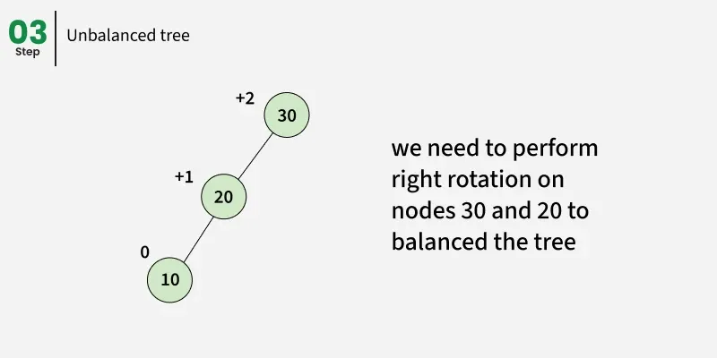
---
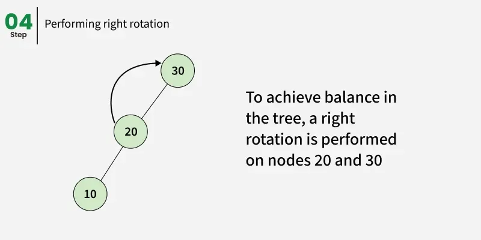
---
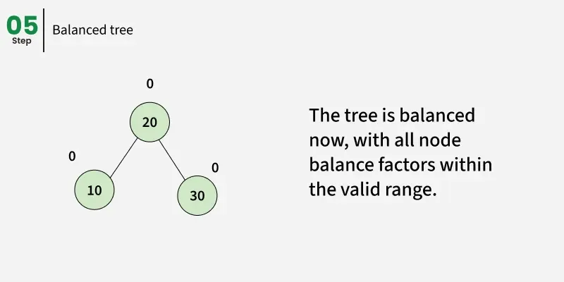
---

* Occurs when a node is inserted into the **right subtree of the left child**
* The tree becomes **left-heavy**
* **Fix**:

    1. Perform a **left rotation** on the left child
    2. Perform a **right rotation** on the node

---

### 8.4 Right-Left (RL) Case

---
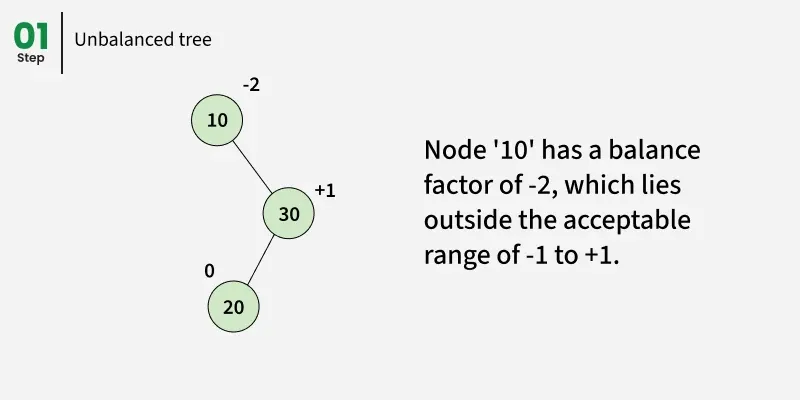
---
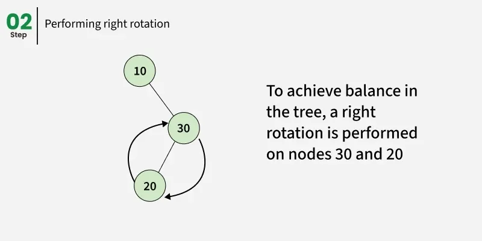
---
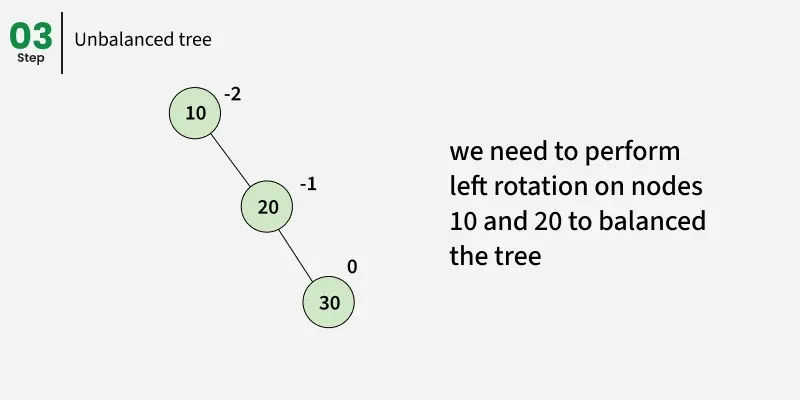
---
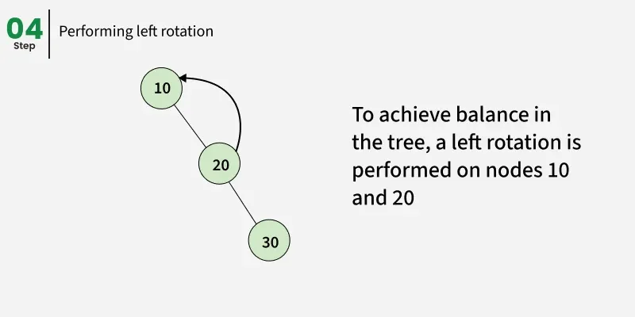
---
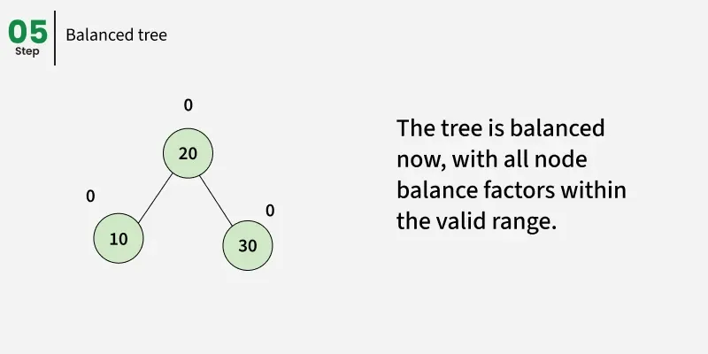
---

* Occurs when a node is inserted into the **left subtree of the right child**
* The tree becomes **right-heavy**
* **Fix**:

    1. Perform a **right rotation** on the right child
    2. Perform a **left rotation** on the node

---

## 9. Applications of AVL Tree

* Used as the **first example** of self-balancing BST in teaching Data Structures due to simplicity
* Suitable for applications where:

    * Insertions and deletions are **less frequent**
    * Data lookups are **frequent**
    * Operations like sorted traversal, floor, ceil, min, and max are required
* Used in **real-time systems** where predictable and consistent performance is needed
* Red-Black Trees are more commonly implemented in standard libraries, but AVL Trees remain important conceptually

---

## 10. Advantages of AVL Tree

* Self-balancing ensures **O(log n)** time for search, insert, and delete
* Supports **sorted traversal**
* Stricter balancing rules result in **smaller height**, making searches faster
* Easier to understand and implement compared to Red-Black Trees

---

## 11. Disadvantages of AVL Tree

* More difficult to implement than a normal BST
* Less commonly used than Red-Black Trees due to strict balancing
* Insertions and deletions are more complex because **more rotations** are required

---

### Summary

An AVL Tree is a powerful self-balancing Binary Search Tree that guarantees efficient and predictable performance. Its strict balance rules make it ideal for applications where fast searching is critical, even though it introduces additional complexity during updates.
