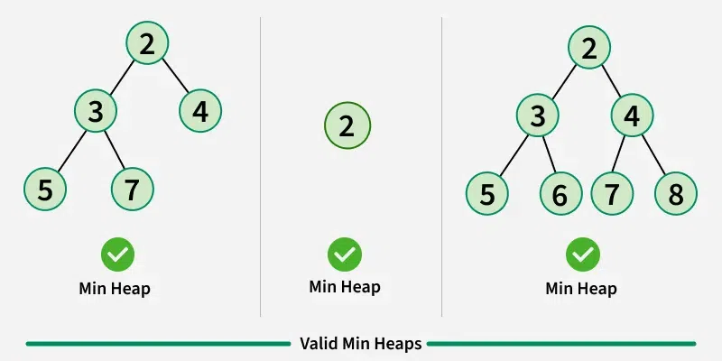
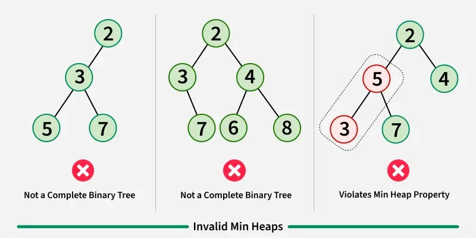
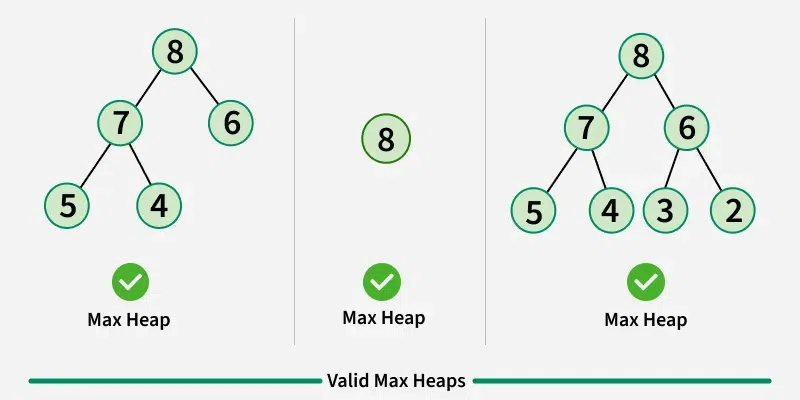
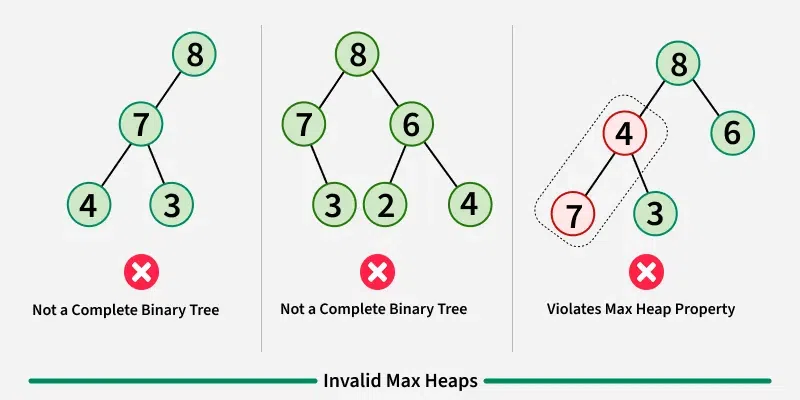
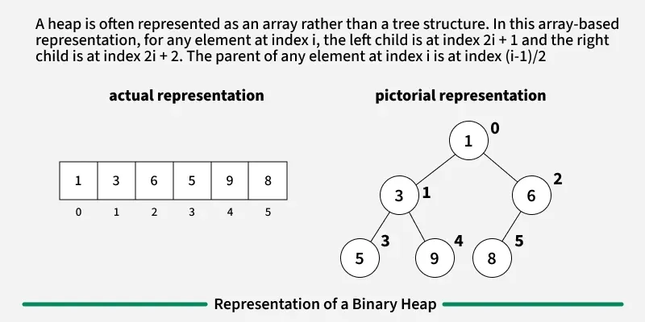
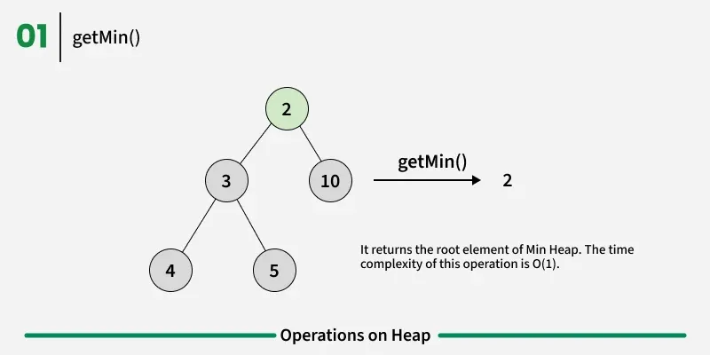
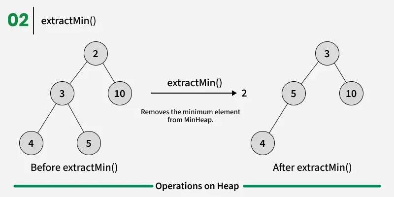
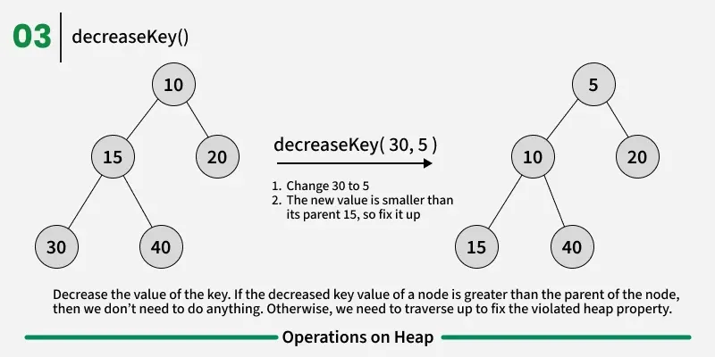
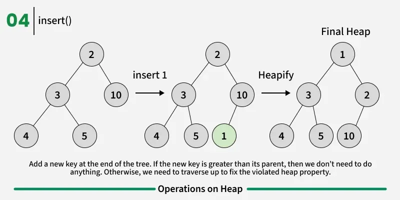
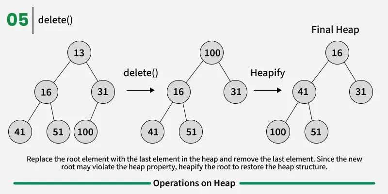

---

# Binary Heap Data Structure

**Last Updated : 21 Oct, 2025**

---

## 1. Introduction to Binary Heap

A **Binary Heap** is a special type of **Complete Binary Tree**, which means:

* All levels of the tree are completely filled **except possibly the last level**
* The last level is filled **from left to right**

Binary Heaps are designed to provide **fast access** to the **minimum or maximum element**, making them extremely useful in many algorithms.

---

## 2. Types of Binary Heaps

There are **two main types** of Binary Heaps:

### 1. Min Heap

* The **root node contains the smallest value**
* This property is true for **every subtree**
* The minimum element can always be accessed in **O(1)** time

### 2. Max Heap

* The **root node contains the largest value**
* This rule also applies to **all subtrees**
* The maximum element is always at the root

Binary heaps are commonly used in:

* **Priority Queues**
* **Heap Sort**
* Graph algorithms that require efficient minimum or maximum selection

---

## 3. Valid and Invalid Heaps

---

---

---

---

---

A Binary Heap must satisfy **two properties**:

1. **Structural Property** → It must be a **Complete Binary Tree**
2. **Heap Property** → It must follow **Min Heap** or **Max Heap** rules

*(Valid and Invalid examples of heaps)*
*(max-heap-2.webp placeholder)*

---

## 4. Representation of Binary Heap

A Binary Heap is typically represented using an **array**, rather than pointers.

### Why Array Representation?

* Since a heap is a **Complete Binary Tree**, it can be efficiently stored in an array
* No extra memory is needed for pointers

### Index Rules in Array Representation

If a node is stored at index `i` in the array `arr[]`:

| Relationship | Formula            |
| ------------ | ------------------ |
| Parent       | `arr[(i - 1) / 2]` |
| Left Child   | `arr[(2 * i) + 1]` |
| Right Child  | `arr[(2 * i) + 2]` |

* The **root element** is stored at `arr[0]`
* The traversal method used is **Level Order Traversal**

---

---

## 5. Operations on Binary Heap

Common heap operations include:

* Insertion
* Deletion
* Extract Minimum / Maximum
* Decrease Key
* Increase Key
* Heapify

---

---

---

---

---

---

## 6. Java Implementation of Min Heap

Below is a complete **Java implementation of a Min Heap**, demonstrating all major heap operations.

```java
import java.util.*;

// A class for Min Heap
class MinHeap {

    private int[] heapArray;
    private int capacity;
    private int current_heap_size;

    // Constructor
    public MinHeap(int n) {
        capacity = n;
        heapArray = new int[capacity];
        current_heap_size = 0;
    }

    // Swap utility
    private void swap(int[] arr, int a, int b) {
        int temp = arr[a];
        arr[a] = arr[b];
        arr[b] = temp;
    }

    private int parent(int key) {
        return (key - 1) / 2;
    }

    private int left(int key) {
        return 2 * key + 1;
    }

    private int right(int key) {
        return 2 * key + 2;
    }

    // Insert a new key
    public boolean insertKey(int key) {
        if (current_heap_size == capacity)
            return false;

        int i = current_heap_size;
        heapArray[i] = key;
        current_heap_size++;

        while (i != 0 && heapArray[i] < heapArray[parent(i)]) {
            swap(heapArray, i, parent(i));
            i = parent(i);
        }
        return true;
    }

    public void decreaseKey(int key, int new_val) {
        heapArray[key] = new_val;
        while (key != 0 && heapArray[key] < heapArray[parent(key)]) {
            swap(heapArray, key, parent(key));
            key = parent(key);
        }
    }

    public int getMin() {
        return heapArray[0];
    }

    public int extractMin() {
        if (current_heap_size <= 0)
            return Integer.MAX_VALUE;

        if (current_heap_size == 1) {
            current_heap_size--;
            return heapArray[0];
        }

        int root = heapArray[0];
        heapArray[0] = heapArray[current_heap_size - 1];
        current_heap_size--;
        MinHeapify(0);

        return root;
    }

    public void deleteKey(int key) {
        decreaseKey(key, Integer.MIN_VALUE);
        extractMin();
    }

    private void MinHeapify(int key) {
        int l = left(key);
        int r = right(key);
        int smallest = key;

        if (l < current_heap_size && heapArray[l] < heapArray[smallest])
            smallest = l;

        if (r < current_heap_size && heapArray[r] < heapArray[smallest])
            smallest = r;

        if (smallest != key) {
            swap(heapArray, key, smallest);
            MinHeapify(smallest);
        }
    }

    public void increaseKey(int key, int new_val) {
        heapArray[key] = new_val;
        MinHeapify(key);
    }

    public void changeValueOnAKey(int key, int new_val) {
        if (heapArray[key] == new_val)
            return;
        if (heapArray[key] < new_val)
            increaseKey(key, new_val);
        else
            decreaseKey(key, new_val);
    }
}
```

### Driver Code

```java
class MinHeapTest {
    public static void main(String[] args) {
        MinHeap h = new MinHeap(11);

        h.insertKey(3);
        h.insertKey(2);
        h.deleteKey(1);
        h.insertKey(15);
        h.insertKey(5);
        h.insertKey(4);
        h.insertKey(45);

        System.out.print(h.extractMin() + " ");
        System.out.print(h.getMin() + " ");

        h.decreaseKey(2, 1);
        System.out.print(h.getMin());
    }
}
```

### Output

```
2 4 1
```

---

## 7. Applications of Binary Heap

Binary Heaps are widely used in many real-world and algorithmic problems:

### 1. Heap Sort

* Uses Binary Heap to sort an array
* Time Complexity: **O(n log n)**

### 2. Priority Queue

* Efficient implementation using Binary Heap
* Supports operations like:

    * Insert
    * Delete
    * ExtractMin / ExtractMax
    * DecreaseKey
* All operations take **O(log N)** time
* Advanced heaps like **Binomial Heap** and **Fibonacci Heap** support faster union operations

### 3. Graph Algorithms

* Used in:

    * **Dijkstra’s Shortest Path Algorithm**
    * **Prim’s Minimum Spanning Tree**

### 4. Problem Solving

Many problems can be efficiently solved using heaps, such as:

* K’th Largest Element in an array
* Sorting an almost sorted array
* Merging K sorted arrays

---

## 8. Summary

* A Binary Heap is a **complete binary tree** with a **heap property**
* It provides **fast access** to minimum or maximum elements
* It is efficiently implemented using an **array**
* Insertion and deletion operations take **O(log n)** time
* Binary Heaps are foundational to **priority queues**, **heap sort**, and **graph algorithms**

---
