---

# Insertion in an AVL Tree

**Last Updated : 09 Dec, 2025**

---

## 1. Introduction

An **AVL Tree** is a **self-balancing Binary Search Tree (BST)** in which the difference between the heights of the left and right subtrees of **every node** cannot be more than **one**.

During insertion, the AVL Tree ensures that this balance condition is maintained by performing **rotations** whenever the balance factor of a node goes outside the allowed range.

---

## 2. AVL Tree Insertion Basics

Insertion in an AVL Tree follows the **same basic rules as a Binary Search Tree (BST)**:

* A new key is placed in its correct position according to BST rules:
  **left subtree < node < right subtree**
* After insertion, the **balance factor** of each node on the path from the inserted node back to the root is checked.
* If any node becomes **unbalanced** (balance factor < −1 or > +1), **rotations** are performed to restore the AVL property.

---
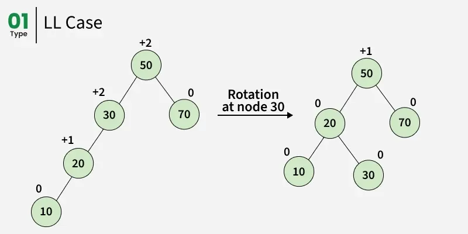
---
## 3. Example of an AVL Tree

---
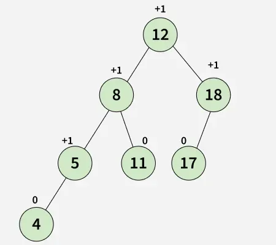
---

In the given example, the tree remains an AVL Tree because the difference between the heights of the left and right subtrees for **every node lies in the range −1 to +1**.

---

## 4. Example of a Tree That Is NOT an AVL Tree

In the given non-AVL example, the tree violates AVL conditions because the difference between the heights of the left and right subtrees for nodes **8** and **12** is **greater than 1**.

---
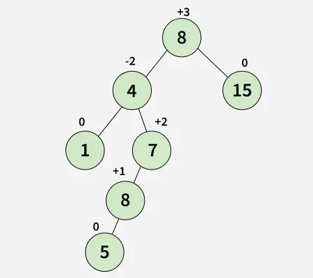
---

## 5. Why AVL Trees?

Most BST operations such as **search, max, min, insert, delete, floor, and ceiling** take **O(h)** time, where *h* is the height of the tree.

* In a **skewed Binary Tree**, *h* can become *n*, making operations **O(n)**.
* AVL Trees ensure that the height always remains **O(log n)** after every insertion and deletion.
* Therefore, all operations in an AVL Tree have a guaranteed upper bound of **O(log n)**, where *n* is the number of nodes.

---

## 6. Insertion in AVL Tree
---
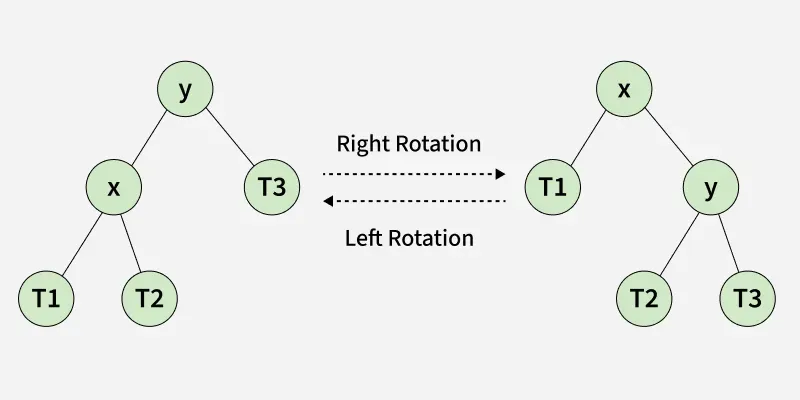
---

To ensure that the tree remains balanced after insertion, the standard BST insertion is **augmented with rebalancing operations**.

### Basic Rebalancing Operations

Two fundamental operations are used to rebalance the tree **without violating BST properties**:

* **Left Rotation**
* **Right Rotation**

These operations maintain the condition:

```
keys(T1) < key(x) < keys(T2) < key(y) < keys(T3)
```

---

## 7. Illustration of AVL Tree Insertion

During insertion, rotations such as **Right-Left**, **Left-Right**, **Left-Left**, or **Right-Right** may be required depending on how the balance factor changes.

---
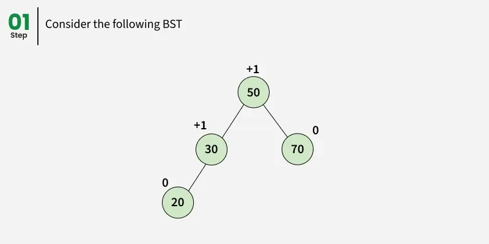
---
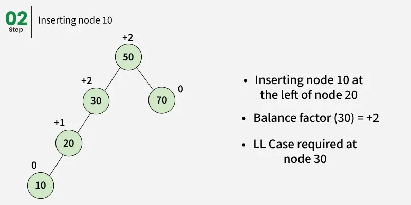
---
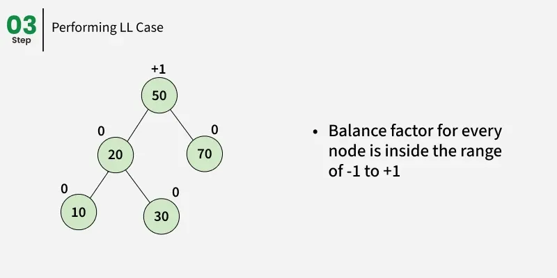
---
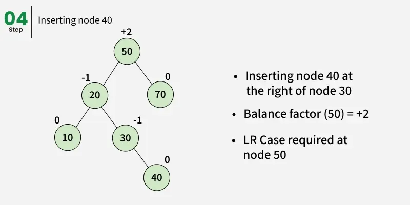
---
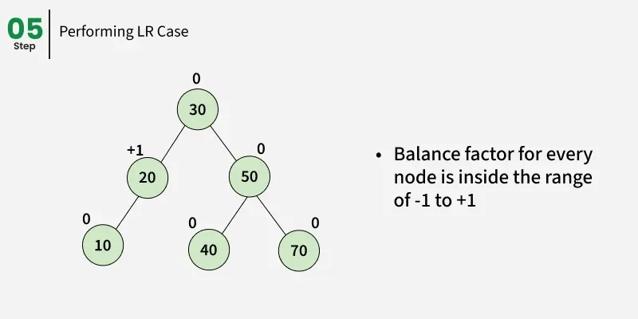
---
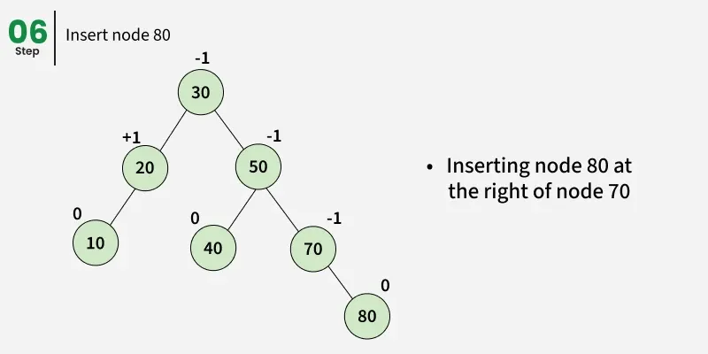
---
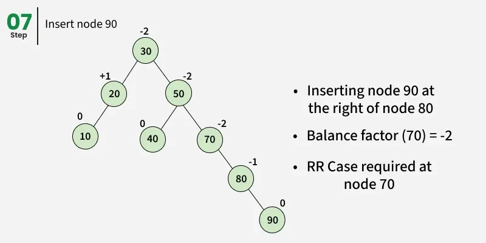
---
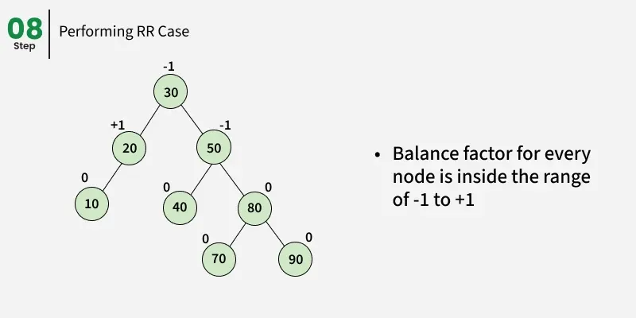
---
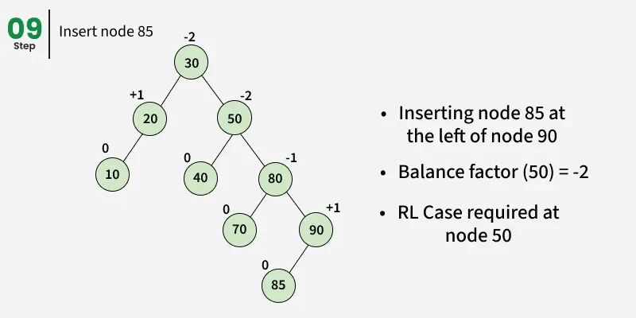
---
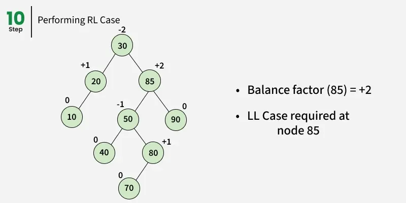
---
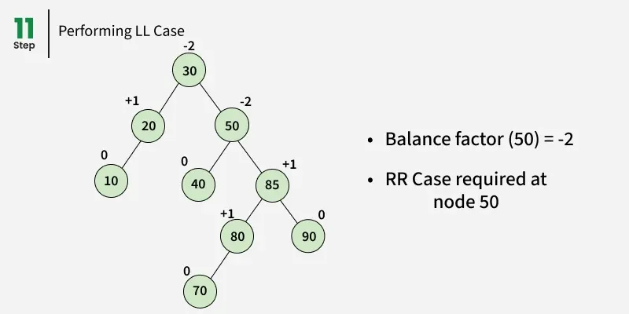
---
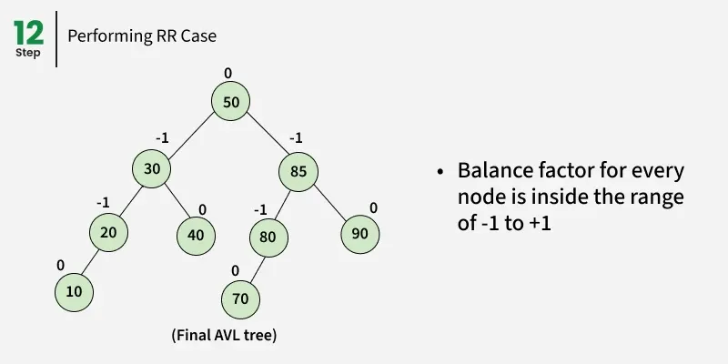
---

## 8. Approach for AVL Tree Insertion

The AVL insertion algorithm uses a **recursive BST insertion** approach.

### Key Idea

* After insertion, recursion naturally provides access to all **ancestor nodes** in a bottom-up manner.
* Therefore, **no parent pointer** is required to traverse upward.
* Each recursive call updates heights and checks balance.

---

## 9. Steps for Insertion in AVL Tree

Follow the steps below to implement AVL Tree insertion:

1. **Perform normal BST insertion**.
2. Update the **height** of the current node.
3. Compute the **balance factor**:

   ```
   balance = height(left subtree) − height(right subtree)
   ```
4. If the balance factor is **greater than 1**, the node is unbalanced:

    * This is either a **Left-Left (LL)** or **Left-Right (LR)** case.
    * Compare the inserted key with the key in the left subtree root to decide.
5. If the balance factor is **less than −1**, the node is unbalanced:

    * This is either a **Right-Right (RR)** or **Right-Left (RL)** case.
    * Compare the inserted key with the key in the right subtree root to decide.

---

## 10. Rotation Cases in AVL Insertion

### 10.1 Left-Left (LL) Case

* Occurs when insertion happens in the left subtree of the left child
* **Fix**: Perform a **single right rotation**

### 10.2 Right-Right (RR) Case

* Occurs when insertion happens in the right subtree of the right child
* **Fix**: Perform a **single left rotation**

### 10.3 Left-Right (LR) Case

* Occurs when insertion happens in the right subtree of the left child
* **Fix**:

    1. Left rotation on left child
    2. Right rotation on the node

### 10.4 Right-Left (RL) Case

* Occurs when insertion happens in the left subtree of the right child
* **Fix**:

    1. Right rotation on right child
    2. Left rotation on the node

---

## 11. Java Implementation of AVL Tree Insertion

The following Java program demonstrates AVL Tree insertion using rotations and balance factor checks:

```java
// Java program to insert a node in AVL tree 
import java.util.*;

class Node { 
    int key; 
    Node left; 
    Node right; 
    int height; 

    Node(int k) { 
        key = k; 
        left = null; 
        right = null; 
        height = 1; 
    }
} 

class GfG {

    static int height(Node N) { 
        if (N == null) 
            return 0; 
        return N.height; 
    } 

    static Node rightRotate(Node y) { 
        Node x = y.left; 
        Node T2 = x.right; 

        x.right = y; 
        y.left = T2; 

        y.height = 1 + Math.max(height(y.left), height(y.right)); 
        x.height = 1 + Math.max(height(x.left), height(x.right)); 

        return x; 
    } 

    static Node leftRotate(Node x) { 
        Node y = x.right; 
        Node T2 = y.left; 

        y.left = x; 
        x.right = T2; 

        x.height = 1 + Math.max(height(x.left), height(x.right)); 
        y.height = 1 + Math.max(height(y.left), height(y.right)); 

        return y; 
    } 

    static int getBalance(Node N) { 
        if (N == null) 
            return 0; 
        return height(N.left) - height(N.right); 
    } 

    static Node insert(Node node, int key) { 
        if (node == null) 
            return new Node(key); 

        if (key < node.key) 
            node.left = insert(node.left, key); 
        else if (key > node.key) 
            node.right = insert(node.right, key); 
        else 
            return node; 

        node.height = 1 + Math.max(height(node.left), height(node.right)); 

        int balance = getBalance(node); 

        if (balance > 1 && key < node.left.key) 
            return rightRotate(node); 

        if (balance < -1 && key > node.right.key) 
            return leftRotate(node); 

        if (balance > 1 && key > node.left.key) { 
            node.left = leftRotate(node.left); 
            return rightRotate(node); 
        } 

        if (balance < -1 && key < node.right.key) { 
            node.right = rightRotate(node.right); 
            return leftRotate(node); 
        } 

        return node; 
    } 

    static void preOrder(Node root) { 
        if (root != null) { 
            System.out.print(root.key + " "); 
            preOrder(root.left); 
            preOrder(root.right); 
        } 
    } 

    public static void main(String[] args) { 
        Node root = null; 

        root = insert(root, 10); 
        root = insert(root, 20); 
        root = insert(root, 30); 
        root = insert(root, 40); 
        root = insert(root, 50); 
        root = insert(root, 25); 

        preOrder(root); 
    } 
}
```

---

## 12. Output

```
30 20 10 25 40 50
```

---

## 13. Time and Space Complexity

* **Time Complexity**:

    * Insertion: **O(log n)**
* **Auxiliary Space**:

    * **O(log n)** due to recursive call stack

### Explanation

* Rotation operations take **constant time**.
* Updating height and computing balance factor also take **constant time**.
* Since AVL Trees are balanced, the height remains **O(log n)**.

---

## 14. Comparison with Red-Black Tree

Both **AVL Trees** and **Red-Black Trees** support basic operations in **O(log n)** time.

* AVL Trees are **more strictly balanced**, resulting in faster searches.
* AVL Trees may require **more rotations** during insertion and deletion.
* **Red-Black Trees** are preferred when:

    * Insertions and deletions are frequent
* **AVL Trees** are preferred when:

    * Searches are more frequent than updates

---

### Summary

Insertion in an AVL Tree enhances standard BST insertion by maintaining strict balance through rotations. This guarantees predictable and efficient performance, making AVL Trees ideal for applications where fast lookup operations are critical.
