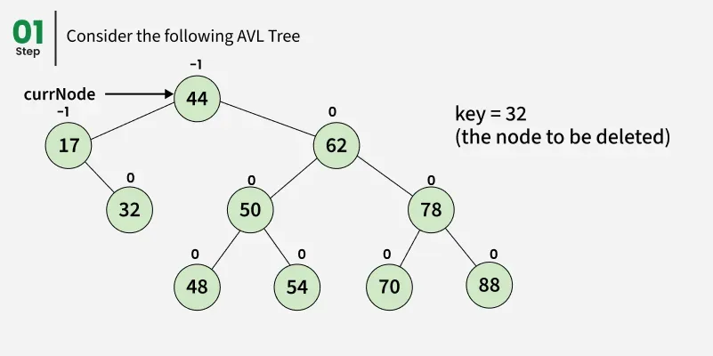
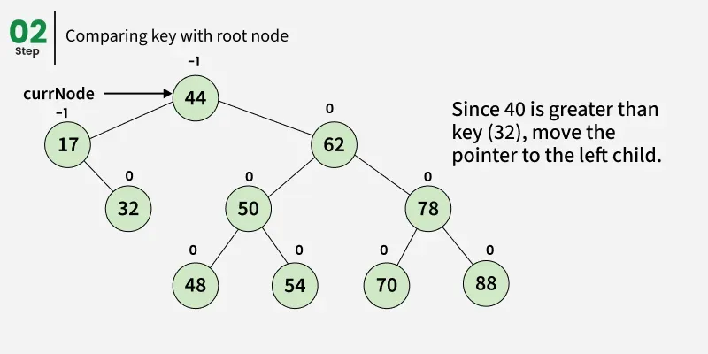
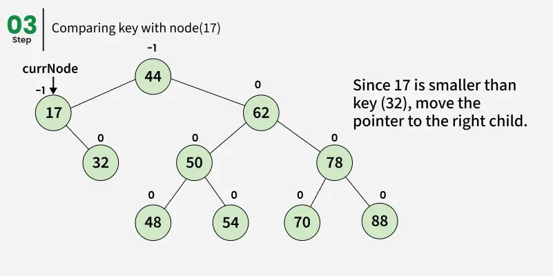
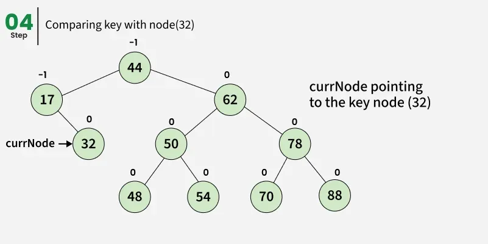
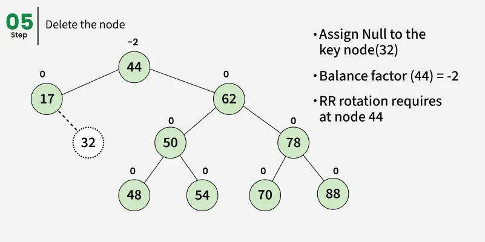
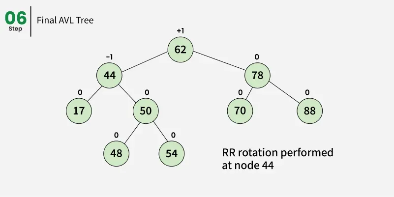

---

# Deletion in an AVL Tree

**Last Updated : 19 Jun, 2025**

We have already discussed **Insertion in an AVL Tree**. In this section, we follow a **similar approach for deletion**, with additional steps to ensure that the tree remains balanced after a node is removed.

An **AVL Tree** is a self-balancing **Binary Search Tree (BST)**, so after every deletion, we must restore both:

* **BST properties**
* **AVL balance property** (balance factor in range −1 to +1)

---

## Steps to Follow for Deletion in an AVL Tree

To make sure that the given tree remains an AVL Tree after every deletion, we must **augment the standard BST delete operation** with **re-balancing steps**.

The BST property must always be maintained:

```
keys(left) < key(root) < keys(right)
```

To rebalance the tree without violating BST rules, the following two basic operations are used:

* **Left Rotation**
* **Right Rotation**

---

---

## Example

Consider the following AVL Tree before deletion:

---

---

---

---

---

---

---

After deletion, the balance factors of ancestor nodes may change, which can cause the tree to become unbalanced. Rotations are then applied to restore balance.

---

## Key Idea Behind AVL Deletion

Deletion in AVL Trees is similar to deletion in a **Binary Search Tree**, but it is followed by:

* **Height updates**
* **Balance factor checks**
* **Rotations (if required)**

Just like insertion, deletion may propagate imbalance **upward toward the root**, requiring multiple rebalancing steps.

---

## Java Implementation: Deletion in AVL Tree

Below is the complete Java implementation that demonstrates **insertion, deletion, and rebalancing** in an AVL Tree.

```java
class Node {
    int key;
    Node left, right;
    int height;

    Node(int k) {
        key = k;
        left = right = null;
        height = 1;
    }
}

public class Main {

    // A utility function to get the height of the tree
    static int height(Node N) {
        if (N == null)
            return 0;
        return N.height;
    }

    // A utility function to right rotate subtree rooted with y
    static Node rightRotate(Node y) {
        Node x = y.left;
        Node T2 = x.right;

        // Perform rotation
        x.right = y;
        y.left = T2;

        // Update heights
        y.height = Math.max(height(y.left), height(y.right)) + 1;
        x.height = Math.max(height(x.left), height(x.right)) + 1;

        // Return new root
        return x;
    }

    // A utility function to left rotate subtree rooted with x
    static Node leftRotate(Node x) {
        Node y = x.right;
        Node T2 = y.left;

        // Perform rotation
        y.left = x;
        x.right = T2;

        // Update heights
        x.height = Math.max(height(x.left), height(x.right)) + 1;
        y.height = Math.max(height(y.left), height(y.right)) + 1;

        // Return new root
        return y;
    }

    // Get balance factor of node N
    static int getBalance(Node N) {
        if (N == null)
            return 0;
        return height(N.left) - height(N.right);
    }

    static Node insert(Node node, int key) {
        if (node == null)
            return new Node(key);

        if (key < node.key)
            node.left = insert(node.left, key);
        else if (key > node.key)
            node.right = insert(node.right, key);
        else
            return node;

        node.height = Math.max(height(node.left), height(node.right)) + 1;

        int balance = getBalance(node);

        if (balance > 1 && key < node.left.key)
            return rightRotate(node);

        if (balance < -1 && key > node.right.key)
            return leftRotate(node);

        if (balance > 1 && key > node.left.key) {
            node.left = leftRotate(node.left);
            return rightRotate(node);
        }

        if (balance < -1 && key < node.right.key) {
            node.right = rightRotate(node.right);
            return leftRotate(node);
        }

        return node;
    }

    // Find node with minimum key value
    static Node minValueNode(Node node) {
        Node current = node;
        while (current.left != null)
            current = current.left;
        return current;
    }

    // Recursive function to delete a node
    static Node deleteNode(Node root, int key) {

        // STEP 1: Perform standard BST delete
        if (root == null)
            return root;

        if (key < root.key)
            root.left = deleteNode(root.left, key);
        else if (key > root.key)
            root.right = deleteNode(root.right, key);
        else {

            // Node with one or no child
            if ((root.left == null) || (root.right == null)) {
                Node temp = (root.left != null) ? root.left : root.right;

                if (temp == null) {
                    temp = root;
                    root = null;
                } else
                    root = temp;
            } else {
                // Node with two children
                Node temp = minValueNode(root.right);
                root.key = temp.key;
                root.right = deleteNode(root.right, temp.key);
            }
        }

        if (root == null)
            return root;

        // STEP 2: Update height
        root.height = Math.max(height(root.left), height(root.right)) + 1;

        // STEP 3: Get balance factor
        int balance = getBalance(root);

        // Left Left Case
        if (balance > 1 && getBalance(root.left) >= 0)
            return rightRotate(root);

        // Left Right Case
        if (balance > 1 && getBalance(root.left) < 0) {
            root.left = leftRotate(root.left);
            return rightRotate(root);
        }

        // Right Right Case
        if (balance < -1 && getBalance(root.right) <= 0)
            return leftRotate(root);

        // Right Left Case
        if (balance < -1 && getBalance(root.right) > 0) {
            root.right = rightRotate(root.right);
            return leftRotate(root);
        }

        return root;
    }

    // Preorder traversal
    static void preOrder(Node root) {
        if (root != null) {
            System.out.print(root.key + " ");
            preOrder(root.left);
            preOrder(root.right);
        }
    }

    // Driver Code
    public static void main(String[] args) {
        Node root = null;

        root = insert(root, 9);
        root = insert(root, 5);
        root = insert(root, 10);
        root = insert(root, 0);
        root = insert(root, 6);
        root = insert(root, 11);
        root = insert(root, -1);
        root = insert(root, 1);
        root = insert(root, 2);

        System.out.println("Preorder traversal of the constructed AVL tree is:");
        preOrder(root);

        root = deleteNode(root, 10);

        System.out.println("\nPreorder traversal after deletion of 10:");
        preOrder(root);
    }
}
```

---

## Output

```
Preorder traversal of the constructed AVL tree is
9 1 0 -1 5 2 6 10 11

Preorder traversal after deletion of 10
1 0 -1 9 5 2 6 11
```

---

## Time and Space Complexity

* **Time Complexity:**
  Rotation operations take constant time. Height updates and balance checks also take constant time.
  Since the AVL tree height is **O(log n)**, deletion takes **O(log n)** time.

* **Auxiliary Space:**
  **O(log n)** due to the recursion call stack.

---

## Summary of Deletion in AVL Trees

* Deletion in AVL Trees is similar to deletion in a BST, but followed by **rebalancing operations**.
* After deleting a node, **balance factors of ancestor nodes may change**.
* If the balance factor goes outside the range **−1 to +1**, rotations (**LL, RR, LR, RL**) are required.
* The type of rotation depends on the **balance factor of the node and its children**.
* Due to strict balancing, the **time complexity remains O(log n)**.

---

