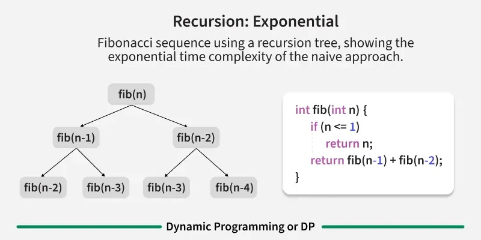
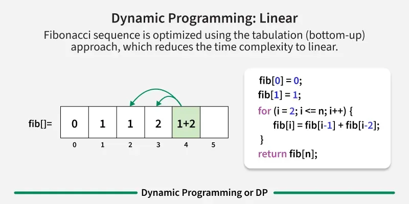
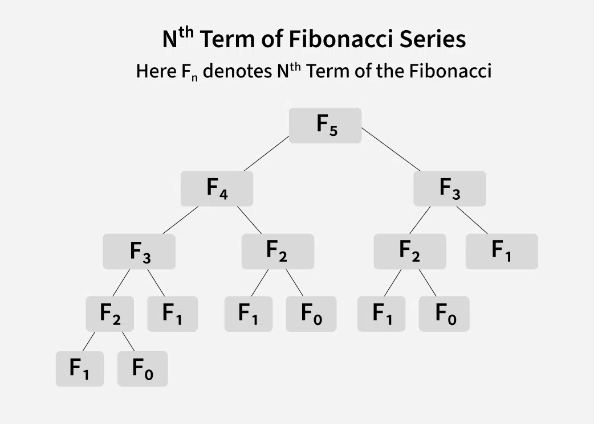
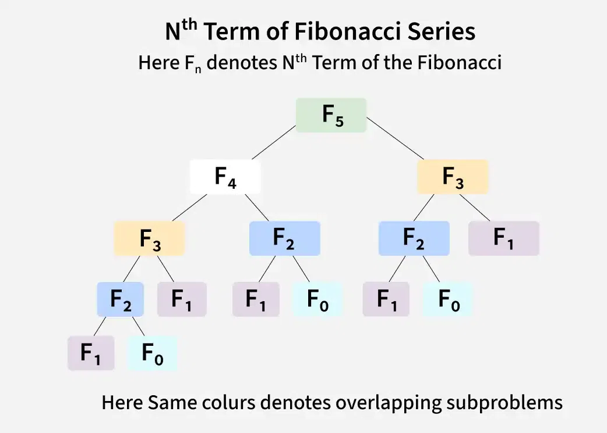
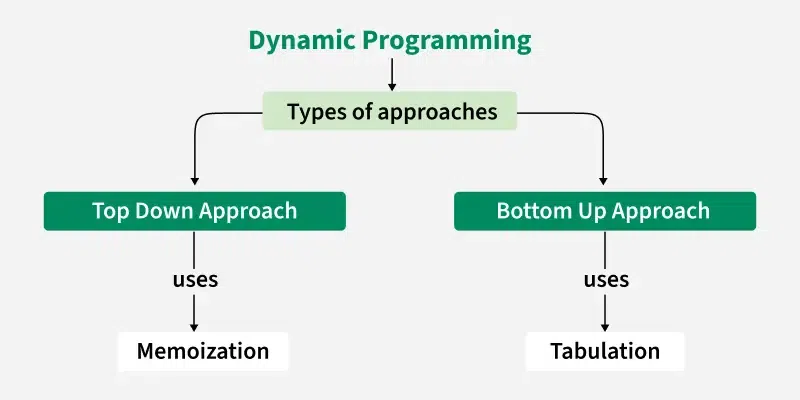

---

# Dynamic Programming (DP) – Introduction

**Last Updated:** 07 Aug, 2025

---

## 1. What is Dynamic Programming (DP)?

**Dynamic Programming (DP)** is a powerful algorithmic technique used to **optimize recursive solutions** when the same subproblems are solved repeatedly.

The **core idea** behind Dynamic Programming is simple:

> **Solve each subproblem only once and store its result for future use.**

DP improves performance by avoiding redundant computations that occur in naive recursive solutions.

Dynamic Programming is an algorithmic technique with the following properties.
1. It is mainly an optimization over plain recursion. Wherever we see a recursive solution that has repeated calls for the same inputs, we can optimize it using Dynamic Programming.
2. The idea is to simply store the results of subproblems so that we do not have to re-compute them when needed later. This simple optimization typically reduces time complexities from exponential to polynomial.
3. Some popular problems solved using Dynamic Programming are Fibonacci Numbers, Diff Utility (Longest Common Subsequence), Bellman–Ford Shortest Path, Floyd Warshall, Edit Distance and Matrix Chain Multiplication.

---

---

---

## 2. Why Do We Need Dynamic Programming?

Many recursive algorithms:

* Recompute the same values multiple times
* Have **exponential time complexity**
* Become impractical for large inputs

Dynamic Programming transforms such solutions into **efficient polynomial-time algorithms**.

---

## 3. Key Concepts of Dynamic Programming

To apply Dynamic Programming, a problem must satisfy **two properties**:

---

### 3.1 Optimal Substructure

A problem has **optimal substructure** if its optimal solution can be constructed from the optimal solutions of its subproblems.

#### Example: Minimum Cost Path in a Graph

To find the minimum cost path from a source to a destination:

* Find minimum paths from the source to intermediate nodes
* Find minimum paths from those nodes to the destination

The final solution is built from these smaller optimal solutions.

---

### 3.2 Overlapping Subproblems

A problem has **overlapping subproblems** if the same subproblem is solved multiple times in the recursion tree.

#### Example: Fibonacci Sequence

To compute `F(n)`:

* We compute `F(n-1)` and `F(n-2)`
* `F(n-2)` is computed multiple times

This redundancy causes inefficiency.

---

## 4. Approaches to Dynamic Programming

There are **two main DP approaches**:

---

### 4.1 Top-Down Approach (Memoization)

* Recursive approach
* Store results of subproblems in a table
* Before solving a subproblem, check if it already exists

**Steps:**

1. Write recursive solution
2. Add a memo table
3. Store results after computation

---

### 4.2 Bottom-Up Approach (Tabulation)

* Iterative approach
* Start from smallest subproblems
* Build the solution step by step
* Avoid recursion overhead

---

---

## 5. Example: Fibonacci Sequence

### Fibonacci Series

```
0, 1, 1, 2, 3, 5, 8, 13, 21, 34, ...
```

---

## 6. Brute Force Recursive Solution

### Java Code (Naive Recursion)

```java
class GfG {

    static int fib(int n) {
        if (n <= 1) {
            return n;
        }
        return fib(n - 1) + fib(n - 2);
    }

    public static void main(String[] args) {
        int n = 5;
        System.out.println(fib(n));
    }
}
```

**Output**

```
5
```
---

---

### Time Complexity

* Exponential
* **O(2ⁿ)**

This happens due to **overlapping subproblems** in the recursion tree.

---

## 7. How Dynamic Programming Works

---

---

Dynamic Programming follows these steps:

1. **Identify subproblems**
   Example: `F(n-1)` and `F(n-2)`

2. **Store solutions**
   Save results to avoid recomputation

3. **Build up solutions**
   Use stored values to compute larger problems

4. **Avoid recomputation**
   Each subproblem is solved only once

---

## 8. Fibonacci Using Memoization (Top-Down DP)

### Time: **O(n)**

### Space: **O(n)**

```java
import java.util.Arrays;

class GfG {

    static int fibRec(int n, int[] memo) {

        if (n <= 1) {
            return n;
        }

        if (memo[n] != -1) {
            return memo[n];
        }

        memo[n] = fibRec(n - 1, memo) + fibRec(n - 2, memo);
        return memo[n];
    }

    static int fib(int n) {
        int[] memo = new int[n + 1];
        Arrays.fill(memo, -1);
        return fibRec(n, memo);
    }

    public static void main(String[] args) {
        int n = 5;
        System.out.println(fib(n));
    }
}
```

**Output**

```
5
```

---

## 9. Fibonacci Using Tabulation (Bottom-Up DP)

### Time: **O(n)**

### Space: **O(n)**

```java
class GfG {

    static int fibo(int n) {
        int[] dp = new int[n + 1];

        dp[0] = 0;
        dp[1] = 1;

        for (int i = 2; i <= n; i++) {
            dp[i] = dp[i - 1] + dp[i - 2];
        }

        return dp[n];
    }

    public static void main(String[] args) {
        int n = 5;
        System.out.println(fibo(n));
    }
}
```

---

## 10. Space Optimized Fibonacci

### Time: **O(n)**

### Space: **O(1)**

```java
class GfG {

    static int fibo(int n) {
        int prevPrev = 0, prev = 1, curr = 1;

        for (int i = 2; i <= n; i++) {
            curr = prev + prevPrev;
            prevPrev = prev;
            prev = curr;
        }

        return curr;
    }

    public static void main(String[] args) {
        int n = 5;
        System.out.println(fibo(n));
    }
}
```

---

## 11. Tabulation vs Memoization

---

---

| Feature         | Tabulation            | Memoization              |
| --------------- | --------------------- | ------------------------ |
| Approach        | Bottom-Up             | Top-Down                 |
| Implementation  | Iterative             | Recursive                |
| Speed           | Faster (no recursion) | Slower (recursive calls) |
| Table Filling   | All entries filled    | Filled on demand         |
| Ease of Writing | Harder                | Easier                   |

---

## 12. Rod Cutting Problem

### Problem Statement

Given a rod of length `n` and `price[]`, determine the **maximum obtainable value** by cutting the rod.

---

### Example

**Input**

```
price = [1,5,8,9,10,17,17,20]
```

**Output**

```
22
```

---

## 13. Rod Cutting Using Memoization (Top-Down DP)

### Time: **O(n²)**

### Space: **O(n)**

```java
import java.util.*;

class GfG {

    static int cutRodRecur(int i, int[] price, int[] memo) {

        if (i == 0) return 0;

        if (memo[i - 1] != -1) return memo[i - 1];

        int ans = 0;

        for (int j = 1; j <= i; j++) {
            ans = Math.max(ans, price[j - 1] + cutRodRecur(i - j, price, memo));
        }

        return memo[i - 1] = ans;
    }

    static int cutRod(int[] price) {
        int n = price.length;
        int[] memo = new int[n];
        Arrays.fill(memo, -1);
        return cutRodRecur(n, price, memo);
    }

    public static void main(String[] args) {
        int[] price = {1,5,8,9,10,17,17,20};
        System.out.println(cutRod(price));
    }
}
```

---

## 14. Rod Cutting Using Tabulation (Bottom-Up DP)

```java
class GfG {

    static int cutRod(int[] price) {
        int n = price.length;
        int[] dp = new int[n + 1];

        for (int i = 1; i <= n; i++) {
            for (int j = 1; j <= i; j++) {
                dp[i] = Math.max(dp[i], price[j - 1] + dp[i - j]);
            }
        }

        return dp[n];
    }

    public static void main(String[] args) {
        int[] price = {1,5,8,9,10,17,17,20};
        System.out.println(cutRod(price));
    }
}
```

---

## 15. Common Algorithms That Use DP

* Fibonacci Sequence
* Longest Common Subsequence (LCS)
* Edit Distance
* Longest Increasing Subsequence
* Knapsack Problem
* Bellman–Ford Algorithm
* Floyd–Warshall Algorithm
* Matrix Chain Multiplication

---

## 16. Advantages of Dynamic Programming

* Avoids recomputation
* Reduces time complexity
* Guarantees optimal solution
* Scales well for large inputs

---

## 17. Applications of Dynamic Programming

* **Optimization Problems**
* **Graph Algorithms**
* **String Processing**
* **Operations Research**
* **Scheduling & Resource Allocation**

---

## 18. When to Use Dynamic Programming?

Use DP when:

* A recursive solution exists
* Recursion tree has overlapping subproblems
* Optimal substructure is present

---

## 19. Conclusion

Dynamic Programming is one of the **most important problem-solving techniques** in computer science. By identifying overlapping subproblems and storing results, DP converts inefficient recursive solutions into **efficient and scalable algorithms**.

Mastering DP is essential for:

* Competitive programming
* Technical interviews
* Real-world optimization problems

---

# Steps to Solve a Dynamic Programming Problem

Dynamic Programming (DP) is a powerful technique used to solve problems that involve **overlapping subproblems** and **optimal substructure**. Instead of solving the same subproblem repeatedly, DP stores results and reuses them, significantly improving efficiency.

This lesson explains the **systematic steps** to solve a Dynamic Programming problem, along with **clear examples and Java implementations**.

---

## Overview of Steps

To solve a Dynamic Programming problem, follow these steps:

1. **Identify if the problem is a Dynamic Programming problem**
2. **Decide a state expression with the least parameters**
3. **Formulate the state and transition relationship**
4. **Apply memoization (Top-Down) or tabulation (Bottom-Up)**

---

## Step 1: How to Classify a Problem as a Dynamic Programming Problem?

Typically, problems that involve:

* **Maximizing or minimizing** a value
* **Counting the number of ways or arrangements**
* **Probability-based calculations**

can often be solved using Dynamic Programming.

### Key Properties of DP Problems

1. **Overlapping Subproblems**
   The same subproblems are solved multiple times.
2. **Optimal Substructure**
   The optimal solution of a problem can be constructed from optimal solutions of its subproblems.

If both properties are present, the problem is a strong candidate for a DP solution.

---

## Step 2: Deciding the State

Dynamic Programming is all about **states** and **state transitions**. This is the most crucial step and must be done carefully.

### What Is a State?

A **state** is defined as a set of parameters that can uniquely identify a subproblem.
The number of parameters should be **as small as possible** to reduce the overall state space.

### Example: Knapsack Problem

In the classic **0/1 Knapsack problem**, we want to maximize profit under a weight constraint.

We define the state as:

```
dp[index][weight]
```

Meaning:

* `index` → items considered so far
* `weight` → remaining capacity of the bag

For example:

```
dp[3][10]
```

represents the **maximum profit using items 0 to 3 with a capacity of 10**.

Just like GPS coordinates need both latitude and longitude, DP states often require multiple parameters to uniquely identify a subproblem.

---

## Step 3: Formulating a Relation Among the States

This is the **hardest part** of solving a DP problem. It requires intuition, observation, and practice.

### Example Problem

Given numbers `{1, 3, 5}`, find the **total number of ways** to form a number `n` using these numbers.

* Repetitions are allowed
* Different arrangements are counted separately

#### Example: n = 6

Total ways = **8**

```
1 + 1 + 1 + 1 + 1 + 1
1 + 1 + 1 + 3
1 + 1 + 3 + 1
1 + 3 + 1 + 1
3 + 1 + 1 + 1
3 + 3
1 + 5
5 + 1
```

---

### Defining the State

We define:

```
state(n)
```

where `state(n)` represents the **number of arrangements to form n using {1, 3, 5}**.

---

### Deriving the Transition

To compute `state(7)`:

* Add `1` to all combinations of `state(6)`
* Add `3` to all combinations of `state(4)`
* Add `5` to all combinations of `state(2)`

Thus:

```
state(7) = state(6) + state(4) + state(2)
```

### General Relation

```
state(n) = state(n - 1) + state(n - 3) + state(n - 5)
```

---

### Naive Recursive Implementation (Exponential)

```java
// Java program to express
// n as sum of 1, 3, 5.

class GfG {

    // Returns the number of 
    // arrangements to form 'n' 
    static int countWays(int n) {

        // base case
        if (n < 0)
            return 0;
        if (n == 0)
            return 1;

        return countWays(n - 1)
             + countWays(n - 3)
             + countWays(n - 5);
    }

    public static void main(String[] args) {
        int n = 7;
        System.out.println(countWays(n));
    }
}
```

**Output**

```
12
```

**Time Complexity:** `O(3^n)`
**Auxiliary Space:** `O(n)` (recursion stack)

This solution is inefficient because it **recomputes the same states repeatedly**.

---

## Step 4: Adding Memoization or Tabulation

To eliminate redundant calculations, we store results of previously computed states.

---

## Using Top-Down DP (Memoization)

We store results in an array and reuse them whenever needed.

```java
// Java program to express
// n as sum of 1, 3, 5.

import java.util.Arrays;

class GfG {

    static int countRecur(int n, int[] memo) {

        // base case
        if (n < 0)
            return 0;
        if (n == 0)
            return 1;

        // If value is memoized
        if (memo[n] != -1) {
            return memo[n];
        }

        // Memoize the state
        memo[n] = countRecur(n - 1, memo)
                + countRecur(n - 3, memo)
                + countRecur(n - 5, memo);

        return memo[n];
    }

    static int countWays(int n) {
        int[] memo = new int[n + 1];
        Arrays.fill(memo, -1);
        return countRecur(n, memo);
    }

    public static void main(String[] args) {
        int n = 7;
        System.out.println(countWays(n));
    }
}
```

**Output**

```
12
```

**Time Complexity:** `O(n)`
**Auxiliary Space:** `O(n + n)` (memo array + recursion stack)

---

## Using Bottom-Up DP (Tabulation)

We build the solution iteratively from smaller values to `n`.

```java
// Java program to express
// n as sum of 1, 3, 5.

class GfG {

    static int countWays(int n) {
        int[] dp = new int[n + 1];
        dp[0] = 1;

        for (int i = 1; i <= n; i++) {
            dp[i] = 0;

            if (i - 1 >= 0) dp[i] += dp[i - 1];
            if (i - 3 >= 0) dp[i] += dp[i - 3];
            if (i - 5 >= 0) dp[i] += dp[i - 5];
        }

        return dp[n];
    }

    public static void main(String[] args) {
        int n = 7;
        System.out.println(countWays(n));
    }
}
```

**Output**

```
12
```

**Time Complexity:** `O(n)`
**Auxiliary Space:** `O(n)`

---

## Memoization vs Tabulation

* **Memoization (Top-Down):** Recursive, easier to write, uses call stack
* **Tabulation (Bottom-Up):** Iterative, faster in practice, no recursion overhead

---

## Practice Problems

To master Dynamic Programming, practice is essential. Start with these classic problems:

| S. No. | Problem            |
| ------ | ------------------ |
| 1      | Min Cost Path      |
| 2      | Subset Sum Problem |
| 3      | Coin Change        |
| 4      | Edit Distance      |
| 5      | Cutting a Rod      |

---

### Final Note

Dynamic Programming becomes intuitive only through **consistent practice**. Always follow the steps:
**identify → define state → derive relation → optimize with DP**.

---
Below are **clear, structured lesson notes** written using **all the provided information**, suitable for exams, lectures, or self-study.

---

# Difference Between Recursion and Dynamic Programming

Recursion and Dynamic Programming (DP) are two powerful techniques used to solve complex problems by breaking them into smaller, more manageable subproblems. Although they share this common idea, they differ significantly in terms of **approach, performance, and memory usage**.

This lesson explains the **key differences**, supported by a **comparative table**, **code examples**, and **real-world applications**.

---

## 1. What Is Recursion?

Recursion is a technique where a **function calls itself** to solve smaller instances of the same problem until a **base case** (termination condition) is reached.

* Each recursive call adds a new frame to the **call stack**
* Problems may be recomputed multiple times
* Simple and intuitive, but often inefficient for large inputs

---

## 2. What Is Dynamic Programming?

Dynamic Programming is an optimization technique that:

* Breaks a problem into **overlapping subproblems**
* **Stores the results** of subproblems
* Reuses stored results to avoid repeated calculations

Dynamic Programming improves performance by using:

* **Memoization (Top-Down)**
* **Tabulation (Bottom-Up)**

---

## 3. Difference Between Recursion and Dynamic Programming (Tabular Form)

| Feature          | Recursion                                                                                                                      | Dynamic Programming                                                                                                |
| ---------------- | ------------------------------------------------------------------------------------------------------------------------------ | ------------------------------------------------------------------------------------------------------------------ |
| **Definition**   | A function calls itself to solve a problem by breaking it into smaller instances of the same problem until a condition is met. | A technique that breaks problems into smaller subproblems and stores their results to avoid repeated calculations. |
| **Approach**     | Usually follows a **top-down** approach.                                                                                       | Commonly follows a **bottom-up** approach.                                                                         |
| **Base Case**    | A base case is mandatory to stop infinite recursion.                                                                           | Also requires a base case, but focuses more on iterative state building.                                           |
| **Performance**  | Often slower due to repeated computations and function call overhead.                                                          | Faster because each subproblem is solved only once.                                                                |
| **Memory Usage** | Requires only stack space for recursive calls.                                                                                 | Requires additional memory to store intermediate results.                                                          |
| **Examples**     | Factorial calculation, Fibonacci sequence.                                                                                     | Fibonacci using bottom-up DP, Knapsack problem.                                                                    |

---

## 4. Example: Finding the Nth Fibonacci Number

### 1️⃣ Using Recursion

The recursive Fibonacci function directly follows the mathematical definition.

```java
public class GFG {
    // Recursive function to calculate the nth Fibonacci number
    public static int fibonacciRecursive(int n) {
        if (n <= 1) {
            // Base case: Fibonacci of 0 is 0, and Fibonacci of 1 is 1
            return n;
        } else {
            // Recursively calculate Fibonacci for n-1 and n-2
            return fibonacciRecursive(n - 1) + fibonacciRecursive(n - 2);
        }
    }

    public static void main(String[] args) {
        int n = 5;
        int result = fibonacciRecursive(n);

        System.out.println(result);
    }
}
```

**Output**

```
5
```

**Time Complexity:**
`O(2ⁿ)` — highly inefficient due to repeated calculations

**Auxiliary Space:**
High, due to recursive call stack usage
May cause **stack overflow** for large `n`

---

### 2️⃣ Using Dynamic Programming

Dynamic Programming avoids repeated calculations by storing previously computed Fibonacci numbers.

```java
import java.util.Arrays;

public class FibonacciDP {

    static int fibonacciDP(int n) {
        int[] fib = new int[n + 1];
        fib[1] = 1;

        for (int i = 2; i <= n; ++i) {
            fib[i] = fib[i - 1] + fib[i - 2];
        }

        return fib[n];
    }

    public static void main(String[] args) {
        System.out.println(fibonacciDP(5));
    }
}
```

**Output**

```
5
```

**Time Complexity:**
`O(n)` — a major improvement over recursion

**Auxiliary Space:**
`O(n)` — used to store intermediate Fibonacci values

---

## 5. Applications of Recursion

* Finding the Fibonacci sequence
* Computing the factorial of a number
* Binary tree traversals:

    * In-order
    * Pre-order
    * Post-order

---

## 6. Applications of Dynamic Programming

* Efficient computation of Fibonacci numbers
* Finding the **longest subsequence**
* Solving optimization problems like:

    * Knapsack problem
    * Shortest paths in graphs (e.g., Dijkstra’s algorithm)

---

## 7. Conclusion

Recursion and Dynamic Programming both rely on breaking problems into smaller parts, but they differ in how efficiently they solve them.

* **Recursion** is simpler and more intuitive but can be inefficient due to repeated calculations.
* **Dynamic Programming** focuses on optimization by storing and reusing results, making it more suitable for large and complex problems.

👉 The **choice between recursion and dynamic programming** depends on:

* Problem size
* Performance requirements
* Memory constraints

Understanding both techniques is essential for mastering algorithm design.

---
