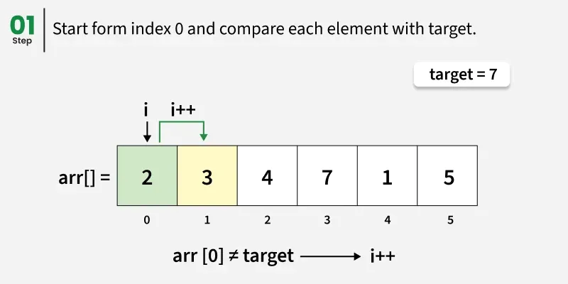
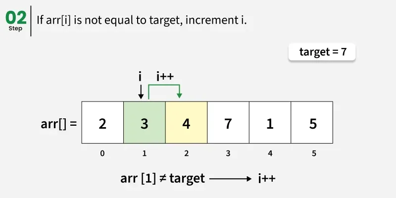
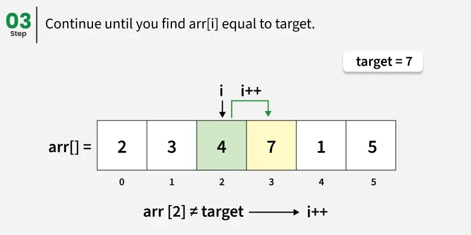
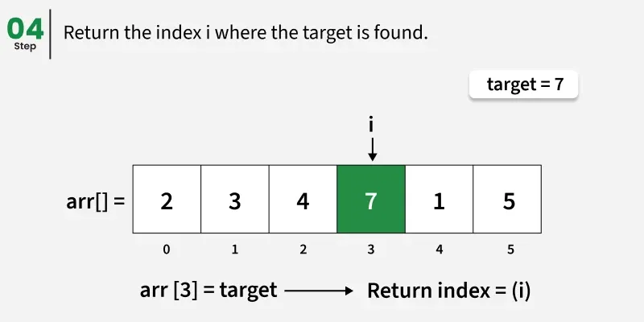
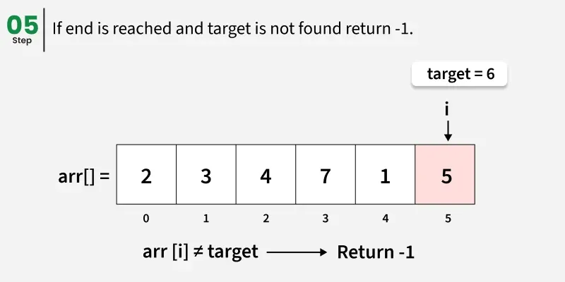
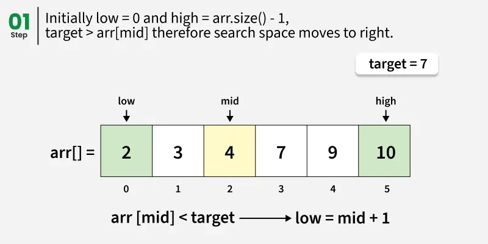
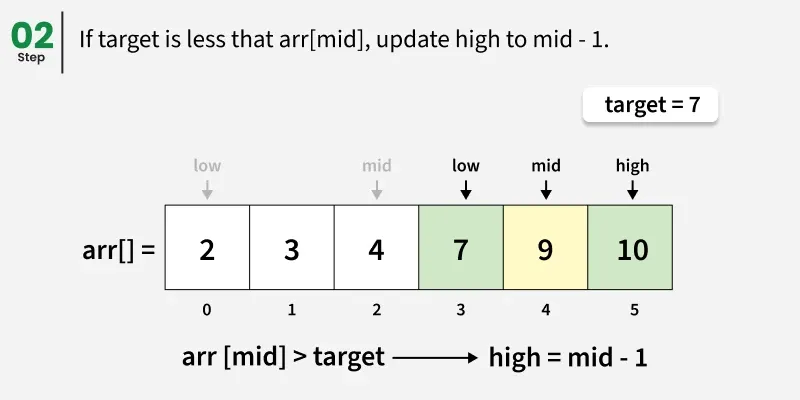
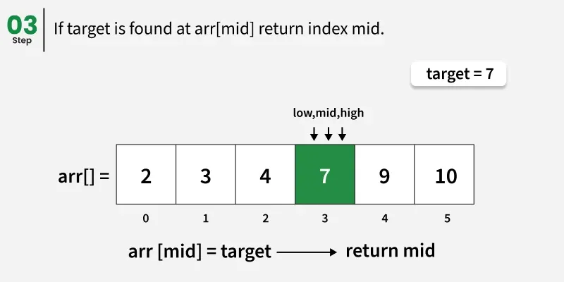
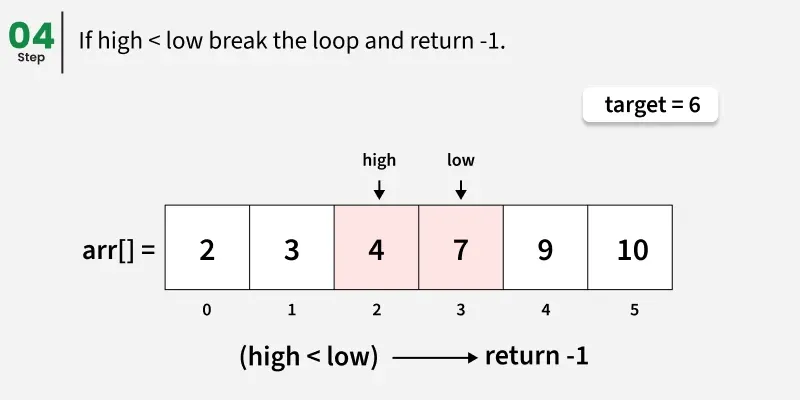

---

# Linear Search vs Binary Search

**Last Updated:** 02 Jul, 2025

---

## Prerequisites

Before studying searching techniques, learners should be familiar with:

* Linear Search
* Binary Search

---

## Overview

Searching algorithms are used to locate a specific element (called the *target*) within a collection of data. Two of the most commonly used searching techniques are **Linear Search** and **Binary Search**. Although both are used to find elements, they differ significantly in terms of performance, requirements, and working principles.

---

## Key Differences Between Linear Search and Binary Search

| Feature          | Linear Search                                | Binary Search                              |
| ---------------- | -------------------------------------------- | ------------------------------------------ |
| Data Order       | Input data **need not be sorted**            | Input data **must be sorted**              |
| Alternative Name | Sequential Search                            | Half-Interval Search                       |
| Time Complexity  | O(n)                                         | O(log n)                                   |
| Type of Array    | Can be used with **multidimensional arrays** | Works only with **one-dimensional arrays** |
| Comparisons      | Performs **equality comparisons**            | Performs **ordering comparisons**          |
| Complexity       | Simple to understand and implement           | More complex to implement                  |
| Speed            | Relatively slow                              | Very fast                                  |
| Search Approach  | Checks elements one by one                   | Divides the search space into halves       |

---

## Linear Search

### Definition

Linear Search is the simplest searching technique. It works by sequentially checking each element in the array until the target element is found or the entire array has been traversed.

---

### Working of Linear Search

* Start searching from the **first element** of the array.
* Compare each element with the target value.
* If a match is found, return the **index** of that element.
* If the end of the array is reached and the element is not found, return **-1**.

---

### Working:

---

---

---

---

---

---

### Java Implementation of Linear Search

```java
public class GFG {

    public static int search(int[] arr, int target) {
        int n = arr.length;

        // Traverse the array sequentially
        for (int i = 0; i < n; i++) {
            if (arr[i] == target) {
                return i;
            }
        }
        // Target not found
        return -1;
    }

    public static void main(String[] args) {
        int[] arr = {2, 3, 4, 7, 1, 5};
        int target = 7;

        int index = search(arr, target);
        System.out.println(index);
    }
}
```

---

### Output

```
3
```

---

### Time and Space Complexity (Linear Search)

* **Time Complexity:** O(n)

    * In the worst case, the target element is not present, so the entire array must be scanned.
* **Auxiliary Space:** O(1)

    * Only a constant amount of extra space is used.

---

## Binary Search

### Definition

Binary Search is an efficient searching algorithm that works on **sorted data**. It repeatedly divides the search interval into two halves, significantly reducing the number of comparisons required.

---

### Working of Binary Search

* Initialize two pointers: **low** (start index) and **high** (end index).
* Find the **middle element** of the array.
* Compare the middle element with the target:

    * If equal, return the index.
    * If the target is greater, search the right half.
    * If the target is smaller, search the left half.
* Repeat until the element is found or the search space becomes empty.

---

### Working:
---

---

---

---

---
### Java Implementation of Binary Search

```java
public class GFG {

    // Iterative Binary Search
    public static int binarySearch(int[] arr, int target, int low, int high) {
        while (low <= high) {
            int mid = low + (high - low) / 2;

            if (arr[mid] == target) {
                return mid;
            }

            if (arr[mid] < target) {
                low = mid + 1;
            } else {
                high = mid - 1;
            }
        }
        // Target not found
        return -1;
    }

    public static void main(String[] args) {
        int[] arr = {2, 3, 4, 7, 9, 10};
        int target = 7;

        int index = binarySearch(arr, target, 0, arr.length - 1);
        System.out.println(index);
    }
}
```

---

### Output

```
3
```

---

### Time and Space Complexity (Binary Search)

* **Time Complexity:** O(log n)

    * The array is divided into half at each step, reducing the search space exponentially.
* **Auxiliary Space:** O(1)

    * Only constant space is required for index variables.

---

## Summary

* **Linear Search** is simple and works on unsorted data but is inefficient for large datasets.
* **Binary Search** is much faster but requires the data to be sorted beforehand.
* Choosing the right search algorithm depends on **data size**, **data order**, and **performance requirements**.

---

