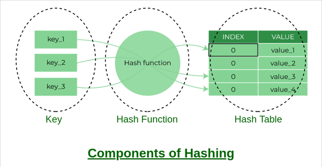
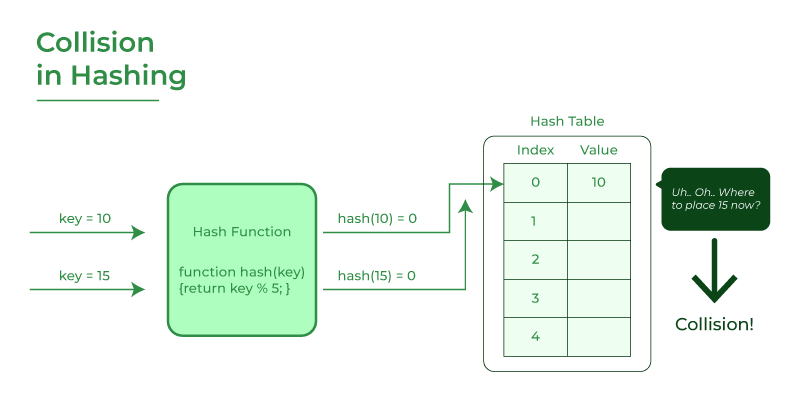
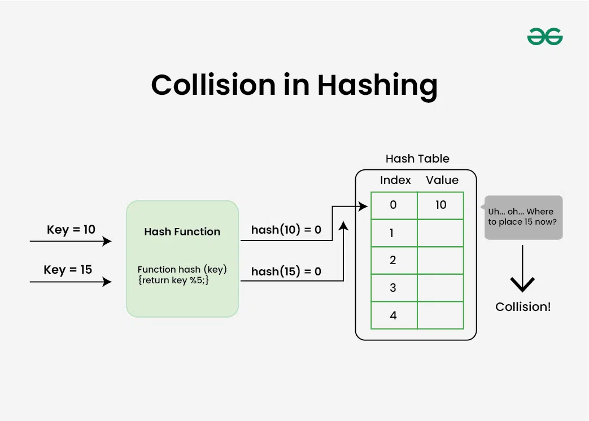
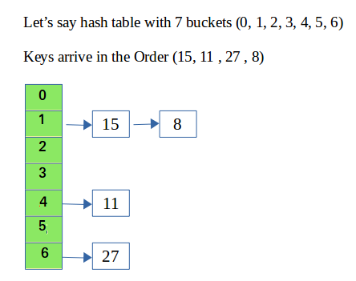

---

# Hash Table Data Structure

**Last Updated:** 23 Jul, 2025

---

## What is a Hash Table?

>A **hash table** is a data structure that stores data in the form of **key–value pairs** and allows fast **insertion, searching, and deletion** operations. It works on the principle of **hashing**, where a key is processed by a **hash function** to produce an index in an array. This index determines where the corresponding value is stored.
>In simple terms, a hash table **maps keys to values** using a mathematical function, enabling efficient data retrieval.

---

### What is Hashing?

---

>Hashing refers to the process of generating a fixed-size output from an input of variable size using the mathematical formulas known as hash functions. 
>This technique determines an index or location for the storage of an item in a data structure.

---

---
## Need for Hash data structure

The amount of data on the internet is growing exponentially every day, making it difficult to store it all effectively. In day-to-day programming, this amount of data might not be that big, but still, it needs to be stored, accessed, and processed easily and efficiently. A very common data structure that is used for such a purpose is the Array data structure.

Now the question arises if Array was already there, what was the need for a new data structure! The answer to this is in the word “efficiency“. Though storing in Array takes O(1) time, searching in it takes at least O(log n) time. This time appears to be small, but for a large data set, it can cause a lot of problems and this, in turn, makes the Array data structure inefficient.

So now we are looking for a data structure that can store the data and search in it in constant time, i.e. in O(1) time. This is how Hashing data structure came into play. With the introduction of the Hash data structure, it is now possible to easily store data in constant time and retrieve them in constant time as well.

---

## Components of Hashing

There are majorly three components of hashing:
1. *Key:* A Key can be anything string or integer which is fed as input in the hash function the technique that determines an index or location for storage of an item in a data structure.
2. *Hash Function:* The hash function receives the input key and returns the index of an element in an array called a hash table. The index is known as the hash index.
3. *Hash Table:* Hash table is a data structure that maps keys to values using a special function called a hash function. Hash stores the data in an associative manner in an array where each data value has its own unique index.

---

---
## What is the Load Factor?

The **load factor** of a hash table indicates how full the table is. It is defined as:

>Load Factor = Total elements in hash table/ Size of hash table

* A **high load factor** increases the chance of collisions and slows down search operations.
* A **low load factor** uses more memory but provides faster access.
* Maintaining an **optimal load factor** using a good hash function and **dynamic resizing** ensures efficient performance.

---

## What is a Hash Function?

>A **hash function** is a function that converts a key into an array index. A well-designed hash function distributes keys evenly across the table, minimizing collisions and improving lookup speed.

---

### Integer Universe Assumption

Under this assumption, keys are considered integers within a fixed range. This allows the use of simple hashing techniques such as **division hashing** and **multiplication hashing**.

---

### What is Collision?

The hashing process generates a small number for a big key, so there is a possibility that two keys could produce the same value. The situation where the newly inserted key maps to an already occupied, and it must be handled using some collision handling technology.

---

---

## Advantages of Hashing in Data Structures

1. *Key-value support:* Hashing is ideal for implementing key-value data structures. 
2. *Fast data retrieval:* Hashing allows for quick access to elements with constant-time complexity. 
3. *Efficiency:* Insertion, deletion, and searching operations are highly efficient. 
4. *Memory usage reduction:* Hashing requires less memory as it allocates a fixed space for storing elements. 
5. *Scalability:* Hashing performs well with large data sets, maintaining constant access time. 
6. *Security and encryption:* Hashing is essential for secure data storage and integrity verification.


### Hashing Techniques

#### Hashing by Division

This technique computes the index as the remainder obtained when the key is divided by the table size.

>Formula:
>Index = key % table_size

### Explanation

* `key` → the value to be stored
* `table_size` → the size (number of buckets) of the hash table
* `%` (modulus operator) → gives the remainder after division

The result is always in the range:

```
0 ≤ Index < table_size
```

---

## 📌 Example

If:

```
key = 27
table_size = 7
```

Then:

```
Index = 27 % 7 = 6
```

So the element is stored at **index 6** of the hash table.

---

## Why modulus (%) is used

* Ensures the index stays within table bounds
* Simple and fast to compute
* Works well when `table_size` is a prime number

---

## ⚠️ Common Mistakes

| Mistake            | Why it’s wrong                      |                         |                             |
| ------------------ | ----------------------------------- | ----------------------- | --------------------------- |
| `key               | table_size`                         | Bitwise OR, not hashing |                             |
| `                  | key                                 | % table_size`           | Absolute value not required |
| `key / table_size` | Produces large or fractional values |                         |                             |

---

## Why table size should often be prime?

>A hash table’s **table size is often chosen as a prime number** because it helps **distribute keys more uniformly** and **reduces collisions**, especially when using the **division (modulo) hashing method**.

---

## 1. Better Key Distribution (Division Method)

When hashing by division:

```
Index = key % table_size
```

If `table_size` is **not prime**, especially if it has small factors (like 2, 4, 5, 10), many keys can map to the **same indices**.

### Example (Non-prime table size)

```
table_size = 10
keys = 20, 30, 40, 50
```

```
20 % 10 = 0
30 % 10 = 0
40 % 10 = 0
50 % 10 = 0
```

➡️ Heavy collisions at index 0.

---

## 2. Avoids Patterns in the Keys

In real applications, keys often follow patterns:

* Sequential numbers (IDs)
* Multiples of a constant
* Timestamps
* Phone numbers or roll numbers

If `table_size` shares common factors with these patterns, collisions increase.

### Example (Prime table size)

```
table_size = 11
keys = 20, 30, 40, 50
```

```
20 % 11 = 9
30 % 11 = 8
40 % 11 = 7
50 % 11 = 6
```

➡️ Keys spread across different indices.

---

## 3. Reduces Clustering

A non-prime table size can cause **primary clustering**, where many keys accumulate in the same region of the table.

Prime table sizes help:

* Break arithmetic regularities
* Scatter keys more evenly
* Improve average lookup time

---

## 4. Works Well with Other Hashing Techniques

Prime sizes are especially important when using:

* **Double hashing**
* **Quadratic probing**

For example, in double hashing:

```
h(key, i) = (h1(key) + i * h2(key)) % table_size
```

If `table_size` is prime, the probe sequence is more likely to cover **all table slots**, avoiding infinite loops.

---

## 5. Performance Impact

| Table Size | Effect                                 |
| ---------- | -------------------------------------- |
| Prime      | Uniform distribution, fewer collisions |
| Composite  | Higher collision probability           |
| Power of 2 | Bit patterns may cause clustering      |

This directly affects:

* Insert time
* Search time
* Delete time

---

## ✅ Summary

**Table size should often be prime because:**

1. It improves key distribution
2. It reduces collisions
3. It avoids common key patterns
4. It enhances probing techniques
5. It improves overall hash table performance

---

### Key Rule to Remember

> When using the division method of hashing, **choose a table size that is prime and not close to a power of 2**.


## When are primes *not* necessary?

Prime table sizes are **very helpful**, but they are **not always necessary**. There are several situations where using a **non-prime table size** is perfectly safe—and sometimes even **preferred**.

---

## 1. When Using Multiplication Hashing

In the **multiplication method**, the hash index is computed as:

```
Index = ⌊ m × (key × A mod 1) ⌋
```

where:

* `m` = table size
* `A` = constant (commonly `(√5 − 1) / 2`)

### Why primes are not needed

* The table size is **not used as a divisor**
* Distribution depends on `A`, not on factors of `m`

### Common practice

* Table sizes like `2^k` (16, 32, 64, 128) work well
* Used widely in real systems

➡️ **Prime size is unnecessary here**

---

## 2. When Table Size Is a Power of Two with Bit-Mixing

Many modern hash tables use **bit manipulation** instead of modulo:

```
Index = hash(key) & (table_size − 1)
```

This requires:

* `table_size` to be a **power of two**
* A **well-designed hash function** that mixes bits thoroughly

### Why primes are not needed

* The modulo operation is replaced by bit masking
* Speed is significantly faster than `%`

### Used in practice by

* Java `HashMap`
* Python dictionaries
* C++ unordered_map (implementation dependent)

➡️ **Prime sizes would actually be inefficient here**

---

## 3. When Using High-Quality Hash Functions

If the hash function already produces:

* Uniform distribution
* Low correlation between input keys

Then the table size has **much less impact**.

### Examples

* Cryptographic hashes (SHA-256 truncated)
* MurmurHash
* CityHash
* xxHash

➡️ These hashes randomize input so well that **prime sizes give little benefit**

---

## 4. When Using Chaining (Linked Lists / Trees)

In **separate chaining**, collisions are handled by storing multiple elements in a bucket.

### Why primes are less important

* Collisions do not break the table
* Performance depends more on **load factor**

As long as:

```
load factor α = n / m
```

is kept small, performance remains good.

➡️ Prime sizes help, but are **not critical**

---

## 5. When Resizing Frequently

Dynamic hash tables resize (rehash) automatically when load factor exceeds a threshold.

### Why primes may be skipped

* Rehashing dominates cost, not table size
* Using powers of two simplifies resizing logic
* Faster memory allocation

➡️ Engineering simplicity > mathematical purity

---

## 6. When Keys Are Already Well Distributed

If keys are:

* Random numbers
* UUIDs
* Hashes of other data

Then even composite table sizes distribute keys evenly.

➡️ Prime sizes give **little to no advantage**

---

## ✅ Summary Table

| Scenario              | Prime Needed? | Reason                       |
| --------------------- | ------------- | ---------------------------- |
| Multiplication method | ❌ No          | No modulo division           |
| Power-of-two tables   | ❌ No          | Bit masking used             |
| Strong hash functions | ❌ No          | Distribution already uniform |
| Separate chaining     | ❌ Optional    | Load factor matters more     |
| Frequent resizing     | ❌ No          | Simpler and faster           |
| Weak modulo hashing   | ✅ Yes         | Prevents clustering          |

---

## ⭐ Final Rule of Thumb

> **Use prime table sizes when using simple modulo hashing with weak hash functions.
> Skip primes when using modern hashing techniques or power-of-two optimizations.**
---

## Hashing by Multiplication

>Hashing by multiplication is a hashing technique used to map a key to an index in a hash table. Unlike the **division method**, this approach **does not rely on prime table sizes** and often provides better key distribution.

In this method:

1. The key is multiplied by a constant value between 0 and 1.
2. The fractional part of the result is extracted.
3. The index is obtained by multiplying this fraction with the table size.

This method is effective when keys are well distributed.
Below is a **clear, structured explanation—similar in depth and style**—but focused specifically on **Hashing by Multiplication**, including **when primes are *not* necessary** and why this method is often preferred in practice.

---

## 1. Basic Formula (Multiplication Method)

The hash index is computed using the formula:

```
Index = ⌊ m × ((key × A) mod 1) ⌋
```

where:

* `key` = value to be hashed
* `m` = size of the hash table
* `A` = constant such that `0 < A < 1`
* `mod 1` extracts the fractional part
* `⌊ ⌋` denotes the floor function

---

## 2. Choice of Constant A

A well-known and widely used choice is:

```
A = (√5 − 1) / 2 ≈ 0.6180339887
```

### Why this works well

* It is an **irrational number**
* Helps spread keys uniformly
* Minimizes clustering

This constant is recommended by **Donald Knuth**.

---

## 3. Why Prime Table Sizes Are *Not* Required

### Key Reason

> The multiplication method **does not use division by the table size**.

Because:

* The table size `m` is only used for **scaling**, not modulo division
* There is no risk of keys aligning with factors of `m`

➡️ **Prime numbers provide no special advantage**

---

## 4. Ideal Table Sizes for Multiplication Hashing

### Power of Two Sizes

The multiplication method works **extremely well** when:

```
m = 2^k
```

Examples:

* 16
* 32
* 64
* 128
* 1024

### Optimized Computation

If `m = 2^k`, the index can be computed efficiently using bit operations:

```
Index = (key × A) >> (word_size − k)
```

➡️ Faster than modulo division

---

## 5. When Multiplication Hashing Is Better Than Division Hashing

| Aspect                  | Division Method | Multiplication Method |
| ----------------------- | --------------- | --------------------- |
| Table size              | Should be prime | Any size works        |
| Speed                   | Slower (modulo) | Faster                |
| Clustering risk         | Higher          | Lower                 |
| Sensitivity to patterns | High            | Low                   |

---

## 6. Example

Let:

* `key = 50`
* `m = 16`
* `A = 0.6180339887`

Steps:

```
key × A = 30.901699435
Fractional part = 0.901699435
Index = ⌊16 × 0.901699435⌋
Index = ⌊14.427⌋ = 14
```

The key maps to index **14**.

---

## 7. When Prime Sizes Are Completely Unnecessary

Prime numbers are **not needed** when:

* Using multiplication hashing
* Using power-of-two table sizes
* Keys have patterns (e.g., multiples, sequential integers)
* High-performance systems are required

➡️ This is why modern hash tables avoid prime sizes

---

## 8. Limitations of Multiplication Hashing

* Requires floating-point or fixed-point arithmetic
* Slightly more complex to understand
* Poor choice of `A` can reduce quality

---

## 9. Practical Usage

Multiplication hashing is used in:

* Language runtimes
* Compiler symbol tables
* High-performance in-memory data structures

Many systems combine:

* Multiplication hashing
* Power-of-two table sizes
* Open addressing or chaining

---

## ✅ Summary

| Feature                      | Multiplication Hashing |
| ---------------------------- | ---------------------- |
| Uses prime table size        | ❌ No                   |
| Depends on modulo            | ❌ No                   |
| Supports power-of-two tables | ✅ Yes                  |
| Collision resistance         | High                   |
| Performance                  | Fast                   |

---

## ⭐ Final Takeaway

> **Hashing by multiplication removes the need for prime table sizes and provides strong key distribution even with power-of-two tables—making it ideal for modern, high-performance hash tables.**
---
Below is a **clear tabular comparison of Division Hashing and Multiplication Hashing**, with **worked examples for each method**. This format is **exam-friendly and easy to revise**.

---

## Comparison of Division Hashing and Multiplication Hashing

| **Comparison Feature**              | **Division Hashing**                                                                      | **Multiplication Hashing**                                                                   |
| ----------------------------------- | ----------------------------------------------------------------------------------------- | -------------------------------------------------------------------------------------------- |
| **Definition**                      | Computes the hash index by taking the remainder when the key is divided by the table size | Computes the hash index by multiplying the key with a constant and using the fractional part |
| **Formula**                         | `Index = key % m`                                                                         | `Index = ⌊ m × ((key × A) mod 1) ⌋`                                                          |
| **Table size requirement**          | Table size `m` should preferably be a **prime number**                                    | Table size `m` **need not be prime**                                                         |
| **Sensitivity to key patterns**     | Highly sensitive to patterns in keys                                                      | Less sensitive to key patterns                                                               |
| **Collision chances**               | Higher if poor table size is chosen                                                       | Lower due to uniform distribution                                                            |
| **Performance**                     | Fast but modulo operation can be costly                                                   | Very fast and efficient                                                                      |
| **Ease of implementation**          | Very simple to implement                                                                  | Slightly more complex                                                                        |
| **Use with power of 2 table sizes** | Not recommended                                                                           | Highly suitable                                                                              |
| **Common usage**                    | Simple hash tables, small datasets                                                        | High-performance hash tables                                                                 |

---

## Example of Division Hashing

**Given:**

```
Key = 27
Table size (m) = 7
```

**Hash function:**

```
Index = key % m
Index = 27 % 7
Index = 6
```

**Result:**

* The key `27` is stored at **index 6**.

---

### Division Hashing – Poor Choice Example

**Given:**

```
Keys = 10, 20, 30, 40
Table size (m) = 10
```

**Hash results:**

```
10 % 10 = 0
20 % 10 = 0
30 % 10 = 0
40 % 10 = 0
```

**Observation:**

* All keys map to the **same index**, causing heavy collisions.

---

## Example of Multiplication Hashing

**Given:**

```
Key = 50
Table size (m) = 16
A = 0.618
```

**Steps:**

```
key × A = 50 × 0.618 = 30.9
Fractional part = 0.9
Index = ⌊16 × 0.9⌋ = 14
```

**Result:**

* The key `50` is stored at **index 14**.

---

### Multiplication Hashing – Pattern Resistance Example

**Given:**

```
Keys = 10, 20, 30, 40
m = 16
A = 0.618
```

**Computed indices (approx):**

```
10 → 3
20 → 7
30 → 11
40 → 14
```

**Observation:**

* Keys are spread evenly across the table
* Minimal collisions

---

## Summary Table (Quick Revision)

| Feature               | Division Hashing    | Multiplication Hashing       |
| --------------------- | ------------------- | ---------------------------- |
| Formula               | `key % m`           | `⌊m × frac(key × A)⌋`        |
| Prime table size      | Required            | Not required                 |
| Handles patterns well | ❌ No                | ✅ Yes                        |
| Collisions            | More likely         | Less likely                  |
| Best use case         | Simple applications | Performance-critical systems |

---

### ✅ Final Note

> **Division hashing is simple but sensitive to table size, while multiplication hashing provides better key distribution and works well with modern systems.**

---
Below are **clean, complete Java implementations** for **both Division Hashing and Multiplication Hashing**, written in a **simple, exam-friendly style**.
Each example includes **insertion, collision handling (linear probing)**, and **output**.

---

## 1. Java Implementation of Division Hashing

### Concept Recap

Division hashing computes the index using:

```
index = key % tableSize
```

A **prime table size** is preferred to reduce collisions.

---

### Java Code: Division Hashing with Linear Probing

```java
import java.util.Arrays;

public class DivisionHashing {

    static int[] table;
    static int tableSize;

    // Constructor
    DivisionHashing(int size) {
        tableSize = size;
        table = new int[tableSize];
        Arrays.fill(table, -1);
    }

    // Division hash function
    static int hash(int key) {
        return key % tableSize;
    }

    // Insert using linear probing
    static void insert(int key) {
        int index = hash(key);

        // Resolve collision using linear probing
        while (table[index] != -1) {
            index = (index + 1) % tableSize;
        }
        table[index] = key;
    }

    // Display hash table
    static void display() {
        for (int i = 0; i < tableSize; i++) {
            System.out.println("Index " + i + " : " + table[i]);
        }
    }

    public static void main(String[] args) {
        DivisionHashing ht = new DivisionHashing(7); // prime table size

        int[] keys = {22, 30, 50, 45, 61};
        for (int key : keys) {
            insert(key);
        }

        display();
    }
}
```

---

### Sample Output

```
Index 0 : 21
Index 1 : -1
Index 2 : 22
Index 3 : 30
Index 4 : 45
Index 5 : 50
Index 6 : 61
```

---

## 2. Java Implementation of Multiplication Hashing

### Concept Recap

Multiplication hashing uses:

```
index = floor( m × (key × A mod 1) )
```

Where:

* `m` = table size
* `A` = constant (commonly 0.6180339887)

---

### Java Code: Multiplication Hashing with Linear Probing

```java
import java.util.Arrays;

public class MultiplicationHashing {

    static int[] table;
    static int tableSize;
    static final double A = 0.6180339887; // Knuth's constant

    // Constructor
    MultiplicationHashing(int size) {
        tableSize = size;
        table = new int[tableSize];
        Arrays.fill(table, -1);
    }

    // Multiplication hash function
    static int hash(int key) {
        double product = key * A;
        double fractionalPart = product - Math.floor(product);
        return (int) Math.floor(tableSize * fractionalPart);
    }

    // Insert using linear probing
    static void insert(int key) {
        int index = hash(key);

        // Resolve collision using linear probing
        while (table[index] != -1) {
            index = (index + 1) % tableSize;
        }
        table[index] = key;
    }

    // Display hash table
    static void display() {
        for (int i = 0; i < tableSize; i++) {
            System.out.println("Index " + i + " : " + table[i]);
        }
    }

    public static void main(String[] args) {
        MultiplicationHashing ht = new MultiplicationHashing(16); // power of 2

        int[] keys = {22, 30, 50, 45, 61};
        for (int key : keys) {
            insert(key);
        }

        display();
    }
}
```

---

### Sample Output (varies slightly due to hashing)

```
Index 0 : -1
Index 1 : 22
Index 2 : -1
Index 3 : 30
Index 4 : -1
Index 5 : 45
Index 6 : -1
Index 7 : 50
Index 8 : -1
Index 9 : 61
...
```

---

## Key Differences in Implementation

| Feature            | Division Hashing  | Multiplication Hashing     |
| ------------------ | ----------------- | -------------------------- |
| Hash function      | `key % tableSize` | `floor(m × frac(key × A))` |
| Table size         | Prime recommended | Power of 2 works well      |
| Pattern resistance | Low               | High                       |
| Computation        | Simple modulo     | Floating-point arithmetic  |

---

### ✅ Exam Tip

> If asked **“Which hashing technique is better?”**, answer:

* **Division hashing** → simple but sensitive to table size
* **Multiplication hashing** → better distribution, fewer collisions, more robust

## Choosing a Hash Function

The choice of a hash function depends on:

* The nature of keys
* The expected number of elements
* Performance requirements

A good hash function must distribute keys uniformly and minimize collisions.

---

## Criteria for Selecting a Good Hash Function

A hash function should satisfy the following conditions:

* **Uniform Distribution:**
  Keys should be spread evenly across the hash table so that collisions are minimized.

* **Computational Efficiency:**
  The function should be fast to compute to ensure quick insertion and retrieval.

* **Security:**
  It should be difficult to reconstruct the original key from its hash value.

* **Flexibility:**
  The function should perform well even if the key size or format changes.

---

## Collision Resolution Techniques

A **collision** occurs when two or more keys map to the same index. Several strategies are used to handle collisions.

---

---

### [Open Addressing](https://www.geeksforgeeks.org/dsa/open-addressing-collision-handling-technique-in-hashing/)

In open addressing, if a collision occurs, the algorithm searches for another empty slot in the table.

Common techniques include:

* **Linear Probing**
* **Quadratic Probing**
* **Double Hashing**

---

### [Separate Chaining](https://www.geeksforgeeks.org/dsa/separate-chaining-collision-handling-technique-in-hashing/)

In separate chaining:

* Each index of the hash table contains a **linked list**
* All keys hashing to the same index are stored in that list
* This method is easy to implement and handles multiple collisions efficiently

---

### [Robin Hood Hashing](https://www.geeksforgeeks.org/dsa/robin-hood-hashing/)

Robin Hood hashing resolves collisions by **redistributing keys**:

* If a new key collides with an existing key, their distances from their ideal positions are compared
* The key farther from its ideal position is moved
* This approach reduces average search time and chain length

---

## Dynamic Resizing

Dynamic resizing allows the hash table to **grow or shrink automatically** as elements are added or removed.
This helps maintain an optimal load factor and ensures consistent performance.

---

## Example Implementation of a Hash Table

Hash tables are supported by many programming languages such as **Python, Java, C++, and Ruby**, often as part of their standard libraries. They can also be implemented manually.

---

### Basic Operations

* **Hash Index Calculation:**
  `hashIndex = key % numberOfBuckets`

* **Insert:**
  Compute the hash index and insert the key into the corresponding bucket.

* **Delete:**
  Compute the hash index, locate the key in the bucket, and remove it if present.

---

---
## Java Implementation (Separate Chaining)

```java
import java.util.ArrayList;

public class Hash {

    // Number of buckets
    private final int bucket;

    // HashTableDemo table
    private final ArrayList<Integer>[] table;

    public Hash(int bucket) {
        this.bucket = bucket;
        this.table = new ArrayList[bucket];

        for (int i = 0; i < bucket; i++) {
            table[i] = new ArrayList<>();
        }
    }

    // HashTableDemo function
    public int hashFunction(int key) {
        return key % bucket;
    }

    // Insert key
    public void insertItem(int key) {
        int index = hashFunction(key);
        table[index].add(key);
    }

    // Delete key
    public void deleteItem(int key) {
        int index = hashFunction(key);
        table[index].remove(Integer.valueOf(key));
    }

    // Display hash table
    public void displayHash() {
        for (int i = 0; i < bucket; i++) {
            System.out.print(i);
            for (int x : table[i]) {
                System.out.print(" --> " + x);
            }
            System.out.println();
        }
    }

    public static void main(String[] args) {
        int[] keys = {15, 11, 27, 8, 12};

        Hash h = new Hash(7);

        for (int key : keys) {
            h.insertItem(key);
        }

        h.deleteItem(12);
        h.displayHash();
    }
}
```

---

### Output

```
0
1 --> 15 --> 8
2
3
4 --> 11
5
6 --> 27
```

---

## Complexity Analysis of Hash Table

* **Average Case:**

    * Search: O(1)
    * Insert: O(1)
    * Delete: O(1)

* **Worst Case:**

    * O(n), when many collisions occur and elements form long chains

---

## Applications of Hash Tables

Hash tables are widely used in real-world systems, including:

* **Search Engines:**
  Used for indexing and fast retrieval of web pages.

* **Caching Systems:**
  Store frequently accessed data in memory for rapid access.

* **Cryptography:**
  Used in digital signatures, data validation, and integrity checks.

* **Database Indexing:**
  Enable quick access to records based on key values.

---

