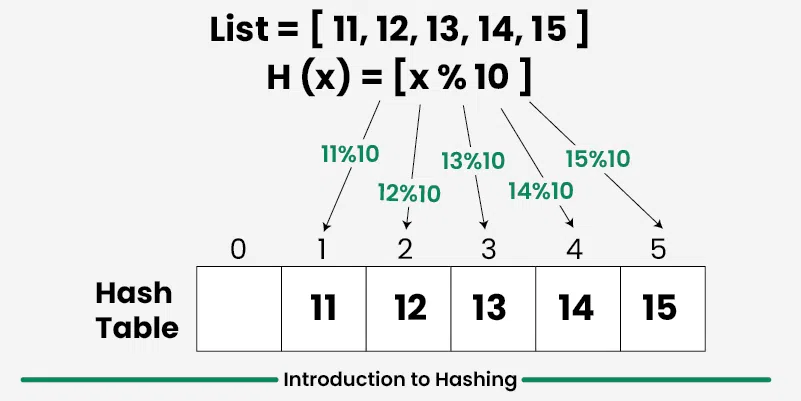
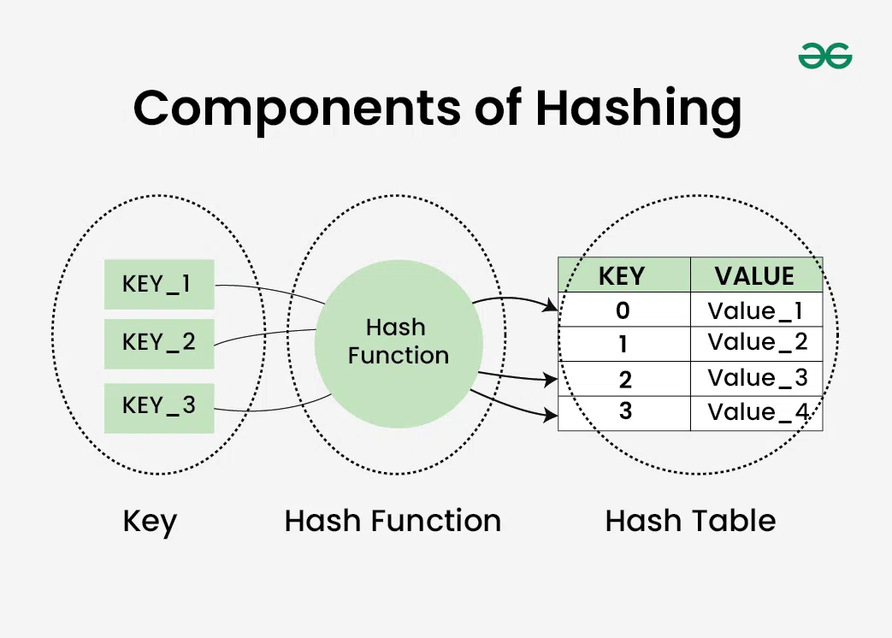
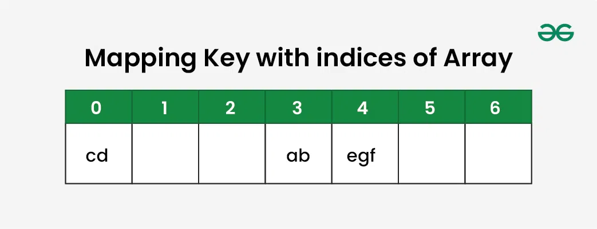
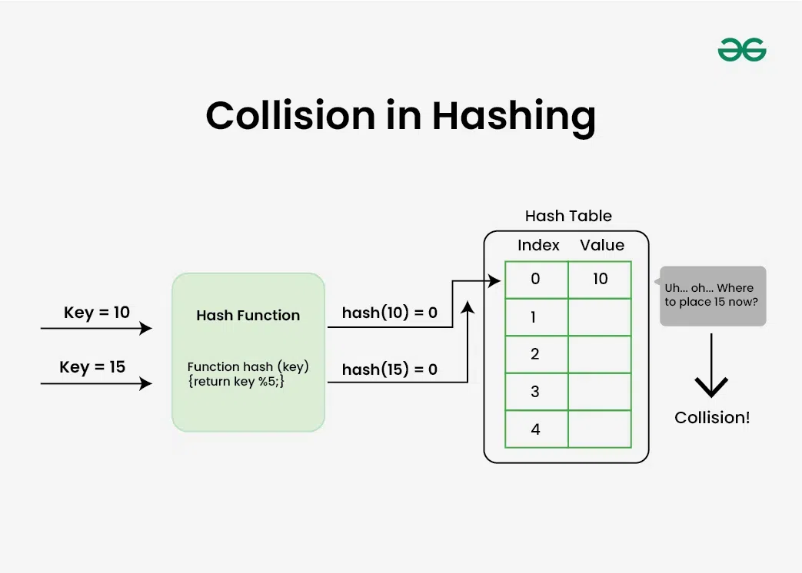

---

# Introduction to Hashing

**Last Updated:** 29 Oct, 2025

---

## What is Hashing?

**Hashing** is a technique used to transform an input of large or variable size into a **small, fixed-size value**, which can be used as an **index in a table**. This transformation is carried out using mathematical formulas known as **hash functions**.

The output produced by a hash function determines the **location** where an item is stored in a data structure called a **hash table**. By directly computing the storage location, hashing allows data to be accessed very quickly.

---

---
## Overview of Hash Table Data Structure

A **hash table** is one of the most commonly used data structures after arrays. Its popularity comes from its efficiency and simplicity.

Key characteristics include:

* Supports **search**, **insert**, and **delete** operations in **O(1) time on average**
* More efficient than arrays, linked lists, and self-balancing binary search trees for direct key-based access
* Widely used for tasks such as dictionaries, frequency counting, and fast data lookup

---

## Real-World Applications of Hashing

Hashing is used extensively in practical systems, including:

* **Database indexing**
* **Cryptography**
* **Caching mechanisms**
* **Symbol tables**
* **Dictionaries and key-value stores**

---

## Forms of Hashing in Programming Languages

Most programming languages implement hashing in two main forms:

### Hash Set

* Stores a **collection of unique keys**
* No duplicate values are allowed

Examples:

* `set` in Python
* `Set` in JavaScript
* `unordered_set` in C++
* `HashSet` in Java

---

### Hash Map

* Stores **key–value pairs**
* Keys are unique, but values may be duplicated

Examples:

* `dict` in Python
* `Map` in JavaScript
* `unordered_map` in C++
* `HashMap` in Java

---

## Situations Where Hashing Is Not Suitable

Hashing is not always the best choice. Other data structures are preferred in certain cases:

* When **sorted order** must be maintained along with search, insert, and delete operations
  → Use a **self-balancing binary search tree**

* When keys are strings and **prefix-based searches** are required
  → Use a **Trie**

* When operations like **floor** and **ceiling** are needed
  → Use a **self-balancing BST**

---

## Components of Hashing

Hashing consists of three major components:

### 1. Key

A **key** is the input value (such as an integer or string) that is provided to the hash function. It determines where data will be stored in the hash table.

---

### 2. Hash Function

A **hash function** takes a key as input and returns an **array index**, known as the **hash index**. This index specifies the position in the hash table where the value should be stored.

---

### 3. Hash Table

A **hash table** is usually implemented as an array of lists (or buckets). It stores values in an associative manner, where each value is mapped to a unique index derived from its key.

---

---
## How Hashing Works

Consider a set of strings:
**{ "ab", "cd", "efg" }**

We want to store these strings in a hash table.

---

### Step-by-Step Process

>**Step 1:**
>A hash function is used to compute a numeric value for each key. This value will act as the index in the hash table.
---
>**Step 2:**
>Assign numeric values to characters:
>* a = 1, b = 2, c = 3, d = 4, and so on
---
>**Step 3:**
>Compute the sum of character values:
>* "ab" = 1 + 2 = 3
>* "cd" = 3 + 4 = 7
>* "efg" = 5 + 6 + 7 = 18
---
>**Step 4:**
>Assume the hash table size is 7.
>The hash function used is:
>* Index = sum of characters mod table size
---
>**Step 5:**
>Compute storage locations:
>* "ab" → 3 mod 7 = 3
>* "cd" → 7 mod 7 = 0
>* "efg" → 18 mod 7 = 4
---

---

This process allows us to directly calculate the storage location of a string, enabling **fast retrieval**. This illustrates why hashing is an effective method for storing **key–value pairs**.

---

## What is a Hash Function?

A **hash function** maps an input key to an index in a hash table using mathematical computations.

### Example:

If phone numbers are used as keys and the table size is 100, a simple hash function could extract the **last two digits** of each phone number to generate valid indices.

---

### Properties of a Good Hash Function

A good hash function should:

* Be **computationally efficient**
* **Distribute keys uniformly** across the table
* **Minimize collisions**
* Maintain a **low load factor**

---

## What is Collision in Hashing?

A **collision** occurs when two or more keys generate the **same hash value**.

For example:

* "ab" and "ba" produce the same sum
* "cd" and "be" also generate the same value

Collisions create difficulties in searching, insertion, deletion, and updating operations.

---

---

The likelihood of collisions depends on:

* Table size
* Key distribution
* Quality of the hash function

To manage collisions, **collision resolution techniques** are used.

---

## Load Factor in Hashing

The **load factor** measures how full a hash table is and is calculated as:

>Load Factor = Total elements in hash table / Size of hash table

The load factor:

* Helps evaluate the efficiency of the hash function
* Indicates whether keys are uniformly distributed
* Determines when resizing or rehashing is required

---

## What is Rehashing?

**Rehashing** refers to the process of hashing all keys again when the hash table becomes too full.

* When the load factor exceeds a predefined threshold (commonly **0.75**), performance degrades
* To fix this, the table size is **increased (usually doubled)**
* All existing elements are rehashed and inserted into the new table

This ensures:

* A lower load factor
* Fewer collisions
* Improved performance

---
