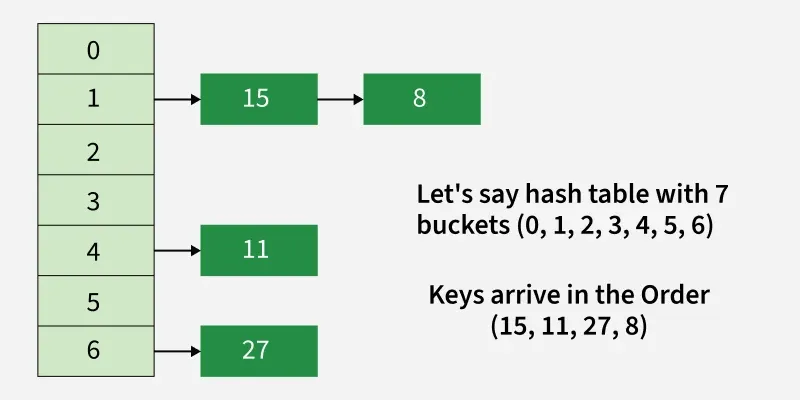
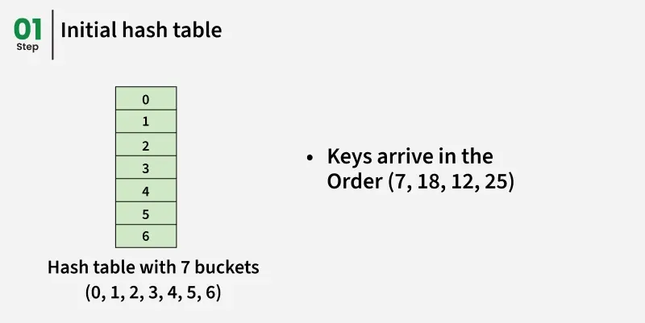
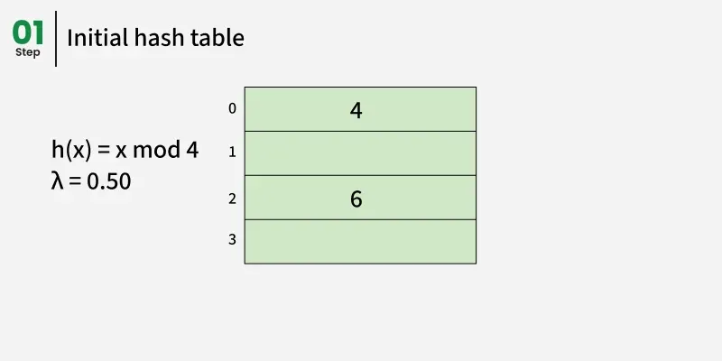
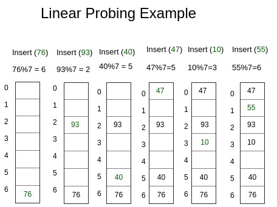
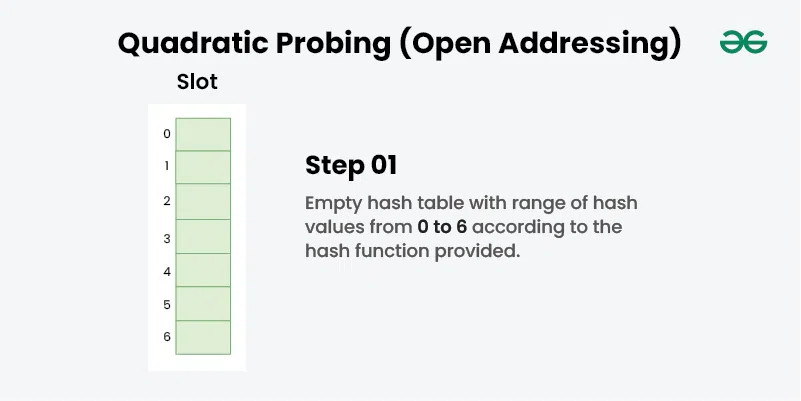
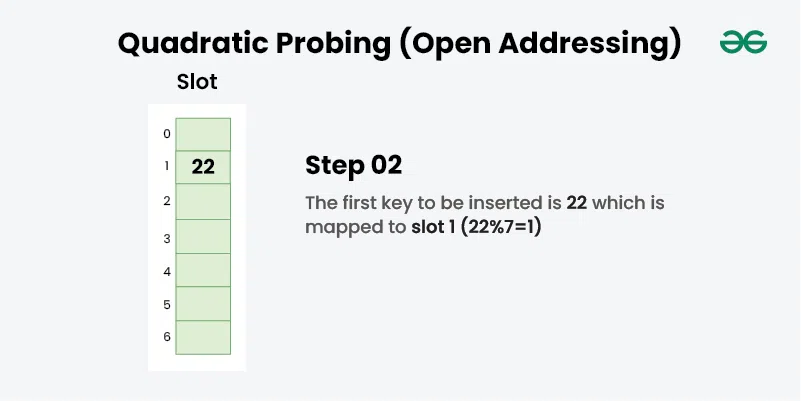
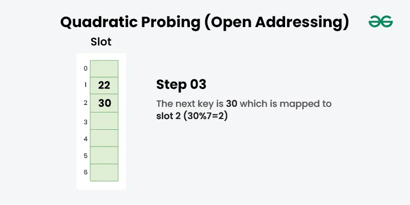
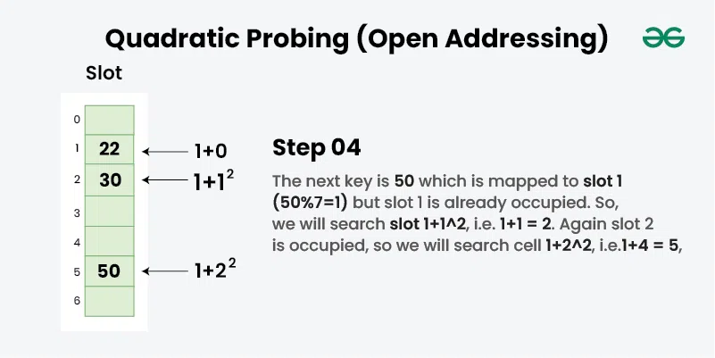

---

# How to Create Your Own Hash Table

## Hashing with Chaining Implementation

**Last Updated:** 01 Aug, 2025

---

## Introduction

In hashing, a **hash function** maps keys to specific values (indices). However, because multiple keys can produce the same hash value, **collisions** may occur. One effective way to handle collisions is **chaining**.

In **hashing with chaining**, each index of the hash table stores a **linked list (or dynamic list)** of elements. All keys that generate the same hash value are stored together in the same list, thus avoiding overwriting data.

For a deeper theoretical explanation, refer to **Hashing | Set 2 (Separate Chaining)**.

---

## Basic Idea of Chaining

* The hash table consists of **n buckets**
* Each bucket points to a list of elements
* Colliding keys are stored in the same bucket using a list

---

## Hash Function Used

To compute the index of a key, we use the following hash function:

```
hashIndex = key % numberOfBuckets
```

This hash index determines the bucket where the key will be stored.

---

## Example

**Number of buckets:** 7
**Keys to insert:** `[15, 11, 27, 8]`

Hash index calculation:

* `15 % 7 = 1`
* `11 % 7 = 4`
* `27 % 7 = 6`
* `8 % 7 = 1`

Keys `15` and `8` collide and are stored in the same bucket using chaining.

---

## Operations on Hash Table

### Insert Operation

1. Compute the hash index using the hash function
2. Move to the corresponding bucket
3. Insert the new key at the end of the list

### Delete Operation

1. Compute the hash index of the key
2. Move to the appropriate bucket
3. Search the list and remove the key if it exists

---

---
## Types of Chaining Implementations

1. **Simple Chaining**
2. **Chaining with Rehashing**

---

## Simple Chaining

Simple chaining uses a **fixed-size hash table**.
There is **no rehashing**, meaning the number of buckets never changes.

---

---

### Java Implementation: Simple Chaining

```java
import java.util.ArrayList;
import java.util.List;

public class Hash {

    // Number of buckets
    private int bucketCount;

    // List of chains
    private List<List<Integer>> table;

    // Constructor
    public Hash(int buckets) {
        bucketCount = buckets;
        table = new ArrayList<>();
        for (int i = 0; i < bucketCount; i++) {
            table.add(new ArrayList<>());
        }
    }

    // Insert key
    public void insert(int key) {
        int index = getHashIndex(key);
        table.get(index).add(key);
    }

    // Remove key
    public void remove(int key) {
        int index = getHashIndex(key);
        table.get(index).remove(Integer.valueOf(key));
    }

    // Display hash table
    public void display() {
        for (int i = 0; i < bucketCount; i++) {
            System.out.print(i);
            for (int key : table.get(i)) {
                System.out.print(" --> " + key);
            }
            System.out.println();
        }
    }

    // HashTableDemo function
    private int getHashIndex(int key) {
        return key % bucketCount;
    }

    public static void main(String[] args) {
        int[] keys = {7, 18, 12, 25};

        Hash hashTable = new Hash(7);

        for (int key : keys) {
            hashTable.insert(key);
        }

        hashTable.remove(12);
        hashTable.display();
    }
}
```

---

### Output

```
0 --> 7
1
2
3
4 --> 18 --> 25
5
6
```

---

## Time Complexity (Simple Chaining)

Let:

* `n` = number of elements
* `m` = number of buckets
* `α = n / m` (load factor)

| Operation | Time Complexity |
| --------- | --------------- |
| Search    | O(1 + α)        |
| Delete    | O(1 + α)        |
| Insert    | O(1 + α)        |

* Expected chain length: **O(α)**
* Load factor should be kept **small**
* Higher load factor → more collisions
* Load factor represents a **trade-off between time and space**

**Auxiliary Space:** O(1)

---

## Chaining with Rehashing

In this approach, the number of buckets is **not fixed**.
The hash table **resizes dynamically** when the load factor exceeds a threshold.

---

### Rehashing Strategy

* Rehashing is triggered when **load factor > 0.5**
* The table size is **doubled**
* All existing keys are **reinserted** into the new table
* Since bucket count changes, the **hash function behavior also changes**

---

---

### Java Implementation: Chaining with Rehashing

```java
import java.util.ArrayList;
import java.util.List;

public class Hash {

    private int bucketCount;
    private int numOfElements;
    private List<List<Integer>> table;

    // Constructor
    public Hash(int buckets) {
        bucketCount = buckets;
        numOfElements = 0;
        table = new ArrayList<>();
        for (int i = 0; i < bucketCount; i++) {
            table.add(new ArrayList<>());
        }
    }

    // Insert key
    public void insert(int key) {
        while (getLoadFactor() > 0.5) {
            rehash();
        }

        int index = getHashIndex(key);
        table.get(index).add(key);
        numOfElements++;
    }

    // Remove key
    public void remove(int key) {
        int index = getHashIndex(key);
        table.get(index).remove((Integer) key);
        numOfElements--;
    }

    // Display table
    public void display() {
        for (int i = 0; i < bucketCount; i++) {
            System.out.print(i);
            for (int key : table.get(i)) {
                System.out.print(" --> " + key);
            }
            System.out.println();
        }
    }

    // HashTableDemo function
    private int getHashIndex(int key) {
        return key % bucketCount;
    }

    // Load factor
    private float getLoadFactor() {
        return (float) numOfElements / bucketCount;
    }

    // Rehashing logic
    private void rehash() {
        List<List<Integer>> oldTable = table;
        bucketCount *= 2;
        table = new ArrayList<>();
        for (int i = 0; i < bucketCount; i++) {
            table.add(new ArrayList<>());
        }
        numOfElements = 0;

        for (List<Integer> bucket : oldTable) {
            for (int key : bucket) {
                insert(key);
            }
        }
    }

    public static void main(String[] args) {
        int[] keys = {15, 11, 27};

        Hash hashTable = new Hash(5);

        for (int key : keys) {
            hashTable.insert(key);
        }

        hashTable.remove(11);
        hashTable.display();

        hashTable.insert(19);

        System.out.println("\nAfter rehashing:");
        hashTable.display();
    }
}
```

---

### Output

```
0 --> 15
1
2 --> 27
3
4

After rehashing:
0 --> 15
1
2 --> 27
3
4 --> 19
```

---

## Complexity Analysis (Chaining with Rehashing)

### Insert Operation

* **Time Complexity:** O(n)
  (Rehashing requires reinserting all elements)
* **Auxiliary Space:** O(n)

### Search Operation

* **Time Complexity:** O(n) in worst case
* **Auxiliary Space:** O(1)

---

## Summary

* **Chaining** efficiently handles collisions by storing multiple keys in the same bucket
* **Simple chaining** uses a fixed table size
* **Chaining with rehashing** dynamically resizes the table for better performance
* Maintaining a **low load factor** is essential for efficient hashing

---

Below is a **complete rewritten version** of the provided content, presented as **clear, structured lesson notes**, with original wording while preserving all technical meaning, examples, and code.

---

# Linear Probing in Hash Tables

---

## Introduction

**Linear Probing** is a collision resolution technique used in **open addressing** hash tables. In open addressing, **all elements are stored directly inside the hash table itself**, rather than using external structures such as linked lists.

Because every key must fit inside the table, the **table size must always be greater than or equal to the number of stored keys**. If required, the table size can be increased by creating a larger table and re-inserting existing elements.

---

## Open Addressing with Linear Probing

When a collision occurs (i.e., the computed index is already occupied), linear probing searches for the **next available slot sequentially** until an empty position is found.

---

## Operations in Linear Probing

### Insert Operation

* Compute the hash index using the hash function
* If the slot is occupied, move to the **next index**
* Continue probing linearly until an empty or deleted slot is found
* Insert the key at that position

---

### Search Operation

* Compute the initial hash index
* Compare the key at the index with the target key
* If it does not match, continue probing sequentially
* Stop when:

    * The key is found, or
    * An empty slot is encountered

---

### Delete Operation

Deletion requires special handling:

* Simply removing an element may break the probing sequence
* To avoid failed searches, deleted slots are marked using a **special marker**
* A **dummy node** (with key = -1 and value = -1) is used to represent deleted entries

Key rules:

* **Insertion** can reuse deleted slots
* **Search** does not stop at deleted slots

---

## Key Idea of Linear Probing

The hash function always generates a valid index within the table size.
Given a `(key, value)` pair:

1. The hash function computes an index
2. If a collision occurs, linear probing finds the next valid position
3. Retrieval of a value by key is **O(1) on average**

---

---
## Implementation of Linear Probing

### Java Implementation

```java
class hashNode {
    int key;
    int value;

    // Constructor
    public hashNode(int key, int value) {
        this.key = key;
        this.value = value;
    }
}

class hashMap {
    hashNode[] arr;
    int capacity;
    int size;
    hashNode dummy;

    // Constructor
    public hashMap() {
        capacity = 20;
        size = 0;
        arr = new hashNode[capacity];
        dummy = new hashNode(-1, -1);
    }

    // HashTableDemo function
    int hashCode(int key) {
        return key % capacity;
    }

    // Insert key-value pair
    void insertNode(int key, int value) {
        hashNode temp = new hashNode(key, value);
        int hashIndex = hashCode(key);

        while (arr[hashIndex] != null &&
               arr[hashIndex].key != key &&
               arr[hashIndex].key != -1) {
            hashIndex++;
            hashIndex %= capacity;
        }

        if (arr[hashIndex] == null || arr[hashIndex].key == -1)
            size++;

        arr[hashIndex] = temp;
    }

    // Delete a key
    int deleteNode(int key) {
        int hashIndex = hashCode(key);

        while (arr[hashIndex] != null) {
            if (arr[hashIndex].key == key) {
                hashNode temp = arr[hashIndex];
                arr[hashIndex] = dummy;
                size--;
                return temp.value;
            }
            hashIndex++;
            hashIndex %= capacity;
        }
        return -1;
    }

    // Get value by key
    int get(int key) {
        int hashIndex = hashCode(key);
        int counter = 0;

        while (arr[hashIndex] != null) {
            if (counter++ > capacity)
                return -1;

            if (arr[hashIndex].key == key)
                return arr[hashIndex].value;

            hashIndex++;
            hashIndex %= capacity;
        }
        return -1;
    }

    // Return size of hash map
    int sizeofMap() {
        return size;
    }

    // Check if map is empty
    boolean isEmpty() {
        return size == 0;
    }

    // Display key-value pairs
    void display() {
        for (int i = 0; i < capacity; i++) {
            if (arr[i] != null && arr[i].key != -1) {
                System.out.println(arr[i].key + " " + arr[i].value);
            }
        }
    }

    public static void main(String[] args) {
        hashMap h = new hashMap();
        h.insertNode(1, 1);
        h.insertNode(2, 2);
        h.insertNode(2, 3);
        h.display();

        System.out.println(h.sizeofMap());
        System.out.println(h.deleteNode(2));
        System.out.println(h.sizeofMap());
        System.out.println(h.isEmpty());
        System.out.println(h.get(2));
    }
}
```

---

## Output

```
1 1
2 3
2
3
1
false
-1
```

---

## Complexity Analysis

### Insertion

* **Best Case:** O(1)
* **Worst Case:** O(n)
  (Occurs when all slots are occupied and linear probing checks each position)
* **Average Case:**

    * O(1) with a good hash function
    * O(n) with a poor hash function
* **Auxiliary Space:** O(1)

---

### Deletion

* **Best Case:** O(1)
* **Worst Case:** O(n)
* **Average Case:**

    * O(1) for good hash distribution
    * O(n) for poor hash distribution
* **Auxiliary Space:** O(1)

---

### Searching

* **Best Case:** O(1)
* **Worst Case:** O(n)
* **Average Case:**

    * O(1) with a good hash function
    * O(n) with a poor hash function
* **Auxiliary Space:** O(1)

---

## Summary

* Linear probing is a **simple and space-efficient** collision resolution method
* All elements are stored directly in the hash table
* Deleted elements are marked using a **dummy node**
* Performance depends heavily on **hash function quality** and **load factor**
* As the table becomes full, performance degrades due to clustering

---

# Quadratic Probing in Hashing

---

## Introduction to Hashing

Hashing is a technique designed to improve upon the **Direct Access Table** method. Instead of using large arrays indexed directly by keys, hashing applies a **hash function** that transforms a key (such as a number or string) into a smaller integer. This integer is then used as an index in a data structure known as a **hash table**.

The main objective of hashing is to achieve fast insertion, deletion, and search operations.

---

## What Is Quadratic Probing?

**Quadratic probing** is a collision resolution strategy used in **open addressing** hash tables. When two keys map to the same index, quadratic probing searches for the next available position using a quadratic function of the probe number.

Unlike linear probing, which checks consecutive slots, quadratic probing spreads out probes to reduce clustering.

---

## Working Principle of Quadratic Probing

Let `hash(x)` denote the index produced by the hash function, and let `S` represent the size of the hash table.

If a collision occurs at `hash(x) % S`, the algorithm probes new slots in the following order:

* First attempt:
  `(hash(x) + 1²) % S`
* Second attempt:
  `(hash(x) + 2²) % S`
* Third attempt:
  `(hash(x) + 3²) % S`
* Continue this process until an empty slot is found

In general, during the *i-th* probe, the algorithm checks:
`(hash(x) + i²) % S`

---

## Example

Consider the hash function:

```
hash(key) = key % 7
```

Given the keys: `22, 30, 50`

Each key is inserted using quadratic probing whenever a collision occurs, following the sequence of squared offsets.

---

---

---

---

---

## Implementation: Standard Quadratic Probing

### Java Implementation

```java
import java.util.Arrays;

public class GfG {

    static void quadProbing(int[] table, int tsize, int[] arr) {
        int n = arr.length;

        for (int i = 0; i < n; i++) {

            // HashTableDemo function
            int hv = arr[i] % tsize;

            // Insert directly if slot is empty
            if (table[hv] == -1) {
                table[hv] = arr[i];
            } else {

                // Apply quadratic probing
                for (int j = 1; j <= tsize; j++) {

                    int t = (hv + j * j) % tsize;

                    if (table[t] == -1) {
                        table[t] = arr[i];
                        break;
                    }
                }
            }
        }
    }

    public static void main(String[] args) {
        int[] arr = {50, 700, 76, 85, 92, 73, 101};
        int tsize = 11;

        int[] table = new int[tsize];
        Arrays.fill(table, -1);

        quadProbing(table, tsize, arr);

        for (int val : table) {
            System.out.print(val + " ");
        }
    }
}
```

---

### Output

```
73 -1 101 -1 92 -1 50 700 85 -1 76
```

---

## Complexity Analysis (Standard Quadratic Probing)

* **Time Complexity:**
  O(n × l), where
  `n` = number of keys
  `l` = size of the hash table

* **Auxiliary Space:**
  O(1)

---

## Limitation of Quadratic Probing

The basic quadratic probing technique **does not guarantee** that every element will find a slot, even if the table still has empty positions.

### Example

For the input array:

```
[21, 10, 32, 43, 54, 65, 87, 76]
```

With a table size of `11`, the resulting table may look like:

```
[10, -1, 65, 32, 54, -1, -1, -1, 43, -1, 21]
```

In this case, the keys `87` and `76` fail to get inserted, despite the presence of unused slots. This occurs because quadratic probing may cycle through a limited subset of table indices.

To overcome this limitation, a **modified probing strategy** is required.

---

## Improved Quadratic Probing Using Power of Two

To ensure better table utilization, the probing sequence can be extended by iterating up to the **next power of 2** greater than the table size.

### Modified Hash Formula

Let `m` be the next power of 2 ≥ table size.

The probing function becomes:

```
hash(x) = (hash(x) + (j + j²) / 2) % m
```

Only indices less than the original table size are considered valid.

---

## Implementation: Improved Quadratic Probing

### Java Implementation

```java
import java.util.Arrays;

public class GfG {

    // Returns the next power of 2 greater than or equal to m
    static int nextPowerOf2(int m) {
        m--;
        m |= m >> 1;
        m |= m >> 2;
        m |= m >> 4;
        m |= m >> 8;
        m |= m >> 16;
        m++;
        return m;
    }

    static void quadProbing(int[] table, int tsize, int[] arr) {
        int n = arr.length;

        for (int i = 0; i < n; i++) {

            int hv = arr[i] % tsize;

            if (table[hv] == -1) {
                table[hv] = arr[i];
            } else {

                int m = nextPowerOf2(tsize);

                for (int j = 1; j <= m; j++) {

                    int t = (hv + (j + j * j) / 2) % m;

                    if (t >= tsize)
                        continue;

                    if (table[t] == -1) {
                        table[t] = arr[i];
                        break;
                    }
                }
            }
        }
    }

    public static void main(String[] args) {
        int[] arr = {21, 10, 32, 43, 54, 65, 87, 76};
        int tsize = 11;

        int[] table = new int[tsize];
        Arrays.fill(table, -1);

        quadProbing(table, tsize, arr);

        for (int val : table) {
            System.out.print(val + " ");
        }
        System.out.println();
    }
}
```

---

### Output

```
10 87 -1 -1 32 -1 54 65 76 43 21
```

---

## Complexity Analysis (Improved Version)

* **Time Complexity:**
  O(n × l), where
  `n` is the number of elements and
  `l` is the hash table size

* **Auxiliary Space:**
  O(1)

---

## Summary

* Quadratic probing is an open-addressing collision resolution technique
* It reduces clustering compared to linear probing
* Standard quadratic probing may fail to utilize all empty slots
* Using a probing range based on the next power of two improves slot coverage
* Performance depends on proper table sizing and hash function quality

---

