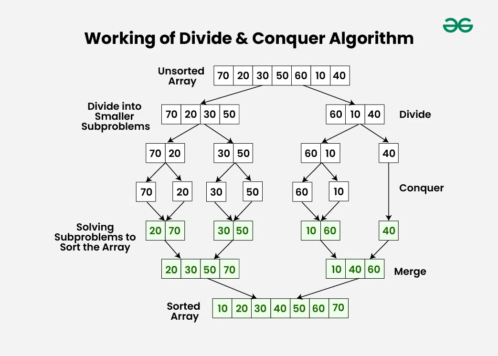
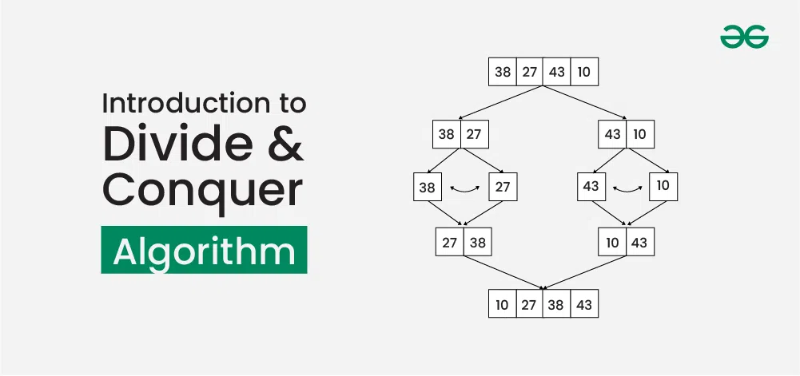

# Introduction to Divide and Conquer Algorithm

Last Updated : 23 Jul, 2025

Divide and Conquer Algorithm is a problem-solving technique used to solve problems by dividing the main problem into subproblems, solving them individually and then merging them to find solution to the original problem. Divide and Conquer is mainly useful when we divide a problem into independent subproblems. If we have overlapping subproblems, then we use [Dynamic Programming](https://www.geeksforgeeks.org/competitive-programming/dynamic-programming/).

In this article, we are going to discuss how Divide and Conquer Algorithm is helpful and how we can use it to solve problems.

## **Working of Divide and Conquer Algorithm**

Divide and Conquer Algorithm can be divided into three steps: Divide, Conquer and Merge.

---

---

## **Working-of-Divide-and-Conquer-Algorithm**

The above diagram shows working with the example of [Merge Sort](https://www.geeksforgeeks.org/dsa/merge-sort/) which is used for sorting

**Divide:**
* Break down the original problem into smaller subproblems.
* Each subproblem should represent a part of the overall problem.
* The goal is to divide the problem until no further division is possible.
* In Merge Sort, we divide the input array in two halves. Please note that the divide step of Merge Sort is simple, but in [Quick Sort](https://www.geeksforgeeks.org/dsa/quick-sort-algorithm/), the divide step is critical. In Quick Sort, we partition the array around a pivot.

**Conquer:**
* Solve each of the smaller subproblems individually.
* If a subproblem is small enough (often referred to as the “base case”), we solve it directly without further recursion.
* The goal is to find solutions for these subproblems independently.
* In Merge Sort, the conquer step is to sort the two halves individually.

**Merge:**
* Combine the sub-problems to get the final solution of the whole problem.
* Once the smaller subproblems are solved, we recursively combine their solutions to get the solution of larger problem.
* The goal is to formulate a solution for the original problem by merging the results from the subproblems.
* In Merge Sort, the merge step is to merge two sorted halves to create one sorted array. Please note that the merge step of Merge Sort is critical, but in Quick Sort, the merge step does not do anything as both parts become sorted in place and the left part has all elements smaller (or equal( than the right part.

## **Characteristics of Divide and Conquer Algorithm**

Divide and Conquer Algorithm involves breaking down a problem into smaller, more manageable parts, solving each part individually, and then combining the solutions to solve the original problem. The characteristics of Divide and Conquer Algorithm are:

1. **Dividing the Problem:** The first step is to break the problem into smaller, more manageable subproblems. This division can be done recursively until the
   subproblems become simple enough to solve directly.
2. **Independence of Subproblems:** Each subproblem should be independent of the others, meaning that solving one subproblem does not depend on the solution of another. This allows for parallel processing or concurrent execution
   of subproblems, which can lead to efficiency gains.
3. **Conquering Each Subproblem:** Once divided, the subproblems are solved individually. This may involve applying the same divide and conquer approach recursively until the subproblems become simple enough to solve directly, or it may involve applying a different algorithm or technique.
4. **Combining Solutions:** After solving the subproblems, their solutions are combined to obtain the solution to the original problem. This combination step should be relatively efficient and straightforward, as the solutions to the subproblems should be designed to fit together seamlessly.

**Examples of Divide and Conquer Algorithm**
1. Merge Sort:

We can use Divide and Conquer Algorithm to sort the array in ascending or descending order by dividing the array into smaller subarrays, sorting the smaller subarrays and then merging the sorted arrays to sort the original array.

Read more about [Merge Sort](https://www.geeksforgeeks.org/dsa/merge-sort/)

2. Quicksort:

It is a sorting algorithm that picks a pivot element and rearranges the array elements so that all elements smaller than the picked pivot element move to the left side of the pivot, and all greater elements move to the right side. Finally, the algorithm recursively sorts the subarrays on the left and right of the pivot element.

Read more about [Quick Sort](https://www.geeksforgeeks.org/dsa/quick-sort-algorithm/)

**Complexity Analysis of Divide and Conquer Algorithm**

>T(n) = aT(n/b) + f(n), where 
>* n = size of input 
>* a = number of subproblems in the recursion 
>* n/b = size of each subproblem. 
>
>All subproblems are assumed to have the same size. 
> 
>f(n) = cost of the work done outside the recursive call, which includes the cost of dividing the problem and cost of merging the solutions

## **Applications of Divide and Conquer Algorithm**

**The following are some standard algorithms that follow Divide and Conquer algorithm:**

1. [Binary Search](https://www.geeksforgeeks.org/dsa/binary-search/) is an efficient algorithm for finding an element in a sorted array by repeatedly dividing the search interval in half. It works by comparing the target value with the middle element and narrowing the search to either the left or right half, depending on the comparison.
2. [Quicksort ](https://www.geeksforgeeks.org/dsa/quick-sort-algorithm/)is a sorting algorithm that picks a pivot element and rearranges the array elements so that all elements smaller than the picked pivot element move to the left side of the pivot, and all greater elements move to the right side. Finally, the algorithm recursively sorts the subarrays on the left and right of the pivot element.
3. [Merge Sort](https://www.geeksforgeeks.org/dsa/quick-sort-algorithm/) is also a sorting algorithm. The algorithm divides the array into two halves, recursively sorts them, and finally merges the two sorted halves.
4. [Closest Pair of Points](https://www.geeksforgeeks.org/dsa/closest-pair-of-points-using-divide-and-conquer-algorithm/) The problem is to find the closest pair of points in a set of points in the x-y plane. The problem can be solved in O(n^2) time by calculating the distances of every pair of points and comparing the distances to find the minimum. The Divide and Conquer algorithm solves the problem in O(N log N) time.
5. [Strassen's Algorithm ](https://www.geeksforgeeks.org/dsa/strassens-matrix-multiplication/)is an efficient algorithm to multiply two matrices. A simple method to multiply two matrices needs 3 nested loops and is O(n^3). Strassen's algorithm multiplies two matrices in O(n^2.8974) time.
6. [Cooley–Tukey Fast Fourier Transform (FFT)](https://en.wikipedia.org/wiki/Cooley%E2%80%93Tukey_FFT_algorithm) algorithm is the most common algorithm for FFT. It is a divide and conquer algorithm which works in O(N log N) time.
7. [Karatsuba algorithm ](https://www.geeksforgeeks.org/dsa/karatsuba-algorithm-for-fast-multiplication-using-divide-and-conquer-algorithm/)for fast multiplication does the multiplication of two binary strings in O(n1.59) where n is the length of binary string.

---

---

**Advantages of Divide and Conquer Algorithm**
* Solving difficult problems: Divide and conquer technique is a tool for solving difficult problems conceptually. e.g. Tower of Hanoi puzzle. It requires a way of breaking the problem into sub-problems, and solving all of them as an individual cases and then combining sub- problems to the original problem.
* Algorithm efficiency: The divide-and-conquer algorithm often helps in the discovery of efficient algorithms. It is the key to algorithms like Quick Sort and Merge Sort, and fast Fourier transforms.
* Parallelism: Normally Divide and Conquer algorithms are used in multi-processor machines having shared-memory systems where the communication of data between processors does not need to be planned in advance, because distinct sub-problems can be executed on different processors.
* Memory access: These algorithms naturally make an efficient use of memory caches. Since the subproblems are small enough to be solved in cache without using the main memory that is slower one. Any algorithm that uses cache efficiently is called cache oblivious.

---
**Disadvantages of Divide and Conquer Algorithm**
* **Overhead:** The process of dividing the problem into subproblems and then combining the solutions can require additional time and resources. This overhead can be significant for problems that are already relatively small or that have a simple solution.
* **Complexity:** Dividing a problem into smaller subproblems can increase the complexity of the overall solution. This is particularly true when the subproblems are interdependent and must be solved in a specific order.
* **Difficulty of implementation:** Some problems are difficult to divide into smaller subproblems or require a complex algorithm to do so. In these cases, it can be challenging to implement a divide and conquer solution.
* **Memory limitations:** When working with large data sets, the memory requirements for storing the intermediate results of the subproblems can become a limiting factor.