---

# KMP Algorithm for Pattern Searching

**Last Updated : 10 Oct, 2025**

The **Knuth–Morris–Pratt (KMP) algorithm** is an efficient algorithm used for **pattern searching in strings**. Its main goal is to find occurrences of a pattern within a given text in an optimized way. Unlike the naive approach, KMP uses a **preprocessing technique** to handle mismatches intelligently and achieves **linear time complexity**.

The algorithm was developed in **1977** by **Donald Knuth, Vaughan Pratt, and James Morris**. Due to its efficiency, KMP is widely used in **search engines, compilers, text editors**, and many real-world string processing systems.

---

## Table of Content

* Naive Approach and How KMP Overcomes It
* LPS (Longest Prefix Suffix) Array
* Algorithm for Construction of LPS Array
* KMP Pattern Matching Algorithm
* Real-Life Applications
* Related Problems

---

## Naive Approach and How KMP Overcomes It

In the **naive string matching algorithm**, the pattern is aligned with the text at every possible position. Characters are compared one by one, and if a mismatch occurs, the pattern is shifted by **one position** and the comparison starts again from the beginning.

This approach often results in **rechecking the same characters multiple times**, especially when the text or pattern contains repeated characters.
For example, searching the pattern `"aaaab"` inside the text `"aaaaaaaab"` leads to many unnecessary comparisons. As a result, the time complexity of the naive approach becomes **O(n × m)**, where `n` is the length of the text and `m` is the length of the pattern.

The **KMP algorithm** eliminates this inefficiency by preprocessing the pattern and storing useful information in an auxiliary array called the **LPS (Longest Prefix Suffix) array**. This array allows the algorithm to avoid unnecessary re-comparisons.

When a mismatch occurs, KMP does **not restart the comparison from the beginning of the pattern**. Instead, it uses the LPS array to determine how far the pattern can be shifted while still preserving already matched characters.
This ensures that **each character in the text is compared at most once**, reducing the time complexity to **O(n + m)**.

---

### Proper Prefix

A **proper prefix** of a string is a prefix that is **not equal to the entire string**.

**Example:**
Proper prefixes of `"abcd"` are:

```
"", "a", "ab", "abc"
```

---

## LPS (Longest Prefix Suffix) Array

The **LPS array** stores, for every position `i` in the pattern, the **length of the longest proper prefix** that is also a **suffix** of the substring `pat[0...i]`.

This information is used by the KMP algorithm to determine **how much to shift the pattern** when a mismatch occurs, without rechecking characters that are already known to match.

---

### Example of LPS Array Construction

#### Example 1: Pattern `"aabaaac"`

* Index 0: `"a"` → No proper prefix/suffix → `lps[0] = 0`
* Index 1: `"aa"` → `"a"` is both prefix and suffix → `lps[1] = 1`
* Index 2: `"aab"` → No prefix matches suffix → `lps[2] = 0`
* Index 3: `"aaba"` → `"a"` is prefix and suffix → `lps[3] = 1`
* Index 4: `"aabaa"` → `"aa"` is prefix and suffix → `lps[4] = 2`
* Index 5: `"aabaaa"` → `"aa"` is prefix and suffix → `lps[5] = 2`
* Index 6: `"aabaaac"` → Mismatch → `lps[6] = 0`

Final LPS array:

```
[0, 1, 0, 1, 2, 2, 0]
```

---

#### Example 2: Pattern `"abcdabca"`

* Index 0: `lps[0] = 0`
* Index 1: `lps[1] = 0`
* Index 2: `lps[2] = 0`
* Index 3: `lps[3] = 0` (no repetition in `"abcd"`)
* Index 4: `lps[4] = 1` (`"a"` repeats)
* Index 5: `lps[5] = 2` (`"ab"` repeats)
* Index 6: `lps[6] = 3` (`"abc"` repeats)
* Index 7: `lps[7] = 1` (mismatch, fallback to `"a"`)

Final LPS array:

```
[0, 0, 0, 0, 1, 2, 3, 1]
```

**Note:**
`lps[i]` represents the **longest proper prefix that is also a suffix**, and care must be taken to ensure the entire substring itself is not considered.

---

## Algorithm for Construction of LPS Array

* The value of `lps[0]` is always `0` because a string of length 1 has no non-empty proper prefix that is also a suffix.
* A variable `len` is used to store the length of the previous longest prefix suffix.
* We traverse the pattern starting from index `1` and compare `pat[i]` with `pat[len]`.

### Case 1: `pat[i] == pat[len]`

* The prefix-suffix match is extended.
* Increment `len` and assign `lps[i] = len`.
* Move to the next index.

### Case 2: `pat[i] != pat[len]` and `len == 0`

* No matching prefix exists.
* Set `lps[i] = 0` and move forward.

### Case 3: `pat[i] != pat[len]` and `len > 0`

* A smaller prefix may still match.
* Update `len = lps[len - 1]`.
* Do **not** increment `i` immediately; retry comparison.

---
**Illustration:**

---
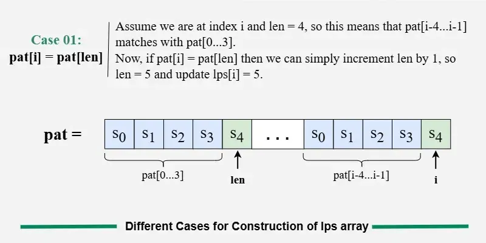
---
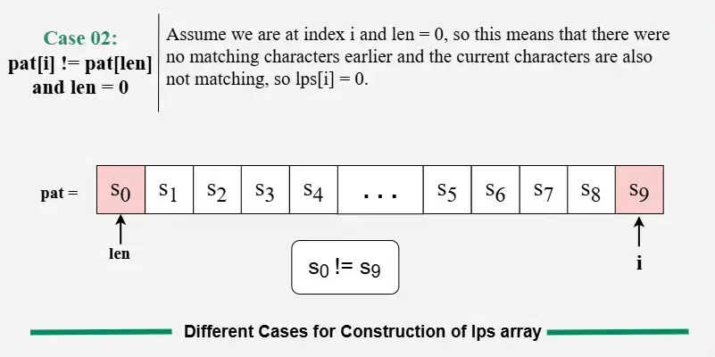
---
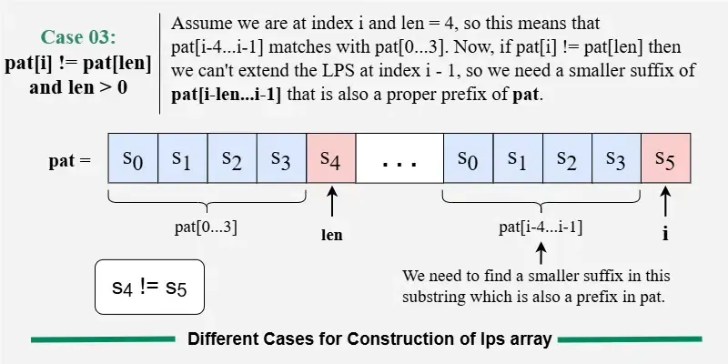
---
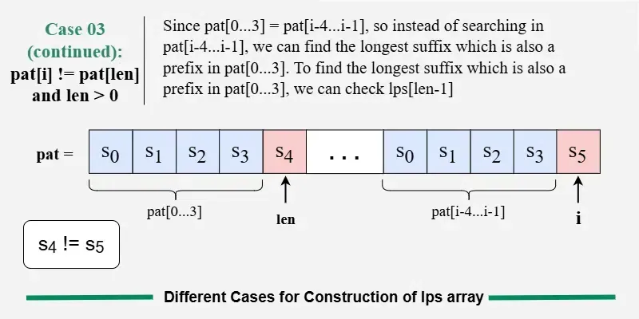
---
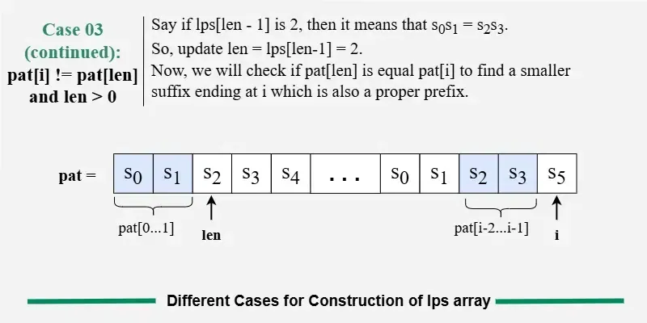
---
**Example of Construction of LPS Array:**

---
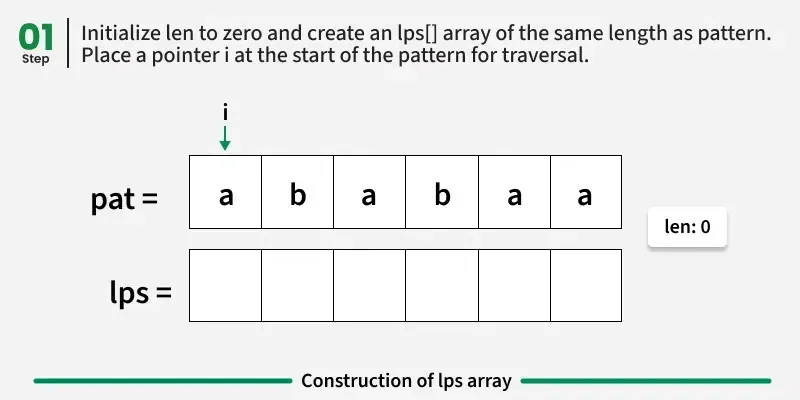
---
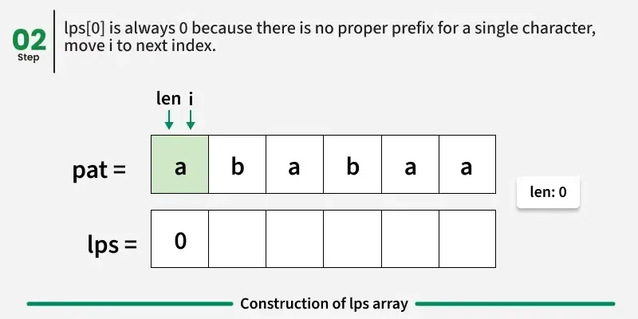
---
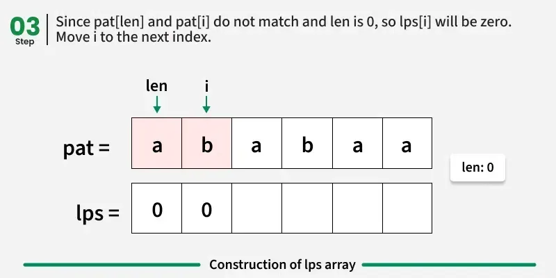
---
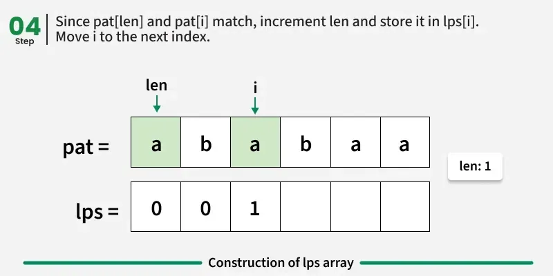
---
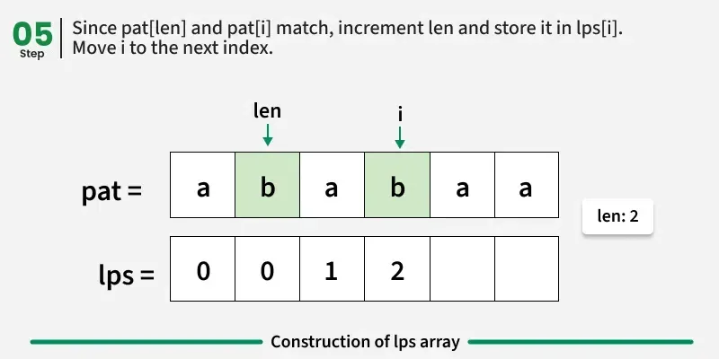
---
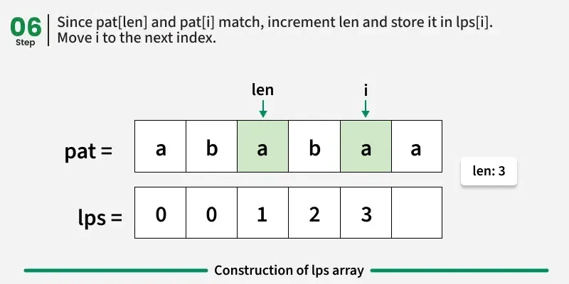
---
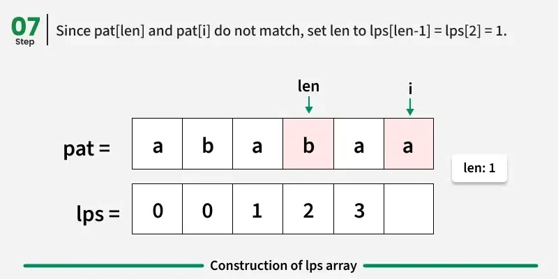
---
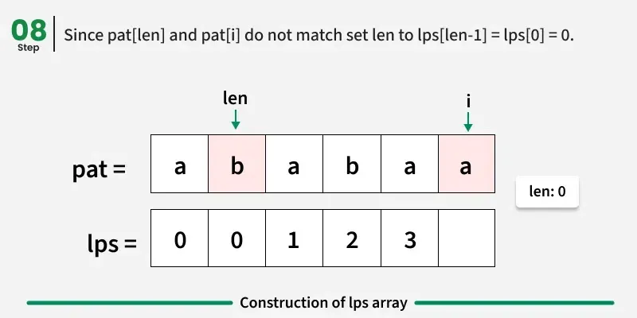
---
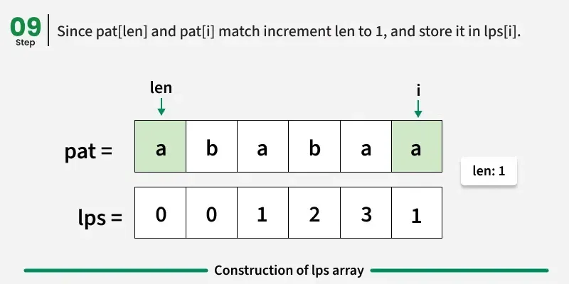
---

### Java Code: LPS Array Construction

```java
import java.util.ArrayList;

class GfG {
    public static ArrayList<Integer> computeLPSArray(String pattern) {
        int n = pattern.length();
        ArrayList<Integer> lps = new ArrayList<>();
        for (int k = 0; k < n; k++) lps.add(0);

        int len = 0;
        int i = 1;

        while (i < n) {
            if (pattern.charAt(i) == pattern.charAt(len)) {
                len++;
                lps.set(i, len);
                i++;
            } else {
                if (len != 0) {
                    len = lps.get(len - 1);
                } else {
                    lps.set(i, 0);
                    i++;
                }
            }
        }
        return lps;
    }
}
```

**Time Complexity:** `O(n)`
**Auxiliary Space:** `O(n)`

---

## KMP Pattern Matching Algorithm

### Terminology

* **Text (txt):** Main string to be searched
* **Pattern (pat):** Substring to be found
* **Match:** All pattern characters match consecutively
* **LPS Array:** Stores longest proper prefix which is also suffix
* **Proper Prefix:** Prefix not equal to whole string
* **Suffix:** Substring ending at current position

---

### Problem Statement

Given:

* `txt`: the main text
* `pat`: the pattern

Find **all starting indices (0-based)** where `pat` occurs in `txt`.

---

### Examples

>Input: txt = "abcab",  pat = "ab"
>Output: [0, 3]
>Explanation: The string "ab" occurs twice in txt, first occurrence starts from index 0 and second from index 3.

>Input: txt =  "aabaacaadaabaaba", pat =  "aaba"
>Output: [0, 9, 12]
>Explanation:
---
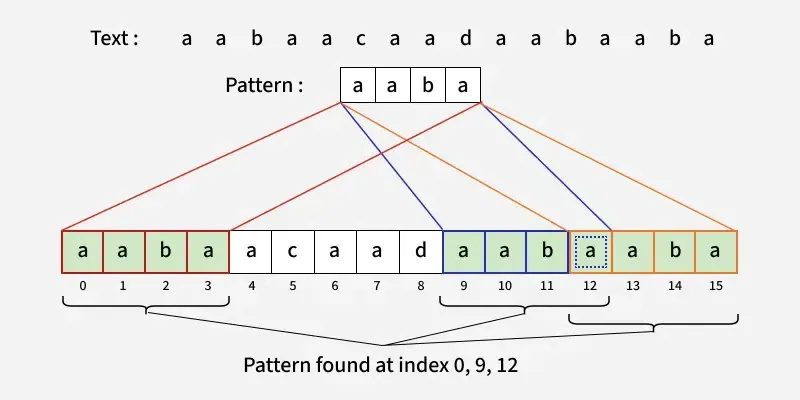
---

## Working of KMP Algorithm

### 1. Preprocessing Step – Build the LPS Array

* First, we process the pattern to create an array called LPS (Longest Prefix Suffix).
* This array tells us: "If a mismatch happens at this point, how far back in the pattern can we jump without missing any potential matches?"
* It helps us avoid starting from the beginning of the pattern again after a mismatch.
* This step is done only once, before we start searching in the text.

#### 2. Matching Step – Search the Pattern in the Text

* Now, we start comparing the pattern with the text, one character at a time.
* If the characters match: Move forward in both the text and the pattern.
* If the characters don’t match:
  * => If we're not at the start of the pattern, we use the LPS value at the previous index (i.e., lps[j - 1]) to move the pattern pointer j back to that position. This means: jump to the longest prefix that is also a suffix — no need to recheck those characters.
  * => If we're at the start (i.e., j == 0), simply move the text pointer i forward to try the next character.
* If we reach the end of the pattern (i.e., all characters matched), we found a match! Record the starting index and continue searching.

**Illustration:**

---

---
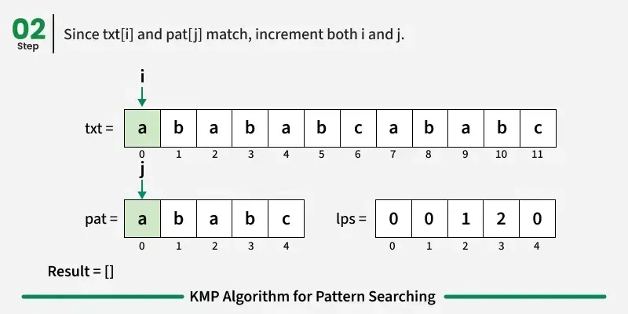
---
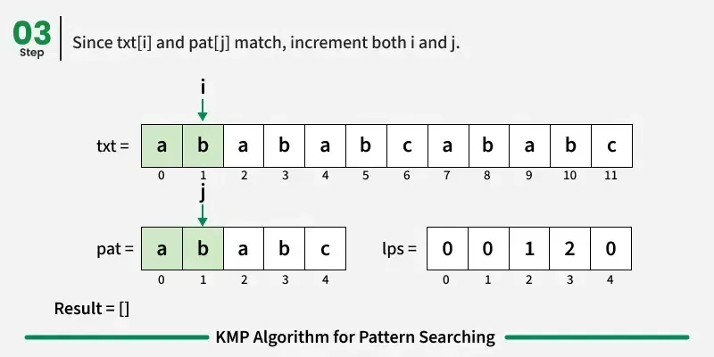
---
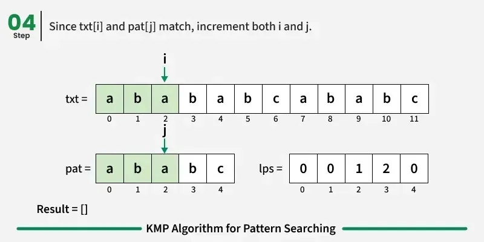
---
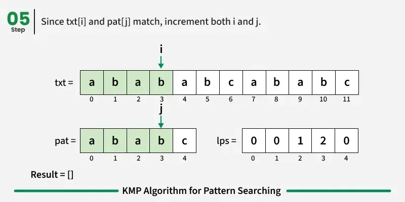
---
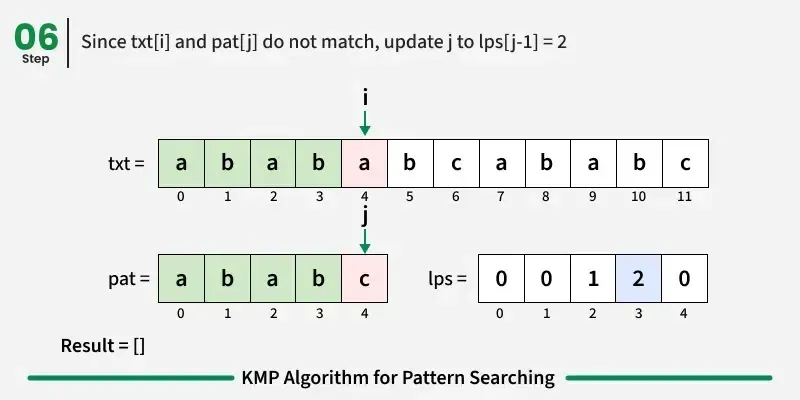
---
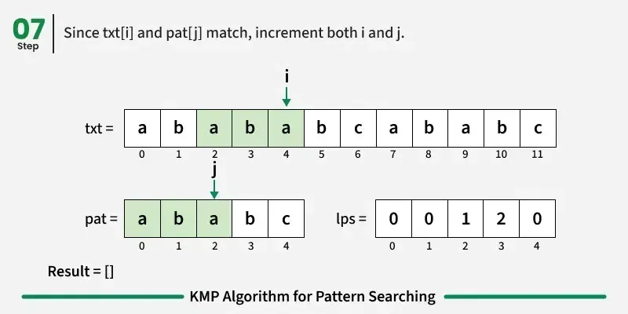
---
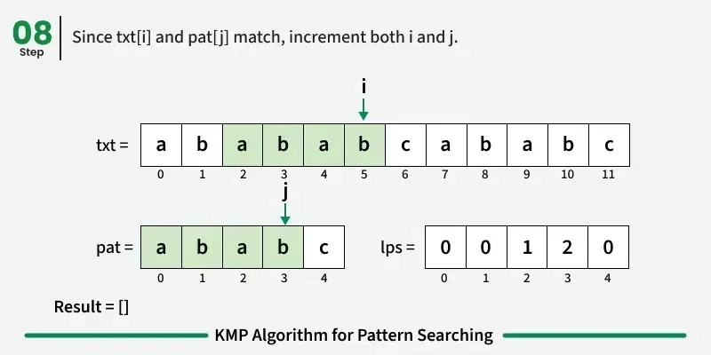
---
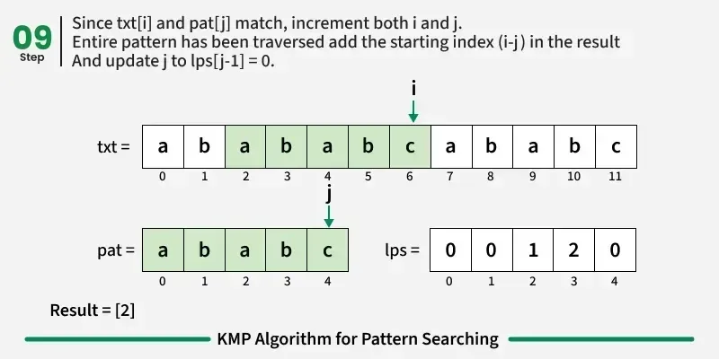
---
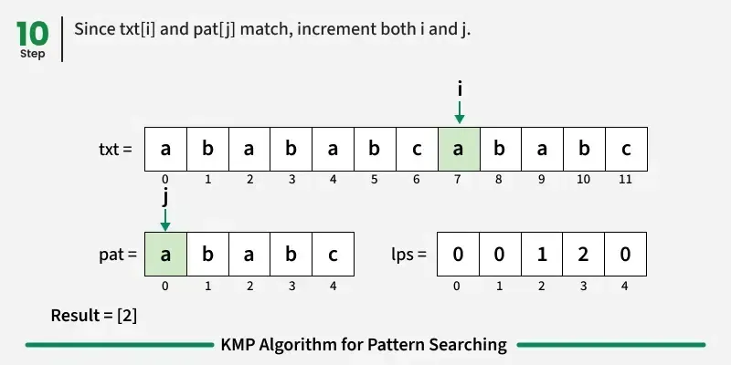
---

---
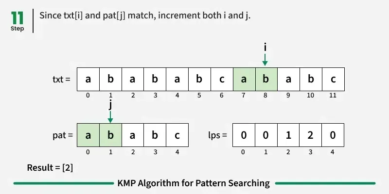
---
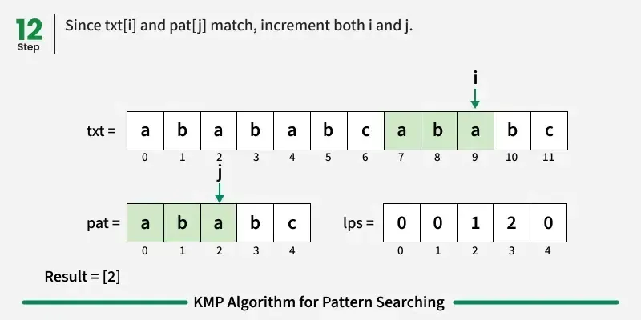
---
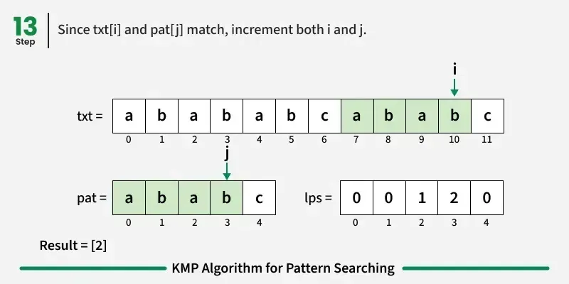
---
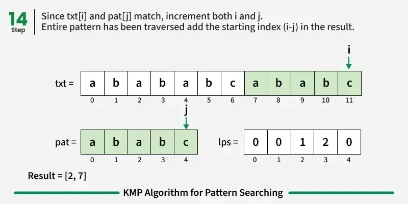
---

### Java Implementation of KMP Search

```java
import java.util.ArrayList;

class GfG {

    static void constructLps(String pat, int[] lps) {
        int len = 0;
        lps[0] = 0;

        int i = 1;
        while (i < pat.length()) {
            if (pat.charAt(i) == pat.charAt(len)) {
                len++;
                lps[i] = len;
                i++;
            } else {
                if (len != 0) {
                    len = lps[len - 1];
                } else {
                    lps[i] = 0;
                    i++;
                }
            }
        }
    }

    static ArrayList<Integer> search(String pat, String txt) {
        int n = txt.length();
        int m = pat.length();

        int[] lps = new int[m];
        ArrayList<Integer> res = new ArrayList<>();

        constructLps(pat, lps);

        int i = 0, j = 0;

        while (i < n) {
            if (txt.charAt(i) == pat.charAt(j)) {
                i++;
                j++;

                if (j == m) {
                    res.add(i - j);
                    j = lps[j - 1];
                }
            } else {
                if (j != 0)
                    j = lps[j - 1];
                else
                    i++;
            }
        }
        return res;
    }

    public static void main(String[] args) {
        String txt = "aabaacaadaabaaba";
        String pat = "aaba";

        ArrayList<Integer> res = search(pat, txt);
        for (int i = 0; i < res.size(); i++)
            System.out.print(res.get(i) + " ");
    }
}
```

**Output:**

```
0 9 12
```

**Time Complexity:** `O(n + m)`
**Auxiliary Space:** `O(m)`

---

## Advantages of KMP Algorithm

* Linear time complexity
* No backtracking in text
* Highly efficient for large texts

---

## Real-Life Applications

* Text editors (Find/Replace feature)
* Plagiarism detection systems
* Bioinformatics (DNA sequence matching)
* Spam detection systems
* Search engines

---
