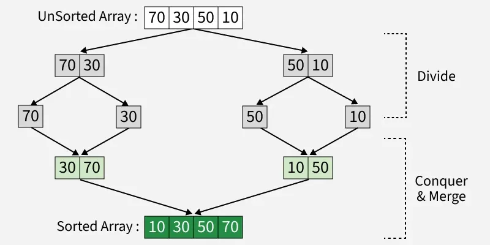
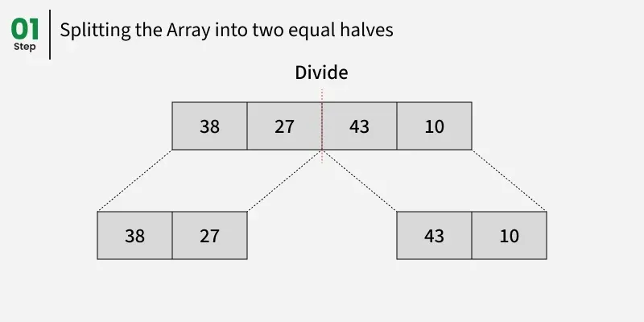
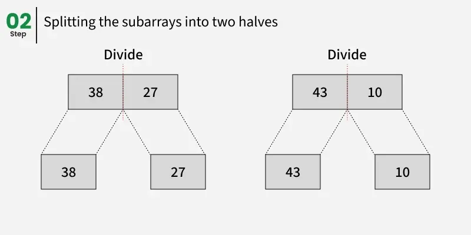
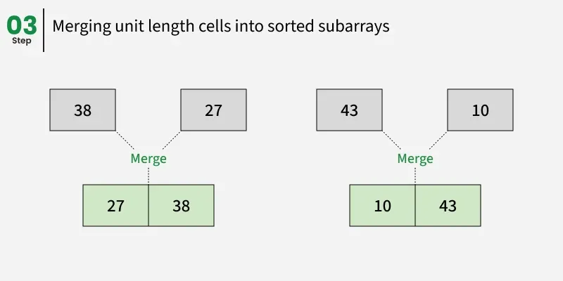
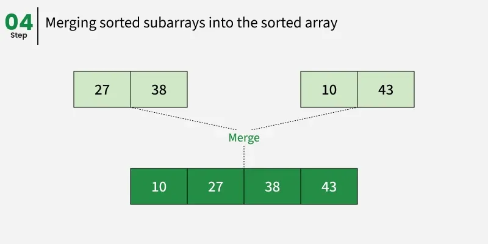

---

# Merge Sort

**Last Updated: 03 Oct, 2025**

## Introduction

Merge Sort is a **popular and efficient sorting algorithm** that follows the **Divide and Conquer** approach. It works by **recursively dividing** the input array into smaller subarrays, **sorting each subarray**, and then **merging the sorted subarrays** to produce the final sorted array.

Merge Sort is well known for its **guaranteed performance** and **stability**, making it suitable for sorting large datasets and non-primitive data types.

---

---

## Divide and Conquer Strategy

Merge Sort operates in three main steps:

1. **Divide**
   Recursively divide the array into two halves until each subarray contains only one element.

2. **Conquer**
   Since a single element is already sorted, recursively sort each subarray.

3. **Merge**
   Merge the sorted subarrays back together in sorted order until the full array is reconstructed.

---

---

---

---

---

## Working of Merge Sort (Example)

Consider the array:

```
[38, 27, 43, 10]
```

### Divide Phase

* `[38, 27, 43, 10]` → `[38, 27]` and `[43, 10]`
* `[38, 27]` → `[38]` and `[27]`
* `[43, 10]` → `[43]` and `[10]`

### Conquer Phase

* `[38]`, `[27]`, `[43]`, and `[10]` are already sorted.

### Merge Phase

* Merge `[38]` and `[27]` → `[27, 38]`
* Merge `[43]` and `[10]` → `[10, 43]`
* Merge `[27, 38]` and `[10, 43]` → `[10, 27, 38, 43]`

### Final Sorted Array

```
[10, 27, 38, 43]
```

---

## Java Implementation of Merge Sort

```java
import java.io.*;

class GfG {

    // Merges two subarrays of arr[]
    static void merge(int arr[], int l, int m, int r) {

        int n1 = m - l + 1;
        int n2 = r - m;

        int L[] = new int[n1];
        int R[] = new int[n2];

        for (int i = 0; i < n1; ++i)
            L[i] = arr[l + i];
        for (int j = 0; j < n2; ++j)
            R[j] = arr[m + 1 + j];

        int i = 0, j = 0;
        int k = l;

        while (i < n1 && j < n2) {
            if (L[i] <= R[j]) {
                arr[k] = L[i];
                i++;
            } else {
                arr[k] = R[j];
                j++;
            }
            k++;
        }

        while (i < n1) {
            arr[k] = L[i];
            i++;
            k++;
        }

        while (j < n2) {
            arr[k] = R[j];
            j++;
            k++;
        }
    }

    static void mergeSort(int arr[], int l, int r) {
        if (l < r) {

            int m = l + (r - l) / 2;

            mergeSort(arr, l, m);
            mergeSort(arr, m + 1, r);

            merge(arr, l, m, r);
        }
    }

    public static void main(String args[]) {
        int arr[] = {38, 27, 43, 10};

        mergeSort(arr, 0, arr.length - 1);

        for (int i = 0; i < arr.length; ++i)
            System.out.print(arr[i] + " ");
        System.out.println();
    }
}
```

---

## Output

```
10 27 38 43
```

---

## Recurrence Relation of Merge Sort

[
T(n) =
\begin{cases}
\Theta(1), & \text{if } n = 1 \
2T(n/2) + \Theta(n), & \text{if } n > 1
\end{cases}
]

### Explanation

* **T(n)**: Total time to sort an array of size *n*
* **2T(n/2)**: Time to recursively sort two halves
* **Θ(n)**: Time taken to merge the two sorted halves

---

## Complexity Analysis of Merge Sort

### Time Complexity

* **Best Case**: O(n log n)
* **Average Case**: O(n log n)
* **Worst Case**: O(n log n)

### Space Complexity

* **Auxiliary Space**: O(n), due to temporary arrays used during merging

---

## Applications of Merge Sort

* Sorting **large datasets**
* **External sorting** when data does not fit into memory
* Solving problems like **Inversion Count**, **Count Smaller on Right**, and **Surpasser Count**
* Preferred for sorting **Linked Lists**
* Used in **library sorting methods**
* Used in **parallel computing** due to independent subarray processing
* Efficiently used for **union and intersection of sorted arrays**
* Basis for **TimSort**, used in Python, Java Android, and Swift

---

## Advantages of Merge Sort

* **Stable sorting algorithm**
* Guaranteed O(n log n) worst-case performance
* Simple and systematic divide-and-conquer approach
* Naturally parallelizable
* Performs well on large datasets

---

## Disadvantages of Merge Sort

* Requires additional memory (O(n))
* Not an in-place sorting algorithm
* Generally slower than Quick Sort due to higher memory usage and less cache friendliness

---

## Summary

Merge Sort is a powerful, stable, and efficient sorting algorithm that guarantees consistent performance regardless of input order. Although it requires additional memory, its reliability and scalability make it a preferred choice for large datasets, linked lists, and real-world applications requiring stability.

---

