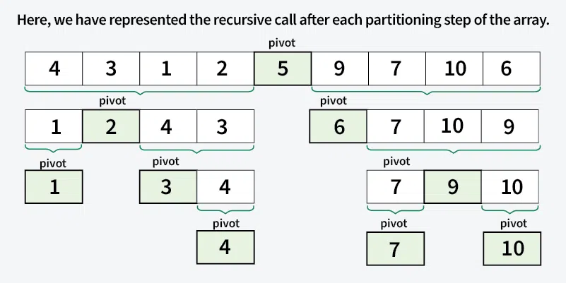
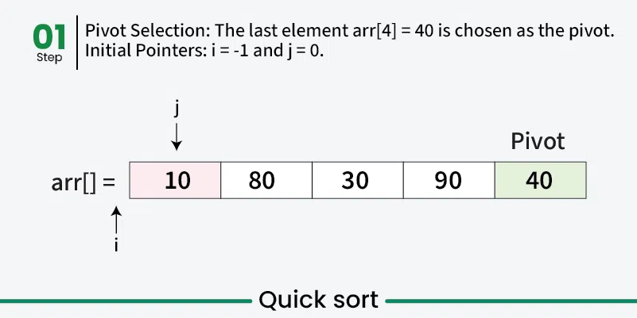
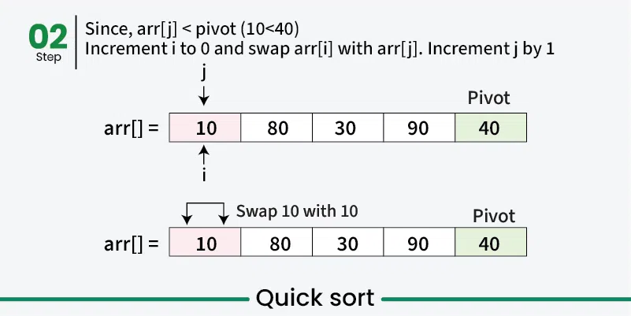
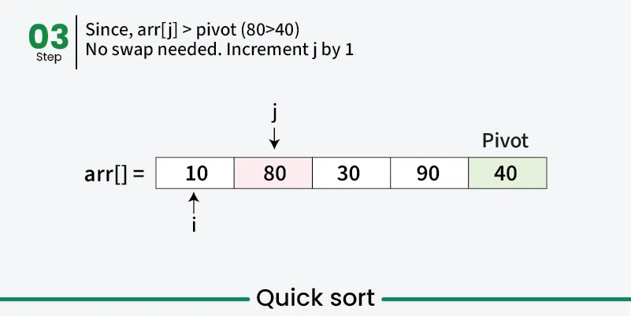
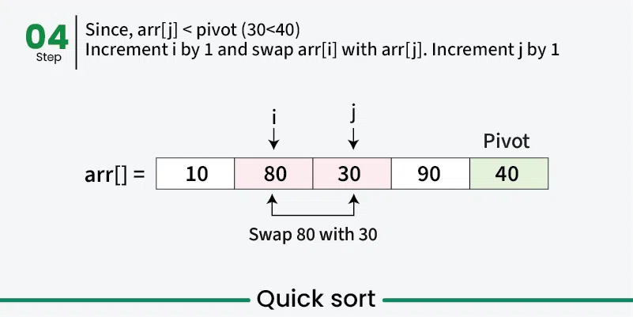
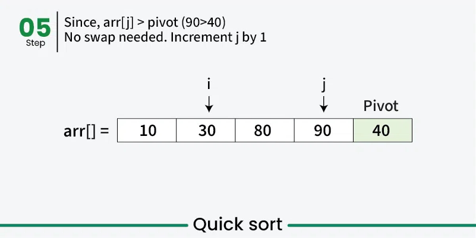
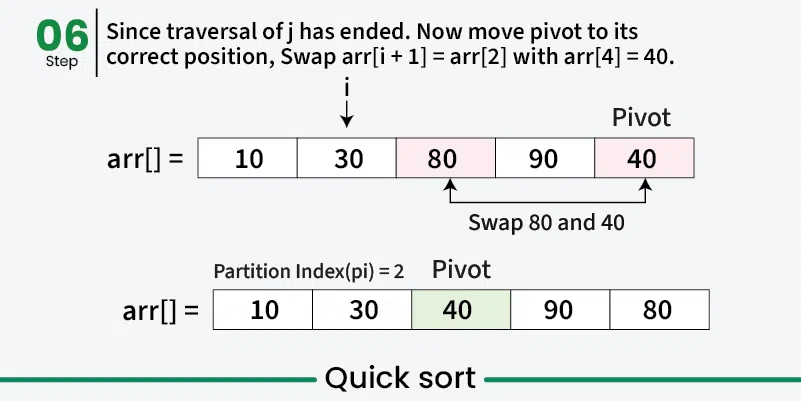
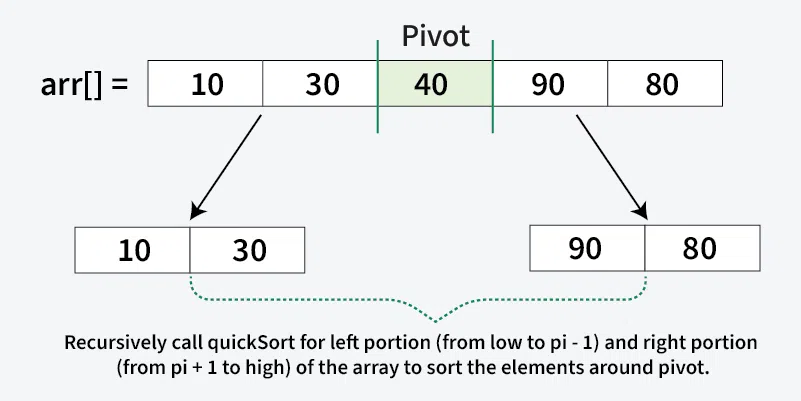

---

# Quick Sort

**Last Updated: 08 Dec, 2025**

## Introduction

Quick Sort is a **comparison-based sorting algorithm** that follows the **Divide and Conquer** paradigm. It works by selecting an element as a **pivot**, placing the pivot in its correct position, and **partitioning** the array such that elements smaller than the pivot are on its left and elements greater than the pivot are on its right. The same process is then applied recursively to the left and right subarrays.

Quick Sort is widely used because of its **high efficiency** and **low memory overhead**.

---

## Divide and Conquer Strategy in Quick Sort

Quick Sort operates through the following major steps:

1. **Choose a Pivot**
   Select an element from the array to act as the pivot. The pivot can be the first element, last element, a random element, or the median.

2. **Partition the Array**
   Rearrange the array so that all elements smaller than the pivot come before it and all elements greater than the pivot come after it. The pivot is placed in its correct sorted position.

3. **Recursive Calls**
   Recursively apply Quick Sort to the left and right subarrays formed around the pivot.

4. **Base Case**
   The recursion stops when a subarray contains only one element, as a single element is already sorted.

---

---

## Choice of Pivot

The performance of Quick Sort largely depends on how the pivot is chosen.

* **First or Last Element as Pivot**
  Simple to implement, but leads to the **worst-case** time complexity when the array is already sorted.

* **Random Pivot**
  Preferred approach as it avoids patterns that cause the worst-case scenario.

* **Median as Pivot**
  Ideal in theory because it divides the array into equal halves, but finding the median introduces additional overhead.

---

## Partitioning in Quick Sort

Partitioning is the **core operation** of Quick Sort and is done in linear time O(n). There are three common partitioning schemes:

1. **Naive Partition**

    * Uses an auxiliary array
    * Requires O(n) extra space

2. **Lomuto Partition**

    * Simple and easy to implement
    * Keeps track of the index of smaller elements
    * Used in this implementation

3. **Hoare’s Partition**

    * Faster and more efficient
    * Uses two pointers moving from both ends of the array

---

## Working of Lomuto Partition Scheme

* Choose the **last element** as the pivot.
* Maintain an index **i** for elements smaller than the pivot.
* Traverse the array:

    * If the current element is smaller than the pivot, swap it with the element at index **i**.
* After traversal, place the pivot at position **i + 1**, which is its correct position.

---

---

---

---

---

---

---
**Illustration of QuickSort Algorithm**

In the previous step, we looked at how the partitioning process rearranges the array based on the chosen pivot. Next, we apply the same method recursively to the smaller sub-arrays on the left and right of the pivot. Each time, we select new pivots and partition the arrays again. This process continues until only one element is left, which is always sorted. Once every element is in its correct position, the entire array is sorted.

Below image illustrates, how the recursive method calls for the smaller sub-arrays on the left and right of the pivot:

---

---

## Java Implementation of Quick Sort (Lomuto Partition)

```java
import java.util.Arrays;

class GfG {

    // Partition function
    static int partition(int[] arr, int low, int high) {

        // Choose the pivot
        int pivot = arr[high];

        // Index of smaller element
        int i = low - 1;

        for (int j = low; j <= high - 1; j++) {
            if (arr[j] < pivot) {
                i++;
                swap(arr, i, j);
            }
        }

        // Place pivot at correct position
        swap(arr, i + 1, high);
        return i + 1;
    }

    // Swap function
    static void swap(int[] arr, int i, int j) {
        int temp = arr[i];
        arr[i] = arr[j];
        arr[j] = temp;
    }

    // Quick Sort function
    static void quickSort(int[] arr, int low, int high) {
        if (low < high) {

            int pi = partition(arr, low, high);

            // Recursive calls
            quickSort(arr, low, pi - 1);
            quickSort(arr, pi + 1, high);
        }
    }

    public static void main(String[] args) {
        int[] arr = {10, 7, 8, 9, 1, 5};

        quickSort(arr, 0, arr.length - 1);

        for (int val : arr) {
            System.out.print(val + " ");
        }
    }
}
```

---

## Output

```
1 5 7 8 9 10
```

---

## Complexity Analysis of Quick Sort

### Time Complexity

* **Best Case**: Ω(n log n)
  Occurs when the pivot divides the array into two equal halves.

* **Average Case**: Θ(n log n)
  Occurs when the pivot divides the array into reasonably balanced partitions.

* **Worst Case**: O(n²)
  Occurs when the smallest or largest element is repeatedly chosen as the pivot (e.g., already sorted arrays).

### Space Complexity

* **Best Case**: O(log n)
  Due to balanced recursion tree.

* **Worst Case**: O(n)
  Due to highly unbalanced recursion tree.

---

## Advantages of Quick Sort

* Efficient for large datasets
* Low memory overhead
* Cache-friendly due to in-place sorting
* Fastest general-purpose sorting algorithm when stability is not required
* Tail recursive, allowing optimization

---

## Disadvantages of Quick Sort

* Poor pivot selection leads to worst-case O(n²) time complexity
* Not suitable for small datasets
* Not a stable sorting algorithm

---

## Applications of Quick Sort

* Sorting large datasets in memory
* Used in standard library functions (e.g., C++ `std::sort`, Java `Arrays.sort` for primitives)
* Database record sorting
* Preprocessing for binary search and two-pointer algorithms
* Finding kth smallest/largest element (Quickselect)
* Sorting objects with custom comparators
* Data compression preprocessing
* Computational geometry and graphics algorithms

---

## Summary

Quick Sort is a highly efficient, in-place sorting algorithm that uses divide and conquer to sort data quickly. While it has a worst-case time complexity of O(n²), its average-case performance and practical efficiency make it one of the most widely used sorting algorithms in real-world applications.

---

