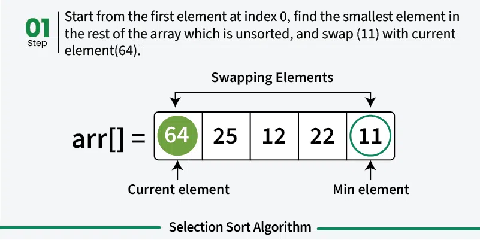
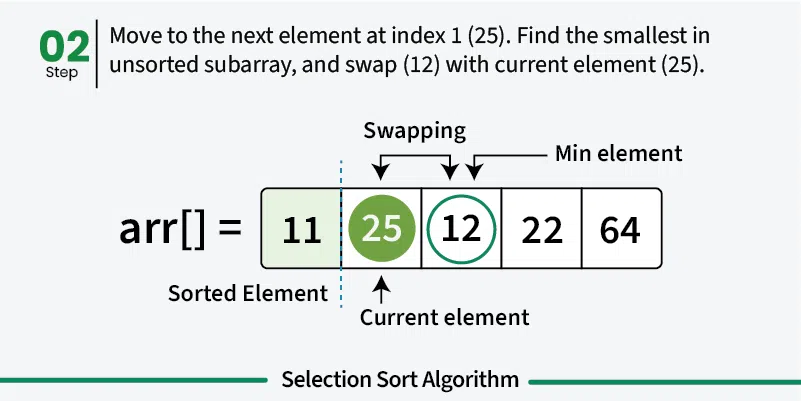
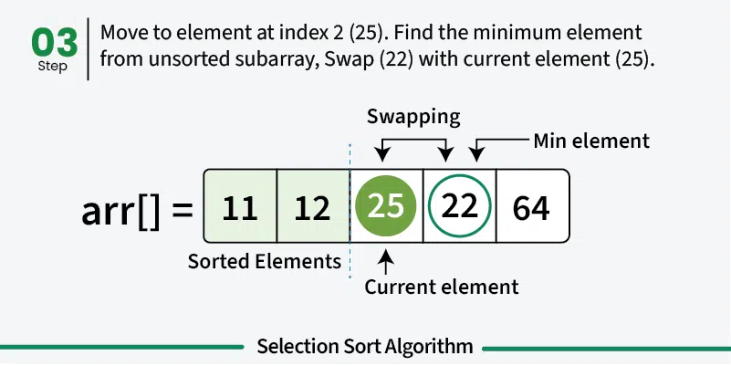
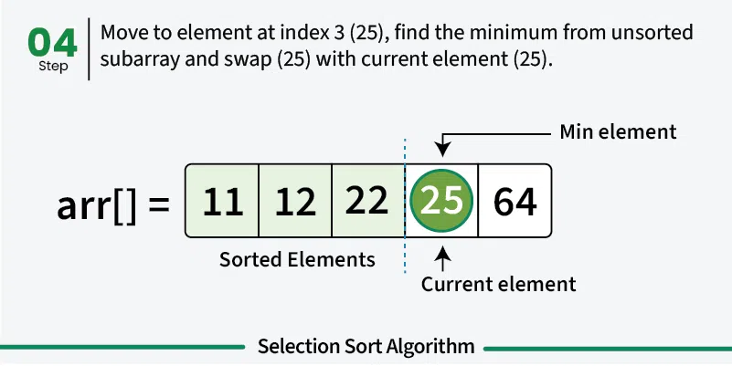
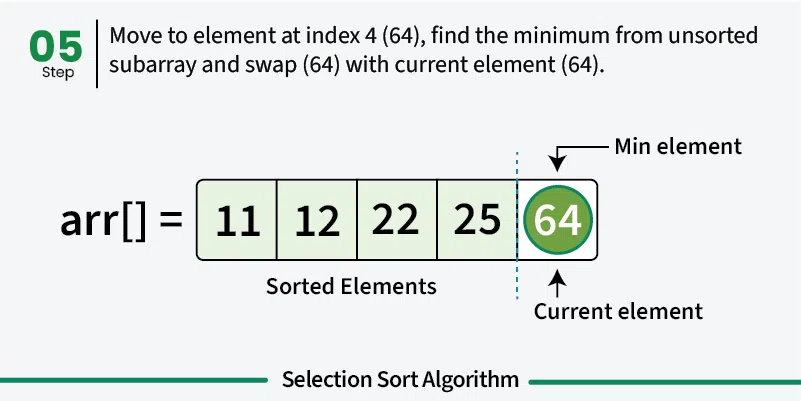
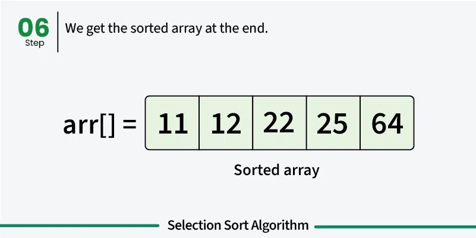

---

# Selection Sort

**Last Updated: 08 Dec, 2025**

## Introduction

Selection Sort is a **comparison-based sorting algorithm**. It works by repeatedly selecting the **smallest (or largest) element** from the unsorted portion of the array and **swapping it with the first unsorted element**. This process continues until the entire array is sorted.

Selection Sort is simple and easy to understand, making it a popular choice for **teaching basic sorting concepts**, although it is not efficient for large datasets.

---

## How Selection Sort Works

The Selection Sort algorithm divides the array into two parts:

* **Sorted portion** (at the beginning)
* **Unsorted portion** (remaining elements)

The algorithm follows these steps:

1. Find the **smallest element** in the array and swap it with the **first element**.
2. Find the **smallest element among the remaining unsorted elements** and swap it with the **second element**.
3. Continue this process, moving the boundary of the sorted portion one position forward each time.
4. Repeat until all elements are placed in their **correct positions**.

---

---

---

---

---

---

---

## Algorithm Steps

1. Start from the first element of the array.
2. Assume the current position contains the minimum element.
3. Compare this element with all remaining unsorted elements.
4. If a smaller element is found, update the minimum index.
5. Swap the minimum element with the element at the current position.
6. Move to the next position and repeat until the array is sorted.

---

## Java Implementation of Selection Sort

```java
// Java program for implementation of Selection Sort
import java.util.Arrays;

class GfG {

    static void selectionSort(int[] arr) {
        int n = arr.length;

        for (int i = 0; i < n - 1; i++) {

            // Assume the current position holds
            // the minimum element
            int min_idx = i;

            // Find the minimum element in the unsorted portion
            for (int j = i + 1; j < n; j++) {
                if (arr[j] < arr[min_idx]) {
                    min_idx = j;
                }
            }

            // Swap the found minimum element with the first element
            int temp = arr[i];
            arr[i] = arr[min_idx];
            arr[min_idx] = temp;
        }
    }

    static void printArray(int[] arr) {
        for (int val : arr) {
            System.out.print(val + " ");
        }
        System.out.println();
    }

    public static void main(String[] args) {
        int[] arr = {64, 25, 12, 22, 11};

        System.out.print("Original array: ");
        printArray(arr);

        selectionSort(arr);

        System.out.print("Sorted array: ");
        printArray(arr);
    }
}
```

---

## Output

```
Original array: 64 25 12 22 11
Sorted array:   11 12 22 25 64
```

---

## Complexity Analysis of Selection Sort

* **Time Complexity**

    * Best Case: O(n²)
    * Average Case: O(n²)
    * Worst Case: O(n²)

  This is because:

    * One loop selects elements one by one → O(n)
    * Another loop compares elements → O(n)
    * Overall complexity → O(n × n) = O(n²)

* **Auxiliary Space Complexity**

    * O(1), since only a few temporary variables are used

---

## Advantages of Selection Sort

* Easy to understand and implement
* Requires **constant extra space (O(1))**
* Performs **fewer swaps** compared to many other sorting algorithms
* Useful when **memory writes are costly**

---

## Disadvantages of Selection Sort

* Inefficient for large datasets due to O(n²) time complexity
* **Not a stable sorting algorithm**, as it may change the relative order of equal elements

---

## Applications of Selection Sort

* Teaching fundamental sorting concepts and algorithm design
* Suitable for **small datasets**
* Useful when **memory usage must be minimal**
* Forms the conceptual basis of the **Heap Sort algorithm**

---

## Frequently Asked Questions (FAQs)

**Q1: Is Selection Sort a stable sorting algorithm?**
No. Selection Sort is not stable because it can change the relative order of equal elements.

**Q2: What is the time complexity of Selection Sort?**
Selection Sort has a time complexity of **O(n²)** in the best, average, and worst cases.

**Q3: Does Selection Sort require extra memory?**
No. Selection Sort is an **in-place algorithm** and requires only **O(1)** extra space.

**Q4: When is it best to use Selection Sort?**
It is best suited for **small datasets**, **educational purposes**, or situations where **memory writes must be minimized**.

**Q5: How does Selection Sort differ from Bubble Sort?**
Selection Sort finds the minimum element and places it in the correct position using fewer swaps, while Bubble Sort repeatedly swaps adjacent elements to sort the array.

---

## Summary

Selection Sort is a simple, in-place sorting algorithm that repeatedly selects the smallest element and places it in its correct position. While it is not efficient for large datasets, it remains valuable for learning sorting fundamentals and understanding algorithm design principles.

---

