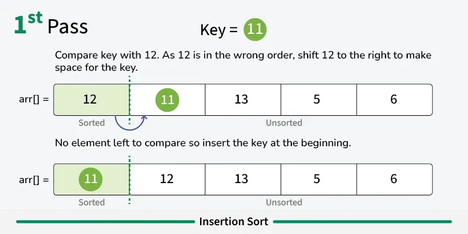
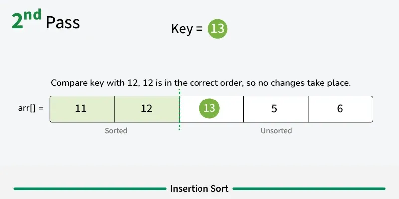
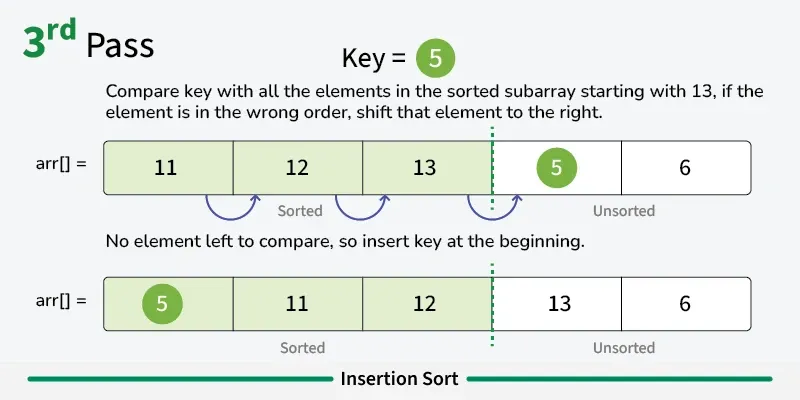
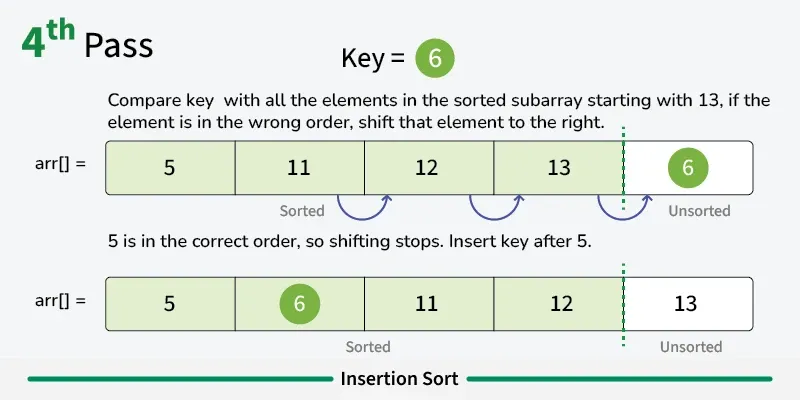
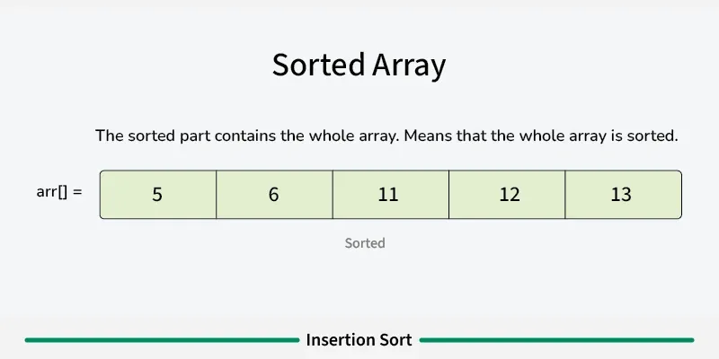
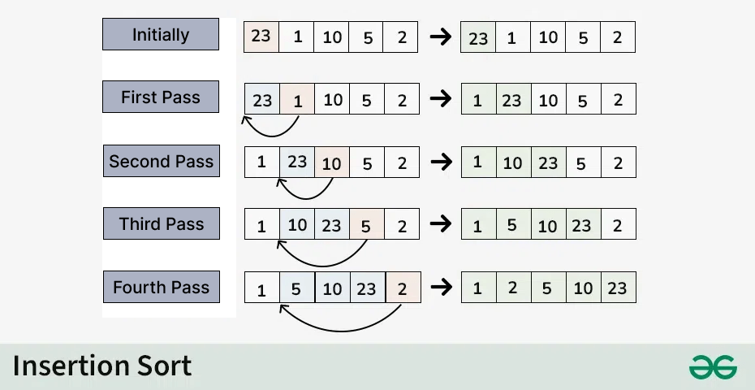

---

# Insertion Sort

**Last Updated: 06 Dec, 2025**

## Introduction

Insertion Sort is a **simple and intuitive sorting algorithm** that works by **iteratively inserting each element from an unsorted list into its correct position in a sorted portion of the list**.

It is often compared to **sorting playing cards in your hand**, where you pick one card at a time and insert it into the correct position among the already sorted cards.

---

## How Insertion Sort Works

Insertion Sort divides the array into two parts:

* **Sorted portion** (initially contains the first element)
* **Unsorted portion** (remaining elements)

The algorithm builds the sorted portion **one element at a time**.

### Step-by-Step Process

1. Assume the **first element is already sorted**.
2. Take the **second element** and compare it with the first.

    * If it is smaller, insert it before the first element.
3. Move to the **third element**, compare it with elements in the sorted portion, and place it in the correct position.
4. Repeat this process until **all elements are sorted**.

---

---

---

---

---

---

## Algorithm Steps

1. Start from index 1 (second element).
2. Store the current element as the **key**.
3. Compare the key with elements in the sorted portion.
4. Shift elements that are greater than the key one position to the right.
5. Insert the key at its correct position.
6. Repeat for all remaining elements.

---

## Java Implementation of Insertion Sort

```java
// Java program for implementation of Insertion Sort
public class InsertionSort {

    /* Function to sort array using insertion sort */
    void sort(int arr[]) {
        int n = arr.length;

        for (int i = 1; i < n; ++i) {
            int key = arr[i];
            int j = i - 1;

            // Move elements greater than key to one position ahead
            while (j >= 0 && arr[j] > key) {
                arr[j + 1] = arr[j];
                j = j - 1;
            }
            arr[j + 1] = key;
        }
    }

    /* Utility function to print the array */
    static void printArray(int arr[]) {
        for (int i = 0; i < arr.length; ++i)
            System.out.print(arr[i] + " ");
        System.out.println();
    }

    // Driver method
    public static void main(String args[]) {
        int arr[] = {12, 11, 13, 5, 6};

        InsertionSort ob = new InsertionSort();
        ob.sort(arr);

        printArray(arr);
    }
}
```

---

## Output

```
5 6 11 12 13
```

---

---

Consider the array:

```
{23, 1, 10, 5, 2}
```

**Initial:**
Current element is  23
The first element in the array is assumed to be sorted.
The sorted part until  0th  index is :  [23]

**First Pass:**
* Compare  1  with  23  (current element with the sorted part).
* Since  1  is smaller, insert  1  before  23  .
* The sorted part until  1st  index is:  [1, 23]

**Second Pass:**
* Compare  10  with  1  and  23  (current element with the sorted part).
* Since  10  is greater than  1  and smaller than  23  , insert  10  between  1  and  23  .
* The sorted part until  2nd  index is:  [1, 10, 23]

**Third Pass:**
* Compare  5  with  1  ,  10  , and  23  (current element with the sorted part).
* Since  5  is greater than  1  and smaller than  10  , insert  5  between  1  and  10
* The sorted part until  3rd  index is  :  [1, 5, 10, 23]

**Fourth Pass:**
* Compare  2  with  1, 5, 10  , and  23  (current element with the sorted part).
* Since  2  is greater than  1  and smaller than  5  insert  2  between  1  and  5  .
* The sorted part until  4th  index is:  [1, 2, 5, 10, 23]

**Final Array:**
* The sorted array is:  [1, 2, 5, 10, 23]

---

## Complexity Analysis of Insertion Sort

### Time Complexity

* **Best Case**: O(n)
  When the array is already sorted.
* **Average Case**: O(n²)
  When elements are in random order.
* **Worst Case**: O(n²)
  When the array is sorted in reverse order.

### Space Complexity

* **Auxiliary Space**: O(1)
  Insertion Sort is an **in-place sorting algorithm**.

---

## Advantages of Insertion Sort

* Simple and easy to implement
* **Stable sorting algorithm**
* Efficient for **small datasets**
* Performs well on **nearly sorted arrays**
* Space-efficient (in-place)
* **Adaptive**: fewer swaps when the array has fewer inversions

---

## Disadvantages of Insertion Sort

* Inefficient for large datasets
* Slower compared to advanced algorithms like Merge Sort and Quick Sort

---

## Applications of Insertion Sort

Insertion Sort is commonly used when:

* The dataset is **small or nearly sorted**
* Stability is important
* Used as a **subroutine in Bucket Sort**
* Used in **hybrid sorting algorithms** such as IntroSort and TimSort
* The array has very **few inversions**

---

## Important Concepts and FAQs

**Boundary Cases**

* Best performance when the array is already sorted → O(n)
* Worst performance when the array is reverse sorted → O(n²)

**Algorithmic Paradigm**

* Follows an **incremental approach**

**Is Insertion Sort in-place?**
Yes, it requires only constant extra space.

**Is Insertion Sort stable?**
Yes, it maintains the relative order of equal elements.

**When should Insertion Sort be used?**
When the number of elements is small or when the array is almost sorted.

---

## Summary

Insertion Sort is a simple, stable, and adaptive sorting algorithm that builds a sorted array incrementally. While it is not suitable for large datasets, it is highly effective for small or nearly sorted lists and plays a key role in hybrid sorting algorithms.

---

