---

# Introduction to Graph Data Structure

**Last Updated : 24 Nov, 2025**

---

## 1. What is a Graph Data Structure?

A **graph** is a **non-linear data structure** that is used to represent **relationships** between different objects.
It is made up of two main parts:

* **Vertices (nodes)** – represent objects
* **Edges (connections)** – represent relationships between objects

Unlike arrays, stacks, queues, or linked lists, a graph **does not follow a fixed sequence**. Any vertex can be connected to any other vertex.

### Simple Explanation for Beginners

Think of a graph as a **network**:

* People connected on social media
* Cities connected by roads
* Computers connected in a network

**Example:**
On a map:

* Each **city** is a vertex
* Each **road** is an edge

This helps us understand **how things are connected**, not the order in which they appear.

---
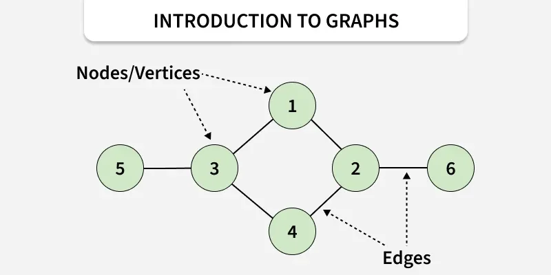
---

## 2. Basic Terminology Used in Graphs

Before learning types of graphs, it is important to understand some basic terms.

### 2.1 Vertex (Node)

A **vertex** is a point in a graph that represents an object.

* Also called a **node**
* Can represent a person, place, computer, or task
* Can be **labeled** (A, B, C) or **unlabeled**

**Example:**
In a social network, each user is a vertex.

---

### 2.2 Edge

An **edge** is a line that connects two vertices.

* Shows the relationship between two vertices
* Can connect any two vertices
* Also called an **arc**

Edges can be:

* **Directed** (one-way)
* **Undirected** (two-way)

**Example:**
A road between two cities is an edge.

---

## 3. Why Do We Need Graphs?

Graphs are used when:

* Relationships are more important than order
* Data is interconnected
* Problems involve networks, paths, or dependencies

Graphs help solve problems like:

* Finding the shortest route
* Detecting connections
* Organizing dependent tasks

---

## 4. Types of Graphs Based on Edge Weights

### 4.1 Weighted Graph

A **weighted graph** is a graph in which each edge has a **weight**.

* Weight represents **distance, cost, or time**
* Used when not all connections are equal

**Examples:**

* Distance between cities
* Cost of travel
* Time taken to reach a destination

**Real-Life Example:**
Google Maps uses weighted graphs to find the shortest route.

---
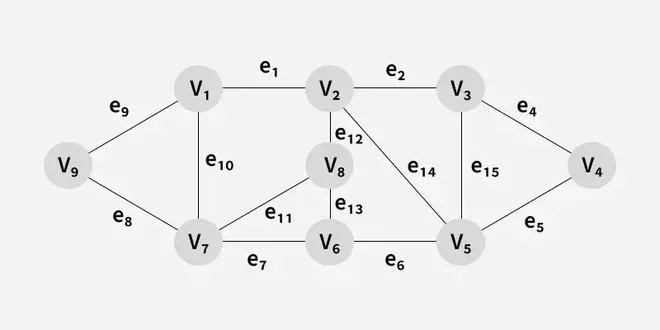
---

### 4.2 Unweighted Graph

An **unweighted graph** is a graph where all edges are treated the same.

* No extra values like cost or distance
* Only shows whether a connection exists

**Examples:**

* Basic friendship networks
* Simple metro maps

---
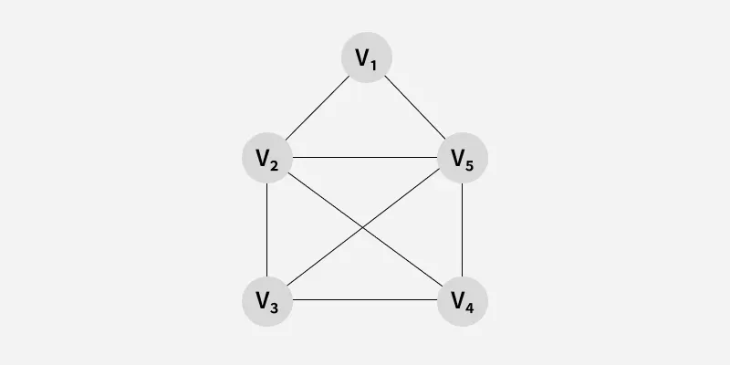
---

## 5. Types of Graphs Based on Edge Direction

### 5.1 Undirected Graph

In an **undirected graph**, edges have **no direction**.

* You can move in both directions
* Connection is mutual

**Examples:**

* Two-way roads
* Friendships on social media

---
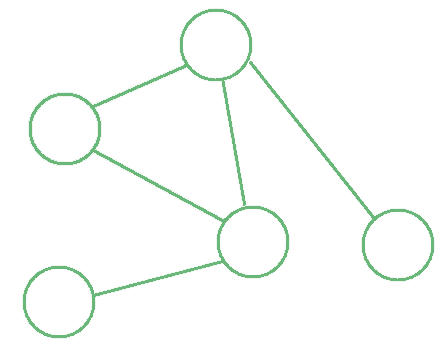
---

### 5.2 Directed Graph

In a **directed graph**, each edge has a **direction**.

* Represented using arrows
* Movement is only allowed in one direction

**Examples:**

* One-way roads
* Web page links
* Task dependencies

---
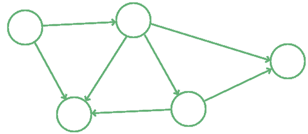
---

## 6. Types of Graphs Based on Size

### 6.1 Finite Graph

A **finite graph** has:

* A limited number of vertices
* A limited number of edges

Most graphs used in programming are finite graphs.

---
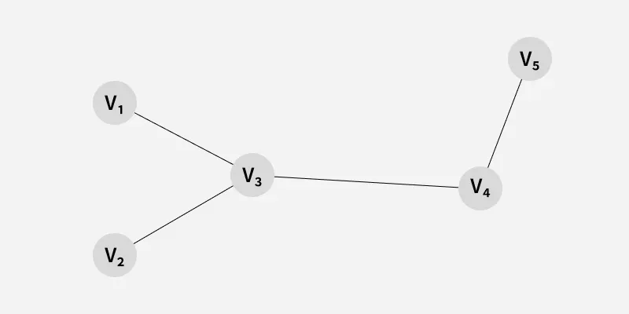
---

### 6.2 Infinite Graph

An **infinite graph** has:

* An infinite number of vertices
* An infinite number of edges

These graphs are mainly studied in **theory** and not used in practical programs.

---
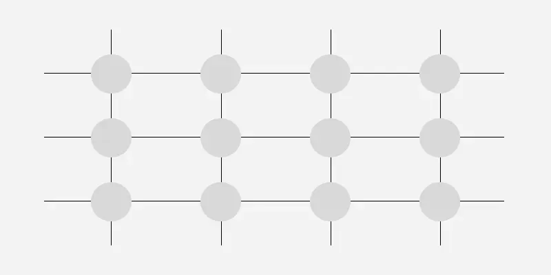
---

## 7. Types of Graphs Based on Structure

### 7.1 Trivial Graph

A **trivial graph**:

* Has only **one vertex**
* Has **no edges**

It is the simplest possible graph.

---
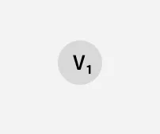
---

### 7.2 Simple Graph

A **simple graph**:

* Has **no self-loops**
* Has **no multiple edges** between the same vertices

**Example:**
A railway track where only one route exists between cities.

---
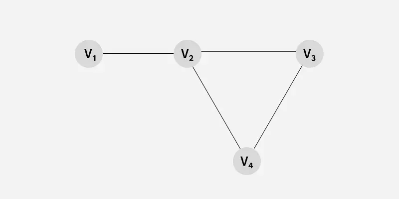
---

### 7.3 Multigraph

A **multigraph**:

* Allows **multiple edges** between the same vertices
* Does not allow self-loops

**Parallel Edges:**
More than one connection between the same two vertices.

**Example:**
Multiple roads connecting the same two cities.

---
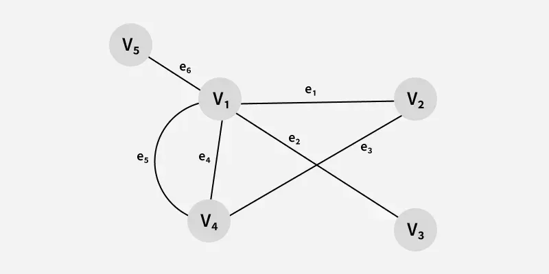
---

### 7.4 Null Graph

A **null graph**:

* Has vertices
* Has **no edges**

All vertices are isolated.

---
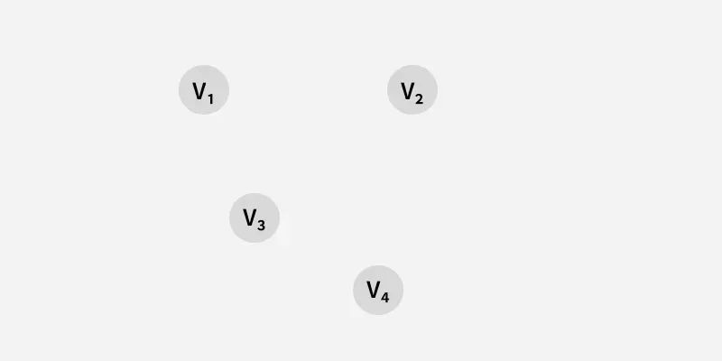
---

### 7.5 Complete Graph

A **complete graph**:

* Every vertex is connected to every other vertex
* Degree of each vertex is **n − 1**

Also called a **full graph**.

---
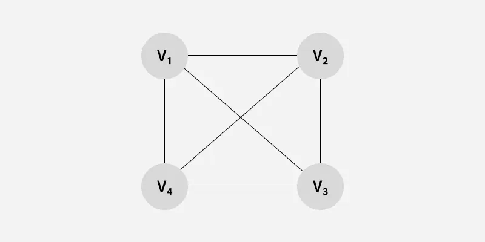
---

## 8. Special Types of Graphs

### 8.1 Pseudograph

A **pseudograph** allows:

* **Self-loops** (edge connects a vertex to itself)
* **Multiple edges**

---
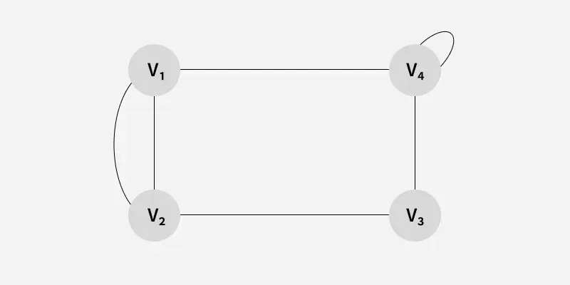
---

### 8.2 Regular Graph

A **regular graph**:

* Every vertex has the **same number of edges**

**Example:**
If every vertex has exactly 3 edges, the graph is 3-regular.

---
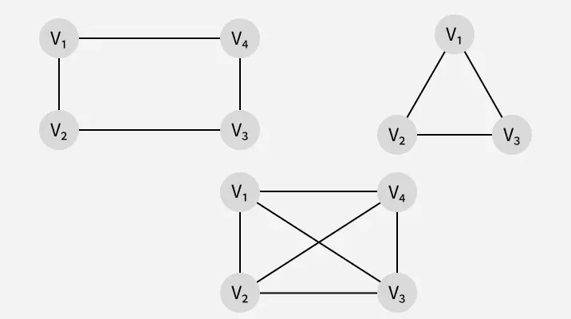
---

## 9. Types of Graphs Based on Density

### 9.1 Sparse Graph

A **sparse graph**:

* Has very few edges
* Most vertices are lightly connected

**Example:**
Chemical reaction networks.

---
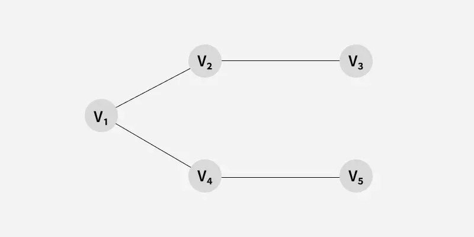
---

### 9.2 Dense Graph

A **dense graph**:

* Has many edges
* Most vertices are connected

**Example:**
Social networks.

---

---

## 10. Types of Graphs Based on Connectivity

### Connected Graph

A graph is **connected** if:

* There is at least one path between every pair of vertices

### Disconnected Graph

A graph is **disconnected** if:

* Some vertices cannot be reached from others

---
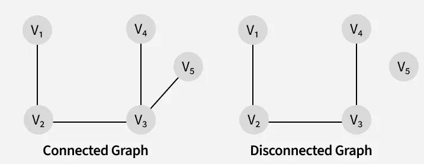
---

## 11. Types of Graphs Based on Cycles

### 11.1 Cyclic Graph

A **cyclic graph** contains at least one cycle.

* A cycle starts and ends at the same vertex
* Contains three or more vertices

---
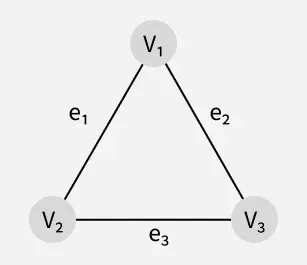
---

### 11.2 Tree

A **tree** is a special type of graph:

* Connected
* Contains no cycles
* Only one path exists between any two vertices

---
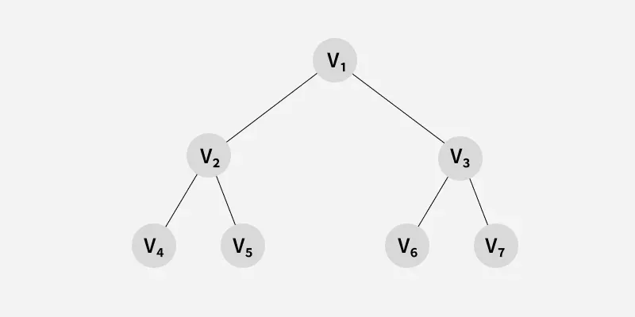
---

## 12. Representation of Graph Data Structure

### 12.1 Adjacency Matrix

In this method:

* A **2D matrix** is used
* Rows and columns represent vertices

**Rules:**

* matrix[i][j] = 1 → edge exists
* matrix[i][j] = 0 → no edge

Best for **dense graphs**.

---
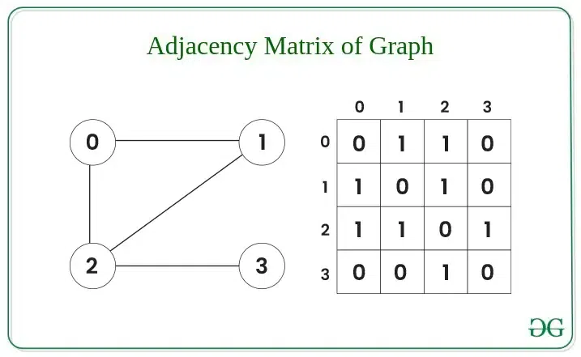
---

### 12.2 Adjacency List

In this method:

* Each vertex stores a list of connected vertices
* Efficient for **sparse graphs**

---
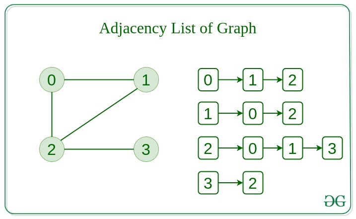
---

## 13. Difference Between Tree and Graph

| Tree                   | Graph                   |
| ---------------------- | ----------------------- |
| No cycles              | May have cycles         |
| Always connected       | May be disconnected     |
| One path between nodes | Multiple paths possible |

Every tree is a graph, but not every graph is a tree.

---
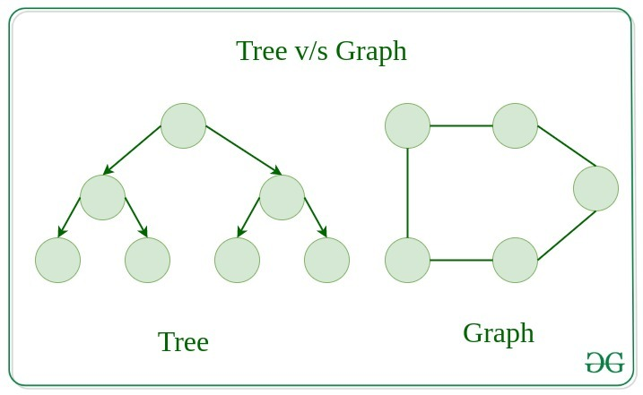
---

## 14. Graph Traversal Techniques

### 14.1 Depth First Search (DFS)

* Explores one path fully before moving to another
* Uses **stack or recursion**

---

### 14.2 Breadth First Search (BFS)

* Explores all neighbors first
* Uses a **queue**

---

## 15. Real-Life Applications of Graphs

Graph Data Structure has numerous real-life applications across various fields. Some of them are listed below:

---
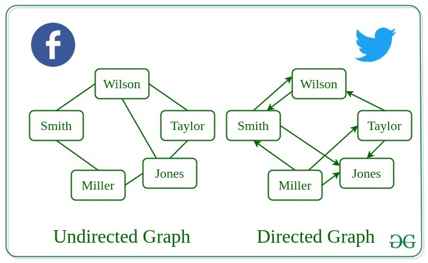
---

- **Social Networks:** Represent users and their connections; used to find mutual friends, suggest new connections, and detect communities.
- **Computer Networks:** Model routers and data links; used for efficient routing, fault detection, and network optimization.
- **Transportation Networks:** Represent cities and routes; used to find shortest or fastest paths and plan optimal travel routes.
- **Neural Networks:** Represent neurons and synapses; used to simulate learning, brain behavior, and data processing.
- **Compilers:** Represent data dependencies and control flows; used for optimization, register allocation, and code analysis.
- **Robot Path Planning:** Represent states and transitions; used to compute the safest or shortest route for autonomous movement.
- **Project Dependencies:** Represent tasks and dependencies; used in topological sorting to determine the correct execution order.
- **Network Optimization:** Represent network nodes and links; used to minimize cost, reduce latency, and improve efficiency.

---

## 16. Advantages of Graph Data Structure

- **Graphs are flexible:** Unlike arrays, linked lists, or trees, graphs have no restrictions and can represent any type of relationship.
- **Model real-world problems:** Useful for pathfinding, data clustering, network analysis, and machine learning.
- **Represent items and relationships:** Any set of items and their connections can be modeled as a graph.
- **Simplifies complex data:** Graphs make complex relationships easy to visualize and understand.

---

