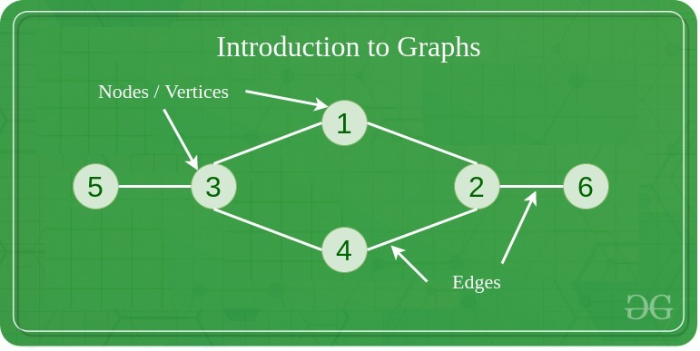
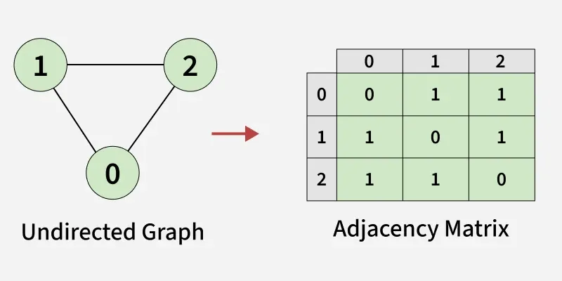
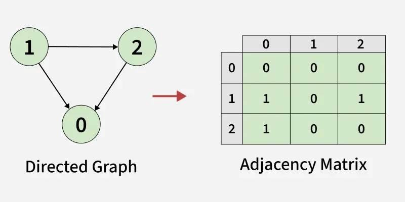
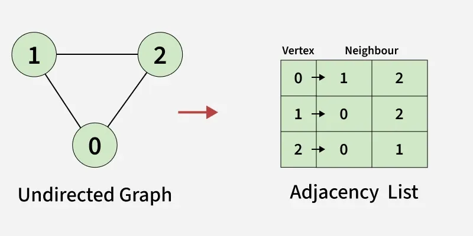
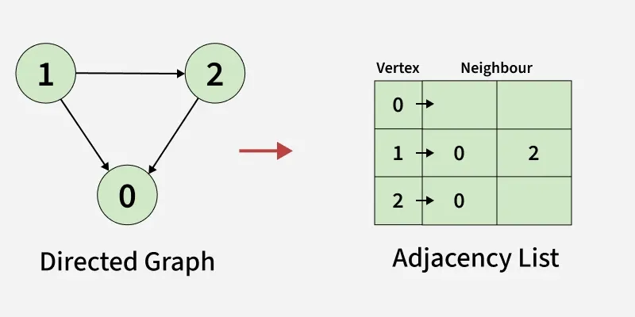

---

# Representation of Graphs

**Last Updated : 29 Oct, 2025**

## Representation of Graph

A Graph is a non-linear data structure consisting of vertices and edges. The vertices are sometimes also referred to as nodes and the edges are lines or arcs that connect any two nodes in the graph. More formally a Graph is composed of a set of vertices(V) and a set of edges(E). The graph is denoted by G(V, E).

---

---

## Representations of Graph

Here are the two most common ways to represent a graph : For simplicity, we are going to consider only unweighted graphs in this post.

* Adjacency Matrix
* Adjacency List

---

## Adjacency Matrix

### Adjacency Matrix Representation

An adjacency matrix is a way of representing a graph as a boolean matrix of (0's and 1's).

Let's assume there are n vertices in the graph So, create a 2D matrix adjMat[n][n] having dimension n x n.

If there is an edge from vertex i to j, mark adjMat[i][j] as 1.
If there is no edge from vertex i to j, mark adjMat[i][j] as 0.

---

### Representation of Undirected Graph as Adjacency Matrix:

We use an adjacency matrix to represent connections between vertices.
Initially, the entire matrix is filled with 0s, meaning no edges exist.
There is an edge between vertex 0 and vertex 1,so we set mat[0][1] = 1 and mat[1][0] = 1.
There is an edge between vertex 0 and vertex 2,so we set mat[0][2] = 1 and mat[2][0] = 1.
There is an edge between vertex 1 and vertex 2,so we set mat[1][2] = 1 and mat[2][1] = 1.

---

---

```java
import java.util.ArrayList;
import java.util.Collections;
​
public class GFG {
​
    static ArrayList<ArrayList<Integer>> createGraph(int V, int[][] edges) {
        ArrayList<ArrayList<Integer>> mat = new ArrayList<>();
​
        // Initialize the matrix with 0
        for (int i = 0; i < V; i++) {
            ArrayList<Integer> row = new ArrayList<>(Collections.nCopies(V, 0));
            mat.add(row);
        }
​
        // Add each edge to the adjacency matrix
        for (int[] it : edges) {
            int u = it[0];
            int v = it[1];
            mat.get(u).set(v, 1);
            
             // since the graph is undirected
            mat.get(v).set(u, 1); 
        }
        return mat;
    }
​
    public static void main(String[] args) {
        int V = 3;
​
        // List of edges (u, v)
        int[][] edges = {
            {0, 1},
            {0, 2},
            {1, 2}
        };
​
        // Build the graph using edges
        ArrayList<ArrayList<Integer>> mat = createGraph(V, edges);
​
        System.out.println("Adjacency Matrix Representation:");
        for (int i = 0; i < V; i++) {
            for (int j = 0; j < V; j++)
                System.out.print(mat.get(i).get(j) + " ");
            System.out.println();
        }
    }
}
```
---

### Output

```
Adjacency Matrix Representation:
0 1 1 
1 0 1 
1 1 0 
```

---

## Representation of Directed Graph as Adjacency Matrix:

Initially, the entire matrix is filled with 0s, meaning no edges exist.
Unlike an undirected graph, we do not set mat[destination][source] because the edge goes in only one direction.
There is an edge between vertex 1 and vertex 0,so we set mat[1][0] = 1.
There is an edge between vertex 2 and vertex 0,so we set mat[2][0] = 1.
There is an edge between vertex 1 and vertex 2,so we set mat[1][2] = 1.

---

---

```java
import java.util.ArrayList;
import java.util.Collections;
​
public class GFG {
​
    static ArrayList<ArrayList<Integer>> createGraph(int V, int[][] edges) {
        ArrayList<ArrayList<Integer>> mat = new ArrayList<>();
​
        // Initialize the matrix with 0
        for (int i = 0; i < V; i++) {
            ArrayList<Integer> row = new ArrayList<>(Collections.nCopies(V, 0));
            mat.add(row);
        }
​
        // Add each edge to the adjacency matrix
        for (int[] it : edges) {
            int u = it[0];
            int v = it[1];
            mat.get(u).set(v, 1);
        }
        return mat;
    }
​
    public static void main(String[] args) {
        int V = 3;
​
        // List of edges (u, v)
        int[][] edges = {{1, 0},{2, 0},{1, 2}};
​
        // Build the graph using edges
        ArrayList<ArrayList<Integer>> mat = createGraph(V, edges);
​
        System.out.println("Adjacency Matrix Representation:");
        for (int i = 0; i < V; i++) {
            for (int j = 0; j < V; j++)
                System.out.print(mat.get(i).get(j) + " ");
            System.out.println();
        }
    }
}
```

---

### Output

```
Adjacency Matrix Representation:
0 0 0 
1 0 1 
1 0 0 
```

---

## Adjacency List Representation

An array of Lists is used to store edges between two vertices. The size of array is equal to the number of vertices (i.e, n). Each index in this array represents a specific vertex in the graph. The entry at the index i of the array contains a linked list containing the vertices that are adjacent to vertex i. Let's assume there are n vertices in the graph So, create an array of list of size n as adjList[n].

adjList[0] will have all the nodes which are connected (neighbour) to vertex 0.
adjList[1] will have all the nodes which are connected (neighbour) to vertex 1 and so on.

---

---

## Representation of Undirected Graph as Adjacency list:

We use an array of lists (or vector of lists) to represent the graph.
The size of the array is equal to the number of vertices (here, 3).
Each index in the array represents a vertex.
Vertex 0 has two neighbours (1 and 2).
Vertex 1 has two neighbours (0 and 2).
Vertex 2 has two neighbours (0 and 1).

---

```java
import java.util.ArrayList;
​
public class GFG {
​
    static ArrayList<ArrayList<Integer>> createGraph(int V, int[][] edges) {
        ArrayList<ArrayList<Integer>> adj = new ArrayList<>();
        for (int i = 0; i < V; i++)
            adj.add(new ArrayList<>());
​
        // Add each edge to the adjacency list
        for (int i = 0; i < edges.length; i++) {
            int u = edges[i][0];
            int v = edges[i][1];
            adj.get(u).add(v);
            
             // since the graph is undirected
            adj.get(v).add(u); 
        }
        return adj;
    }
​
    public static void main(String[] args) {
        int V = 3;
​
        // List of edges (u, v)
        int[][] edges = { {0, 1}, {0, 2}, {1, 2} };
​
        // Build the graph using edges
        ArrayList<ArrayList<Integer>> adj = createGraph(V, edges);
​
        System.out.println("Adjacency List Representation:");
        for (int i = 0; i < V; i++) {
            
            // Print the vertex
            System.out.print(i + ": "); 
            for (int j : adj.get(i)) {
                
                // Print its adjacent
                System.out.print(j + " "); 
            }
            System.out.println(); 
        }
    }
}
```
---

### Output

```
Adjacency List Representation:
0: 1 2 
1: 0 2 
2: 0 1 
```

---

## Representation of Directed Graph as Adjacency list:

We use an array of lists (or vector of lists) to represent the graph.
The size of the array is equal to the number of vertices (here, 3).
Each index in the array represents a vertex.
Vertex 0 has no neighbours
Vertex 1 has two neighbours (0 and 2).
Vertex 2 has 1 neighbours (0).

---

---

```java
import java.util.ArrayList;
​
public class GFG {
​
    static ArrayList<ArrayList<Integer>> createGraph(int V, int[][] edges) {
        ArrayList<ArrayList<Integer>> adj = new ArrayList<>();
        for (int i = 0; i < V; i++)
            adj.add(new ArrayList<>());
​
        // Add each edge to the adjacency list
        for (int i = 0; i < edges.length; i++) {
            int u = edges[i][0];
            int v = edges[i][1];
            adj.get(u).add(v);
 
        }
        return adj;
    }
​
    public static void main(String[] args) {
        int V = 3;
​
        // List of edges (u, v)
        int[][] edges = { {1, 0}, {1, 2}, {2, 0} };
​
        // Build the graph using edges
        ArrayList<ArrayList<Integer>> adj = createGraph(V, edges);
​
        System.out.println("Adjacency List Representation:");
        for (int i = 0; i < V; i++) {
            
            // Print the vertex
            System.out.print(i + ": "); 
            for (int j : adj.get(i)) {
                
                // Print its adjacent
                System.out.print(j + " "); 
            }
            System.out.println(); 
        }
    }
}
```

---

### Output

```
Adjacency List Representation:
0: 
1: 0 2 
2: 0 
```

---

