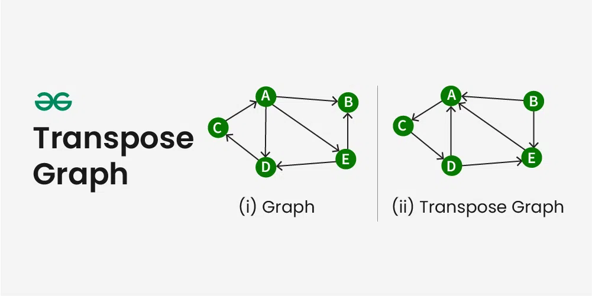

---

# Transpose Graph

## Transpose of a Directed Graph

The **transpose of a directed graph G** is another directed graph on the **same set of vertices** with **all of the edges reversed** compared to the orientation of the corresponding edges in **G**.

That is, if **G contains an edge (u, v)** then the **converse / transpose / reverse of G** contains an edge **(v, u)** and vice versa.

Given a graph **(represented as adjacency list)**, we need to find another graph which is the **transpose of the given graph**.

---

---

## Example: Transpose Graph

**Input** : figure (i) is the input graph.
**Output** : figure (ii) is the transpose graph of the given graph.

---

## Approach to Find the Transpose of a Graph

We traverse the **adjacency list** and as we find a vertex **v** in the adjacency list of vertex **u**, which indicates an edge from **u to v** in the main graph, we just add an edge from **v to u** in the transpose graph i.e. add **u** in the adjacency list of vertex **v** of the new graph.

Thus traversing lists of all vertices of the main graph we can get the transpose graph.

Thus the total time complexity of the algorithm is **O(V + E)** where **V** is number of vertices of graph and **E** is the number of edges of the graph.

**Note** : It is simple to get the transpose of a graph which is stored in adjacency matrix format, you just need to get the transpose of that matrix.

---

## Implementation

```java
// Java program to find the transpose of a graph
import java.util.*;
import java.lang.*;
import java.io.*;
​
class Graph
{
    // Total number of vertices
    private static int vertices = 5;
    
    // Find transpose of graph represented by adj
    private static ArrayList<Integer>[] adj = new ArrayList[vertices];
   
    // Store the transpose of graph represented by tr
    private static ArrayList<Integer>[] tr = new ArrayList[vertices];
​
    // Function to add an edge from source vertex u to 
    // destination vertex v, if choice is false the edge is added
    // to adj otherwise the edge is added to tr
    public static void addedge(int u, int v, boolean choice)
    {
        if(!choice)
            adj[u].add(v);
        else
            tr[u].add(v);
    }
​
    // Function to print the graph representation
    public static void printGraph()
    {
        for(int i = 0; i < vertices; i++)
        {
            System.out.print(i + "--> ");
            for(int j = 0; j < tr[i].size(); j++)
                System.out.print(tr[i].get(j) + " ");
            System.out.println();
        }
    }
​
    // Function to print the transpose of 
    // the graph represented as adj and store it in tr
    public static void getTranspose()
    {
​
        // Traverse the graph and for each edge u, v 
        // in graph add the edge v, u in transpose
        for(int i = 0; i < vertices; i++)
            for(int j = 0; j < adj[i].size(); j++)
                addedge(adj[i].get(j), i, true);
    }
​
    public static void main (String[] args) throws java.lang.Exception
    {
        for(int i = 0; i < vertices; i++)
        {
            adj[i] = new ArrayList<Integer>();
            tr[i] = new ArrayList<Integer>();
        }
        addedge(0, 1, false);
        addedge(0, 4, false);
        addedge(0, 3, false);
        addedge(2, 0, false);
        addedge(3, 2, false);
        addedge(4, 1, false);
        addedge(4, 3, false);
        
        // Finding transpose of the graph 
        getTranspose();
        
        // Printing the graph representation
        printGraph();
    }
}
​
// This code is contributed by code_freak
```

---

## Output

```
0--> 2  
1--> 0  4  
2--> 3  
3--> 0  4  
4--> 0  
```

---

## Time Complexity

The time complexity of the **addEdge function** is **O(1)**, as it simply appends an element to the vector.

The time complexity of the **displayGraph function** is **O(V + E)**, where **V** is the number of vertices and **E** is the number of edges, as it needs to traverse the adjacency list of each vertex and print out the adjacent vertices.

The time complexity of the **transposeGraph function** is also **O(V + E)**, where **V** is the number of vertices and **E** is the number of edges, as it needs to traverse the adjacency list of each vertex and add the corresponding edges to the transpose graph's adjacency list.

Therefore, the **overall time complexity** of the program is **O(V + E)**.

---

## Space Complexity

In terms of space complexity, the program uses **two arrays of vectors** to represent the original graph and its transpose, each of which has a size of **V** (the number of vertices).

Additionally, the program uses a **constant amount of space** to store integer variables and temporary data structures.

Therefore, the space complexity of the program is **O(V)**.

Note that the space complexity of the program could be larger if the input graph has a large number of edges, as this would require more memory to store the adjacency lists.

---
