---

# Breadth First Search (BFS) in Graphs

**Last Updated: 6 Dec, 2025**

---

## 1. Introduction to Breadth First Search (BFS)

**Breadth First Search (BFS)** is a **graph traversal algorithm** that starts from a **source node** and explores the graph **level by level**.

* First, BFS visits all vertices **directly adjacent** to the source.
* Then, it visits the neighbours of those vertices.
* This process continues until **all reachable vertices** are visited.

BFS ensures that **closer vertices are visited before farther ones**, making it fundamentally different from Depth First Search (DFS).

---

## 2. Key Characteristics of BFS

* Traverses vertices **level by level**
* Visits **closest vertices first**
* Uses a **queue** data structure
* Requires a **visited array** to avoid revisiting vertices
* Works for **both directed and undirected graphs**

---

## 3. BFS vs DFS (Conceptual Difference)

| BFS                                      | DFS                              |
| ---------------------------------------- | -------------------------------- |
| Explores level by level                  | Explores depth first             |
| Uses a queue                             | Uses stack / recursion           |
| Finds shortest path in unweighted graphs | Does not guarantee shortest path |
| More memory usage                        | Less memory usage                |

---

## 4. Importance and Use of BFS

Many popular graph algorithms are based on BFS or BFS-like traversal, including:

* **Dijkstra’s shortest path algorithm**
* **Kahn’s Algorithm**
* **Prim’s Algorithm**

BFS itself is used to:

* Detect cycles in graphs
* Find shortest paths in **unweighted graphs**
* Explore connected components

---

## 5. BFS Traversal Example (Connected Graph)

### Input

```
adj[][] = [[1, 2], [0, 2], [0, 1, 3, 4], [2], [2]]
```
---
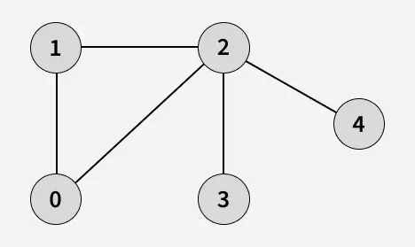
---

### Output

```
[0, 1, 2, 3, 4]
```

### Explanation

Starting BFS from vertex **0**:

1. Visit 0 → Print 0
2. Visit 1 (neighbor of 0) → Print 1
3. Visit 2 (next neighbor of 0) → Print 2
4. Visit 3 (neighbor of 2 not yet visited) → Print 3
5. Visit 4 (next neighbor of 2) → Print 4

---

## 6. BFS Traversal Example (Disconnected Graph)

### Input

```
adj[][] = [[2, 3], [2], [0, 1], [0], [5], [4]]
```
---
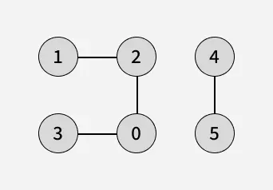
---

### Output

```
[0, 2, 3, 1, 4, 5]
```

### Explanation

Start BFS from **vertex 0**:

* Visit 0 → Print 0
* Visit 2 → Print 2
* Visit 3 → Print 3
* Visit 1 → Print 1

Since vertices **4 and 5** are not connected to 0, BFS restarts:

* Visit 4 → Print 4
* Visit 5 → Print 5

This ensures **all vertices** are visited.

---

## 7. BFS from a Given Source (Undirected Graph)

### Algorithm Overview

* Start BFS from a **given source vertex**
* Use a **queue** to maintain traversal order
* Use a **visited array** to avoid revisiting nodes
* Visit vertices in **increasing order of distance** from the source

---
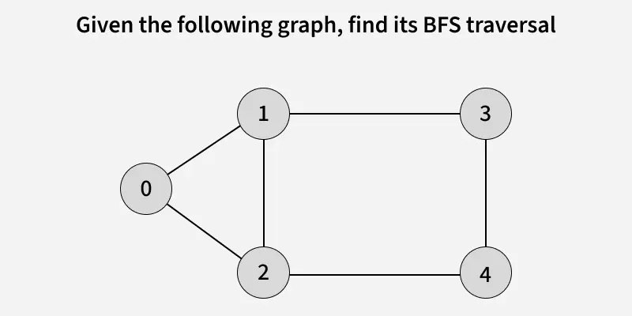
---
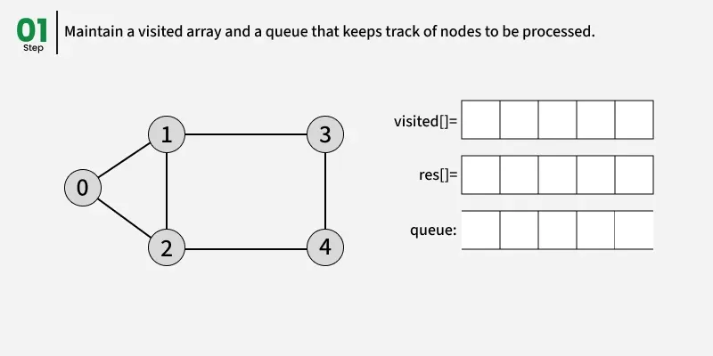
---
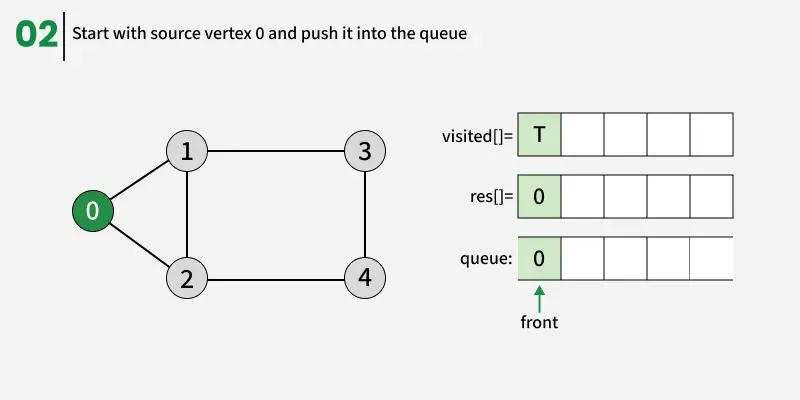
---
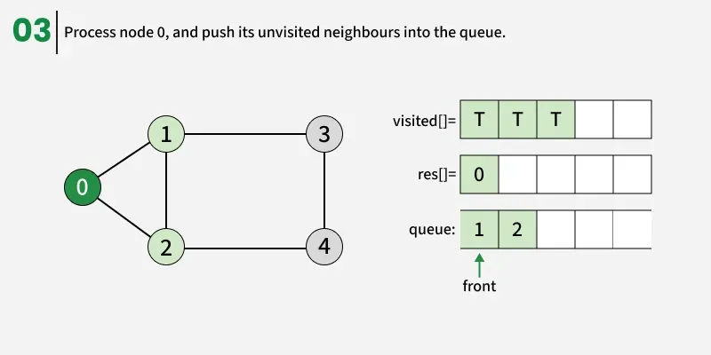
---
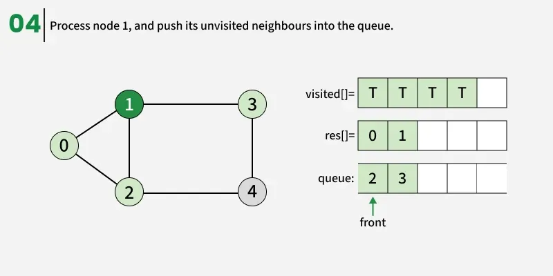
---
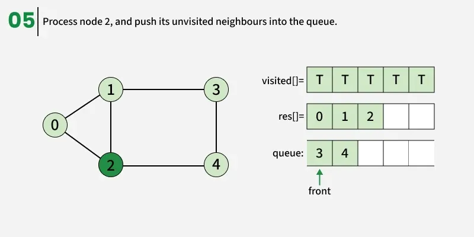
---
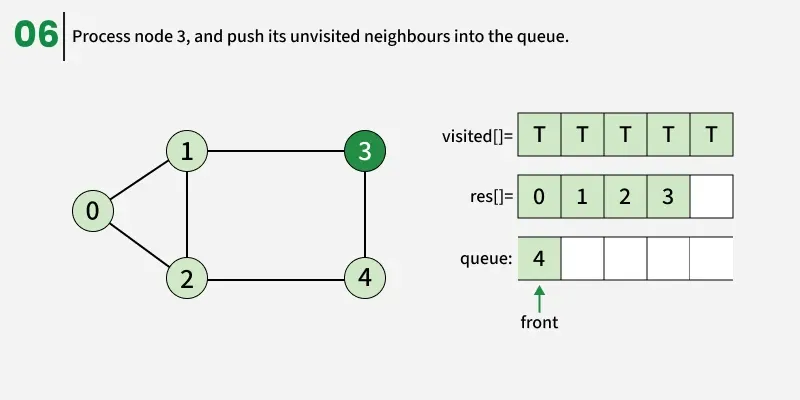
---
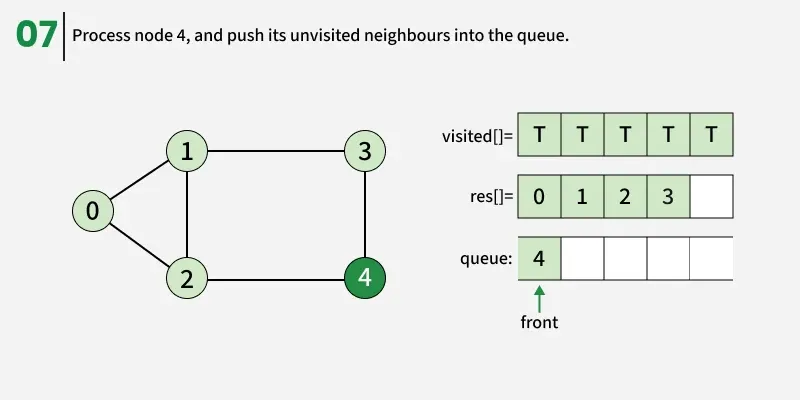
---
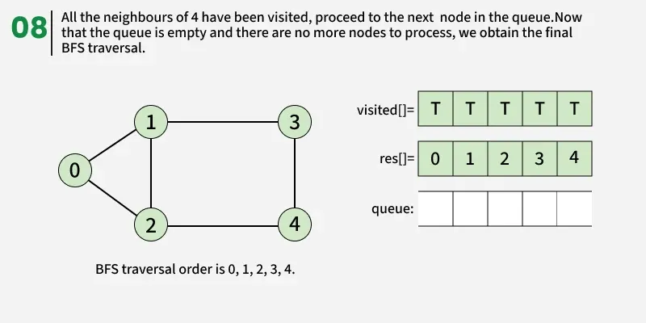
---

### Java Implementation (Single Connected Component)

```java
static ArrayList<Integer> bfs(ArrayList<ArrayList<Integer>> adj) {
    int V = adj.size();
    boolean[] visited = new boolean[V];
    ArrayList<Integer> res = new ArrayList<>();
    
    int src = 0;
    Queue<Integer> q = new LinkedList<>();
    visited[src] = true;
    q.add(src);

    while (!q.isEmpty()) {
        int curr = q.poll();
        res.add(curr);

        for (int x : adj.get(curr)) {
            if (!visited[x]) {
                visited[x] = true;
                q.add(x);
            }
        }
    }
    return res;
}
```

### Output

```
0 1 2 3 4
```

---

## 8. BFS of a Disconnected Undirected Graph

In a **disconnected graph**, a single BFS traversal is not sufficient.

### Strategy:

* Loop through all vertices
* If a vertex is **unvisited**, start BFS from it
* This ensures all **connected components** are explored

---

### Java Implementation (All Components)

```java
static void bfsConnected(ArrayList<ArrayList<Integer>> adj, int src,
                         boolean[] visited, ArrayList<Integer> res) {
    Queue<Integer> q = new LinkedList<>();
    visited[src] = true;
    q.add(src);

    while (!q.isEmpty()) {
        int curr = q.poll();
        res.add(curr);

        for (int x : adj.get(curr)) {
            if (!visited[x]) {
                visited[x] = true;
                q.add(x);
            }
        }
    }
}

static ArrayList<Integer> bfs(ArrayList<ArrayList<Integer>> adj) {
    int V = adj.size();
    boolean[] visited = new boolean[V];
    ArrayList<Integer> res = new ArrayList<>();

    for (int i = 0; i < V; i++) {
        if (!visited[i])
            bfsConnected(adj, i, visited, res);
    }
    return res;
}
```

### Output

```
0 2 3 1 4 5
```

---

## 9. Time and Space Complexity of BFS

### Time Complexity

| Scenario      | Complexity   |
| ------------- | ------------ |
| BFS traversal | **O(V + E)** |

**Reason:**

* Each vertex is visited once
* Each edge is processed once

---

### Auxiliary Space Complexity

| Resource              | Complexity |
| --------------------- | ---------- |
| Queue + visited array | **O(V)**   |

---

## 10. Applications of BFS in Graphs

1. *Shortest Path and Minimum Spanning Tree for unweighted graph:* In an unweighted graph, the shortest path is the path with the least number of edges. With Breadth First, we always reach a vertex from a given source using the minimum number of edges. Also, in the case of unweighted graphs, any spanning tree is Minimum Spanning Tree and we can use either Depth or Breadth first traversal for finding a spanning tree.

2. *Minimum Spanning Tree for weighted graphs:* We can also find Minimum Spanning Tree for weighted graphs using BFT, but the condition is that the weight should be non-negative and the same for each pair of vertices.

3. *Peer-to-Peer Networks:* In Peer-to-Peer Networks like BitTorrent, Breadth First Search is used to find all neighbor nodes.

4. *Crawlers in Search Engines:* Crawlers build an index using Breadth First. The idea is to start from the source page and follow all links from the source and keep doing the same. Depth First Traversal can also be used for crawlers, but the advantage of Breadth First Traversal is, the depth or levels of the built tree can be limited.

5. *Social Networking Websites:* In social networks, we can find people within a given distance 'k' from a person using Breadth First Search till 'k' levels.

6. *GPS Navigation systems:* Breadth First Search is used to find all neighboring locations.

7. *Broadcasting in Network:* In networks, a broadcasted packet follows Breadth First Search to reach all nodes.

8. *In Garbage Collection:* Breadth First Search is used in copying garbage collection using Cheney's algorithm. Breadth First Search is preferred over Depth First Search because of a better locality of reference.

9. *Cycle detection in undirected graph:* In undirected graphs, either Breadth First Search or Depth First Search can be used to detect a cycle. We can use BFS to detect cycle in a directed graph also.

10. *Ford–Fulkerson algorithm In Ford:* Fulkerson algorithm, we can either use Breadth First or Depth First Traversal to find the maximum flow. Breadth First Traversal is preferred as it reduces the worst-case time complexity to O(VE2).

11. *To test if a graph is Bipartite:* We can either use Breadth First or Depth First Traversal.

12. *Path Finding:* We can either use Breadth First or Depth First Traversal to find if there is a path between two vertices.

13. *Finding all nodes within one connected component:* We can either use Breadth First or Depth First Traversal to find all nodes reachable from a given node.

14. *AI:* In AI, BFS is used in traversing a game tree to find the best move.

15. *Network Security:* In the field of network security, BFS is used in traversing a network to find all the devices connected to it.

16. *Connected Component:* We can find all connected components in an undirected graph.

17. *Topological sorting:* BFS can be used to find a topological ordering of the nodes in a directed acyclic graph (DAG).

18. *Image processing:* BFS can be used to flood-fill an image with a particular color or to find connected components of pixels.

19. *Recommender systems:* BFS can be used to find similar items in a large dataset by traversing the items' connections in a similarity graph.

20. *Other usages:* Many algorithms like Prim's Minimum Spanning Tree and Dijkstra's Single Source Shortest Path use structures similar to Breadth First Search.

---

## 11. Advantages of Breadth First Search

* Never gets stuck exploring deep paths
* Guaranteed to find a solution if one exists
* Finds **minimum-step solutions**
* Linear memory usage with depth
* Easy to implement and understand

---

## 12. Disadvantages of Breadth First Search

* **High memory usage**
* Space complexity can be **O(bᵈ)**
  where:

    * **b** = branching factor (outdegree)
    * **d** = depth of the graph
* Can exhaust memory quickly for large graphs

---

## 13. Summary

* BFS explores graphs **level by level**
* Uses a **queue** and **visited array**
* Ideal for **shortest path problems**
* Widely used in **networks, AI, security, and routing**

---


