---

# Dijkstra’s Algorithm

**Last Updated: 22 Dec, 2025**

---

## 1. Introduction to Dijkstra’s Algorithm

**Dijkstra’s Algorithm** is a **graph algorithm** used to find the **shortest path from a single source vertex** to **all other vertices** in a **weighted graph**.

### Key Conditions:

* The graph can be **directed or undirected**
* **All edge weights must be non-negative**
* The graph is commonly represented using an **adjacency list**

---

## 2. Problem Definition

Given:

* A **weighted undirected graph** represented as an adjacency list `adj[][]`
* Each entry `adj[u]` contains pairs `{v, w}`, meaning:

    * There is an edge from vertex **u** to vertex **v**
    * The weight of the edge is **w**
* A **source vertex `src`**

### Objective:

Find the **shortest distance** from the source vertex to **all other vertices**.

---

## 3. Example

### Input

```
src = 0
adj[][] = [
  [[1,4], [2,8]],
  [[0,4], [4,6], [2,3]],
  [[0,8], [3,2], [1,3]],
  [[2,2], [4,10]],
  [[1,6], [3,10]]
]
```
---
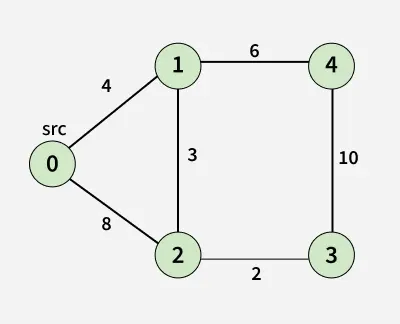
---

### Output

```
[0, 4, 7, 9, 10]
```

### Explanation of Shortest Paths

* 0 → 0 = 0
* 0 → 1 = 4 (direct edge)
* 0 → 2 = 7 (0 → 1 → 2 = 4 + 3)
* 0 → 3 = 9 (0 → 1 → 2 → 3 = 4 + 3 + 2)
* 0 → 4 = 10 (0 → 1 → 4 = 4 + 6)

---

## 4. Core Idea Behind Dijkstra’s Algorithm

Dijkstra’s Algorithm works by maintaining a **distance array**:

* `dist[v]` stores the **shortest known distance** from the source to vertex `v`
* Initially:

    * `dist[src] = 0`
    * All other distances are set to **infinity (∞)**

The algorithm maintains **two sets of vertices**:

1. Vertices **included** in the shortest-path tree
2. Vertices **not yet included**

At each step:

* Pick the vertex with the **minimum distance** from the second set
* Finalize its distance
* Update (relax) distances of its adjacent vertices

---

## 5. Role of Priority Queue in Dijkstra’s Algorithm

A **priority queue (min-heap)** is used to:

* Always select the vertex with the **smallest current distance**
* Avoid unnecessary processing of longer paths

### Why Priority Queue?

* Ensures shortest-distance vertex is processed first
* If a vertex appears again with a larger distance, it is ignored
* Makes the algorithm efficient and scalable

---

## 6. Detailed Steps of the Algorithm

1. Create a distance array `dist[]` of size **V**
2. Initialize all values to **∞**
3. Set `dist[src] = 0`
4. Insert `(0, src)` into the priority queue
5. While the priority queue is not empty:

    * Extract the vertex `u` with minimum distance
    * If extracted distance > `dist[u]`, skip
    * For each neighbor `v` of `u`:

        * If `dist[u] + weight < dist[v]`, update `dist[v]`
        * Push `(dist[v], v)` into the priority queue
6. Once the queue is empty, `dist[]` contains the shortest distances

---
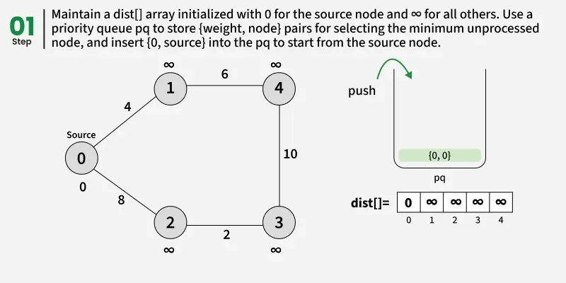
---
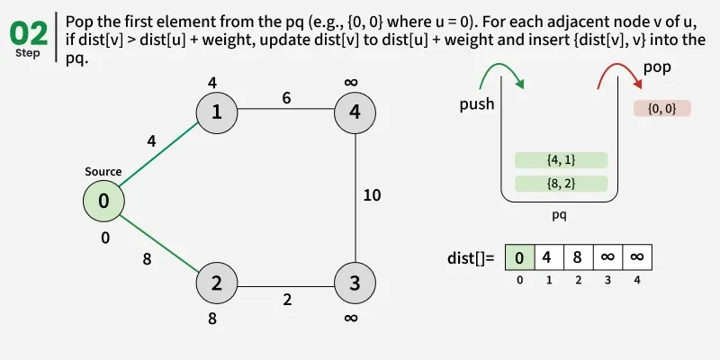
---
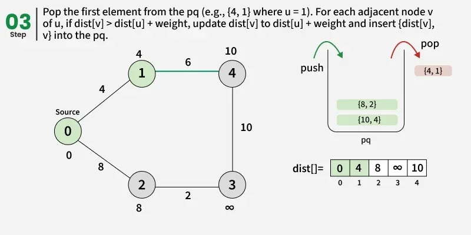
---
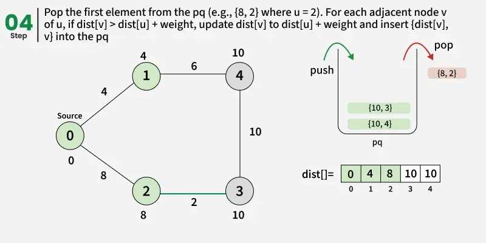
---
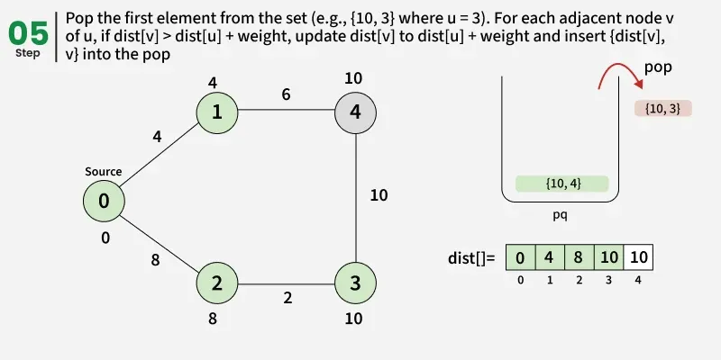
---
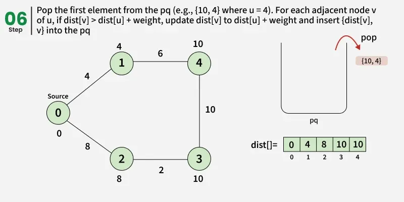
---
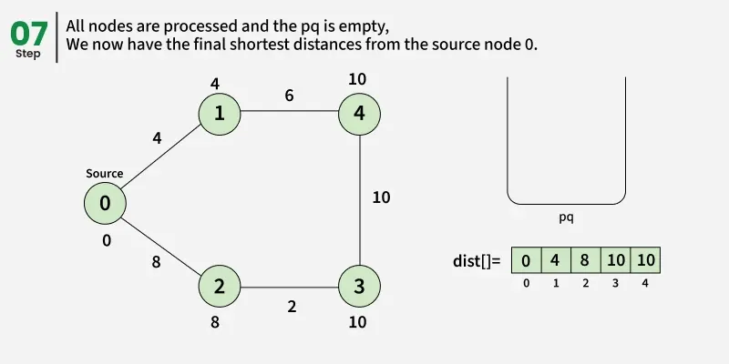
---

## 7. Java Implementation (Using Priority Queue)

```java
static ArrayList<Integer> dijkstra(ArrayList<ArrayList<int[]>> adj, int src) {
    int V = adj.size();

    PriorityQueue<int[]> pq = new PriorityQueue<>((a, b) -> a[0] - b[0]);
    int[] dist = new int[V];
    Arrays.fill(dist, Integer.MAX_VALUE);

    dist[src] = 0;
    pq.offer(new int[]{0, src});

    while (!pq.isEmpty()) {
        int[] top = pq.poll();
        int d = top[0];
        int u = top[1];

        if (d > dist[u])
            continue;

        for (int[] p : adj.get(u)) {
            int v = p[0];
            int w = p[1];

            if (dist[u] + w < dist[v]) {
                dist[v] = dist[u] + w;
                pq.offer(new int[]{dist[v], v});
            }
        }
    }

    ArrayList<Integer> result = new ArrayList<>();
    for (int d : dist)
        result.add(d);

    return result;
}
```

### Output

```
0 4 7 9 10
```

---

## 8. Time and Space Complexity

### Time Complexity

```
O((V + E) log V)
```

* Each vertex can enter the priority queue
* Each edge is relaxed once
* Priority queue operations take `log V`

### Auxiliary Space Complexity

```
O(V + E)
```

---

## 9. How Does Dijkstra’s Algorithm Work?

Once a vertex is removed from the priority queue:

* Its shortest distance is **finalized**
* It is never processed again

This works **only because all edge weights are non-negative**.

---

## 10. Why Dijkstra’s Algorithm Fails with Negative Weights

Dijkstra assumes:

> Once a vertex `u` is chosen, `dist[u]` is final.

With **negative edges**:

* A shorter path might appear later
* This breaks the algorithm’s correctness

Hence, **Dijkstra does not work with negative edge weights**.

---
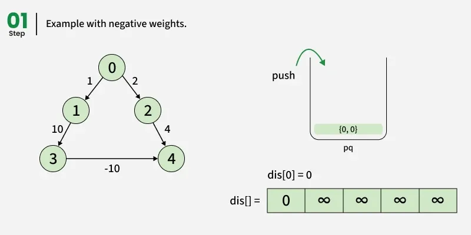
---
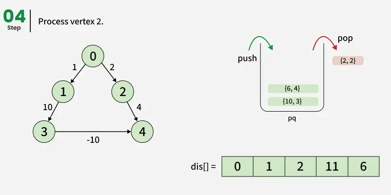
---
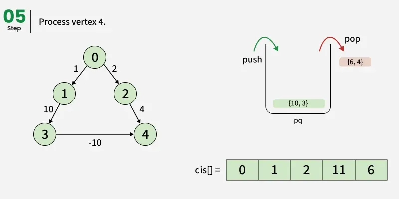
---
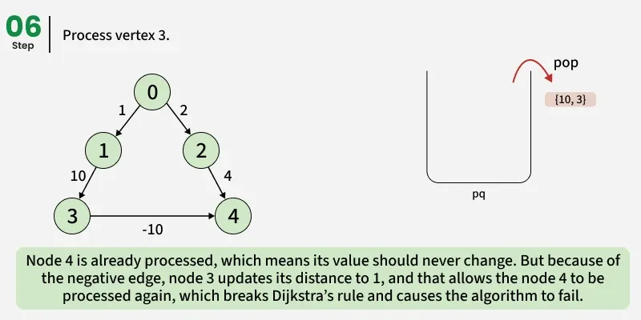
---

## 11. Directed vs Undirected Graphs

* Works for **both directed and undirected graphs**
* Must satisfy:

    * Non-negative edge weights
    * Graph connectivity (or reachable nodes from source)

---

## 12. [Common Questions on Dijkstra’s Algorithm](https://www.geeksforgeeks.org/dsa/introduction-to-dijkstras-shortest-path-algorithm/)

### Priority Queue vs Set

* Both can be used
* Priority Queue is preferred:

    * Faster
    * Simpler
    * Lower constant factors
* Both give **O(E log V)** complexity

---

### Why Use Priority Queue Instead of Normal Queue?

* Normal queue processes in arrival order
* Priority queue processes by **minimum distance**
* Using normal queue breaks Dijkstra’s logic

---

### Can It Work on Directed Graphs?

Yes, as long as all edge weights are non-negative.

---

## 13. Advanced Variations and Problems

* Minimum-product path (using logarithms)
* Minimum-weight cycle in undirected graph
* Shortest path in DAG
* Minimum cost path
* Printing negative weight cycle
* Counting shortest paths
* Snake and Ladder problem
* Word Ladder problem

---

## 14. Dijkstra vs Other Shortest Path Algorithms

### Dijkstra vs Bellman–Ford

| Feature         | Dijkstra   | Bellman–Ford |
| --------------- | ---------- |--------------|
| Negative edges  | ❌ No      | ✅ Yes       | 
| Time Complexity | O(E log V) | O(VE)        |
| Faster          | ✅         |  ❌          |  

---

### Dijkstra vs Floyd–Warshall

| Feature         | Dijkstra   | Floyd–Warshall |
| --------------- | ---------- | -------------- |
| Source          | Single     | All pairs      |
| Time Complexity | O(E log V) | O(V³)          |
| Graph Size      | Large      | Small          |

---

## 15. Applications of Dijkstra’s Algorithm

* GPS navigation systems
* Network routing
* Shortest path problems
* Used internally in Prim’s algorithm
* Used in optimized graph traversal systems

---

## 16. Summary

* Dijkstra’s Algorithm finds shortest paths from a **single source**
* Uses **priority queue**
* Requires **non-negative weights**
* Efficient and widely used
* Foundation for many advanced graph algorithms

---
