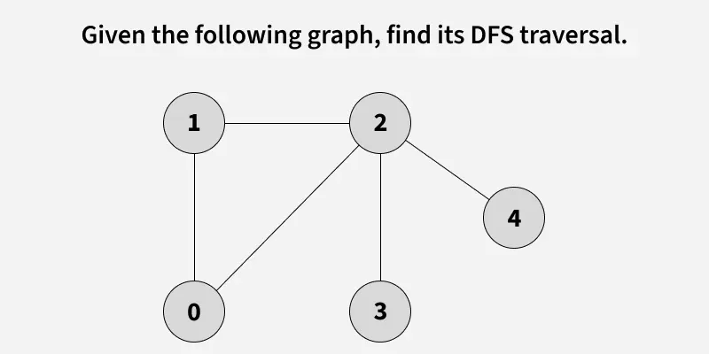
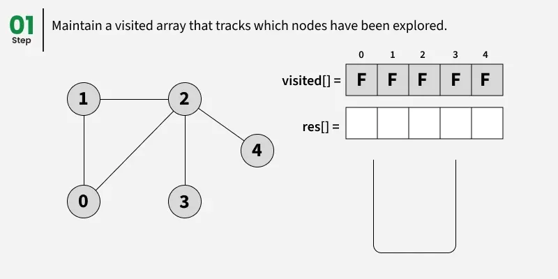
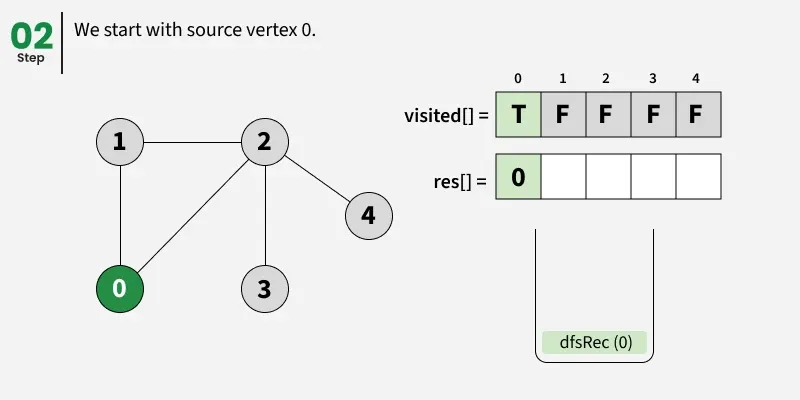
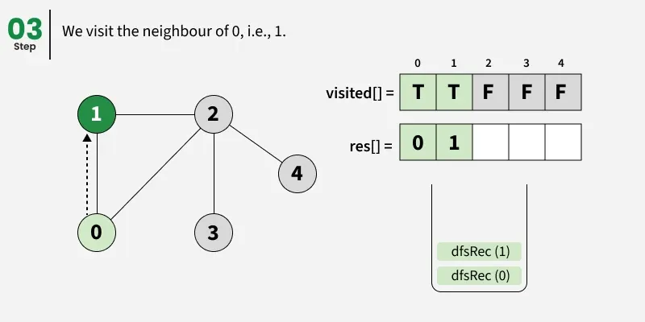
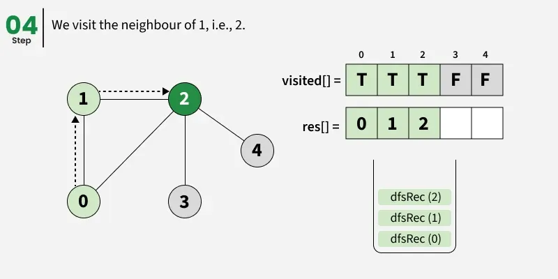
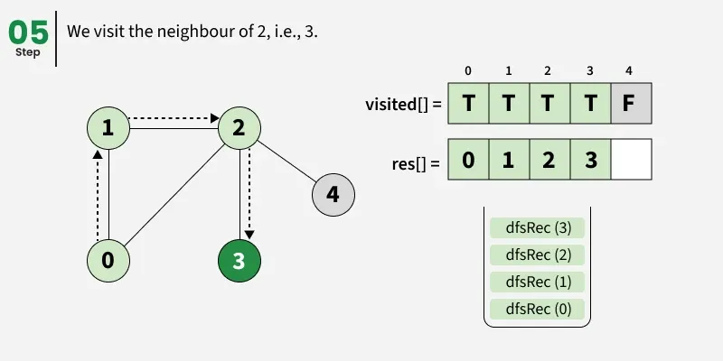
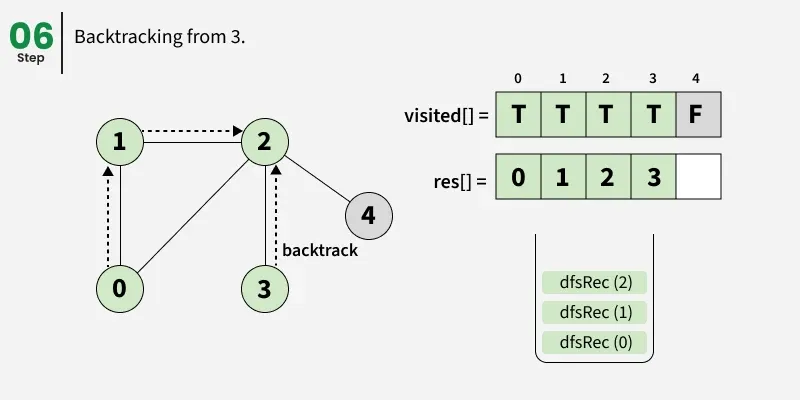
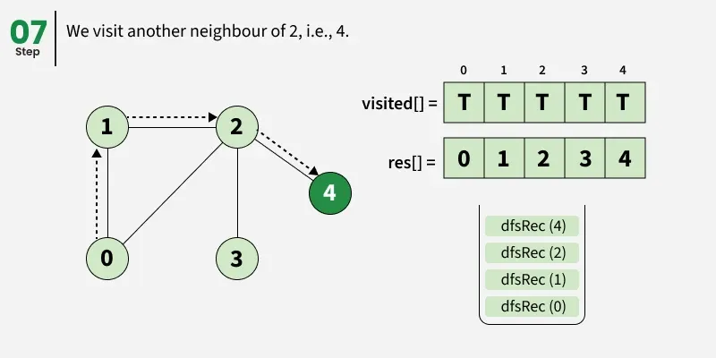
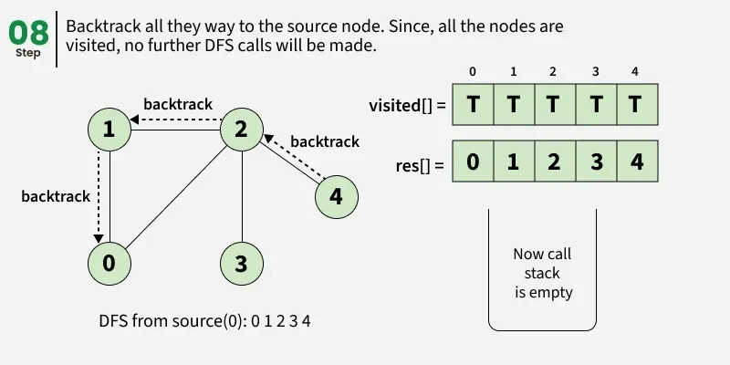

---

# Depth First Search (DFS) for a Graph

**Last Updated: 25 Oct, 2025**

---

## 1. Introduction to Depth First Search

**Depth First Search (DFS)** is a **graph traversal algorithm** used to explore all the vertices of a graph.

Given a graph, DFS traverses the graph by:

* Starting from a **source vertex**
* Exploring **one path completely** before moving to another path
* **Backtracking** when no further unvisited adjacent vertices are available

DFS is widely used in:

* Graph traversal
* Path finding
* Cycle detection
* Topological sorting
* Connected component detection

---

## 2. Basic Idea of DFS

The core idea of DFS is:

> “Go as deep as possible along one path before backtracking.”

DFS works by:

1. Visiting a vertex
2. Marking it as visited
3. Recursively visiting each unvisited adjacent vertex

To prevent **infinite loops in graphs with cycles**, DFS uses a **visited array**.

---

## 3. Key Characteristics of DFS

* DFS explores depth-wise rather than level-wise
* Uses **recursion** or an explicit **stack**
* A vertex is processed **only once**
* The traversal order may differ depending on:

    * The starting vertex
    * The order of adjacent vertices

---

## 4. Note on Multiple DFS Traversals

> There can be **multiple DFS traversals** of the same graph.

This happens because:

* DFS depends on the **order in which adjacent vertices are chosen**
* Different adjacency orders can produce different valid DFS outputs

In these notes, **vertices are picked according to insertion order**.

---

## 5. DFS Example 1

### Input Graph (Adjacency List Representation)

```
adj[][] = [[1, 2], 
           [0, 2], 
           [0, 1, 3, 4], 
           [2], 
           [2]]
```

---

---

### Output

```
[0, 1, 2, 3, 4]
```

---

### Step-by-Step DFS Traversal

* **Start at vertex 0**

    * Mark 0 as visited
    * Print 0

* **Move to vertex 1**

    * Mark 1 as visited
    * Print 1

* **Move to vertex 2**

    * Mark 2 as visited
    * Print 2

* **Move to vertex 3**

    * Mark 3 as visited
    * Print 3
    * No unvisited neighbors → backtrack to 2

* **Move to vertex 4**

    * Mark 4 as visited
    * Print 4
    * Backtrack to 2 → 1 → 0

---

### DFS Traversal Order

```
0 → 1 → 2 → 3 → 4
```

---

## 6. DFS Example 2 (Disconnected Graph)

### Input Graph

```
adj[][] = [[2, 3], 
           [2], 
           [0, 1], 
           [0], 
           [5], 
           [4]]
```

---

---

### Output

```
[0, 2, 1, 3, 4, 5]
```

---

### DFS Traversal Explanation

#### First Connected Component

* Start at **0**

    * Visit 0 → print 0
* Move to **2**

    * Visit 2 → print 2
* Move to **1**

    * Visit 1 → print 1
    * Backtrack to 2 → 0
* Move to **3**

    * Visit 3 → print 3
    * Backtrack to 0

#### Second Connected Component

* Vertex **4** is unvisited

    * Start DFS at 4 → print 4
* Move to **5**

    * Visit 5 → print 5

---

## 7. DFS from a Given Source Vertex

When DFS starts from a **single source vertex**:

* Only vertices reachable from that source are visited
* DFS continues until no unvisited adjacent vertices remain
* Backtracking occurs automatically using recursion

Because graphs may contain:

* Cycles
* Self-loops

We use a **visited array** to ensure each vertex is processed only once.

---

## 8. Working of DFS (Conceptual Illustration)

---

---

---

---

---

---

---

---

---

---

## 9. DFS Implementation (Connected Graph)

### Recursive DFS Code

```java
static void dfsRec(ArrayList<ArrayList<Integer>> adj,
                   boolean[] visited, int s,
                   ArrayList<Integer> res)
{
    visited[s] = true;
    res.add(s);

    // Recursively visit all adjacent vertices
    // that are not visited yet
    for (int i : adj.get(s)) {
        if (!visited[i]) {
            dfsRec(adj, visited, i, res);
        }
    }
}

static ArrayList<Integer> dfs(ArrayList<ArrayList<Integer>> adj) {
    boolean[] visited = new boolean[adj.size()];
    ArrayList<Integer> res = new ArrayList<>();
    dfsRec(adj, visited, 0, res);
    return res;
}
```

---

### Output

```
0 1 2 3 4
```

---

## 10. Time and Space Complexity (Connected Graph)

### Time Complexity

```
O(V + E)
```

* Each vertex is visited once
* Each edge is explored once (directed) or twice (undirected)

---

### Auxiliary Space Complexity

```
O(V + E)
```

Because:

* Visited array of size **V**
* Recursive call stack can grow up to **V**
* Adjacency list stores **V + E** elements

---

## 11. DFS of a Disconnected Graph

In a **disconnected graph**, not all vertices are reachable from a single source.

To traverse the entire graph:

* Loop through all vertices
* If a vertex is unvisited, start DFS from that vertex
* This ensures **all connected components** are covered

---

## 12. DFS Implementation (Disconnected Graph)

```java
private static void dfsRec(ArrayList<ArrayList<Integer>> adj,
                           boolean[] visited, int s,
                           ArrayList<Integer> res) {
    visited[s] = true;
    res.add(s);

    // Recursively visit all adjacent vertices
    // that are not visited yet
    for (int i : adj.get(s)) {
        if (!visited[i]) {
            dfsRec(adj, visited, i, res);
        }
    }
}

public static ArrayList<Integer> dfs(ArrayList<ArrayList<Integer>> adj) {
    boolean[] visited = new boolean[adj.size()];
    ArrayList<Integer> res = new ArrayList<>();

    // Loop through all vertices
    // to handle disconnected graphs
    for (int i = 0; i < adj.size(); i++) {
        if (!visited[i]) {
            dfsRec(adj, visited, i, res);
        }
    }

    return res;
}
```

---

### Output

```
0 3 2 1 4 5
```

---

## 13. Time and Space Complexity (Disconnected Graph)

### Time Complexity

```
O(V + E)
```

* Every vertex is visited at most once
* Every edge is traversed:

    * Once in directed graphs
    * Twice in undirected graphs

---

### Auxiliary Space Complexity

```
O(V + E)
```

Due to:

* Visited array of size **V**
* Recursive call stack
* Adjacency list storage

---

## 14. Summary of DFS

| Feature                      | Description               |
| ---------------------------- | ------------------------- |
| Traversal Type               | Depth-wise                |
| Data Structure Used          | Recursion / Stack         |
| Handles Cycles               | Yes (using visited array) |
| Works on Disconnected Graphs | Yes                       |
| Time Complexity              | O(V + E)                  |
| Space Complexity             | O(V + E)                  |

---

## 15. DFS vs BFS Comparison

Depth First Search (DFS) and Breadth First Search (BFS) are the two most commonly used **graph traversal algorithms**. Although both are used to visit all vertices of a graph, they differ significantly in **approach, data structures used, traversal order, and applications**.

---

### 15.1 Basic Difference Between DFS and BFS

| Feature                 | Depth First Search (DFS)                                      | Breadth First Search (BFS)                                                  |
| ----------------------- | ------------------------------------------------------------- | --------------------------------------------------------------------------- |
| Traversal Strategy      | Explores as deep as possible along a path before backtracking | Explores all neighbors at the current level before moving to the next level |
| Traversal Style         | Depth-wise                                                    | Level-wise                                                                  |
| Order of Visiting Nodes | Goes deep first                                               | Visits neighbors first                                                      |
| Backtracking            | Required                                                      | Not required                                                                |

---

### 15.2 Data Structures Used

| Aspect                 | DFS                                                | BFS                  |
| ---------------------- | -------------------------------------------------- | -------------------- |
| Primary Data Structure | Stack (implicit recursion stack or explicit stack) | Queue                |
| Implementation         | Recursive or Iterative                             | Iterative            |
| Memory Usage Pattern   | Stores deep paths                                  | Stores entire levels |

---

### 15.3 Working Principle

| DFS                                             | BFS                                |
| ----------------------------------------------- | ---------------------------------- |
| Starts from a source vertex                     | Starts from a source vertex        |
| Visits one adjacent vertex and continues deeper | Visits all adjacent vertices first |
| Backtracks when no unvisited neighbors exist    | Moves level by level               |
| Uses recursion or stack                         | Uses a queue                       |

---

### 📌 Space for Diagram

*(DFS traversal tree vs BFS level-order traversal tree)*

---

### 15.4 Time Complexity Comparison

Both DFS and BFS have the **same time complexity** when using adjacency lists.

| Algorithm | Time Complexity | Explanation                                      |
| --------- | --------------- | ------------------------------------------------ |
| DFS       | O(V + E)        | Visits every vertex once and explores every edge |
| BFS       | O(V + E)        | Visits every vertex once and explores every edge |

Where:

* **V** = Number of vertices
* **E** = Number of edges

---

### 15.5 Space Complexity Comparison

| Algorithm | Auxiliary Space | Reason                                           |
| --------- | --------------- | ------------------------------------------------ |
| DFS       | O(V + E)        | Visited array + recursion stack + adjacency list |
| BFS       | O(V + E)        | Visited array + queue + adjacency list           |

**Important Note:**

* DFS may consume more stack space in **deep graphs**
* BFS may consume more queue space in **wide graphs**

---

### 15.6 DFS vs BFS Output Behavior

| Aspect             | DFS                                | BFS                                             |
| ------------------ | ---------------------------------- | ----------------------------------------------- |
| Traversal Order    | Depends heavily on adjacency order | More predictable (level order)                  |
| Path Found         | Not guaranteed to be shortest      | Always finds shortest path in unweighted graphs |
| Revisit Prevention | Visited array                      | Visited array                                   |

---

### 15.7 Applications of DFS and BFS

| Application                      | DFS  |  BFS  |
| -------------------------------- |----- |------ |
| Graph Traversal                  | ✅   | ✅    |
| Detecting Cycles                 | ✅   | ❌    |
| Topological Sorting              | ✅   | ❌    |
| Connected Components             | ✅   | ✅    |
| Shortest Path (Unweighted Graph) | ❌   | ✅    |
| Maze Solving                     | ✅   | ✅    |
| Web Crawling                     | ❌   | ✅    |

---

### 15.8 When to Use DFS vs BFS

| Use Case                           | Preferred Algorithm |
| ---------------------------------- | ------------------- |
| Exploring all paths deeply         | DFS                 |
| Finding shortest path (unweighted) | BFS                 |
| Detecting cycles in a graph        | DFS                 |
| Level-wise traversal               | BFS                 |
| Memory-constrained deep graph      | BFS                 |
| Backtracking problems              | DFS                 |

---

### 15.9 DFS vs BFS Summary Table

| Feature                   | DFS                | BFS                |
| ------------------------- | ------------------ | ------------------ |
| Traversal Type            | Depth-first        | Breadth-first      |
| Data Structure            | Stack / Recursion  | Queue              |
| Time Complexity           | O(V + E)           | O(V + E)           |
| Space Complexity          | O(V + E)           | O(V + E)           |
| Shortest Path             | No                 | Yes (unweighted)   |
| Implementation Simplicity | Simple (recursive) | Simple (iterative) |

---

### 15.10 Key Exam Notes ⭐

* DFS and BFS both visit **all vertices** in a graph
* DFS uses **stack / recursion**, BFS uses **queue**
* BFS is preferred for **shortest path problems in unweighted graphs**
* DFS is preferred for **cycle detection and backtracking**
* Time complexity for both is **O(V + E)**

---


