# Introducing Data Structures and Algorithms

## 1. What Are Data Structures and Algorithms?

**Data Structures and Algorithms (DSA)** are two foundational concepts in computer science that work together to solve problems efficiently.

- A **data structure** is the way data is organized and stored in memory so it can be accessed and manipulated effectively.
- An **algorithm** is a finite, step-by-step set of instructions used to solve a problem or perform a task using that data.

**Real-life analogy:** Think of a kitchen. The storage system — plates in a cabinet, spoons in a drawer, food in the refrigerator — is the data structure. The procedure for making coffee — boil water, add coffee, pour, stir, serve — is the algorithm. Good organization makes items easy to find, and a clear procedure makes the task easy to repeat. In the same way, good data structures make data easy to access, and good algorithms make problems easy to solve.

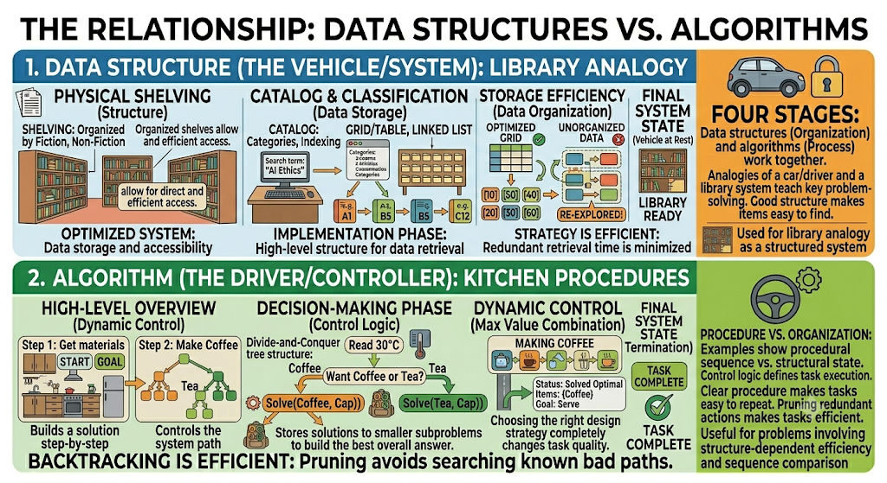

---

## 2. Why Study Data Structures and Algorithms?

Any programmer can write code that works. Professional programmers write code that works **correctly**, runs **quickly**, uses **memory efficiently**, and **scales** to large numbers of users. This is where DSA becomes essential.

Consider a student database. Searching through 100 records with a basic loop is trivial. Searching through 10 million records with the wrong algorithm could take several seconds per query — completely unacceptable for a real system. The right data structure and algorithm can reduce that same search to milliseconds. DSA is what separates a solution that works from a solution that works well.

---

## 3. What Is a Data Structure?

A **data structure** is a way of organizing and storing data so that operations — storage, retrieval, modification, and deletion — can be performed efficiently.

### Example: Arrays

An array stores a fixed collection of values where each element is accessed by its index.

```java
int[] scores = {75, 82, 90, 68, 95};
```

| Index | Value |
|---|---|
| 0 | 75 |
| 1 | 82 |
| 2 | 90 |
| 3 | 68 |
| 4 | 95 |

Accessing `scores[2]` returns 90 immediately because arrays support **random access** — the computer jumps directly to a position when the index is known, without searching.

**Strength:** Arrays are very fast for direct access. `scores[4]` returns 95 in constant time O(1).

**Weakness:** Insertion and deletion in the middle are costly. If the array holds `10, 20, 30, 40` and you insert `25` between `20` and `30`, every element after the insertion point must shift to a new position. The larger the array, the more expensive this becomes.

---

## 4. Abstract Data Type (ADT)

An **Abstract Data Type (ADT)** defines *what* a data structure does — its behavior and operations — without specifying *how* it is implemented internally.

**Analogy:** An ATM allows users to withdraw money, deposit money, and check a balance. Users do not need to understand the database structure, network protocols, or memory layout behind the machine to use it. The ATM's interface is the abstraction.

Similarly, a **Stack ADT** exposes three operations:

| Operation | Description |
|---|---|
| `push(item)` | Add an item to the top |
| `pop()` | Remove and return the top item |
| `peek()` | View the top item without removing it |

The user of the Stack ADT does not need to know whether it is implemented with an array or a linked list — only that these operations are available and behave correctly.

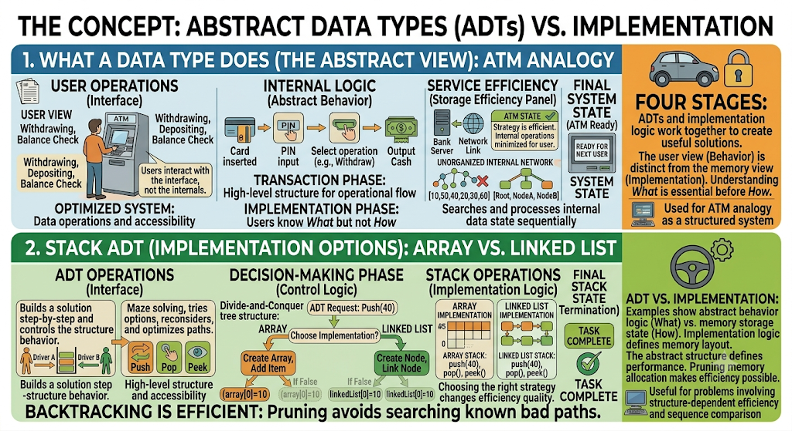

---

## 5. Data Structure vs. ADT

| | ADT | Data Structure |
|---|---|---|
| **What it is** | A specification (what operations exist) | An implementation (how data is stored) |
| **Focus** | Behavior | Memory layout and internal code |
| **Example** | Stack ADT (LIFO behavior) | Array-based stack or linked-list-based stack |

A **Stack ADT** follows the **Last-In First-Out (LIFO)** rule — the last item pushed is the first item popped. This behavior can be implemented using either an array (`int[] stack`) or a linked list (`Node head`). Both satisfy the Stack ADT contract but store data differently in memory.

---

## 6. What Is an Algorithm?

An **algorithm** is a finite sequence of well-defined instructions that takes input, processes it, and produces output before terminating.

Every algorithm has four components:

| Component | Description |
|---|---|
| **Input** | The data provided to the algorithm |
| **Processing** | The operations performed on the data |
| **Output** | The result produced |
| **Termination** | The algorithm must always stop |

### Example: Finding the Largest Number

Given the list `5, 12, 8, 20, 3`, find the largest value.

**Approach:** Assume the first number is the largest. Compare it with every remaining number, updating the largest value whenever a bigger number is found.

```java
int largest = numbers[0];
for (int num : numbers) {
    if (num > largest) {
        largest = num;
    }
}
// Result: largest = 20
```

---

## 7. Relationship Between Data Structures and Algorithms

Data structures and algorithms are interdependent — neither is fully useful without the other.

- A **data structure** stores and organizes data, providing the system.
- An **algorithm** processes that data, providing the logic.

**Analogy:** A data structure is like a car; an algorithm is like the driver. Without a driver, the car goes nowhere. Without a car, the driver has nothing to operate. Together, they move.

In practice, the choice of data structure directly affects which algorithms are possible and how efficient they can be. For example, binary search only works on sorted arrays; it cannot be applied to an unsorted list or a linked list without modification.

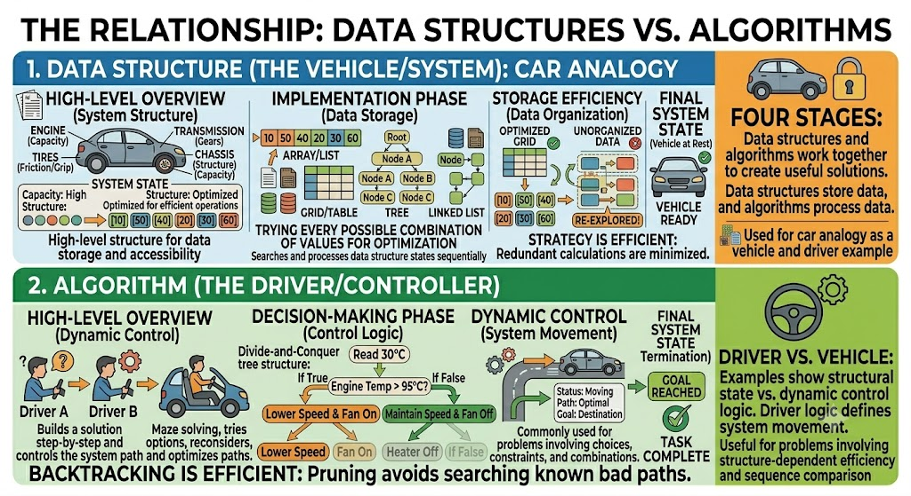

---

## 8. How Algorithms Solve Problems

Most algorithmic problem solving follows four stages: input, processing, output, and termination.

### Example 1: Student Scores

- **Input:** A list of student scores
- **Processing:** Calculate the average, highest, and lowest scores
- **Output:** `Average = 85, Highest = 98, Lowest = 60`
- **Termination:** Program stops after displaying results

### Example 2: Temperature Control System

- **Input:** Current temperature = 30°C
- **Processing:** Check if temperature > 28°C
- **Output:** Turn heater OFF (condition is true)
- **Termination:** System waits for next reading

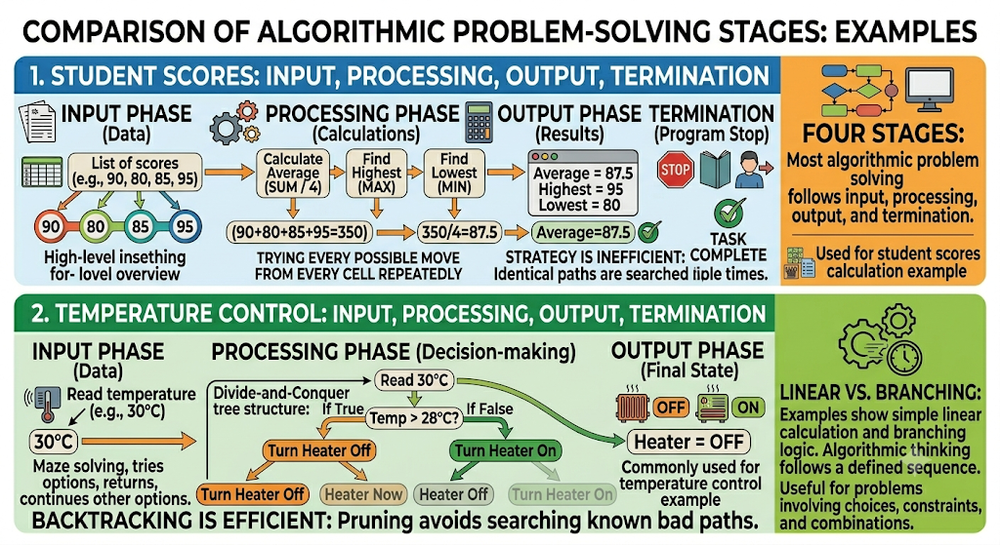

---

## 9. Common Types of Algorithms

### Search Algorithms

Search algorithms locate specific data within a collection.

**Linear Search** checks each element one by one from the beginning.

- Example: In `10, 20, 30, 40, 50`, searching for `40` checks 10 → 20 → 30 → 40.
- Time complexity: **O(n)** — in the worst case, every element is checked.

**Binary Search** eliminates half the remaining search space with each comparison, but requires **sorted data**.

- Example: In `10, 20, 30, 40, 50, 60, 70`, searching for `60` starts at the middle value `40`. Since `60 > 40`, only the right half `50, 60, 70` is searched. The middle of that is `60` — found.
- Time complexity: **O(log n)** — dramatically faster than linear search for large datasets.

| Algorithm | Requires Sorted Data | Time Complexity |
|---|---|---|
| Linear Search | No | O(n) |
| Binary Search | Yes | O(log n) |

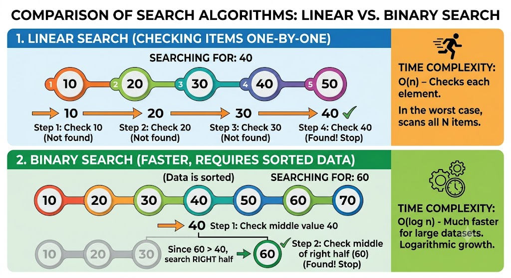

---

### Sorting Algorithms

Sorting algorithms arrange data into a meaningful order to enable faster searching, cleaner output, and easier processing.

**Bubble Sort** repeatedly compares neighboring elements and swaps them if they are in the wrong order.

- Example: `50, 10, 40, 20` → swap 50 and 10 → `10, 50, 40, 20` → continue until sorted → `10, 20, 40, 50`.
- Simple to implement but slow for large inputs. Time complexity: **O(n²)**.

**Merge Sort** uses **divide and conquer**: split the list into halves, sort each half recursively, then merge the sorted halves.

- Time complexity: **O(n log n)** — significantly more efficient than bubble sort for large lists.

| Algorithm | Strategy | Time Complexity |
|---|---|---|
| Bubble Sort | Compare and swap neighbors | O(n²) |
| Merge Sort | Divide, sort, merge | O(n log n) |

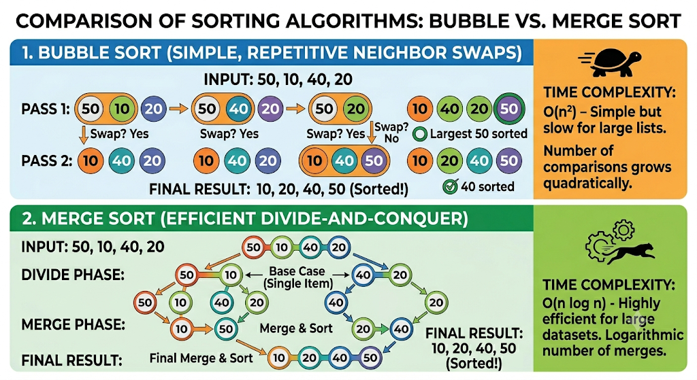

---

### Graph Algorithms

Graph algorithms solve problems involving networks of relationships. A **graph** consists of **nodes** (entities) connected by **edges** (relationships). For example, cities can be nodes and roads between them can be edges.

**Dijkstra's Algorithm** finds the shortest path from one node to all others in a weighted graph. It is used in GPS navigation, network routing, and mapping applications.

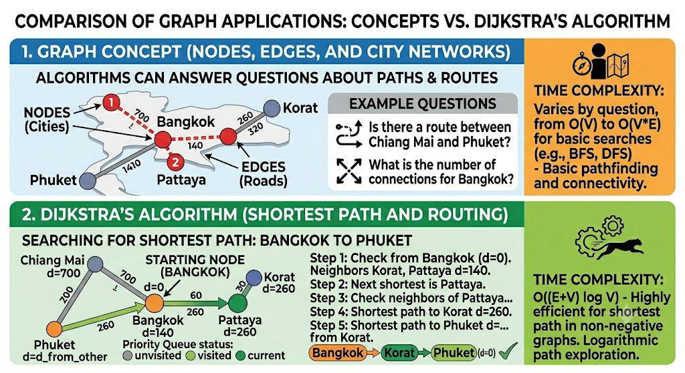

---

## 10. Algorithm Design Strategies

**Algorithm design strategies** are general patterns for approaching and constructing solutions. They are not specific algorithms — they are frameworks for thinking about problems. Choosing the right strategy is critical because a method that works well for one problem can be completely wrong for another.

---

### A. Brute Force

**Brute force** tries every possible option until a valid answer is found. It is simple to implement and always finds a solution when the search space is finite. However, it is usually slow because the number of possibilities grows rapidly.

**Example:** A brute-force password attack tries `0000`, `0001`, `0002`, ... until it reaches the correct value `1234`. This works for a 4-digit PIN but becomes completely impractical for long passwords with millions of combinations.

- **Advantage:** Simple to implement, guaranteed to find a solution.
- **Disadvantage:** Very slow for large input spaces.

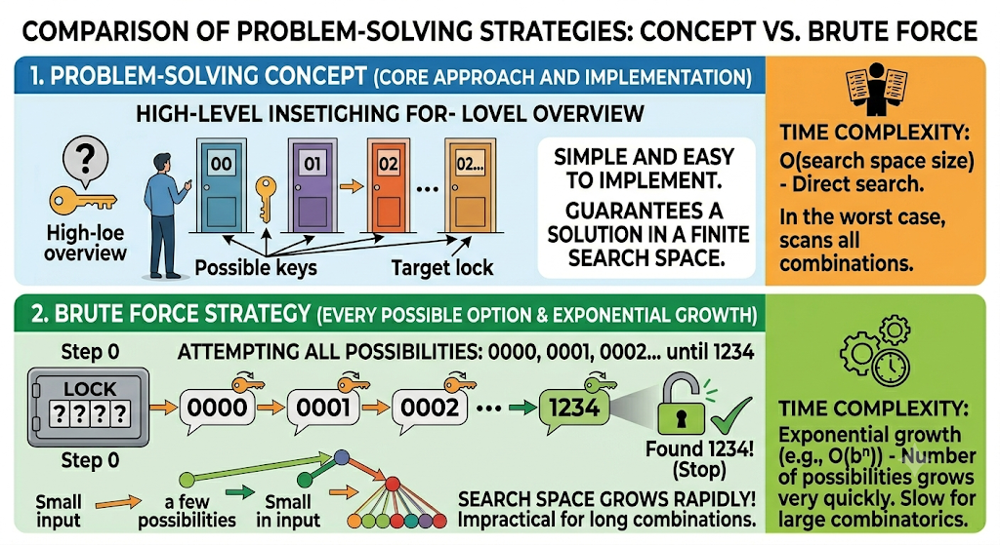

---

### B. Greedy Algorithms

A **greedy algorithm** builds a solution step by step by always choosing the option that looks best at the current moment, without reconsidering earlier decisions.

**Example:** Making 41 cents using coins of 25, 10, 5, and 1. The greedy method picks the largest coin that fits each time: 25¢ → 10¢ → 5¢ → 1¢ = 4 coins total.

- **Advantage:** Fast and simple; no backtracking needed.
- **Disadvantage:** Local best choices do not always lead to a globally optimal solution. The greedy approach can fail when an early decision blocks a better overall answer (see the Knapsack Problem in Section 13).

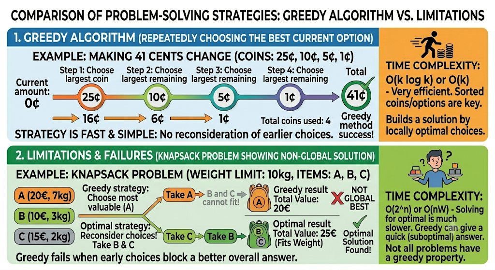

---

### C. Dynamic Programming

**Dynamic programming** solves complex problems by breaking them into **overlapping subproblems**, solving each subproblem once, and **storing the result** to avoid redundant computation. It is most useful for optimization problems where the same calculations would otherwise be repeated many times.

**Example:** Computing `fib(50)` naively recomputes `fib(10)`, `fib(20)`, and many smaller values dozens of times. With dynamic programming, each value is computed once and stored. This transforms an exponential-time computation into a linear one.

- **Common applications:** Knapsack problem, shortest paths, sequence alignment, resource allocation.
- **Advantage:** Eliminates redundant computation, dramatically faster than brute force for the right problems.

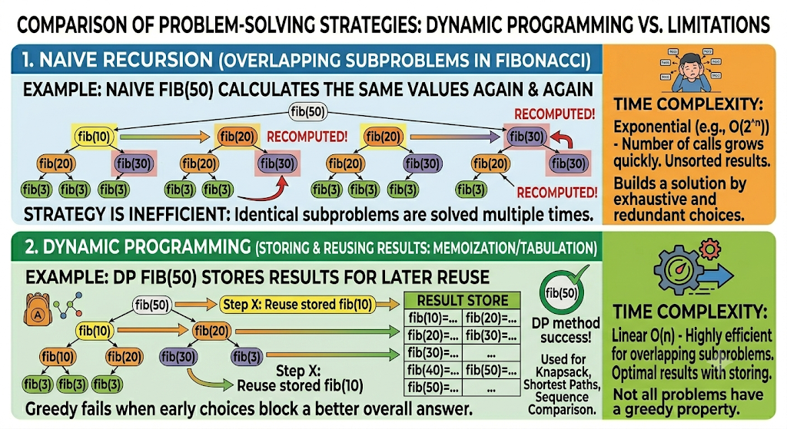

---

### D. Divide and Conquer

**Divide and conquer** solves a problem by splitting it into **smaller independent subproblems**, solving each subproblem separately, and **combining the results**.

This strategy works best when the subproblems do not overlap — if they do, dynamic programming is usually preferable.

**Examples:**
- **Merge Sort:** Divide the list into halves → sort each half → merge the sorted halves.
- **Binary Search:** Discard half the search space at each step by comparing with the midpoint.

- **Advantage:** Turns large, difficult problems into smaller, manageable ones.
- **Key difference from dynamic programming:** Subproblems are independent; results are not stored and reused across branches.

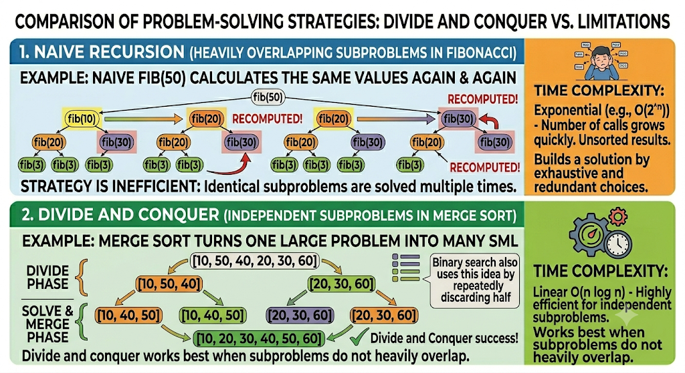

---

### E. Backtracking

**Backtracking** builds a solution incrementally, step by step, and **abandons a path** as soon as it becomes clear that the path cannot lead to a valid answer. It then returns to the previous decision point and tries a different option.

**Example:** In maze solving, the algorithm tries going left, reaches a dead end, backtracks to the last junction, and then tries going right. This continues until the exit is found or all paths are exhausted.

- **Common applications:** Sudoku, N-Queens problem, permutations, combinations, constraint satisfaction.
- **Advantage:** Much more efficient than brute force because invalid paths are cut off early.

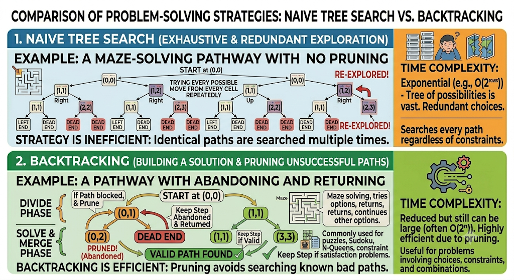

---

### Strategy Comparison

| Strategy | Core Idea | Best Used When |
|---|---|---|
| Brute Force | Try all possibilities | Search space is small |
| Greedy | Always pick the local best | Local best = global best |
| Dynamic Programming | Store and reuse subproblem results | Subproblems overlap |
| Divide and Conquer | Split, solve independently, combine | Subproblems are independent |
| Backtracking | Build incrementally, abandon bad paths | Constraints eliminate many paths early |

---

## 11. What Makes a Good Algorithm?

A good algorithm satisfies five properties:

| Property | Meaning | Example |
|---|---|---|
| **Correctness** | Produces the right answer for all valid inputs | `2 + 2` returns `4`, not `5` |
| **Efficiency** | Uses reasonable time and memory | Runs in O(n log n) instead of O(n²) |
| **Simplicity** | Logic is clear and understandable | Other programmers can read and follow it |
| **Robustness** | Handles invalid or unexpected inputs safely | `divide(10, 0)` returns an error, not a crash |
| **Maintainability** | Can be updated or extended without becoming fragile | Adding a new feature doesn't break existing logic |

---

## 12. Problem Abstraction

**Problem abstraction** means removing unnecessary real-world details and focusing only on the information that is relevant to the solution.

**Example:** A Mars food shipment problem involves potatoes, rice, beans, and peanut butter. The names and types of food do not matter to the algorithm — what matters is each item's **weight** and **caloric value**. After abstraction, the problem becomes:

> Maximize total calories while staying within a weight limit.

This transforms a real-world logistics scenario into a clean mathematical optimization problem that an algorithm can solve directly. Abstraction is essential because it reveals the true structure of a problem and makes it possible to apply known algorithms to new situations.

---

## 13. The Knapsack Problem

The **Knapsack Problem** is a classic optimization problem that demonstrates why algorithm design strategy matters.

**Problem:** Given a set of items, each with a weight and value, select items so that the total weight stays within a capacity limit while maximizing total value.

**Example:** Capacity = 10 kg

| Item | Weight | Value |
|---|---|---|
| A | 5 kg | 100 |
| B | 4 kg | 90 |
| C | 6 kg | 120 |

**Greedy approach** (pick highest value first):
- Select C: weight = 6 kg, value = 120
- Remaining capacity = 4 kg; neither A nor B fits alone without exceeding 10 kg with C
- Total value = **120**

**Better solution:**
- Select A + B: weight = 5 + 4 = 9 kg, value = 100 + 90 = **190**

The greedy approach fails here because choosing the single highest-value item blocks a better combination. A **dynamic programming** solution stores results for every sub-capacity and sub-set of items, finding the true optimal without re-examining every combination from scratch.

**Key lessons from the Knapsack Problem:**

- The most obvious solution is not always correct.
- The right design strategy can completely change the quality of the solution.
- How a problem is represented matters as much as how it is solved.
- Efficiency matters — for large inputs, a poor strategy becomes computationally infeasible.

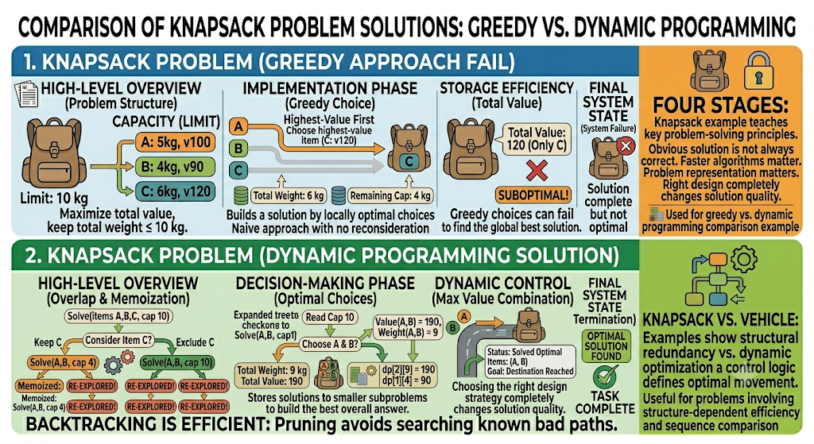

---

## 14. Summary

| Concept | Definition | Examples |
|---|---|---|
| **Data Structure** | A way of organizing and storing data | Array, linked list, stack, queue, tree, graph, hash table |
| **Algorithm** | A step-by-step procedure for solving a problem | Binary search, merge sort, Dijkstra's algorithm |
| **ADT** | A specification of behavior without implementation details | Stack ADT, Queue ADT |
| **Design Strategy** | A general pattern for constructing algorithms | Brute force, greedy, dynamic programming, divide and conquer, backtracking |

The core relationship is straightforward: **data structures hold the information; algorithms process it**. Together, they allow programs to solve problems correctly and at scale. Choosing the right data structure and the right algorithm strategy is one of the most important skills in software development.