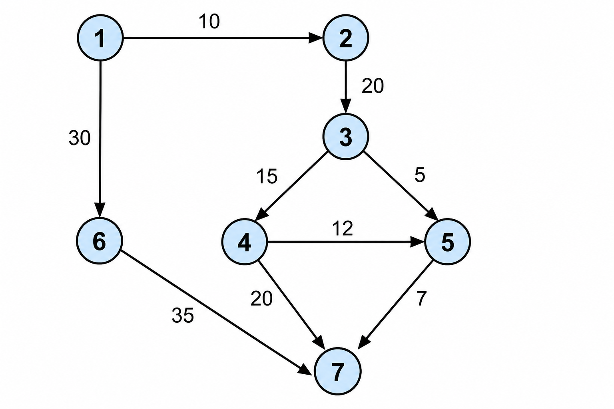

# Dijkstra's Algorithm 

## 1. Foundational Concepts: Graphs, Direction, and Weight

Before getting into Dijkstra's algorithm itself, it helps to be clear on the underlying data structure it operates on.

### 1.1 What Is a Graph?

A **graph** is a non-linear data structure made up of:

- **Vertices** (also called nodes) — the fundamental units of the graph, which may be labeled or unlabeled.
- **Edges** (also called arcs) — the connections between two vertices, representing some relationship between them.

Unlike arrays or linked lists, graphs don't follow a fixed sequential order — a vertex can connect to any number of other vertices in any pattern.

**Example:** on a map, each city is a vertex, and each road connecting two cities is an edge — the graph as a whole represents how the cities are linked.

### 1.2 Weighted vs. Unweighted Graphs

- **Unweighted graph:** all edges are treated equally — there's no extra value attached to a connection, just the fact that it exists.
- **Weighted graph:** each edge carries a number (its **weight**) representing something meaningful in context — distance, travel time, cost, capacity, or similar.

### 1.3 Directed vs. Undirected Graphs

- **Undirected graph:** edges have no direction — the connection between two vertices works both ways, and each edge is defined by an *unordered* pair of vertices.
- **Directed graph (digraph):** each edge has a direction, shown with an arrow, and is defined by an *ordered* pair of vertices. Traveling from vertex A to vertex B doesn't imply you can travel back from B to A using the same edge.

In a digraph, vertices have two useful properties:
- **Out-degree** — the number of directed edges flowing *away* from a vertex.
- **In-degree** — the number of directed edges flowing *into* a vertex.

**Real-world analogy:** think of a one-way street map. Each intersection is a vertex; each one-way street is a directed edge. If a street only allows travel from A to B, you can't use that same edge to drive back from B to A — you'd need a different route entirely (if one exists).

### 1.4 Edge-Weighted Digraphs

Combining both ideas gives an **edge-weighted digraph** — a directed graph where every edge also carries a weight. This is exactly the structure Dijkstra's algorithm is designed to operate on.

Every connection is typically written as an ordered triple **(u, v, w)**, meaning: *there is a directed path from vertex u to vertex v, at a cost of w*. Critically, this says nothing about traveling from v back to u — that would require a separate edge (v, u, w′), possibly with a different weight, if it exists at all.

**Some real-world contexts modeled this way:**

| Context | Vertex | Directed Edge |
|---|---|---|
| Transportation | Street intersection | One-way street |
| Web | Web page | Hyperlink |
| Flight scheduling | Airport | Flight route |
| Financial | Bank account | Transaction |
| Food web | Species | Predator–prey relationship |
| Scheduling | Task | Precedence constraint |

### 1.5 How Graphs Are Represented

Two common ways to store a graph in memory:

- **Adjacency Matrix:** a 2D matrix where rows and columns represent vertices. `matrix[i][j]` holds the weight of the edge from vertex i to vertex j (or 0 / a sentinel value if no edge exists). Simple to implement and gives O(1) edge lookups, but uses O(V²) space regardless of how many edges actually exist — wasteful for sparse graphs.
- **Adjacency List:** each vertex keeps a list of the edges leading out of it. For an edge-weighted graph, each entry in the list stores both the destination vertex and the edge's weight (often as a small `Edge` object or a `{vertex, weight}` pair). This uses O(V + E) space, making it far more efficient for sparse graphs — which is why it's the representation used throughout this document (and in the Java code in Section 10).

For a directed graph specifically, the adjacency list for vertex u only contains the vertices v where an edge explicitly points *from* u *to* v — unlike an undirected graph, where each edge shows up in both endpoints' lists.

### 1.6 Why This Matters for Dijkstra's Algorithm

Dijkstra's algorithm specifically requires an **edge-weighted graph** (directed or undirected) to have meaningful "costs" to sum along a path — without weights, every path of the same edge-count would look identical, and "shortest" would just mean "fewest hops," which is a much simpler problem (solvable with plain BFS). The **direction** of edges matters too: in a digraph, a short path from A to B doesn't guarantee an equally short (or any) path back from B to A, so Dijkstra's algorithm computes distances *from* the fixed source outward, not between arbitrary pairs.

---

## 2. What Is the Single-Source Shortest Path Problem?

Given a **weighted graph** and a fixed **source vertex**, the goal is to find the **shortest (minimum-cost) path** from that source to **every other vertex** in the graph — either via a direct edge, or via a path through other vertices.

- The **source vertex is fixed** — you pick one vertex to start from.
- You then compute the shortest distance from that source to *all* the other vertices.
- This is a classic **minimization problem**, and minimization is a form of **optimization** — which is why the **greedy method** applies here, just like it did for Minimum Spanning Trees.

**Dijkstra's Algorithm** is the standard greedy solution to this problem.

### Requirements

- Works on **directed or undirected** graphs (an undirected edge can be treated as two directed edges, one in each direction).
- Works on **weighted** graphs — each edge must have an associated cost/weight.
- Requires **non-negative edge weights** — this is a hard requirement, explained in Section 6.

---

## 3. Core Idea: Relaxation

Dijkstra's algorithm maintains a running "best distance so far" for every vertex, starting at infinity (unknown) for everything except the source (which starts at 0). The key operation is called **relaxation**:

> For an edge (u, v) with weight w: if `dist[u] + w < dist[v]`, then update `dist[v] = dist[u] + w`.

In plain terms: *"If going through u gives a shorter path to v than what we currently know, update v's distance."*

The algorithm repeatedly:
1. **Selects the unvisited vertex with the smallest known distance.**
2. **Relaxes all of its neighbors** — checking if going through this vertex gives them a shorter path.
3. **Marks the selected vertex as visited** (finalized) — its shortest distance is now considered locked in.
4. Repeats until every vertex has been visited.

This is greedy because at each step, the algorithm commits to the closest unvisited vertex without reconsidering that choice later.

---

## 4. Worked Example 1 — Table-Based Trace (7 vertices, directed graph)

Consider a directed, weighted graph with vertices 1–7 and these edges:



| Edge | 1→2 | 1→6 | 2→3 | 3→4 | 3→5 | 4→7 | 4→5 | 6→7 | 5→7 |
|---|---|---|---|---|---|---|---|---|---|
| Weight | 10 | 30 | 20 | 15 | 5 | 20 | 12 | 35 | 7 |

**Source vertex = 1.** We track a table of tentative distances `d[2]` through `d[7]`, updating it each time a new vertex is selected:

| Selected Vertex | Visited Set | d[2] | d[3] | d[4] | d[5] | d[6] | d[7] |
|---|---|---|---|---|---|---|---|
| 1 | {1} | 10 | ∞ | ∞ | ∞ | 30 | ∞ |
| 2 | {1,2} | **10** | 10+20=30 | ∞ | ∞ | 30 | ∞ |
| 3 | {1,2,3} | 10 | **30** | 30+15=45 | 30+5=35 | 30 | ∞ |
| 6 | {1,2,3,6} | 10 | 30 | 45 | 35 | **30** | 30+35=65 |
| 5 | {1,2,3,6,5} | 10 | 30 | 45 | **35** | 30 | 35+7=42 |
| 7 | {1,2,3,6,5,7} | 10 | 30 | 45 | 35 | 30 | **42** |
| 4 | {1,2,3,6,5,7,4} | 10 | 30 | **45** | 35 | 30 | 42 |

**Why 4 is selected last:** at every stage, 45 (for vertex 4) is the largest remaining tentative distance, so it's the last one whose value gets finalized — even though vertex 4 itself was reachable early on (via vertex 3).

**Final shortest distances from vertex 1:**

| To vertex | 2 | 3 | 4 | 5 | 6 | 7 |
|---|---|---|---|---|---|---|
| Distance | 10 | 30 | 45 | 35 | 30 | 42 |

**Sanity check for vertex 7:** there are multiple ways to reach 7 from 1 — e.g., 1→6→7 costs 30+35=65, or 1→2→3→4→7 costs 10+20+15+20=65 — but the path 1→2→3→5→7 costs 10+20+5+7=**42**, which is indeed the smallest of all of them. This confirms the table's result.

---

## 5. Worked Example 2 — Simple Relaxation Demo (3 vertices)

To see relaxation in its simplest form: suppose vertex 1 (source) connects directly to vertex 2 with weight 2, and vertex 2 connects to vertex 3 with weight 4. There's no direct edge from 1 to 3.

- **Initial distances:** d[1]=0, d[2]=2 (direct edge), d[3]=∞ (no direct edge yet).
- Since d[2]=2 is the smallest unvisited distance, **select vertex 2**.
- **Relax vertex 3** via vertex 2: is `d[2] + weight(2,3) < d[3]`? → `2 + 4 = 6 < ∞`? Yes → update d[3] = 6.

So even though there's no direct edge from 1 to 3, Dijkstra discovers a path of length 6 (via vertex 2) and updates the "infinity" placeholder accordingly. This is relaxation in action.

---

## 6. Worked Example 3 — Full Relaxation Trace (6 vertices)

Consider a graph with vertices 1–6 and these edges: 1–2(2), 1–3(4), 2–3(1), 2–4(7), 3–5(3), 5–4(2), 5–6(5), 4–6(1). Source = vertex 1.

**Initial distances (direct edges only):** d[2]=2, d[3]=4, d[4]=∞, d[5]=∞, d[6]=∞

| Step | Selected | Relaxation Performed | Updated Distances |
|---|---|---|---|
| 1 | 2 (dist 2) | 2→3: 2+1=3 < 4 → update; 2→4: 2+7=9 < ∞ → update | d[3]=3, d[4]=9 |
| 2 | 3 (dist 3) | 3→5: 3+3=6 < ∞ → update | d[5]=6 |
| 3 | 5 (dist 6) | 5→4: 6+2=8 < 9 → update; 5→6: 6+5=11 < ∞ → update | d[4]=8, d[6]=11 |
| 4 | 4 (dist 8) | 4→6: 8+1=9 < 11 → update | d[6]=9 |
| 5 | 6 (dist 9) | no outgoing edges to relax | — |

**Final shortest distances from vertex 1:** d[2]=2, d[3]=3, d[4]=8, d[5]=6, d[6]=9

This example shows a vertex's distance can be updated **more than once** (vertex 4 went ∞ → 9 → 8) before it's finally selected and locked in — relaxation keeps checking for a better path until the vertex itself is chosen.

---

## 7. Worked Example 4 — An Unreachable Vertex

Not every vertex needs to be reachable from the source. Consider a directed graph with vertices 1–6, source = 1, and direct edges 1→2(50), 1→3(45), 1→4(10) — but **no edge at all leads into vertex 6**.

- **Initial:** d[2]=50, d[3]=45, d[4]=10, d[5]=∞, d[6]=∞
- Select **4** (dist 10) → relax: 4→5: 10+15=25 < ∞ → d[5]=25
- Select **5** (dist 25) → relax: 5→2: 25+20=45 < 50 → d[2]=45; 5→3: 25+20=45, same as current 45, no strict improvement (or ties, depending on the graph) → d[3] stays 45
- Select **2** (dist 45) → relax: 2→3: 45+10=55, not better than 45 → no change
- Select **3** (dist 45) → its only outgoing edge goes to 5, which is already visited → nothing to relax
- Select **6** — since nothing ever pointed into vertex 6, its distance **remains ∞ forever**.

**Final distances:** d[2]=45, d[3]=45, d[4]=10, d[5]=25, d[6]=**∞ (unreachable)**

**Key takeaway:** if a vertex has no incoming path from the source, Dijkstra correctly leaves its distance at infinity — this represents "no path exists," not an error.

---

## 8. Why Dijkstra Fails with Negative Edge Weights

Dijkstra's algorithm relies on a critical assumption: **once a vertex is selected (visited), its shortest distance is final and will never improve.** This assumption only holds when **all edge weights are non-negative**.

**Illustration of the failure:** Suppose a source vertex has two outgoing paths — one direct edge with a small positive weight, and another route passing through an edge that turns out to be **negative**. Because the direct edge initially looks shortest, Dijkstra selects and "locks in" that vertex early — before ever exploring the second route. If that second route (through the negative edge) would actually have produced a smaller total distance, Dijkstra never finds it, because it never re-examines a vertex once marked visited.

Concretely, in one such example, Dijkstra reports a distance of **3** to a vertex when a route through a negative edge would have produced the *true* shortest distance of **−3** — but since the vertex was already finalized at 3 before the negative-weight route could be considered, the algorithm returns the wrong (too large) answer.

**Why this happens:** the greedy assumption "the closest unvisited vertex can never get closer later" breaks down when a negative edge can make a longer-looking path suddenly cheaper. This is precisely why Dijkstra's algorithm **requires non-negative weights** to guarantee correctness.

**The fix:** for graphs with negative edges, use the **Bellman-Ford algorithm** instead — it's slower (typically O(V·E)) but correctly handles negative weights (and can even detect negative-weight cycles).

---

## 9. Worked Example 5 — Priority-Queue-Based Trace (Undirected Graph)

Here's a fully specified example that's easy to verify by hand. Consider an undirected graph with 5 vertices (0–4) and source = 0:

| Edge | 0–1 | 0–2 | 1–2 | 1–4 | 2–3 | 3–4 |
|---|---|---|---|---|---|---|
| Weight | 4 | 8 | 3 | 6 | 2 | 10 |

**Trace:**

- `dist = [0, ∞, ∞, ∞, ∞]`. Push (0, vertex 0).
- Pop **vertex 0** (dist 0). Relax neighbors: 1 → 0+4=4; 2 → 0+8=8. `dist = [0,4,8,∞,∞]`
- Pop **vertex 1** (dist 4). Relax neighbors: 2 → 4+3=7 < 8 → update; 4 → 4+6=10 < ∞ → update. `dist = [0,4,7,∞,10]`
- Pop **vertex 2** (dist 7). Relax neighbors: 3 → 7+2=9 < ∞ → update; 1 → 7+3=10, not better than 4, skip. `dist = [0,4,7,9,10]`
- Pop **vertex 3** (dist 9). Relax neighbors: 4 → 9+10=19, not better than 10, skip.
- Pop **vertex 4** (dist 10). No unvisited neighbors left.

**Final shortest distances from vertex 0:** `[0, 4, 7, 9, 10]`

This matches the expected output exactly, and demonstrates the specific case where a two-hop path (0→1→2, cost 7) beats the direct edge (0→2, cost 8) — exactly the kind of improvement relaxation is designed to catch.

---

## 10. Java Implementation (Priority-Queue Based)

```java
import java.util.ArrayList;
import java.util.Arrays;
import java.util.List;
import java.util.PriorityQueue;

public class DijkstraAlgorithm {

    // adj.get(u) is a list of int[]{neighbor, weight} pairs for vertex u
    static int[] dijkstra(List<List<int[]>> adj, int src) {
        int V = adj.size();

        // Min-heap storing {distance, vertex} pairs, ordered by distance
        PriorityQueue<int[]> pq = new PriorityQueue<>((a, b) -> a[0] - b[0]);

        int[] dist = new int[V];
        Arrays.fill(dist, Integer.MAX_VALUE);
        dist[src] = 0;
        pq.offer(new int[]{0, src});

        while (!pq.isEmpty()) {
            int[] top = pq.poll();
            int d = top[0];
            int u = top[1];

            // Skip stale entries: a shorter distance for u was already found and processed
            if (d > dist[u]) continue;

            // Relax all neighbors of u
            for (int[] edge : adj.get(u)) {
                int v = edge[0];
                int weight = edge[1];

                if (dist[u] + weight < dist[v]) {
                    dist[v] = dist[u] + weight;
                    pq.offer(new int[]{dist[v], v});
                }
            }
        }
        return dist;
    }

    public static void main(String[] args) {
        // Example from Section 9: 5 vertices, undirected graph
        int n = 5;
        List<List<int[]>> adj = new ArrayList<>();
        for (int i = 0; i < n; i++) adj.add(new ArrayList<>());

        addEdge(adj, 0, 1, 4);
        addEdge(adj, 0, 2, 8);
        addEdge(adj, 1, 2, 3);
        addEdge(adj, 1, 4, 6);
        addEdge(adj, 2, 3, 2);
        addEdge(adj, 3, 4, 10);

        int[] result = dijkstra(adj, 0);
        System.out.println("Shortest distances from vertex 0: " + Arrays.toString(result));
        // Expected output: [0, 4, 7, 9, 10]
    }

    static void addEdge(List<List<int[]>> adj, int u, int v, int weight) {
        adj.get(u).add(new int[]{v, weight});
        adj.get(v).add(new int[]{u, weight}); // omit this line for a directed graph
    }
}
```

**How the "skip stale entries" check works:** because a vertex can be pushed onto the priority queue multiple times (once per relaxation that improves its distance), an outdated, larger-distance entry might still be sitting in the queue when a better one gets popped first. The check `if (d > dist[u]) continue;` cheaply discards those stale entries instead of reprocessing a vertex unnecessarily.

---

## 11. Time and Space Complexity

The runtime of Dijkstra's algorithm depends entirely on **which data structures back the graph and the priority queue** — the algorithm's logic stays the same, but the cost of "find the next closest vertex" and "update a neighbor's distance" varies a lot depending on the implementation.

### 11.1 Complexity by Data Structure

| Priority Queue Structure | Graph Representation | Time Complexity | Best Suited For |
|---|---|---|---|
| Unordered array/list (linear scan for the minimum) | Adjacency matrix | O(V²) | Dense graphs (E ≈ V²) |
| Binary Heap (Min-Heap) | Adjacency list | O((V + E) log V) | Sparse graphs (E ≪ V²) |
| Fibonacci Heap | Adjacency list | O(E + V log V) | Large, theoretically complex graphs |

For a connected graph, O((V + E) log V) is often simplified to **O(E log V)**, since a connected graph has at least V − 1 edges, making the E term dominate.

### 11.2 Step-by-Step Derivation (Binary Heap Implementation)

Breaking the O((V + E) log V) bound down into the algorithm's actual operations:

1. **Initialization:** setting every vertex's distance to infinity (except the source, set to 0) takes **O(V)**.
2. **Extract-Min (vertex processing):** the algorithm pops the minimum-distance vertex from the heap exactly once per vertex. Each extraction costs O(log V), so across all V vertices: **V × O(log V) = O(V log V)**.
3. **Relaxation (edge updates):** every edge is examined exactly once overall (twice for an undirected graph, once per direction). Whenever a shorter path is found, a decrease-key/insert operation is triggered in the heap, costing O(log V) each. Across all edges: **E × O(log V) = O(E log V)**.

Adding these together:

**Total time = O(V) + O(V log V) + O(E log V) = O((V + E) log V)**

### 11.3 Why a Fibonacci Heap Improves This to O(E + V log V)

In a binary heap, the decrease-key operation (used during relaxation) costs O(log V). A **Fibonacci heap** optimizes this specific operation down to **amortized O(1)**. Since relaxation happens once per edge, the O(E log V) portion collapses to just **O(E)**, leaving the overall bound at:

**O(E) + O(V log V) = O(E + V log V)**

This is asymptotically better, though in practice the binary heap's simpler implementation and lower constant factors often make it the more practical choice unless the graph is very large.

### 11.4 Best, Average, and Worst Case

| Case | Complexity | When It Occurs |
|---|---|---|
| **Best case** | O((V + E) log V) | Using an optimized structure (e.g., Fibonacci heap) on a sparse graph — few edges relative to vertices |
| **Average case** | O((V + E) log V) | Most real-world graphs are neither extremely sparse nor fully dense, so this bound holds broadly in practice |
| **Worst case** | O(V² log V) | A dense (near-complete) graph using a simple/unoptimized priority queue, where heap operations aren't well matched to the edge count |

**Why the naive array-based version is O(V²):** for each of the V vertices, finding the next closest unvisited vertex takes an O(V) linear scan (no heap at all), and this scan is repeated once per vertex — giving O(V) × O(V) = **O(V²)** overall, regardless of how many edges exist. This is actually *competitive* with the heap-based approach on very dense graphs, since E approaches V² there anyway.

### 11.5 Space Complexity

| Component | Space |
|---|---|
| Distance array (`dist[]`) | O(V) |
| Adjacency list (graph storage) | O(V + E) |
| Priority queue (holds up to one entry per relaxation) | O(V) to O(E) |
| **Overall auxiliary space** | **O(V + E)**, often simplified to O(V) when the graph is sparse |

The exact space used by the priority queue depends on implementation details — a heap that allows in-place decrease-key stays at O(V), while one that simply re-inserts an updated distance (as in the Java implementation in Section 10, which pushes a new entry rather than updating in place) can hold up to one entry per relaxation, bounding it at O(E) in the worst case.

---

## 12. Dijkstra's vs. Prim's — A Common Point of Confusion

Both algorithms look almost identical when traced by hand: start at a vertex, repeatedly pick the "closest" unvisited option, and update neighbors. The key difference is **what "closest" means**:

| | Dijkstra's Algorithm | Prim's Algorithm |
|---|---|---|
| Minimizes | **Cumulative path distance** from the source to each vertex | **Individual edge weight** to extend the tree |
| Relaxation rule | `dist[u] + weight(u,v) < dist[v]` (adds up the path so far) | `weight(u,v) < dist[v]` (compares only the single connecting edge) |
| Goal | Shortest paths from **one source** to all vertices | Cheapest way to **connect all vertices** (a spanning tree) |

This distinction matters: Dijkstra's shortest-path tree and Prim's minimum spanning tree can select entirely different edges on the same graph, because one is optimizing total distance traveled and the other is optimizing total tree weight.

---

## 13. Quick Summary

- Dijkstra's algorithm solves the **single-source shortest path problem**: shortest distance from one fixed source to every other vertex in a weighted graph.
- The core operation is **relaxation**: `dist[v] = min(dist[v], dist[u] + weight(u,v))`.
- At each step, the algorithm greedily selects the unvisited vertex with the smallest known distance, relaxes its neighbors, and marks it as visited (finalized).
- Vertices with **no path** from the source correctly remain at distance **infinity**.
- Dijkstra's algorithm **requires non-negative edge weights** — with negative edges, it can lock in a vertex's distance too early and return an incorrect (too large) result. **Bellman-Ford** is the correct choice when negative weights are present.
- **Time complexity:** O(V²) with an array/matrix and linear scan; O((V + E) log V) with a binary heap and adjacency list; O(E + V log V) with a Fibonacci heap. Worst case is O(V² log V) on dense graphs with an unoptimized priority queue.
- **Space complexity:** O(V + E) overall — O(V) for the distance array, O(V + E) for the adjacency list, and up to O(V) to O(E) for the priority queue depending on implementation.
- Despite looking similar to **Prim's Algorithm** in execution, Dijkstra's minimizes cumulative path distance, while Prim's minimizes individual edge weight to build a spanning tree — they solve different problems.