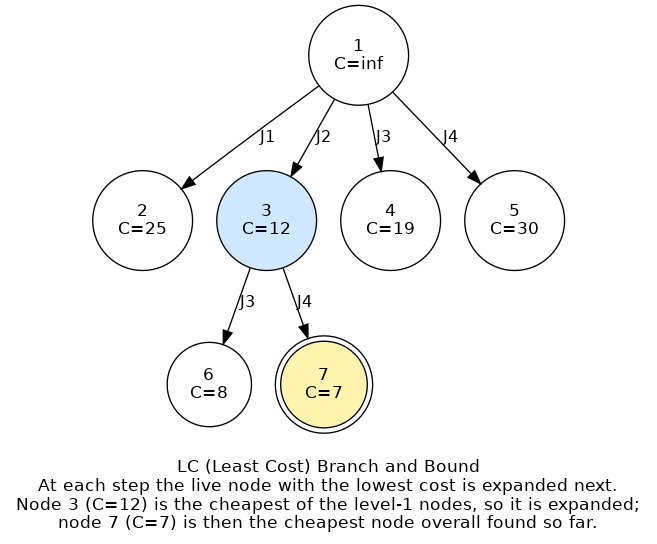
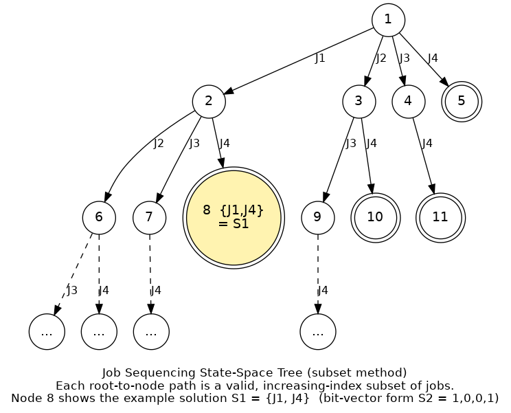

# Branch and Bound

## 1. Overview

Branch and Bound is a general algorithmic technique for solving optimization problems — problems where we want to find the best (minimum-cost, or maximum-profit) solution among a large space of candidates, subject to constraints.

It's closely related to backtracking: both techniques explore a **state-space tree**, where each node represents a partial solution and each edge represents a decision that extends that partial solution. The key difference is in how the two techniques search that tree:

- **Backtracking** explores the tree depth-first (DFS), diving as deep as possible along one branch before backing up.
- **Branch and Bound** explores the tree breadth-first (BFS) in spirit — at each step, it looks across *all* the currently available partial solutions ("live nodes") and always extends the most promising one next, rather than committing to a single branch.

Branch and Bound is used specifically for **optimization problems**, and in its classic form it solves **minimization** problems. A maximization problem (e.g., "maximize profit") can always be converted into an equivalent minimization problem (e.g., by minimizing the negative of profit), so this isn't a real restriction in practice.

## 2. Branching and Bounding

The name describes the two operations the algorithm repeatedly performs:

**Branching** is the process of generating sub-problems from a partial solution — expanding a node in the state-space tree into its children, each representing one more decision taken. If you're at a city in a routing problem, branching means considering every unvisited city you could go to next; if you're building a subset, branching means considering "include this item" versus "exclude this item."

**Bounding** is the process of computing a cost (or a lower bound on the eventual cost) for each newly generated node, and using it to decide which nodes are still worth exploring. If a node's cost is already worse than the best complete solution found so far, there is no point expanding it further — every solution reachable from it can only be as bad or worse. That branch is pruned (discarded) without being explored.

Put together, the algorithm repeatedly asks: *among all the live (not-yet-expanded, not-yet-pruned) nodes, which one has the lowest cost so far?* It extends that node next. This keeps the search focused on the most promising part of the tree instead of exhaustively exploring everything, which is what makes Branch and Bound far more efficient than brute force for problems with an exponentially large search space.

## 3. State-Space Tree Search Strategies

There are three common strategies for deciding which live node to expand next. All three still qualify as "branch and bound" because they all compute and use a cost per node to prune — they differ only in the order nodes are visited.

### 3.1. FIFO Branch and Bound

Newly generated nodes are placed into a **queue**. The next node to expand is always the one at the front of the queue — the node that has been waiting the longest. This produces a pure, level-by-level breadth-first traversal: every node at depth *k* is expanded before any node at depth *k+1* is touched.

### 3.2. LIFO Branch and Bound

Newly generated nodes are placed onto a **stack** instead. The next node to expand is always the most recently generated one. This still respects the "generate all children before choosing what's next" spirit of branch and bound, but the exploration order looks more like a depth-first traversal through the live nodes, since the most recently pushed branch is popped and expanded first.

### 3.3. LC (Least Cost) Branch and Bound

Rather than using a plain queue or stack, every live node is tagged with a cost (computed by a problem-specific cost function), and the next node expanded is always **the live node with the lowest cost**, regardless of when it was generated or how deep it is. This is the most efficient of the three strategies, because it doesn't need to explore the tree level by level or branch by branch — it always chases the most promising lead. This is the strategy used in the worked shortest-path example in Section 7 below.

## 4. Representing a Solution in the State-Space Tree

How a solution is represented affects how the state-space tree is shaped. Using the classic **job sequencing with deadlines** problem as an example (where we decide which jobs to schedule), there are two common representations:

**Variable-size (subset) representation.** A solution is represented as the subset of decisions actually taken — for example, "job 1 and job 4" (2 elements). Different solutions can have different numbers of elements: one branch of the tree might terminate with 1 job selected, another with 3.

**Fixed-size representation.** A solution is represented as a vector with one entry per candidate decision, each entry recording whether that item was taken or not — for example, "job 1 = yes, job 2 = no, job 3 = no, job 4 = yes" written as (1, 0, 0, 1). Every solution in the tree has the same length, equal to the number of candidate items.

Either representation can be used to build the same underlying state-space tree; the choice mainly affects how compactly a solution is stored and read back out at the end.

## 5. A Worked Example: Job Sequencing with Deadlines

Section 4 introduced job sequencing with deadlines conceptually. Here is a concrete instance, including how the three search strategies from Section 3 (FIFO, LIFO, and LC branch and bound) apply to it.

**The problem.** Four jobs are available:

| Job | J1 | J2 | J3 | J4 |
|---|---|---|---|---|
| Profit | 10 | 5 | 8 | 3 |
| Deadline | 1 | 2 | 1 | 2 |

Each job takes one unit of time, and only one job can run in any given time slot. A job can only be scheduled in a slot at or before its deadline. The goal is to choose a subset of jobs, and a slot for each, to maximize total profit. Since the largest deadline here is 2, at most two jobs can ever be scheduled.

**Building the state-space tree.** Using the subset (variable-size) representation from Section 4, each node in the tree corresponds to a valid partial solution: a sequence of job indices in strictly increasing order (this avoids generating the same subset twice, e.g., {J1, J4} only once, not also as {J4, J1}). The root represents "no jobs chosen yet." Branching from any node considers every job with a higher index than the last one added:

For example, node 8 is reached by the path J1 → J4, so it represents the candidate solution {J1, J4}. Using the two representations from Section 4, this is written as:

- Subset form: S1 = {J1, J4}
- Fixed-size (bit-vector) form: S2 = (1, 0, 0, 1), read as "J1 included, J2 excluded, J3 excluded, J4 included"

Both describe the same node; the tree itself doesn't change, only how a solution at that node is recorded. Note that this particular node is just one candidate among many the tree generates. It's not necessarily the profit-maximizing one; that's determined by comparing the profit of every feasible leaf, exactly as branch and bound is designed to do.

**FIFO, LIFO, and LC branch and bound on this tree.** The three strategies from Section 3 differ only in which live node they pick next:

| Strategy | Data structure | Next node expanded |
|---|---|---|
| FIFO branch and bound | Queue | The node that has been waiting longest (pure level-by-level order) |
| LIFO branch and bound | Stack | The most recently generated node |
| LC branch and bound | Cost-ordered list | Whichever live node currently has the lowest cost |

For instance, if node 2 (representing {J1}) is expanded into children for {J1, J2}, {J1, J3}, and {J1, J4}, a LIFO search would push these three children onto a stack; the next node expanded is whichever one sits on top of the stack, i.e., the last one generated, before the search ever returns to any node generated earlier.

**LC branch and bound with costs.** For LC branch and bound, each node also needs a cost. Since branch and bound is defined for minimization (Section 1), a maximizing profit problem like this one is handled by working with a cost function that penalizes low-profit partial solutions, so that the most profitable partial solutions end up with the lowest cost. Suppose the cost function applied to this tree produces the following values for the root and its first two levels:

The root itself carries no useful bound yet (cost effectively infinite, since no job has been chosen). Expanding it produces four children, one per first job chosen: node 2 (J1, cost 25), node 3 (J2, cost 12), node 4 (J3, cost 19), and node 5 (J4, cost 30). LC branch and bound always expands the cheapest live node next, so node 3 (cost 12) is chosen over the other three, even though it wasn't generated first and isn't the deepest node available. Expanding node 3 produces two more children: node 6 (adding J3, cost 8) and node 7 (adding J4, cost 7). Node 7 is now the cheapest live node in the whole tree, so it would be expanded (or accepted as the best solution found, if it's already a complete, feasible schedule) before the search ever returns to nodes 2, 4, or 5. This is exactly the behavior described in Section 3.3: LC branch and bound chases the cheapest lead across the whole tree, rather than working strictly level by level (as FIFO does) or strictly by recency (as LIFO does).

## 6. Applications

Branch and Bound is the standard technique behind several classic combinatorial optimization problems, including:

- **0/1 Knapsack Problem** — deciding which items to include in a knapsack of limited capacity to maximize value, where each item is either fully included or fully excluded. This can be solved with FIFO, LIFO, or LC branch and bound.
- **Traveling Salesperson Problem (TSP)** — finding the minimum-cost tour that visits every city exactly once and returns to the start.
- **Job Sequencing with Deadlines** — deciding which jobs to schedule (and in what order) to maximize profit, given that each job has a deadline and every job takes one unit of time.

## 7. Worked Example: Cheapest Path from S to G

The following example demonstrates LC (Least Cost) Branch and Bound applied to a simple shortest-path problem: starting at node **S**, reach the goal node **G** at the lowest possible total cost, where the graph has these weighted edges:

| Edge | Weight |
|---|---|
| S – A | 3 |
| S – B | 6 |
| A – C | 7 |
| A – D | 2 |
| D – B | 3 |
| D – E | 2 |
| D – G | 4 |
| B – E | 6 |
| E – G | 1 |
| C – G | 5 |

At every step, we expand the live node with the lowest accumulated cost, exactly as described in Section 3.3.

**Step 1 — Expand S.** S branches to A (cost 3) and B (cost 6). Live nodes: A(3), B(6). Lowest is A, so we expand it next.

**Step 2 — Expand A.** A branches to C (3+7=10), back to S (3+3=6), and D (3+2=5). Live nodes: B(6), C(10), S(6), D(5). Lowest is D, so we expand it next.

**Step 3 — Expand D.** D branches to A (5+2=7), B (5+3=8), E (5+2=7), and **G (5+4=9)**. We've reached the goal for the first time, at cost 9 — this becomes our current best solution (S→A→D→G, cost 9), but we keep searching in case a cheaper path exists.

Live (unexpanded) nodes now: B(6, from S), C(10), S(6, from A), A(7, from D), B(8, from D), E(7, from D).

We can immediately prune C(10), since 10 ≥ 9 — expanding it can only make things worse.

**Step 4 — Expand the two nodes tied at cost 6: B (from S) and S (from A).**

Expanding B(6): its children are S (6+6=12), E (6+6=12), and D (6+3=9). All three are ≥ 9 (the current best), so all are pruned — this entire branch is discarded.

Expanding S(6): its children are A (6+3=9) and B (6+6=12). Both are ≥ 9, so both are pruned too.

Live nodes remaining: A(7, from D), B(8, from D), E(7, from D).

**Step 5 — Expand the nodes tied at cost 7: A and E (both children of D).**

Expanding E(7): its children are B (7+6=13), D (7+2=9), and **G (7+1=8)**. We've reached the goal again, this time at cost 8 — cheaper than our previous best of 9. We update the best solution to S→A→D→E→G, cost 8.

B(13) and D(9) are both ≥ 8, so both are pruned. B(8, from D) — still live from Step 3 — is also pruned now, since 8 ≥ 8 offers no possible improvement.

Only A(7, from D) remains live.

**Step 6 — Expand A(7).** Its children are C (7+7=14), D (7+2=9), and S (7+3=10). All three are ≥ 8, so all are pruned.

No live nodes remain. **Stop.**

**Result.** The cheapest path from S to G is:

**S → A → D → E → G, with total cost 8.**

This matches the general stopping rule for branch and bound: once every remaining live node's cost is greater than or equal to the best complete solution found so far, no further expansion can possibly improve on that solution, so the search terminates.

## 8. Summary

Branch and bound systematically explores a state-space tree of partial solutions, using a cost function to prune any branch that can't possibly beat the best solution found so far. The three common variants — FIFO, LIFO, and LC (least cost) — differ only in which live node gets expanded next; LC branch and bound, which always chases the cheapest live node, is typically the fastest at homing in on the optimum because it avoids wasting time on branches that were never going to be competitive. The technique underlies solutions to classic problems like the 0/1 knapsack problem, the traveling salesperson problem, and job sequencing with deadlines.