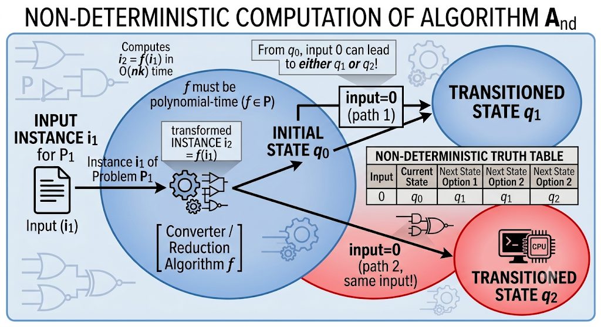
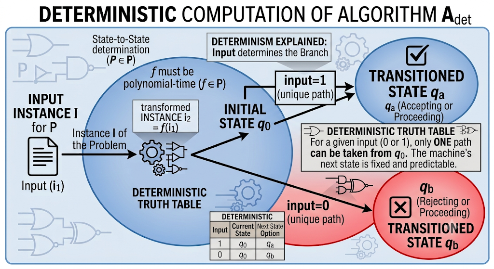
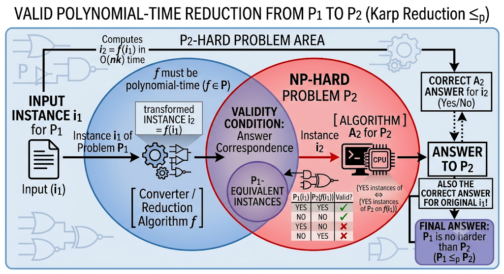
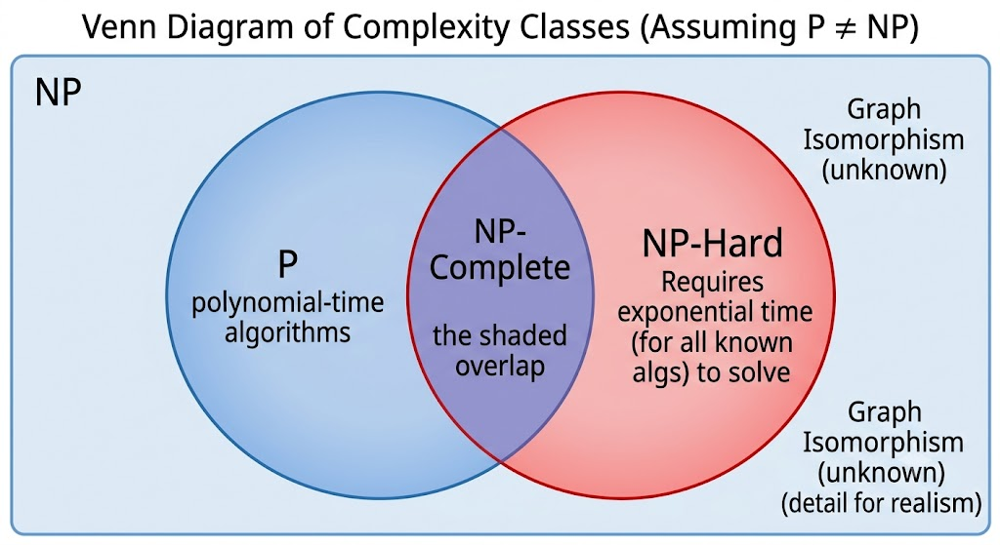

# Dynamic Programming — Part 6: NP-Hard and NP-Complete, the Reduction View (Java)

Part 5 built NP-Hardness and NP-Completeness from the "research framework" angle — nondeterministic algorithms as unfinished proofs, SAT as the historical anchor via Cook's theorem. Part 6 covers the same destination by a shorter, more mechanical road: a second common way these ideas are taught, centered entirely on **reduction as a black box you plug one algorithm into to solve another problem**. It's worth having both framings — this one is the one most exam questions and textbook diagrams actually use.

---

## Table of Contents

1. [Non-Deterministic Algorithms: The Multiple-Path View](#1-non-deterministic-algorithms-the-multiple-path-view)
2. [Decision Problems](#2-decision-problems)
3. [Reduction: Solving P1 by Borrowing P2's Algorithm](#3-reduction-solving-p1-by-borrowing-p2s-algorithm)
4. [NP-Hard: Reduce Everything Into One Problem](#4-np-hard-reduce-everything-into-one-problem)
5. [NP-Complete: NP ∩ NP-Hard](#5-np-complete-np--np-hard)
6. [Java: Reduction in Practice](#6-java-reduction-in-practice)
7. [Summary](#7-summary)

---

## 1. Non-Deterministic Algorithms: The Multiple-Path View

A **deterministic** algorithm always produces the same output for the same input. Feed an addition function `2, 3` and you always get `5` — predictable, every time.

A **non-deterministic** algorithm is one where, even knowing the input, **the output cannot be predicted** — the same input can produce different outputs across different runs. Picture a state machine: from initial state `q0` on input `0`, the machine might transition to `q1` on one run and to `q2` on another. Or picture a flowchart with an `if` branch: a deterministic algorithm always takes exactly the branch the condition dictates, but a non-deterministic one is allowed to explore **both** the yes-branch and the no-branch — you cannot say in advance which path execution follows, because it can take more than one.



This is a genuinely different phenomenon from a deterministic machine, where different *outputs* only ever come from different *inputs*:



> **A note on terminology.** Some introductions illustrate this idea with Monte Carlo methods and genetic algorithms — real, runnable programs that use randomness and return approximate, run-to-run-varying answers. Those are usefully called **randomized algorithms**, and they are a legitimate, practical technique (Part 5, §3.2, covers this distinction in more depth). The non-determinism used to define the complexity class **NP**, though, is a different, purely theoretical device: a hypothetical machine that — if a successful path exists — always finds it, instantly and correctly. It has no physical implementation; it exists to let us *classify* how hard a problem is by asking "if I could magically try every branch at once, how fast could I confirm a solution?" Keep the two ideas separate: nondeterminism-for-NP is a proof tool, not a program you can run.

## 2. Decision Problems

Everything from here on is phrased in terms of **decision problems**: problems whose only possible output is **yes** or **no** — never a number, a string, or a structure.

- "Is there a Hamiltonian cycle in this graph?" — decision problem.
- "What is the shortest Hamiltonian cycle?" — *not* a decision problem (it's an optimization problem), but it has a natural decision version: "Is there a Hamiltonian cycle of cost ≤ B?"

Restricting to yes/no answers is what makes the machinery in the next section clean: an algorithm for a decision problem is just a function from input to `{yes, no}`, and comparing two such functions is comparing two black boxes with identical output shapes.

## 3. Reduction: Solving P1 by Borrowing P2's Algorithm

Suppose you have two decision problems, **P1** and **P2**. P1 takes input `i1`; P2 takes input `i2`. You have a working algorithm **A2** for P2 — you understand exactly how it works. You do **not** have an algorithm A1 for P1; maybe you've tried and failed, maybe you've never even attempted it.

Here's the trick: if you can write a **converter function `f`** that transforms any P1-input into an equivalent P2-input, you can solve P1 **without ever writing A1**:



Feed `i1` through `f` to get `i2 = f(i1)`. Feed `i2` into A2. Whatever A2 says about `i2` — yes or no — is *also* the correct answer for the original P1 instance, **provided `f` was built so that "P2 says yes to f(i1)" exactly matches "P1 says yes to i1."** When such an `f` exists, we say:

> **P1 is reducible to P2** (written `P1 ∝ P2`).

Notice what happened: A1 never entered the picture. A2 — someone else's algorithm, for a completely different-looking problem — did all the real work. This is the entire point of reduction: it lets you **borrow** solving power from a problem you understand and apply it to one you don't, as long as the *inputs* can be translated.

One condition matters enormously: **the converter `f` itself must run in polynomial time.** If translating `i1` into `i2` took exponential time, the trick would be pointless — you'd have paid the exponential cost before A2 even started. All reductions used to classify NP-Hardness are **polynomial-time reductions**.

## 4. NP-Hard: Reduce Everything Into One Problem

Now scale the idea up. Take the entire class **NP** — every problem solvable by a non-deterministic polynomial-time algorithm (Part 5, §4): call them `A, B, C, D, ...`. Suppose you can find **one problem X** such that **every single one of A, B, C, D, ...** reduces to X:

```
   A ∝ X
   B ∝ X
   C ∝ X            ⟹    X is NP-Hard
   D ∝ X
   ...
```

If a polynomial algorithm for X is ever found, then by the reduction machinery of Section 3, **every** problem in NP becomes solvable in polynomial time too — just convert, then run X's algorithm. That's the definition:

> A problem **X is NP-Hard** if every problem in NP can be polynomially reduced to X.

X doesn't have to itself belong to NP — it just has to be **at least as hard as** everything in NP, in the precise sense that solving X solves them all.

## 5. NP-Complete: NP ∩ NP-Hard

**NP-Complete** adds one more requirement on top of NP-Hard: the problem must *also* be in NP itself (i.e., it must have a non-deterministic polynomial-time algorithm of its own — a polynomial-time verifier).

> A problem is **NP-Complete** if it is both **NP** and **NP-Hard**.

The classic Venn diagram:



- **P** — deterministic polynomial-time algorithms exist (innermost circle).
- **NP** — non-deterministic polynomial-time algorithms exist (the outer left circle; P sits inside it).
- **NP-Hard** — every NP problem reduces to it (right circle; may reach outside NP entirely).
- **NP-Complete** — the overlap: NP-Hard problems that are *also* themselves in NP.

Anything purely NP (left circle only) is "merely" verifiable quickly, with no proof it's a hardest problem. Anything purely NP-Hard (right circle only, e.g. optimization TSP, or the undecidable halting problem) is at least as hard as NP but isn't itself a yes/no-polynomially-verifiable problem. The overlap — NP-Complete — is the "hardest problems that are still fair members of NP": SAT, 0/1 Knapsack (decision form), Hamiltonian Cycle, Graph Coloring (decision form), Vertex Cover, and hundreds more.

## 6. Java: Reduction in Practice

Talking about reduction abstractly (`A ∝ X`) can feel weightless. Here are two real, small, polynomial-time reductions coded up exactly as the diagram in Section 3 describes: convert the input, hand it to someone else's algorithm, read off the answer.

### 6.1 Partition ≤ₚ Subset-Sum

**P1 (unknown algorithm): Partition.** Given a set of positive integers, can it be split into two subsets with **equal sums**?

**P2 (known algorithm): Subset-Sum.** Given a set of positive integers and a target `T`, does some subset sum to exactly `T`? (This is a genuine dynamic programming problem — the same `dp[i][w]`-style table as 0/1 Knapsack, Part 1/2.)

**The converter `f`:** Partition(S) is true **if and only if** Subset-Sum(S, total(S) / 2) is true — split into two equal halves is exactly "does some subset hit exactly half the total?" (If the total is odd, no equal split can exist — reject immediately, no need to call A2 at all.)

```java
public class PartitionViaSubsetSum {

    // ---- A2: known algorithm for Subset-Sum (classic DP, O(n * target)) ----
    static boolean subsetSumExists(int[] arr, int target) {
        boolean[] dp = new boolean[target + 1];
        dp[0] = true; // sum 0 always achievable (empty subset)

        for (int x : arr) {
            for (int t = target; t >= x; t--) {
                if (dp[t - x]) dp[t] = true;
            }
        }
        return dp[target];
    }

    // ---- The reduction: convert a Partition instance into a Subset-Sum instance ----
    static boolean partitionExists(int[] arr) {
        int total = 0;
        for (int x : arr) total += x;

        if (total % 2 != 0) return false; // odd total: no equal split possible

        int target = total / 2;           // this IS the converter f
        return subsetSumExists(arr, target); // hand off entirely to A2
    }

    public static void main(String[] args) {
        System.out.println(partitionExists(new int[]{1, 5, 11, 5})); // true  (11 | 5+5+1)
        System.out.println(partitionExists(new int[]{1, 2, 3, 5}));  // false (odd total)
        System.out.println(partitionExists(new int[]{3, 1, 4, 2, 2})); // true (4+2 | 3+1+2)
    }
}
```

Notice: `partitionExists` never contains any partition-specific search logic. It computes `total`, halves it, and **delegates completely** to `subsetSumExists` — precisely the `i1 → f → i2 → A2 → answer` pipeline from Section 3. If a faster Subset-Sum algorithm is ever discovered, Partition automatically gets faster too, for free.

### 6.2 Independent-Set ≤ₚ Vertex-Cover

A reduction doesn't need any arithmetic at all — this one is pure graph structure. **P1 (unknown algorithm): Independent Set.** Given a graph `G` and integer `k`, is there a set of `k` vertices with **no edges between any of them**? **P2 (known algorithm): Vertex Cover.** Given `G` and integer `k'`, is there a set of `k'` vertices that **touches every edge**?

**The converter `f`:** these are complements of each other on the *same graph*. A set `S` is independent **iff** its complement `V − S` is a vertex cover (every edge must have at least one endpoint outside an independent set, or the edge would connect two members of S). So:

```
IndependentSet(G, k)  is true   iff   VertexCover(G, n - k)  is true
```

```java
import java.util.*;

public class IndependentSetViaVertexCover {

    // ---- A2: known (brute-force, small-n) algorithm for Vertex Cover ----
    static boolean vertexCoverExists(int n, List<int[]> edges, int k) {
        int[] verts = new int[n];
        for (int i = 0; i < n; i++) verts[i] = i;

        return anySubsetOfSizeCovers(verts, edges, k, 0, new boolean[n], 0);
    }

    static boolean anySubsetOfSizeCovers(int[] verts, List<int[]> edges, int k,
                                          int idx, boolean[] chosen, int count) {
        if (count == k) return coversAllEdges(chosen, edges);
        if (idx == verts.length) return false;

        chosen[idx] = true;  // include vertex idx
        if (anySubsetOfSizeCovers(verts, edges, k, idx + 1, chosen, count + 1)) return true;
        chosen[idx] = false; // exclude vertex idx

        return anySubsetOfSizeCovers(verts, edges, k, idx + 1, chosen, count);
    }

    static boolean coversAllEdges(boolean[] chosen, List<int[]> edges) {
        for (int[] e : edges) {
            if (!chosen[e[0]] && !chosen[e[1]]) return false; // edge uncovered
        }
        return true;
    }

    // ---- The reduction: convert an Independent-Set instance into a Vertex-Cover instance ----
    static boolean independentSetExists(int n, List<int[]> edges, int k) {
        int kPrime = n - k;               // this IS the converter f
        if (kPrime < 0) return false;
        return vertexCoverExists(n, edges, kPrime); // hand off entirely to A2
    }

    public static void main(String[] args) {
        // 5-cycle: 0-1-2-3-4-0. Max independent set size is 2 (e.g. {0,2}).
        int n = 5;
        List<int[]> cycle = Arrays.asList(
                new int[]{0, 1}, new int[]{1, 2}, new int[]{2, 3},
                new int[]{3, 4}, new int[]{4, 0}
        );

        System.out.println(independentSetExists(n, cycle, 2)); // true  ({0,2}, {1,3}, ...)
        System.out.println(independentSetExists(n, cycle, 3)); // false (no independent set of size 3)
    }
}
```

Again, `independentSetExists` contains **zero** independent-set-specific logic — it computes `n - k` and delegates to a vertex-cover solver it treats as a black box.

### 6.3 Chaining Reductions

Both demos above are single hops, but Section 3's diagram composes: if `A ∝ B` (via converter `f`) and `B ∝ C` (via converter `g`), then `A ∝ C` via the converter `g(f(·))` — run `f`, then `g`, then C's algorithm. This transitivity is exactly why NP-Hardness proofs form chains rather than each requiring a fresh proof against every problem in NP directly (Part 5, §7): show your problem reduces to *one* already-known NP-Hard problem, and transitivity connects it back to all the others for free — including, transitively, SAT itself.

## 7. Summary

| Term | One-line definition |
|---|---|
| Non-deterministic algorithm (NP sense) | A theoretical machine that may explore multiple next-steps from one state; same input, unpredictable path — not to be confused with randomized algorithms |
| Decision problem | A problem whose only output is yes/no |
| Reduction, `P1 ∝ P2` | A polynomial-time converter `f` turns any P1-input into a P2-input with a matching answer, so P2's algorithm solves P1 for free |
| NP-Hard | Every problem in NP reduces to it — at least as hard as anything in NP |
| NP-Complete | NP-Hard **and** itself in NP — the overlap of the two circles |

The practical takeaway, sharpened by the Java demos: reduction is not a rhetorical device, it is a real coding pattern — write the converter, call someone else's solver, done. That's exactly how NP-Hardness is *proved* in research papers: pick a known-hard problem, exhibit the converter, and the hardness transfers immediately.