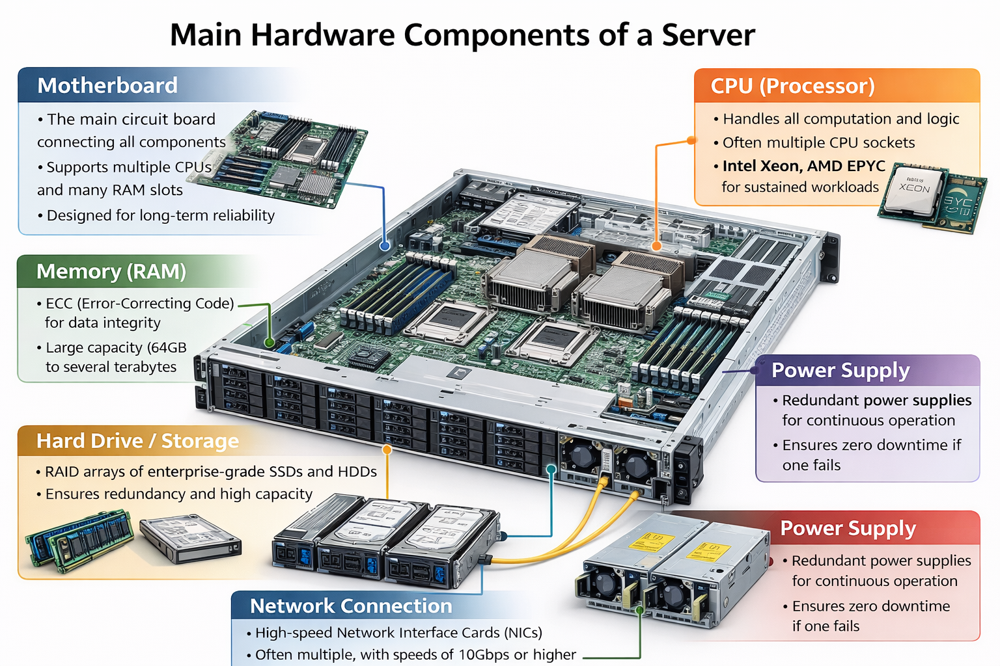
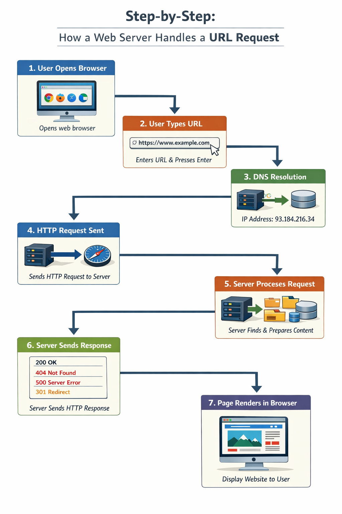

# Servers 

---

## Table of Contents

1. [What is a Server?](#1-what-is-a-server)
2. [Main Hardware Components](#2-main-hardware-components-of-a-server)
3. [Server Room Environment and Requirements](#3-server-room-environment-and-requirements)
4. [How a Server Works — The Request and Response Model](#4-how-a-server-works--the-request-and-response-model)
5. [Step-by-Step: How a Web Server Handles a URL Request](#5-step-by-step-how-a-web-server-handles-a-url-request)
6. [Types of Servers](#6-types-of-servers)
7. [Server vs Desktop Computer — Full Comparison](#7-server-vs-desktop-computer--full-comparison)
8. [Can Your Personal Computer Be a Server?](#8-can-your-personal-computer-be-a-server)

---

## 1. What is a Server?

A **server** is a computer system whose primary purpose is to **provide services, data, or resources to other computers**. These other computers are called **clients**. The relationship between a server and its clients is known as the **client-server model**.

We are surrounded by enormous amounts of data on the internet every single day. Because the volume of data is far too large for humans to manage and distribute manually, we rely on machines — servers — to automatically handle, store, and serve that data to whoever requests it.

> **Key point:** A server is not a special type of computer by design — it is defined by its *role*. Any machine running server software and accepting requests can act as a server.

### How clients connect to servers

- **Via the internet** — worldwide, public access (e.g. browsing a website)
- **Via a Local Area Network (LAN)** — within an office or building (e.g. a company's internal file server)

---

## 2. Main Hardware Components of a Server

While a server looks similar to a desktop computer internally, every component is built for **high endurance, capacity, and reliability** rather than cost-efficiency.

### Motherboard
- The main circuit board connecting all components
- Server motherboards often support multiple CPUs and more RAM slots than desktop boards
- Designed to run continuously without failure for years

### CPU (Processor)
- Handles all computation and logic
- Servers often use multiple CPU sockets for parallel processing of many requests simultaneously
- Common server CPUs: Intel Xeon, AMD EPYC — built for sustained workloads, not bursts

### Memory (RAM)
- Stores data being actively processed
- Server RAM is typically **ECC (Error-Correcting Code)** to detect and correct data corruption automatically — critical for uptime
- Servers use far more RAM than desktops — often 64GB to several terabytes

### Hard Drive / Storage
- Stores all files, databases, and applications
- Servers use large arrays of drives in **RAID configurations** for redundancy (if one drive fails, data is preserved) and speed
- Enterprise-grade SSDs and HDDs are used, rated for much higher read/write cycles

### Network Connection
- Allows the server to communicate with clients
- Servers use high-speed **Network Interface Cards (NICs)** — often multiple, for redundancy and load balancing
- Network speeds of 10Gbps or higher are common

### Power Supply
- Provides electricity to all components
- Servers use **redundant power supplies** — if one fails, the other keeps the server running with zero downtime
- Consumer desktops have a single power supply with no backup

---

## 3. Server Room Environment and Requirements

Unlike a desktop computer that can sit on a desk anywhere, a server requires a **dedicated, controlled environment**. This is because servers run 24/7 and generate significant heat.

### Requirements

- **Dedicated server room:** A physical space reserved exclusively for servers — no general use allowed
- **Cleanliness:** Dust and debris can clog cooling systems and damage hardware, so rooms are kept spotlessly clean
- **Air conditioning:** Servers generate a lot of heat; air conditioning maintains a stable, cool temperature to prevent overheating and hardware failure
- **Server racks:** Servers are installed in metal rack units (measured in "U" height). Multiple servers can be stacked in a single rack, saving floor space
- **Uninterrupted Power Supply (UPS):** A battery backup system ensures electricity continues even during power outages, preventing data loss and downtime
- **Physical security:** Access is restricted to authorised personnel only, protecting the hardware and data
- **Cable management:** Organised cabling for network and power connections reduces errors and makes maintenance easier

> **Note:** A desktop computer can be placed in any room and switched off at any time. A server is expected to be online continuously — often with 99.9%+ uptime — making its environment critical to performance.

---

## 4. How a Server Works — The Request and Response Model

The fundamental operating principle of a server is the **request and response model** (also called the *call and response model*). Every interaction between a client and a server follows this pattern:

1. The **client** needs something (a webpage, a file, data from a database)
2. The client sends a **request** to the server over a network connection
3. The **server receives** the request and processes it
4. The server sends back a **response** containing the requested data or a status message

### What the server does during processing

On most requests, the server must perform several tasks before it can respond:

- **Identify the sender:** Determine which client is making the request (using IP address, session tokens, cookies, etc.)
- **Authenticate the client:** Verify the client has permission to access the requested resource — without authentication, the server would serve data to anyone, including attackers
- **Process the request:** Look up the data in a database, run application logic, read a file, or perform a calculation
- **Format the response:** Return the result in the format the client expects (HTML for browsers, JSON for apps, binary for file downloads, etc.)

> **Note:** A server handles thousands of these request-response cycles simultaneously, which is why it needs powerful hardware and an efficient operating system.

---

## 5. Step-by-Step: How a Web Server Handles a URL Request

When you type a URL into a browser, a complex sequence of events happens in milliseconds. Here is every step in detail:

1. **User opens a browser** — e.g. Google Chrome, Mozilla Firefox, Safari, or Edge.

2. **User types a URL** — e.g. `https://www.example.com` — into the address bar and presses Enter.

3. **DNS resolution:** The browser does not know the physical location of `example.com`. It contacts a **DNS (Domain Name System) server**, which acts like the internet's phone book. The DNS server translates the human-readable domain name into a numerical **IP address** (e.g. `93.184.216.34`) that identifies the web server's actual location.

4. **HTTP request sent:** The browser sends an **HTTP (or HTTPS) request** to the web server at that IP address. This request includes what page or resource the client wants, the browser type, accepted languages, and other headers.

5. **Server receives and processes the request:** The web server accepts the incoming HTTP request, locates the requested document (an HTML file, image, video, etc.) on its storage, and prepares a response.

6. **Server sends HTTP response:** The server sends the resource back to the browser along with a **status code:**
    - `200 OK` — success
    - `404 Not Found` — the resource doesn't exist
    - `500 Internal Server Error` — something went wrong on the server side
    - `301 Moved Permanently` — the resource has been moved to a new URL

7. **Browser renders the page:** The browser receives the HTML, CSS, JavaScript, and media files. It processes all of these together and renders the complete, visual website on your screen.

> **Note:** The entire process above — from pressing Enter to seeing the website — typically takes between 200ms and 2 seconds depending on network speed and server performance.

---

## 6. Types of Servers

Different types of servers are used for different purposes. Each specialises in handling a specific kind of service:

| Server Type | Description | Examples |
|---|---|---|
| **Web server** | Stores and delivers websites and web pages to browsers via HTTP/HTTPS | Apache, Nginx |
| **Database server** | Stores, manages, and provides access to structured data | MySQL, PostgreSQL, Microsoft SQL Server |
| **Application server** | Runs the back-end logic of software applications and connects the front end to the database | Tomcat, JBoss |
| **File server** | Stores and shares files across a network so users can access documents from any connected device | Windows Server, Samba |
| **Mail server** | Handles sending, receiving, and storing emails | Microsoft Exchange, Postfix |
| **VPS (Virtual Private Server)** | A virtual machine that acts as a dedicated server, shared physically with others but isolated virtually | AWS EC2, DigitalOcean |
| **Game server** | Hosts multiplayer online games, managing all player connections and game state in real time | Minecraft servers, Steam dedicated servers |
| **Media server** | Stores and streams audio, video, and media files to devices | Plex, Jellyfin |
| **Print server** | Manages print requests from multiple users, queuing jobs and sending them to shared printers | CUPS (Linux), Windows Print Server |
| **Proxy server** | Acts as an intermediary between clients and other servers — used for security, caching, and anonymity | Squid, HAProxy |
| **Fax server** | Manages sending and receiving faxes over a network without needing a physical fax machine per user | RightFax, HylaFAX |
| **Virtual server** | A software-defined server instance running on a physical machine; multiple virtual servers can share one physical machine | VMware, Hyper-V |

---

## 7. Server vs Desktop Computer — Full Comparison

| Feature | Server | Desktop |
|---|---|---|
| **Purpose** | Provides services and resources to multiple clients | Used by a single person for personal tasks |
| **Simultaneous users** | Supports thousands of concurrent users | One user at a time |
| **Storage capacity** | Massive — terabytes to petabytes; stores apps, databases, and files for all clients | Limited to personal files and apps; typically 256GB–2TB |
| **Hardware quality** | High-capacity, enterprise-grade with ECC RAM, RAID storage, redundant PSUs | Basic consumer-grade components; no redundancy |
| **CPU** | Often multi-socket with server-grade processors (Intel Xeon, AMD EPYC) | Single consumer CPU (Intel Core i7, AMD Ryzen) |
| **Operating system** | Windows Server 2012/2016/2019, Linux (often without GUI — command line only) | Windows 10/11, macOS, Ubuntu desktop, Linux Mint |
| **Uptime requirement** | Expected to run 24/7/365 with minimal downtime | Switched on and off as needed |
| **Physical size** | Rack-mounted units (1U, 2U, 4U); housed in server rooms | Tower or compact desktop; placed anywhere |
| **Cost** | Significantly more expensive — enterprise hardware carries a premium | Much cheaper — consumer market pricing |
| **Performance under load** | Designed to maintain high performance under sustained, heavy workloads | Performance may degrade under multiple simultaneous demands |
| **Network interface** | High-speed NICs; often multiple for redundancy and load balancing | Standard single NIC; sufficient for personal use |
| **Login access** | Multiple users can log in and use the server simultaneously via remote access | Typically one active user session at a time |
| **Role in network** | Provides services — the "giver" in the client-server relationship | Requests services — the "receiver" in the client-server relationship |

> **Examples of client devices:** laptops, desktop computers, smartphones, tablets
> **Examples of server types:** web servers, database servers, application servers, mail servers

---

## 8. Can Your Personal Computer Be a Server?

Yes — technically, **any computer can act as a server** as long as it runs server software and is connected to a network. The distinction between a "server" and a "desktop" is functional, not physical.

### How to set up your PC as a server

- **FTP server:** Install an FTP (File Transfer Protocol) server program on your desktop. Other users on the same network can connect and transfer files to and from your computer. Example software: **FileZilla Server**.
- **Web server:** Install Apache or Nginx on your PC. You can host a website accessible on your local network (or the wider internet if you configure port forwarding on your router). Example: **XAMPP** for Windows/Linux/macOS.
- **Game server:** Run a local game server (e.g. for Minecraft) on your desktop, letting friends connect and play on your hosted world.
- **Media server:** Install **Plex** or **Jellyfin** to turn your PC into a streaming server that other devices on your home network can access.

### Limitations of using a personal computer as a server

- Consumer hardware is not built for 24/7 operation — heat and wear can cause failure faster
- No redundant power supply means any power outage stops the server immediately
- Home internet connections typically have limited upload bandwidth, making it slow for many remote users
- Security risks increase significantly if the server is exposed to the internet without proper configuration
- A desktop OS handles multi-user server workloads less efficiently than a dedicated server OS

> **Summary:** For small-scale, local use (home file sharing, local game hosting, learning and testing), a personal computer works fine as a server. For business or high-traffic use, dedicated server hardware and a proper server OS are essential.

---

