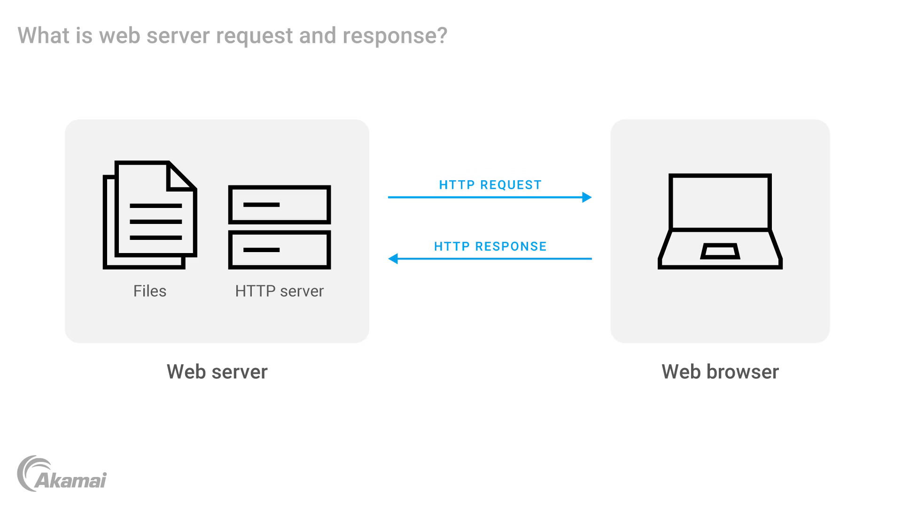
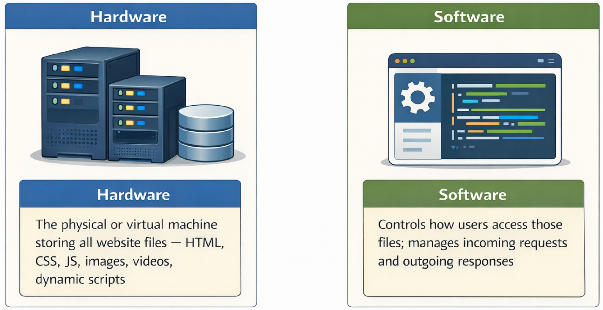
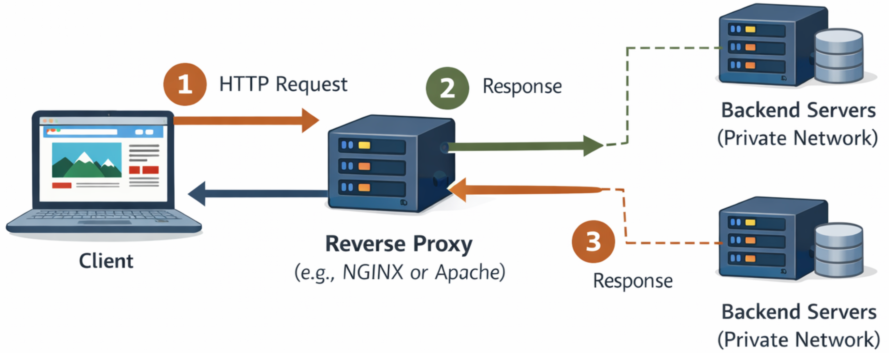
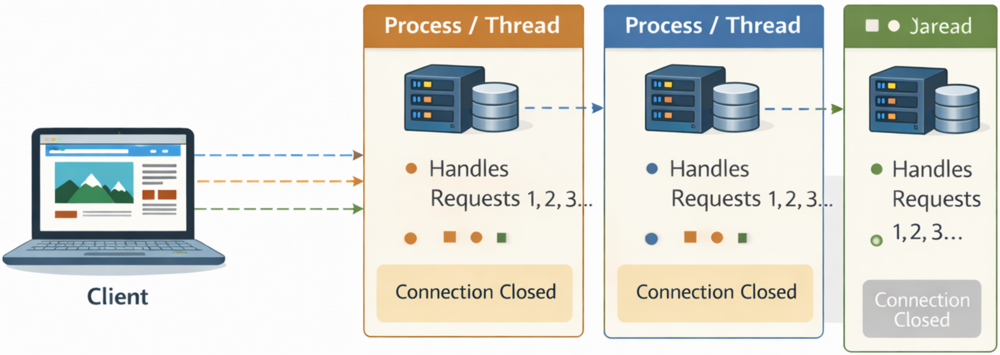
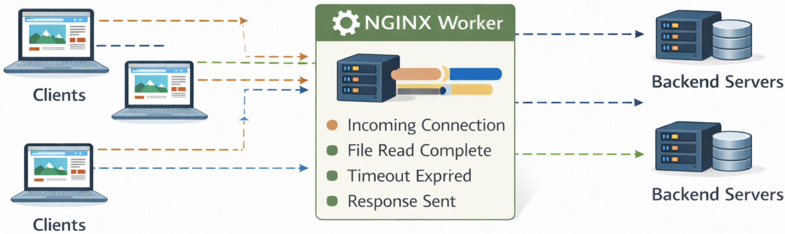
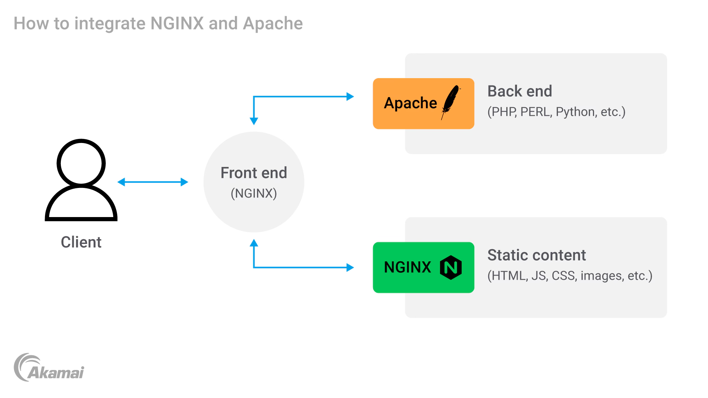

# Apache vs NGINX 

---

## Table of Contents

1. [What Are Apache and NGINX?](#1-what-are-apache-and-nginx)
2. [How a Web Server Works — Recap](#2-how-a-web-server-works--recap)
3. [What is a Reverse Proxy Server?](#3-what-is-a-reverse-proxy-server)
4. [Key Advantages of a Reverse Proxy](#4-key-advantages-of-a-reverse-proxy)
5. [Load Balancing — Layer 4 vs Layer 7](#5-load-balancing--layer-4-vs-layer-7)
6. [Apache — In Depth](#6-apache--in-depth)
7. [NGINX — In Depth](#7-nginx--in-depth)
8. [Apache vs NGINX — Full Comparison](#8-apache-vs-nginx--full-comparison)
9. [Using Apache and NGINX Together](#9-using-apache-and-nginx-together)
10. [Self-hosting vs Hosting Provider](#10-self-hosting-vs-hosting-provider)
11. [Which Should You Choose?](#11-which-should-you-choose)

---

## 1. What Are Apache and NGINX?

Both **Apache** and **NGINX** are:

- Free and **open-source** projects
- Very commonly used as **HTTP servers** — software that accepts HTTP connections, maps them to documents, images, or other resources, and returns them to the requester
- Very commonly used as **reverse proxy servers** — an intermediary that sits in front of one or more web servers and handles all incoming client requests on their behalf

They are two of the most widely deployed pieces of web infrastructure in the world, powering a vast proportion of all websites and web applications on the internet.

---

## 2. How a Web Server Works — Recap



At its most basic, a web server handles a simple exchange:

1. A **client** (web browser) wants a resource — for example, a specific web page
2. The browser sends an **HTTP request** to the server
3. The server searches its data, assembles the requested page or resource
4. The server sends the resource back as an **HTTP response**
5. The browser renders and displays the content

> **Example:** A user visits `ibm.com/cloud-security`. Their browser sends an HTTP request. The web server locates the cloud security page, assembles it, and ships it back to the browser for display.

### Hardware and software components



| Component | Role |
|---|---|
| **Hardware** | The physical or virtual machine storing all website files — HTML, CSS, JS, images, videos, dynamic scripts |
| **Software** | Controls how users access those files; manages incoming requests and outgoing responses |

### What HTTP traffic includes

It is important to note that HTTP servers do not only handle web pages. They handle **all HTTP traffic**, which includes:

- Web pages (HTML documents)
- Images, videos, and other static assets
- **REST API calls** — the HTTP requests that power almost every modern web and mobile application

---

## 3. What is a Reverse Proxy Server?

In the early days of the web, a single server handled all requests. Today, high-traffic websites use **multiple backend servers**, all capable of delivering the same content, with a **reverse proxy** placed in front to manage all incoming connections.

### How a reverse proxy works



1. A client sends an HTTP request — it arrives at the **reverse proxy** (e.g. NGINX or Apache)
2. The reverse proxy **initiates its own connection** to the appropriate backend server on the private network
3. The backend server processes the request and returns the response to the proxy
4. The proxy forwards the response back to the client

From the client's perspective, **everything appears to come from the proxy itself** — the existence and number of backend servers is completely hidden.

---

## 4. Key Advantages of a Reverse Proxy

### 1. Load balancing
- Requests can be routed to any number of backend servers
- The proxy sends each request to the server that is **least busy** at that moment
- No single server becomes a bottleneck — performance scales horizontally

### 2. Security
- The outside world never sees or knows about the backend servers
- All the client ever interacts with is the reverse proxy
- The internal network architecture is completely concealed, reducing the attack surface significantly

### 3. Caching
- If the same static resource (e.g. a popular image that appears on every page) is requested repeatedly, the proxy can **cache** that resource locally
- Subsequent requests for that resource are served directly from the cache — no need to reach the backend server
- Saves time and reduces network throughput

### 4. Compression
- The reverse proxy can **compress** data before sending it to the client
- Compression reduces the size of the response, decreasing load times for the end user
- Compression is applied between the proxy and the client specifically

### 5. SSL termination
- The proxy can handle **SSL/TLS encryption** for all connections to the outside web
- The backend servers on the private network can then communicate in **plain text** internally
- This can dramatically speed up applications since encryption/decryption is computationally expensive
- Centralising SSL at the proxy simplifies certificate management

---

## 5. Load Balancing — Layer 4 vs Layer 7

Not all load balancers operate the same way. There are two main types:

### Layer 4 load balancers (transport layer)
- Operate at the **transport level** of the network stack
- Simply route requests to available servers based on network-level information (IP address, TCP/UDP port)
- Can handle DNS, mail, TCP, and UDP traffic
- No awareness of the content or type of request

### Layer 7 load balancers (application layer)
- Operate at the **application level** — specifically HTTP
- Can inspect the actual content of a request before routing it
- Can make intelligent decisions: route API calls to one server pool, static files to another, video streams to a third
- **Apache and NGINX are used as layer 7 load balancers** — they understand HTTP and can make content-aware routing decisions

> **Analogy:** A layer 4 load balancer is like a post office sorting mail by zip code — it doesn't open the envelope. A layer 7 load balancer reads the letter and routes it based on what it says.

---

## 6. Apache — In Depth

### History
- Apache has been around since approximately **1995** — pre-dating the year 2000
- It is one of the **oldest and most widely used** web servers ever created
- It started as a basic web server and was **extended over time** through a modular system

### How Apache works — one-connection-per-process model
This is Apache's core architecture and its most important characteristic to understand:



- Each incoming client connection is assigned its own **dedicated process or thread**
- That process/thread is responsible for managing the entire connection — it handles every request the client makes until the connection is closed
- When the connection ends, the process/thread is freed

**The problem with this model:**
- Every concurrent connection requires its own process
- When the number of simultaneous connections **exceeds the number of available processes**, performance degrades significantly
- Under very heavy load, Apache can struggle — it becomes slow or unresponsive as the system runs out of processes to allocate

### Key features and strengths

- **Dynamic content processing:** Apache can process dynamic content (PHP, PERL, Python, etc.) **natively within the server itself**, without passing it to an external processor — this is one of its key advantages over NGINX
- **Highly extensible via modules:** Functionality is added through modules. For example:
    - `mod_proxy` — enables reverse proxy capabilities
    - `mod_http` — HTTP handling
    - Many more for authentication, caching, URL rewriting, compression, and so on
- **Virtual hosting:** Supports multiple virtual hosts on a single server — multiple websites can share one Apache instance while maintaining their own unique configurations
- **Cross-platform:** Runs on Windows, macOS, and Linux
- **Protocol support:** Handles HTTP, HTTPS, and FTP
- **Large community:** Decades of development means a vast ecosystem of modules, plugins, documentation, and community support

### Best for
- **Dynamic content** — PHP applications, ecommerce platforms, forums, content management systems (e.g. WordPress)
- **Highly customised server configurations** — the module system allows extensive tailoring
- **Environments where flexibility and extensibility** matter more than raw speed under extreme concurrent load

---

## 7. NGINX — In Depth

### History
- NGINX was released in **2004** by **Igor Sysoev**
- It was created with the **explicit goal of outperforming Apache** — particularly at handling large numbers of simultaneous connections
- It has achieved that goal: NGINX does outperform Apache as a simple web server and proxy server

### How NGINX works — asynchronous, event-driven model
This is NGINX's defining architectural feature:



- **Asynchronous:** NGINX does not wait for one task to finish before starting another. It can initiate many operations simultaneously, and each one completes whenever it is ready — without blocking others
- **Event-driven:** Rather than following a predetermined sequence of steps, NGINX is driven by **events** — an incoming connection is an event, a completed file read is an event, a response being sent is an event. NGINX reacts to these events as they happen
- A single worker process can handle **thousands of simultaneous connections** using this model, with minimal resource consumption

**Why this matters:**
- Where Apache needs a new process for every connection, NGINX handles many connections within the same process
- This makes NGINX far more efficient under high concurrent load — it does not degrade the same way Apache does when connection counts rise

### Key features and strengths

- **Static content delivery:** Extremely fast at serving static files — HTML, CSS, JavaScript, images, videos
- **Simple configuration:** NGINX's configuration syntax is clean and straightforward, making it easy to set up and manage even for large deployments
- **High performance:** Consistently outperforms Apache for simple web serving and proxy tasks — it is, without question, fast
- **Reverse proxy:** Excellent at acting as a reverse proxy, distributing requests across backend servers
- **Load balancing:** Built-in load balancing across multiple backend servers
- **HTTP caching:** Can cache responses to reduce backend load
- **Mail proxy:** Can also proxy IMAP, POP3, and SMTP traffic (email protocols)
- **Container popularity:** NGINX is currently more popular in the **container space** (Docker, Kubernetes), giving it an additional popularity boost from containerised solutions

### Limitation
- NGINX **cannot process dynamic content natively** — it has no built-in engine for PHP, PERL, Python, or similar languages
- Dynamic requests must be **passed to an external processor** (such as PHP-FPM, or a backend Apache server) for execution
- This adds a step to dynamic content handling, making Apache the better native choice for dynamic workloads

### Best for
- **Static content delivery** — HTML, CSS, JS, images, videos
- **Reverse proxy** — sitting in front of backend servers
- **Load balancing** across multiple servers
- **HTTP caching** to reduce backend pressure
- **Containerised environments** — Docker, Kubernetes
- **Linux systems** — NGINX is specifically recommended for Linux

---

## 8. Apache vs NGINX — Full Comparison

| Feature | Apache | NGINX |
|---|---|---|
| **First released** | ~1995 | 2004 |
| **Created by** | Apache Software Foundation | Igor Sysoev |
| **Primary goal** | Extensible, full-featured web server | Outperform Apache; handle high concurrency |
| **Connection model** | One-connection-per-process (synchronous) | Asynchronous, event-driven |
| **Concurrent connections** | Degrades under very high loads | Handles thousands simultaneously with ease |
| **Static content** | Capable, but not optimised | Extremely fast and efficient |
| **Dynamic content** | Processes natively (PHP, PERL, Python) | Cannot process natively — must pass to external processor |
| **Configuration** | More complex — highly extensible via modules | Simple and clean configuration syntax |
| **Extensibility** | Highly extensible via large module ecosystem | Less extensible; more focused feature set |
| **Virtual hosting** | Full support | Full support |
| **Reverse proxy** | Yes — via `mod_proxy` module | Yes — built-in, core use case |
| **Load balancing** | Yes — layer 7 | Yes — layer 7; also more popular for this role |
| **SSL termination** | Yes | Yes |
| **Caching** | Yes — via modules | Yes — built-in |
| **Platform support** | Windows, macOS, Linux | Primarily Linux |
| **Container popularity** | Less common in containers | Very popular in Docker/Kubernetes environments |
| **HTTP traffic** | Yes — web pages and REST API calls | Yes — web pages and REST API calls |
| **Best used for** | Dynamic apps, flexible/customised setups | Static content, reverse proxy, high-traffic proxy layer |

---

## 9. Using Apache and NGINX Together

Apache and NGINX are not mutually exclusive — they are **frequently deployed together**, with each handling what it does best.

### The most common configuration — NGINX in front of Apache
 


```
Client → NGINX (front end / reverse proxy)
              ├── Static content (HTML, CSS, JS, images) → served by NGINX directly
              └── Dynamic content (PHP, PERL, Python) → forwarded to Apache (back end)
```

**Step-by-step flow:**
1. All incoming HTTP requests arrive at **NGINX first**
2. NGINX inspects each request:
    - If it is for **static content** → NGINX serves it directly from its cache or storage — fast and efficient
    - If it is for **dynamic content** → NGINX forwards the request to **Apache** on the private backend network
3. Apache processes the dynamic content (runs the PHP/Python/PERL code, queries databases, etc.)
4. Apache returns the result to NGINX
5. NGINX sends the final response back to the client

### Why this works so well — each server covers the other's weakness

| | Apache alone | NGINX alone | Apache + NGINX together |
|---|---|---|---|
| High concurrent connections | Struggles | Handles easily | NGINX absorbs concurrent load |
| Dynamic content | Handles natively | Cannot handle natively | Apache handles it in the back end |
| Static content speed | Slower | Very fast | NGINX serves static files instantly |
| Security | Backend exposed | Backend exposed | NGINX hides Apache completely |

### Additional benefits of the combined setup

- **Reduced Apache thread pressure:** NGINX's asynchronous model handles the bulk of concurrent connections, so Apache only receives the requests it actually needs to process — far fewer threads needed
- **Load balancing:** NGINX can distribute dynamic requests across **multiple Apache servers**, preventing any single Apache instance from being overwhelmed
- **Security:** NGINX acts as a buffer between the internet and Apache — the outside world never directly interacts with Apache, reducing exposure to attacks
- **Scalability:** The architecture scales horizontally — add more Apache servers behind NGINX as traffic grows, without any change to the client-facing layer

> **Note:** The reverse is also possible — Apache can be placed in front of NGINX, or multiple NGINX instances can sit behind an NGINX load balancer. The choice depends on what fits best into the specific environment.

---

## 10. Self-hosting vs Hosting Provider

When deploying web server software, there is a fundamental infrastructure choice to make:

| | Self-hosting | Hosting provider |
|---|---|---|
| **Who uses it** | Individuals, hobbyists, developers learning | Organisations providing essential or high-traffic services |
| **Speed** | Limited by home/office internet upload bandwidth | High-speed data centre networks |
| **Reliability** | Vulnerable to power outages and hardware failure | Engineered to handle power fluctuations and prevent failure |
| **Data security** | Risk of private information leaking into the public domain | Providers ensure private data stays protected |
| **Cost** | Low upfront cost; no ongoing subscription | Ongoing cost; but reliability and security are far superior |
| **Scalability** | Very limited — constrained by a single machine | Easily scalable — add resources on demand |

> **Key takeaway:** Self-hosting is fine for personal projects, learning, and development. For any organisation providing essential services or handling sensitive data, a hosting provider is strongly recommended.

---

## 11. Which Should You Choose?

The answer depends entirely on your use case. Neither Apache nor NGINX is universally superior — they each shine in different scenarios.

### Choose Apache if:
- Your application serves **dynamic content** — PHP, Python, PERL, or other server-side languages
- You need **extensive customisation** via modules
- You are running a **WordPress site**, ecommerce platform, or forum
- Your environment is already Apache-based and you want continuity

### Choose NGINX if:
- You need to serve large volumes of **static content** quickly
- You are building a **reverse proxy** or **load balancer** layer
- You are working in a **containerised environment** (Docker, Kubernetes)
- You need to handle **very high numbers of simultaneous connections**
- You are running on **Linux** and need a fast, simple configuration

### Choose both together if:
- You have a **high-traffic application** with a mix of static and dynamic content
- You want to maximise performance by letting each server do what it does best
- You need the security and load-balancing benefits of a reverse proxy layer in front of your dynamic application servers

> **Final note:** The fundamentals of Apache and NGINX are largely the same. Both handle HTTP traffic, both can act as reverse proxies, and both will keep your web data flowing quickly, safely, and reliably. The decision really comes down to what fits best into your specific environment.

---

